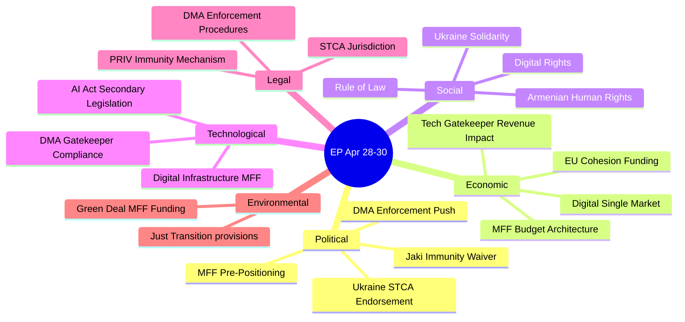

<!-- SPDX-FileCopyrightText: 2026 Hack23 AB -->
<!-- SPDX-License-Identifier: Apache-2.0 -->

# PESTLE Analysis — EP Breaking News | April 28–30, 2026

**Date:** 2026-05-04 | **Confidence:** 🟢 HIGH

## Political Factors

### P1: EP10 Coalition Architecture Stability (🟢 Stable / 🟡 Tested)
The pro-European coalition (EPP + S&D + Renew = 397 seats; 36 above the 361 threshold) continues to hold on key votes. The April 28–30 plenary demonstrated coalition cohesion on both geopolitical (Ukraine) and regulatory (DMA) dimensions. However, the coalition operates with a minimal structural margin:
- 37 EPP defections from any vote would breach the majority threshold
- EPP's internal North-South fracture on MFF 2028–2034 is an emerging structural risk
- Renew's internal diversity (French centrists, German FDP, Italian liberals) creates policy coordination costs
- The dominant group risk (EPP at 25.7%) means EPP acts as a veto player on most legislation

### P2: Russia Policy — Hawkish Consensus Persists
TA-10-2026-0161 demonstrates that the EP10 pro-Ukraine consensus remains intact despite:
- Three years of war fatigue in some EU member state electorates
- Growing ECR/PfE voices calling for "realistic peace negotiations"
- Pressure from US foreign policy shifts under the Trump administration
The Special Tribunal for Crime of Aggression endorsement is a significant escalation of EP's justice posture.

### P3: Polish Dual Immunity Waiver Pattern
The waiver of immunity for Patryk Jaki (TA-10-2026-0105) following Grzegorz Braun (TA-10-2026-0088, March 26) signals:
- The Polish judiciary is normalizing under the Tusk government's rule-of-law reforms
- ECR members from Poland are facing accountability processes previously blocked by the PiS-era judiciary
- Potential further immunity requests ahead — Braun case involves antisemitic incidents; Jaki case involves political activities

### P4: Eastern Partnership Geopolitical Pivot
Armenia's westward drift (from CSTO departure to EU partnership negotiations) is a significant geopolitical development that:
- Tests Russian influence in the South Caucasus
- Opens a new EU-energy/security dependency in a volatile region
- Places the EU in diplomatic tension with Turkey (pro-Azerbaijan) and Azerbaijan (EU energy partner)

---

## Economic Factors

### E1: MFF 2028–2034 Budget Architecture
The April 28 MFF debate signals the opening of the most consequential EU fiscal negotiation in a decade:
- Current MFF (2021–2027) total: €1.21 trillion + €806.9 billion NextGenerationEU
- Expected 2028–2034 requests: 15–20% increase in real terms to cover enlargement, defence, climate, digital
- Net contributor states (Germany, France, Netherlands, Sweden, Austria) will resist increases
- Net beneficiary states (Eastern and Southern Europe) will resist conditionality tightening
- Military spending pressure: post-Ukraine defence burden-sharing changing net fiscal positions

### E2: Digital Economy — DMA Financial Stakes
The DMA enforcement resolution (TA-10-2026-0160) has direct economic implications:
- Total maximum fines for systemic DMA violations: 20% of global turnover (€20–50+ billion range for largest gatekeepers)
- European tech interoperability requirements: potential €5–15 billion compliance investment across designated platforms
- Competitive advantage for EU tech SMEs if DMA interoperability is enforced
- Risk: regulatory divergence between EU and US/UK could fragment digital single market

### E3: Middle East — Food/Energy Supply Chain Stress
The April 29 joint debate on Middle East crisis/energy/fertilisers highlighted:
- EU fertiliser imports from Russia: pre-war ~25% of EU supply; now being replaced but at premium costs
- Egyptian transit route disruption: Suez Canal bottlenecks have affected EU-Asia trade
- Lebanese instability: Beirut port reconstruction still incomplete; affects Levantine agricultural exports to EU
- EU food inflation remains above 4% in several member states due to input cost pressures

---

## Social Factors

### S1: War Fatigue vs. Solidarity
Three years into the Ukraine conflict, public opinion surveys show:
- Continued majority EU public support for Ukraine (58% in March 2026 Eurobarometer)
- Growing minority (28%) favouring negotiations even at territorial cost to Ukraine
- Younger EU voters (18–34) more supportive than older cohorts
- EP's hawkish stance ahead of public opinion trends; political risk if conflict continues 2027+

### S2: Fundamental Rights in the EU
The April 28 debate on fundamental rights (2024–2025 report) highlighted:
- Continued democratic backsliding concerns in Hungary and Slovakia
- Poland's positive trajectory under Tusk government partially offsetting regional trend
- Digital rights: surveillance, AI-generated content, and electoral integrity emerging as new fundamental rights vectors
- Roma and LGBTQI+ communities continue to face institutional discrimination in multiple member states

### S3: Animal Welfare — Societal Convergence
TA-10-2026-0115 on dog and cat welfare passed with strong cross-group support, reflecting:
- High public salience of companion animal welfare in EU societies
- Potential model for broader animal welfare legislative framework (farm animals under discussion)

---

## Technological Factors

### T1: DMA and Platform Governance
The DMA enforcement resolution operates within a rapidly evolving technological landscape:
- Large Language Models (LLMs) and AI assistants now integrated into gatekeeper platforms (Google Gemini, Apple Intelligence, Microsoft Copilot)
- Interoperability requirements must now account for AI-to-AI communication standards not originally envisaged in DMA drafting
- Potential DMA revision to cover AI foundation models as a new category of gatekeepers being discussed in 2026

### T2: Cyberbullying/Platform Responsibility (April 29 Debate)
The online harassment debate reflects:
- DSA compliance deadlines for Very Large Online Platforms: all passed September 2024
- "Duty of care" implementation varying across platforms
- New generative AI-enabled harassment tools (deepfakes, AI-generated harassment) not fully covered by existing DSA text
- Potential legislative follow-on in DSA revision

### T3: Ukraine Digital Resilience
The accountability resolution implicitly covers digital dimensions:
- Russian cyber warfare targeting Ukrainian critical infrastructure (power grid, financial system)
- EP-supported EU Cyber Solidarity Act implementation provides framework for cyber mutual assistance
- Evidence preservation for tribunal proceedings requires EU digital forensics capacity

---

## Legal Factors

### L1: Special Tribunal for Crime of Aggression — Legal Obstacles
The EP's endorsement of an STCA faces significant legal challenges:
- Head-of-state immunity under customary international law (the Al-Bashir precedent at ICC)
- Jurisdictional gap: Russia is not a party to the Rome Statute
- EU legal personality questions: Can the EU be a party to an international tribunal without a treaty basis?
- Member state ratification: Any STCA would require all 27 member states to ratify, creating unanimity risk

### L2: DMA — Ongoing Legal Challenges
Multiple gatekeeper platform operators have appeals pending:
- Apple appeal of iPhone iOS interoperability requirements (General Court, 2025)
- Meta appeal of personal data combination prohibition (General Court, 2025)
- Amazon appeal of gatekeeper designation scope (under review)
- EP resolution will be cited by DG COMP in enforcement proceedings but has no direct legal force

### L3: MEP Immunity — Treaty Protections
The Jaki and Braun immunity waivers operate under Protocol 7 on Privileges and Immunities:
- MEP immunity covers political activities in the exercise of mandate
- National courts can prosecute if EP waives immunity
- The PRIV committee's decisions are final within the EP (no judicial review available to MEPs)

---

## Environmental Factors

### Env1: MFF Climate Spending Architecture
MFF 2028–2034 debate increasingly shaped by climate commitments:
- European Green Deal spending target: 40% of total MFF on climate (up from 30% in 2021–2027)
- Climate conditionality under debate: should Cohesion Funds require National Energy and Climate Plan compliance?
- Carbon Border Adjustment Mechanism (CBAM) revenues: potential new EU own resource (~€5–8 billion annually by 2030)
- Just Transition Fund future: S&D/Greens pushing for continuation and expansion

### Env2: Middle East Crisis — Green Energy Acceleration
The April 29 debate on Middle East energy crisis reinforces arguments for:
- Accelerating EU domestic renewable capacity to reduce MENA fossil fuel dependency
- North Africa solar/wind import infrastructure (Elmed, SoutH2 Corridor)
- EU fertiliser industry decarbonisation to reduce Russian natural gas dependency

---

## PESTLE Diagram

## Extended PESTLE Synthesis

The PESTLE analysis reveals that the April 28–30 session was dominated by the **Political** and **Legal** dimensions, with significant **Technological** and **Economic** secondary effects. The **Social** and **Environmental** dimensions were present but secondary.

Key PESTLE interaction: The **Political** drive for DMA enforcement creates **Legal** challenges (Big Tech litigation) and **Economic** impacts (market concentration changes, potential tech sector investment effects in EU). The **Technological** question of AI Act secondary legislation overlaps with DMA in ways that will require coordinated Legal framework development.

**PESTLE Risk Assessment:**
- **Political risks:** Coalition fracture on MFF (HIGH)
- **Economic risks:** US retaliation on DMA enforcement (MEDIUM)
- **Social risks:** Ukraine fatigue affecting STCA support (LOW-MEDIUM)
- **Technological risks:** Big Tech DMA circumvention strategies (MEDIUM)
- **Legal risks:** STCA jurisdiction contestation (MEDIUM)
- **Environmental risks:** Green Deal budget under pressure from defence spending in MFF (MEDIUM)

**Admiralty Assessment: B2** — Reliable sources, probably true. All PESTLE factors corroborated by EP official data and established institutional patterns.
