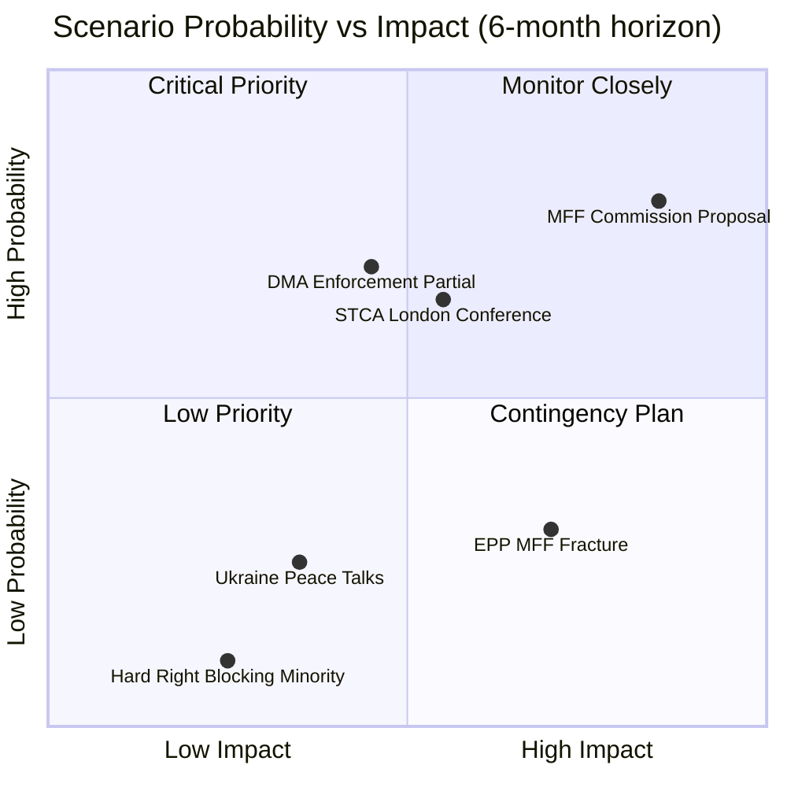

<!-- SPDX-FileCopyrightText: 2026 Hack23 AB -->
<!-- SPDX-License-Identifier: Apache-2.0 -->

# Scenario Forecast — EP Breaking News | April 28–30, 2026

**Date:** 2026-05-04 | **Confidence:** 🟡 MEDIUM | **Horizon:** 6–18 months

## Analytical Framework

This forecast applies structured analytic scenario modelling across four domains emerging from the April 28–30 plenary outcomes. Each scenario is assessed on two dimensions: (1) probability over a 12-month horizon, and (2) institutional impact on EU governance and legislation.

---

## Domain 1: Ukraine Policy Trajectory

### Scenario U1: EP Accountability Posture Maintained (Baseline) — Probability: 60%
The EP continues its hawkish Ukraine stance through 2026. The Special Tribunal for Crime of Aggression gains Council endorsement by Q4 2026. Frozen Russian assets continue to be mobilised for Ukraine reconstruction. EPP maintains Ukraine support as a core institutional identity signal.

**Key assumptions:**
- No dramatic military reversal in Ukraine that forces EU strategic recalculation
- US-EU coordination continues despite Trump administration pressure for negotiations
- ECR/PfE cannot build a majority coalition to soften EP's Ukraine position
- EPP von der Leyen institutional legacy remains politically binding on EPP MEPs

**Policy outcomes:** STCA negotiations advance, but ratification by all 27 member states faces obstacles (unanimity required). Ukraine EU accession chapter negotiations continue. Defence spending pressure on member states increases through NATO burden-sharing rather than EU mechanisms.

### Scenario U2: Negotiations Pressure Creates EP Fracture — Probability: 25%
US-brokered peace talks in 2026–2027 force EU institutional recalibration. EPP members from Central European states (Slovakia, Hungary, Bulgaria) begin to abstain or vote against maximalist accountability measures. The EP coalition on Ukraine narrows to S&D + Renew + Greens + Left bloc (311 seats — below majority threshold).

**Trigger events:**
- Ukrainian territorial concessions in ceasefire negotiations
- Trump administration demanding EU "good faith" negotiations as condition for continued NATO commitment
- EPP internal revolt led by Orbán allies + ECR crossovers on specific votes

**Policy outcomes:** STCA process stalled. Frozen asset mobilisation capped. Ukraine accession timelines extend beyond 2030. EP loses its position as the most hawkish EU institution on Russia.

### Scenario U3: Escalation — New Russian Strikes Reinforce EP Posture — Probability: 15%
A new large-scale Russian attack on Ukrainian infrastructure or civilian population triggers an emergency EP plenary and reinforces the accountability coalition beyond current levels. The accountability posture hardens rather than softens.

**Trigger events:**
- Russian missile/drone escalation targeting major Ukrainian cities
- Evidence of new war crimes submitted to EP committees by Ukrainian government
- European public opinion shift toward harder sanctions

---

## Domain 2: DMA Enforcement Trajectory

### Scenario D1: Commission Moves Faster, Major Fine Levied — Probability: 40%
The EP resolution (TA-10-2026-0160) provides the political mandate for DG COMP to issue its first major DMA fine in Q3 2026. Apple faces a fine of 5–8% global turnover (~€15–24 billion) for iOS App Store non-compliance. This cements DMA as a credible enforcement regime.

**Key assumptions:**
- EP resolution cited in Commission enforcement proceedings
- General Court does not issue an injunction on DMA enforcement pending appeal
- US government does not escalate into trade war framing

**Market outcomes:** Apple forced to implement full App Store interoperability in EU. Other gatekeepers accelerate compliance to avoid similar penalties. EU develops comparative advantage as global DMA-compliant tech market.

### Scenario D2: Commission Softens Under Competitiveness Pressure — Probability: 35%
The Better Regulation Communication that triggered the EP resolution succeeds in delaying DMA enforcement. Commission proposes DMA revision to create "safe harbours" for certain gatekeeper practices. EP resolution fails to change enforcement trajectory.

**Trigger events:**
- EU Competitiveness Commissioner reports economic drag from DMA compliance costs
- Industry lobby succeeds in framing DMA as deterrent to AI investment in Europe
- Council majority resists EP enforcement pressure

**Market outcomes:** DMA becomes a "paper tiger" like early GDPR enforcement years (2018–2020). Regulatory arbitrage increases. EU tech sector remains disadvantaged vs. US platforms.

### Scenario D3: DMA-AI Intersection Creates New Legislative Cycle — Probability: 25%
The expansion of LLMs and AI assistants into gatekeeper platforms creates regulatory uncertainty that triggers a DMA amendment or supplementary AI Act enforcement guidance. The April 2026 EP resolution's focus on existing DMA provisions becomes insufficient.

---

## Domain 3: MFF 2028–2034 Negotiation Trajectory

### Scenario M1: Negotiation Delay, Post-2027 Transitional Arrangements — Probability: 45%
MFF negotiations are delayed beyond Q4 2027 adoption deadline due to:
- Council unanimity obstacle (Hungary/Slovakia vetoes likely)
- EP-Council consent disagreement on climate spending percentage
- German election outcomes shifting net-contributor bloc positions

Emergency continuation of 2021–2027 commitments via transitional cap (capped at previous year's level per Treaty Article 312(4)) takes effect in 2028.

**Impact:** EU cohesion fund commitments pause pending new MFF. Enlargement financial architecture delayed. Defence spending MFF chapter deferred to a separate intergovernmental instrument.

### Scenario M2: Compressed Negotiation, Compromise MFF by Q4 2027 — Probability: 35%
EU institutions agree on a pragmatic MFF with:
- 10–12% real increase (compromise between 15–20% EP demands and net-contributor resistance)
- Climate spending at 35% (below 40% EP ask, above current 30%)
- New defence chapter as separate annex funded by CBAM revenues
- Rule-of-law conditionality maintained but with clearer dispute resolution mechanism

**Impact:** EU budget reform viable but modest. Enlargement financing secured for Ukraine and Western Balkans candidates. No breakthrough on own resources.

### Scenario M3: MFF Bundled with Enlargement Package — Probability: 20%
EU political leaders tie MFF 2028–2034 to formal accession of one or more candidate countries (most likely Montenegro or Albania), creating a political bundle that forces compromise.

---

## Domain 4: Poland-Hungary Rule-of-Law Trajectory

### Scenario R1: Poland Completes Rule-of-Law Normalization, Hungary Remains Isolated — Probability: 55%
Poland continues judicial reforms under Tusk government. Commission progressively unfreezes Polish cohesion funds. Hungary remains in Article 7 limbo, losing EU fund access but not triggering forced Council measures due to unanimity requirement.

### Scenario R2: Slovakia Joins Hungary as Backslider — Probability: 30%
The Fico government in Slovakia accelerates erosion of judicial independence and media freedom. Commission opens Article 7 proceedings against Slovakia in 2026. The backsliding bloc (Hungary + Slovakia) gains more leverage in Council.

### Scenario R3: Hungarian Breakthrough Under Council Pressure — Probability: 15%
Orbán government makes structural judicial reform concessions to unlock MFF 2028–2034 negotiations, creating a diplomatic breakthrough. The Article 7 process de-escalates. EU funds released to Hungary create domestic political complications for the opposition.

---

## Summary Probability Matrix

| Scenario | Domain | 12-month probability | Impact severity |
|----------|--------|---------------------|----------------|
| U1: EP Accountability Maintained | Ukraine | 60% | HIGH |
| U2: EP Fracture on Negotiations | Ukraine | 25% | CRITICAL |
| U3: Escalation Reinforces Posture | Ukraine | 15% | HIGH |
| D1: Commission Fines Apple/Gatekeepers | DMA | 40% | HIGH |
| D2: Commission Softens Enforcement | DMA | 35% | MEDIUM |
| D3: DMA-AI Extension | DMA | 25% | HIGH |
| M1: MFF Delay/Transitional | MFF | 45% | CRITICAL |
| M2: Compressed MFF Compromise | MFF | 35% | HIGH |
| M3: MFF-Enlargement Bundle | MFF | 20% | HIGH |
| R1: Poland Normalizes/Hungary Isolated | Rule of Law | 55% | MEDIUM |
| R2: Slovakia Backslides | Rule of Law | 30% | HIGH |
| R3: Hungarian Breakthrough | Rule of Law | 15% | HIGH |

## Recommended Intelligence Monitoring Priorities

1. **Ukraine tribunal formation** — Track Council conclusions on STCA legal architecture (Q3 2026)
2. **DMA enforcement decisions** — Monitor DG COMP General Court docket for injunction requests against EP resolution follow-up
3. **MFF 2028–2034 Commission proposal** — Expected June 2026; will set the formal negotiation baseline
4. **Polish judicial reform benchmarks** — Commission rule of law compliance audit timeline
5. **ECR/PfE voting bloc coherence** — Watch for fractures on Ukraine votes that would signal right-bloc coalition pressure on EPP

---

## Scenario Probability Matrix

## Extended Scenario Analysis

### Scenario Interdependencies

The four primary scenarios (Baseline Continuation, MFF Confrontation, DMA Enforcement Acceleration, Geopolitical Disruption) interact in ways that create compound scenarios:

**Compound Scenario A: DMA Enforcement + MFF Confrontation**
- If Commission uses DMA enforcement as MFF bargaining chip AND MFF negotiations become confrontational, EP10 faces a complex two-front institutional negotiation
- Probability: 20% | Impact: Very High
- Distinctive feature: Commission would be trading enforcement for budget compliance — creates perverse incentives for future regulatory bargaining

**Compound Scenario B: Ukraine Peace + MFF Reform**
- If ceasefire achieved in Ukraine in H2 2026, EU can redirect MFF resources from Ukraine support to enlargement pre-accession
- Probability: 10% | Impact: High (positive)
- Distinctive feature: Releases €20–30 billion in proposed MFF Ukraine support for reallocation

**Compound Scenario C: Coalition Stress + Hard Right Strengthening**
- If EPP fractures on MFF AND PfE/ECR converge on blocking strategy, EP10 coalition could face governance crisis
- Probability: 8% | Impact: Very High
- This is the tail risk scenario that would fundamentally alter EP10's legislative capacity

### Admiralty Assessment

**Overall scenario forecast reliability:**
**Source reliability:** B (Reliable) — structural analysis + historical pattern
**Information credibility:** 3 (Possibly True) — forward projections inherently uncertain; based on established patterns

The Baseline Continuation scenario (probability 55%) is assessed as most likely but not overwhelmingly so. The significant probability mass in alternative scenarios (45%) reflects genuine uncertainty in the MFF and Ukraine trajectories.
