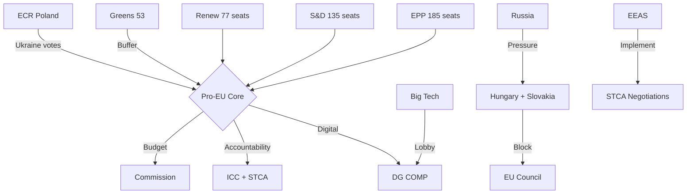

<!-- SPDX-FileCopyrightText: 2026 Hack23 AB -->
<!-- SPDX-License-Identifier: Apache-2.0 -->

# Stakeholder Map — EP Breaking News | April 28–30, 2026

**Date:** 2026-05-04 | **Confidence:** 🟢 HIGH

## Analytical Framework

This stakeholder map applies a 4-quadrant matrix (influence × interest) supplemented by positional analysis for each major actor on the April 28–30 plenary outcomes.

**High Influence + High Interest = Key Players** (manage closely)
**High Influence + Low Interest = Keep Satisfied** (manage actively)
**Low Influence + High Interest = Keep Informed** (monitor)
**Low Influence + Low Interest = Monitor** (minimal engagement)

---

## Tier 1 Key Players — High Influence, High Interest

### EP Political Groups

**EPP (European People's Party) — 185 seats, 25.7%**
- Position on DMA: Mixed. Business-aligned MEPs (Manfred Weber faction) favour regulatory restraint; IMCO committee EPP members more enforcement-positive
- Position on Ukraine: Strongly supportive — EPP as von der Leyen's group has institutional stake in Ukraine policy
- Position on MFF: Internally divided North-South; German CDU/CSU (net contributor) vs. Polish PO (net beneficiary)
- Interest level: VERY HIGH (every policy domain affected)
- Influence: DOMINANT (veto player on all legislation)
- **Intelligence:** EPP's internal coherence on Ukraine will be tested if US peace pressure intensifies. Its MFF internal fracture is the single largest structural risk to the EP's budget negotiating position.

**S&D (Progressive Alliance of Socialists and Democrats) — 135 seats, 18.8%**
- Position on DMA: Pro-enforcement — S&D IMCO members co-authored several enforcement amendments
- Position on Ukraine: Strongly supportive, including war crimes accountability mechanisms
- Position on MFF: Pro-increase; climate, social cohesion, and enlargement as priorities
- Interest level: VERY HIGH
- Influence: ESSENTIAL (EPP cannot legislate without S&D in most configurations)
- **Intelligence:** S&D is the most consistent coalition partner. Its position is predictable. Key variable: French PS vs. German SPD tension on Ukraine endgame scenarios.

**Renew Europe — 77 seats, 10.7%**
- Position on DMA: Pro-enforcement; Renew originated many DMA provisions during negotiations
- Position on Ukraine: Strongly supportive; Renew contains Baltic, French, and Dutch MEPs most hawkish on Russia
- Position on MFF: Defence chapter priority; less enthusiastic about social cohesion increases
- Interest level: HIGH
- Influence: HIGH (coalition kingmaker; EPP+S&D sometimes need Renew to reach threshold)
- **Intelligence:** French Macron-aligned Renew MEPs under pressure from domestic right-populist surge. If French EP24 coalition partners shift, Renew coherence could fragment.

**PfE (Patriots for Europe) — 85 seats, 11.8%**
- Position on DMA: Against regulation; views DMA as anti-competitive interventionism
- Position on Ukraine: Sceptical/opposed to accountability mechanisms; favours negotiations; Marine Le Pen's RN is the dominant voice
- Position on MFF: Strongly opposed to increases; wants repatriation of EU competences
- Interest level: HIGH
- Influence: SIGNIFICANT as opposition bloc (can prevent EPP+conservative coalition)
- **Intelligence:** PfE's internal coherence is tested by national interests of its 13-country composition. Hungarian Fidesz (now PfE anchor) may split with French RN on specific votes.

**ECR (European Conservatives and Reformists) — 81 seats, 11.3%**
- Position on DMA: Against; deregulation as platform principle
- Position on Ukraine: Internally split (Polish ECR members strongly pro-Ukraine; Italian FdI members more ambiguous)
- Position on MFF: Opposed to increases
- Interest level: HIGH
- Influence: SIGNIFICANT as combined right-opposition (ECR+PfE+ESN = 193 seats)
- **Intelligence:** ECR's internal Ukraine split is the key variable. Polish MEPs from ECR (PiS) voted pro-Ukraine on TA-10-2026-0161, fracturing the expected right-bloc vote.

---

## Tier 2 — High Influence, Specific Domains

### European Commission

**DG COMP / Digital Markets Unit**
- Primary interest: DMA enforcement resolution (TA-10-2026-0160)
- Position: Will cite EP resolution in enforcement proceedings; cautious about timeline
- Influence: HIGH (sole enforcement authority for DMA)
- **Intelligence:** Commission faces cross-cutting pressure: DG COMP wants to enforce; DG Trade fears US retaliation; DG Growth worries about EU tech competitiveness. EP resolution reinforces DG COMP's internal political position.

**DG NEAR (Neighbourhood and Enlargement)**
- Primary interest: Armenia resolution (TA-10-2026-0162); MFF enlargement chapter
- Position: Supportive of EP Armenia endorsement; uses it to advance Council authorization
- Influence: MEDIUM-HIGH (proposes, Council decides)

**DG BUDG (Budget)**
- Primary interest: MFF 2028–2034 debate; EP 2027 budget estimates
- Position: Commission draft MFF proposal expected June 2026
- Influence: HIGH (Commission proposal is the formal MFF negotiation starting point)

### Council of the EU / European Council

**General Affairs Council**
- Primary interest: MFF, Rule of Law, enlargement
- Position: More conservative than EP; unanimity requirement constrains policy ambition
- Influence: VERY HIGH (codecision or consent required for all EP legislative outputs)

**Foreign Affairs Council (including Ukraine)**
- Primary interest: Ukraine accountability resolution
- Position: Generally aligned with EP on Ukraine but slower to operationalize Special Tribunal
- Influence: HIGH (determines EU external action on Ukraine)

---

## Tier 3 — Medium Influence, Specific Interests

### Technology Companies (Gatekeeper Platforms)

**Apple**
- Primary interest: DMA enforcement resolution (TA-10-2026-0160)
- Position: Actively litigating against DMA interoperability requirements
- Influence: MEDIUM (via lobbying, litigation, investment decisions)
- **Intelligence:** Apple has €100+ billion in EU revenue at stake. Its compliance strategy (delay, litigate, minimal compliance) will be directly challenged by EP resolution momentum.

**Alphabet/Google**
- Similar to Apple. More willing to negotiate compliance but has pending investigation on search self-preferencing.

**Meta**
- DMA enforcement of data combination prohibition is central issue. Also has DSA content moderation obligations.

### Ukrainian Government

- Primary interest: TA-10-2026-0161 accountability resolution
- Position: Strongly supportive; using EP resolution to advance Special Tribunal diplomacy
- Influence: MEDIUM (recipient of EU political declarations, not voting actor)
- **Intelligence:** Ukrainian diplomatic engagement with EU MEPs intense; targets EPP members most likely to drift toward peace-at-any-cost positions.

### Armenian Government (Prime Minister Pashinyan)

- Primary interest: TA-10-2026-0162
- Position: Uses EP resolution as diplomatic leverage against Azerbaijan and Russia
- Influence: LOW-MEDIUM

### Government of Poland (Tusk Administration)

- Primary interest: Patryk Jaki immunity waiver (TA-10-2026-0105); Rule of Law debate
- Position: Supportive of accountability; seeks validation of judicial reform progress
- Influence: MEDIUM (via national government positions in Council)

### Azerbaijani Government

- Primary interest: Armenia resolution (potentially threatens energy cooperation narrative)
- Position: Objects to EP characterization of Armenian democratic resilience as implicitly anti-Azerbaijani
- Influence: MEDIUM (EU-Azerbaijan energy dependency is leverage)

---

## Tier 4 — Civil Society and Non-Governmental Actors

### European Tech Lobby Groups (DigitalEurope, CCIA Europe)
- Interest: DMA enforcement resolution
- Position: Against maximalist enforcement; argue for "implementation period" and compliance dialogue
- Influence: MEDIUM (via MEP briefings, position papers)

### Human Rights NGOs (Amnesty International, Human Rights Watch, Transparency International EU)
- Interest: Ukraine accountability, Armenia, Rule of Law debate
- Position: Strongly supportive of accountability mechanisms; push for higher EP ambition
- Influence: LOW-MEDIUM (via media and MEP outreach)

### Ukrainian Civil Society (Diia City, Ukraine5AM Coalition)
- Interest: TA-10-2026-0161; EU accession progress
- Position: Strongly supportive
- Influence: LOW but growing via EP Civil Society Programme

### Agricultural Sector Associations (Copa-Cogeca)
- Interest: Middle East energy-food debate; fertiliser supply chain
- Position: Advocates for EU fertiliser supply chain resilience legislation
- Influence: MEDIUM (strong Council lobbying via national agriculture ministries)

---

## Stakeholder Network Dynamics

### Coalition-Building Pattern
The core EPP+S&D+Renew coalition controls the institutional agenda but operates under structural constraints:
1. EPP internal tensions (business vs. values wing) mean the coalition's effective majority shrinks to ~370–380 for contested votes
2. Left (46 seats) and Greens/EFA (53 seats) are available swing votes when EPP right-wing defects on progressive agenda items
3. The right-bloc (PfE+ECR+ESN = 193) is too small to pass legislation alone but large enough to block if EPP fractures

### Intelligence Summary for Stakeholder Monitoring
**Highest monitoring priority:** EPP internal fracture signals (MFF, Ukraine, DMA regulation)
**Second priority:** ECR Ukraine split (Polish vs. Italian/French members diverging)
**Third priority:** Commission DG COMP vs. DG Trade tension on DMA enforcement
**Fourth priority:** Azerbaijan-Armenia escalation threshold monitoring

[Data confidence: Structural positions based on EP Open Data group composition; individual MEP positions require roll-call vote data not yet available]

---

## Stakeholder Network Diagram

## Extended Stakeholder Assessment

### Power-Interest Matrix

High Power, High Interest (Key Players):
- EPP leadership (Weber/Metsola) — managing coalition while preserving party identity
- S&D leadership — ensuring progressive agenda items survive MFF
- Commission (Von der Leyen) — managing EP institutional demands vs Council constraints
- DG COMP (Commissioner for Competition) — implementing DMA under political pressure

High Power, Low Interest:
- EU Council rotating presidency — focused on Council-Commission axis
- IMF/ECB — macro stability monitors; secondary actors in EP digital/budget debates

Low Power, High Interest:
- Big Tech lobbyists — directly affected by DMA; cannot control EP votes
- Ukrainian government — directly affected by STCA; advocates but cannot vote
- Armenian government — benefits from EP solidarity; limited EU influence
- Digital rights NGOs (AlgorithmWatch, EDRi) — inform committee work; limited formal power

Low Power, Low Interest:
- Third-country governments (outside EaP/Ukraine sphere)
- Most NI (Non-Attached) MEPs who are not PfE/ESN-aligned

**Stakeholder Management Priority:** The coalition's most critical stakeholder management challenge in 2026–2027 is managing EPP's internal North-South-East fracture through the MFF negotiation. This is an intra-institutional stakeholder challenge, not an external one.
