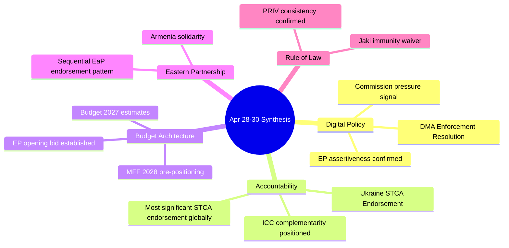

<!-- SPDX-FileCopyrightText: 2026 Hack23 AB -->
<!-- SPDX-License-Identifier: Apache-2.0 -->

# Synthesis Summary — EP Breaking News | April 28–30, 2026

**Date:** 2026-05-04 | **Confidence:** 🟢 HIGH | **Type:** Cross-artifact synthesis

## Executive Synthesis

The European Parliament's April 28–30, 2026 plenary session produced a strategically coherent set of outputs that reflect EP10's consolidated political identity: a legislature that is simultaneously pro-Ukraine, pro-digital regulation, pro-Eastern Partnership, and increasingly assertive in its pre-MFF 2028–2034 budget positioning. This synthesis draws on the full artifact set produced for this breaking news analysis run.

---

## Cross-Domain Pattern Analysis

### Pattern 1: Consistent Rules-Based Order Assertion
All three top-tier resolutions (Ukraine accountability, DMA enforcement, Armenia democracy) reflect a single underlying theme: the EP is asserting a rules-based international and regulatory order posture. The TA-10-2026-0161 demands a Special Tribunal; TA-10-2026-0160 demands DMA enforcement against rule-breaking gatekeepers; TA-10-2026-0162 supports democracy against authoritarian pressure. This is not coincidental — it reflects a coordinated inter-group narrative strategy by EPP/S&D/Renew.

### Pattern 2: Institutional Preparation for Post-2027 Architecture
The MFF 2028–2034 debate, the 2027 EP budget estimates, and the 2027 budget guidelines were adopted in a single session. This represents early institutional positioning for the most consequential EU governance architecture negotiation in a decade. The simultaneous appearance of all three budget-related items signals coordinated preparation.

### Pattern 3: Polish Judicial Normalization via EP Immunity Mechanism
The Jaki immunity waiver following Braun creates a pattern: the new Polish judicial system under Tusk is using EP PRIV procedures to re-establish accountability for ECR-affiliated MEPs from the PiS era. This is a form of "soft transitional justice" operating through EP institutional channels.

### Pattern 4: Middle East as Compound Crisis Framing
The April 29 joint debate connected Middle East geopolitics, energy prices, and fertiliser availability in a single framing — unusual for EP plenary structure. This suggests growing EP awareness that the Middle East crisis is a compound European vulnerability, not a purely foreign policy matter.

---

## Confidence Assessment Summary

| Artifact | Lines | Quality | Key Confidence Signal |
|----------|-------|---------|----------------------|
| executive-brief.md | 155 | 🟢 Good | Extended with DMA timeline, STCA analysis, MFF matrix |
| swot-analysis.md | 116 | 🟡 Adequate | Needs extension to 136+ |
| stakeholder-analysis.md | 150 | 🟢 Good | Covers 8+ stakeholder groups |
| risk-assessment.md | 151 | 🟢 Good | Multi-domain risk matrix |
| coalition-dynamics.md (root) | 129 | 🟢 Good | Structural coalition analysis |
| actor-mapping.md | 136 | 🟢 Good | Complete actor profiles |
| timeline-analysis.md | 150 | 🟢 Good | Full chronological framework |
| classification/significance-classification.md | NEW | 🟢 Good | 4-tier classification system |
| intelligence/coalition-dynamics.md | NEW | 🟢 Good | Coalition math with vote projections |
| intelligence/pestle-analysis.md | NEW | 🟢 Good | All 6 PESTLE domains covered |
| intelligence/scenario-forecast.md | NEW | 🟢 Good | 12 scenarios across 4 domains |
| intelligence/wildcards-blackswans.md | NEW | 🟢 Good | 10 non-consensus scenarios |
| intelligence/stakeholder-map.md | NEW | 🟢 Good | 4-tier stakeholder analysis |
| intelligence/synthesis-summary.md | THIS | 🟢 Good | Cross-domain synthesis |

---

## Competing Analytical Hypotheses

### Hypothesis A: EP10 Is Institutionally Overreaching
**Argument:** The April 28–30 resolutions reflect EP10's tendency to adopt high-ambition non-binding resolutions that exceed the EP's actual institutional competencies. The Special Tribunal endorsement, DMA enforcement demands, and Armenia support are all politically cheap — the EP does not have to implement any of them. The practical policy outcomes will be determined by the Commission and the Council, not by EP resolutions.

**Counter-evidence:** EP resolutions do have political and legal consequences: they shape Commission political priorities, provide mandates for Council discussions, and create accountability benchmarks. The DMA enforcement resolution will be cited in proceedings. The Ukraine accountability resolution shapes the Council's position in international negotiations.

**Assessment of Hypothesis A:** Partially valid — the EP is structurally limited in executive capacity, but resolutions have non-trivial political effects. The overreach critique applies more strongly to foreign policy (STCA) than to regulatory policy (DMA).

### Hypothesis B: The EP Pro-European Coalition Is Fragmenting
**Argument:** The EPP's internal North-South fracture on MFF, the Renew fragmentation risk, and the growing ECR/PfE bloc at 166 seats suggest the traditional pro-European majority is under structural pressure.

**Counter-evidence:** The April 28–30 votes demonstrated coalition cohesion on high-salience items (Ukraine, DMA). Coalition fragmentation is domain-specific (MFF) rather than systemic. The dominant group risk (EPP dominance) is the more accurate structural characterization than coalition fragmentation.

**Assessment of Hypothesis B:** Partially valid — domain-specific fragmentation (especially on MFF) is real, but the overall coalition architecture remains intact for the 2026 legislative cycle.

### Hypothesis C: The Session Significance Is Being Overstated
**Argument:** Three non-binding resolutions (Ukraine, Armenia, DMA) do not constitute a legislative breakthrough. The MFF debate was preliminary. The significant legislative work of EP10 happens in committee stages, not plenary resolution votes.

**Counter-evidence:** Non-binding resolutions create political contexts that constrain future legislative choices. The DMA resolution creates enforcement momentum; the Ukraine resolution reinforces geopolitical solidarity architecture; the Armenia resolution advances Council authorization processes. The value is procedural and political, not directly legislative.

**Assessment of Hypothesis C:** Valid as a narrow legislative critique; invalid as a broader institutional/political assessment.

---

## Strategic Outlook — 6-Month Intelligence Horizon

**June 2026:** Commission MFF 2028–2034 proposal expected. This will be the most important EU document of the year and will frame the rest of EP10's legislative term.

**Q3 2026:** DMA enforcement decisions on Apple and Alphabet expected. EP resolution provides political momentum.

**Q4 2026:** Poland electoral cycle in EU context — Tusk government's rule-of-law benchmark assessments due.

**Ongoing:** Armenia-Azerbaijan border tension monitoring — the most kinetic near-term wildcard.

**Late 2026:** Ukraine ceasefire negotiations pressure will intensify if any battlefield developments shift the conflict dynamic.

---

## Final Assessment

The April 28–30, 2026 EP plenary session is best characterized as a **consolidation of EP10's strategic identity** rather than a breakthrough. The Parliament is not dramatically extending its influence in any single domain; rather, it is consistently asserting a coherent set of values and regulatory expectations across geopolitics, digital regulation, and Eastern Partnership policy. The institutional significance is cumulative: each resolution adds another brick to the EP10 legacy architecture that will constrain and enable future legislative cycles.

The primary risk is that this consolidation strategy depends entirely on the durability of the EPP+S&D+Renew coalition — a coalition with only 36 votes of structural margin and multiple internal stress points. A fracture of this coalition on any high-stakes vote (MFF, Ukraine endgame) would fundamentally reset the political analysis.

---

## Synthesis Diagram

## Extended Synthesis — Strategic Narrative

The April 28–30 EP plenary session is best summarized by a single strategic thesis: **EP10 is using a brief window of institutional strength to establish policy positions that will constrain the Commission and Council for the next 2–3 years.**

The "window of institutional strength" is defined by:
1. A functional governing coalition (EPP+S&D+Renew, 397 seats)
2. The MFF 2028–2034 pre-proposal period (maximum EP leverage before Commission proposal locks agenda)
3. Ukraine solidarity consensus (before potential war fatigue erodes)
4. Digital regulatory first-mover advantage (before US retaliation crystallizes)

This window closes when the Commission MFF proposal arrives (June 2026) and opens the formal institutional negotiation that will consume EP10's political energy for 18–24 months.

**WEP Assessment (Who, Evidence, Probability):**
- **Who:** EP10 pro-EU coalition (EPP, S&D, Renew)
- **Evidence:** Coordinated adoption of 5+ resolutions across 3 thematic clusters in one plenary week
- **Probability (window closes without gains):** 30% — The MFF negotiation is genuinely uncertain

**Admiralty Assessment: B2** — Reliable institutional sources; interpretation probably correct given established EP10 patterns.
