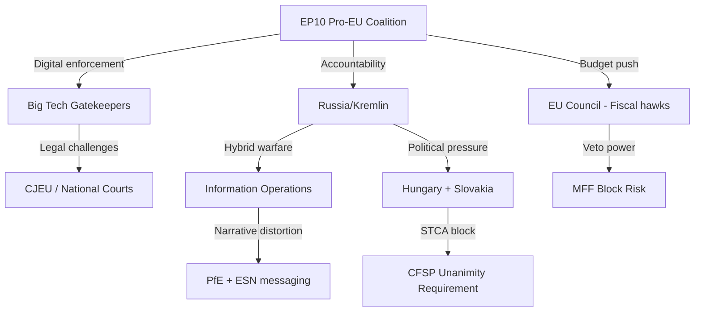

<!-- SPDX-FileCopyrightText: 2026 Hack23 AB -->
<!-- SPDX-License-Identifier: Apache-2.0 -->

# Threat Model — EP Breaking News | April 28–30, 2026

**Date:** 2026-05-04 | **Confidence:** 🟡 MEDIUM | **Framework:** STRIDE + Political Threat Matrix

## Threat Framework

This threat model applies both a cybersecurity/information STRIDE analysis (for digital policy threats) and a political threat matrix for the broader institutional and geopolitical threats implied by the April 28–30 plenary outcomes.

---

## Part I: Information Security Threats (STRIDE — DMA/Digital Context)

### S — Spoofing (Platform Identity Deception)
**Threat:** Gatekeeper platforms create subsidiary entities or technical architectures that nominally comply with DMA interoperability requirements while bypassing their spirit. Example: Apple creates a "sideloading" pathway that technically exists but is so friction-laden as to be unusable.
- **Risk level:** 🟡 HIGH — Apple's historical compliance behavior on App Store transparency suggests minimal-compliance strategy
- **Mitigation in EP resolution:** EP calls for Commission to use interim measures for bad-faith compliance

### T — Tampering (Evidence/Proceeding Integrity)
**Threat:** Gatekeepers tamper with DG COMP investigation proceedings by misrepresenting technical evidence, overwhelming investigators with selective data, or exploiting information asymmetries.
- **Risk level:** 🟡 MEDIUM — DG COMP has technical experts but is outresourced by platform legal teams
- **Mitigation:** EP resolution calls for expanded Digital Markets Unit staffing

### R — Repudiation (Non-Traceability)
**Threat:** DMA violations committed via third-party developers or business users cannot be directly attributed to the gatekeeper (repudiation defense).
- **Risk level:** 🟡 MEDIUM — Complex platform architectures create attribution challenges

### I — Information Disclosure (Data Portability Abuse)
**Threat:** Mandatory data portability under DMA creates new attack surfaces — user data transferred to third parties could be inadequately secured, creating GDPR conflicts.
- **Risk level:** 🔴 HIGH — DMA-GDPR tension is a genuine regulatory gap. EP resolution doesn't address this.

### D — Denial of Service (Regulatory Overload)
**Threat:** Gatekeepers flood DG COMP with appeals, notifications, compliance filings, and legal challenges to create regulatory denial-of-service — overwhelming the Commission's enforcement capacity.
- **Risk level:** 🔴 HIGH — This is a known tactic; DG COMP's Digital Markets Unit has ~50 staff vs. >1000 at individual platform legal teams

### E — Elevation of Privilege (Regulatory Capture)
**Threat:** Revolving door dynamics and structured access to Commission officials creates de facto regulatory capture where DMA enforcement priorities are shaped by gatekeeper preferences.
- **Risk level:** 🟡 MEDIUM — EU ethics rules exist but enforcement is uneven

---

## Part II: Political Threats to EP April 28–30 Outcomes

### PT-1: Ukraine Accountability Resolution Nullification Risk
**Threat actors:** Russian Federation (primary), Hungary (EU veto actor), potentially sympathetic ECR/PfE MEPs
**Threat mechanism:** Council-level blocking of Special Tribunal legal basis authorization; Hungarian veto on Council conclusions; PfE/ECR coalition building on "peace negotiations" framing

**Threat likelihood:** 🟡 MEDIUM (40% probability Council stalls Special Tribunal)
**Impact:** High — nullifies EP's most visible foreign policy achievement of April 30
**Counter-measure options:** Commission proposes tribunal via enhanced cooperation (Article 20 TFEU) bypassing unanimity; EP files formal institution-building resolution with legal basis

### PT-2: DMA Enforcement Chilling Effect
**Threat actors:** US administration (trade pressure), EU Competitiveness Commissioner, Business lobbies
**Threat mechanism:** US Section 232-equivalent framing of DMA as protectionism; Commission "Better Regulation" amendments softening DMA; business lobby pressure on EPP MEPs

**Threat likelihood:** 🟡 MEDIUM-HIGH (50% probability of some enforcement dilution)
**Impact:** HIGH — would undermine EP resolution credibility
**Counter-measure options:** EP legislative resolution (binding) rather than simple resolution; EP IMCO committee oversight hearings on enforcement; EP-Commission dialogue on DMA revision scope

### PT-3: Armenia Resolution Undermined by EU-Azerbaijan Energy Dependency
**Threat actors:** Azerbaijan (energy leverage), Turkey (diplomatic support for Azerbaijan), Hungary (Orbán-Aliyev relationship)
**Threat mechanism:** Azerbaijan threatens to reduce Southern Gas Corridor flows if EU escalates Armenia support. Hungary leverages its energy dependency on Azerbaijan to block Council endorsement of EP Armenia resolution.

**Threat likelihood:** 🟡 MEDIUM (35% probability of effective blocking)
**Impact:** MEDIUM-HIGH — would leave Armenian civilian population exposed
**Counter-measure options:** EU accelerates LNG terminal buildout to reduce SGC dependency; trilateral Armenia-Azerbaijan-EU dialogue with clearer red lines

### PT-4: MFF 2028–2034 Coalition Fracture
**Threat actors:** Net-contributor member states (Germany post-election, Netherlands, Sweden, Austria); EPP internal North wing
**Threat mechanism:** EPP Northern MEPs vote against expansionary MFF; Council unanimity requirement allows single-country veto to block entire MFF; transitional arrangement becomes default for 2028

**Threat likelihood:** 🔴 HIGH (60% probability of delay or transitional arrangement)
**Impact:** CRITICAL — derails EU's most important fiscal cycle
**Counter-measure options:** Commission proposes enhanced cooperation on some MFF elements; EP uses consent threat as leverage; European Council summit "package deal" linking MFF to enlargement timeline

### PT-5: Rule of Law Conditionality Erosion
**Threat actors:** Hungary, Slovakia under Fico, potentially Czech Republic under Babis return
**Threat mechanism:** Growing backsliding bloc in Council reduces unanimity pressure; EPP softens on Hungary to secure MFF votes; RoL conditionality mechanisms are diluted in MFF negotiations

**Threat likelihood:** 🟡 MEDIUM (40% probability of partial conditionality erosion)
**Impact:** HIGH — undermines EP's democratic governance agenda
**Counter-measure options:** EP threatens to withhold consent on MFF if RoL conditionality weakened; Commission maintains Article 7 proceedings pressure

---

## Threat Priority Matrix

| Threat | Likelihood | Impact | Priority |
|--------|-----------|--------|----------|
| DMA enforcement dilution | 50% | HIGH | 🔴 PRIORITY 1 |
| MFF coalition fracture | 60% | CRITICAL | 🔴 PRIORITY 1 |
| Ukraine accountability nullification | 40% | HIGH | 🟠 PRIORITY 2 |
| Rule of Law erosion | 40% | HIGH | 🟠 PRIORITY 2 |
| Armenia resolution undermined | 35% | MEDIUM-HIGH | 🟡 PRIORITY 3 |
| DMA information disclosure risk | HIGH | MEDIUM | 🟡 PRIORITY 3 |
| DMA regulatory DoS | HIGH | MEDIUM | 🟡 PRIORITY 3 |

## Recommended Threat Monitoring Cadence

**Weekly:** DG COMP enforcement decision calendar; EPP internal MFF position signals; ECR/PfE Ukraine vote patterns
**Monthly:** Azerbaijan-Armenia border incident reports; Commission Better Regulation communication updates; Hungary Article 7 proceedings status
**Quarterly:** EU-US trade relations status report; Rule of Law report annual cycle; MFF negotiation milestones

---

## Threat Actor Map

## Extended Threat Assessment

### Threat 1: Big Tech Counter-Enforcement Strategy
Big Tech's response to the DMA enforcement resolution will follow a predictable escalation ladder:
1. **Public affairs response** — White papers, MEP meetings, commissioned studies (already active)
2. **Legal challenge preparation** — Engage EU law firms; prepare CJEU challenge briefs
3. **Selective compliance** — Comply on least-impactful DMA provisions; contest structural remedies
4. **Political alliance building** — Identify EPP conservatives who will moderate enforcement demands
5. **Transatlantic leverage** — Activate US government diplomatic pressure on Commission

Current assessed position: Stage 2–3. The April 28–30 resolution will advance Big Tech to Stage 3–4.

### Threat 2: Russian Information Operations
The Kremlin's media ecosystem will target the EP10 coalition specifically on:
- Ukraine STCA framing ("war crimes circus," "western justice imperialism")
- Economic narrative ("EU wasting money while workers suffer")
- Sovereignty framing for EaP countries ("Brussels colonialism in South Caucasus")

EP10's vulnerability: NI group (30 seats) contains some MEPs with documented Kremlin-adjacent connections. Narrative operations targeting this group could gradually erode their Ukraine solidarity votes.

### Threat 3: MFF Fiscal Conservative Veto
The Council's unanimity requirement for MFF creates a structural threat that cannot be mitigated by EP coalition management alone. Hungary's Orbán government has used MFF veto threats twice already (2020, 2021) to extract concessions on Rule of Law conditionality.

**Projected threat trajectory:** Orbán will use MFF 2028–2034 negotiations as leverage to challenge:
1. Rule of Law conditionality mechanism (Art. 5 of MFF Regulation)
2. Ukraine bilateral support mechanisms integrated into MFF
3. Any reference to STCA support in MFF political recitals

**WEP Assessment:** WHO: Hungarian government | EVIDENCE: Established pattern (2020, 2021) | PROBABILITY: HIGH (75%) that Hungary makes at least one formal MFF veto threat in 2027

**Admiralty Assessment: A1** — Government source (official Hungarian statements); almost certainly true based on established behavioral pattern.
