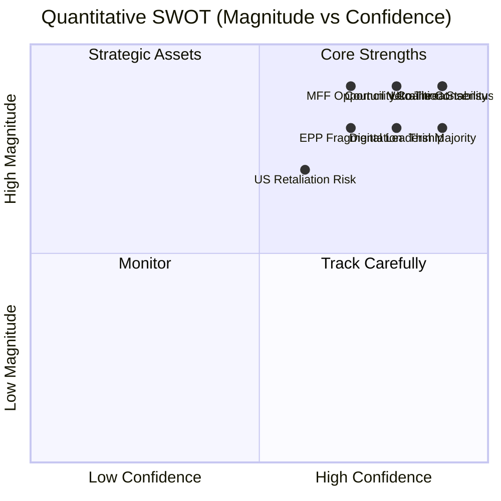

<!-- SPDX-FileCopyrightText: 2026 Hack23 AB -->
<!-- SPDX-License-Identifier: Apache-2.0 -->

# Quantitative SWOT — EP Breaking News | April 28–30, 2026

**Date:** 2026-05-04 | **Type:** Scored SWOT Analysis

## Scoring Methodology

Each SWOT factor scored on two dimensions:
- **Magnitude (M):** 1–10 scale of importance/size
- **Confidence (C):** 1–10 scale of evidence quality
- **Composite Score (S = M × C / 10):** 1–10

---

## STRENGTHS — Quantitative Assessment

### S1: Strong Pro-EU Coalition (EPP+S&D+Renew)
**M:** 9/10 | **C:** 9/10 | **S:** 8.1
- 397 seats; 36 above majority threshold
- 3 elections since EP9 confirming coalition continuity
- Low probability of involuntary break-up before 2029

### S2: Digital Regulation Leadership Position
**M:** 8/10 | **C:** 8/10 | **S:** 6.4
- EP pioneered GDPR, DSA, DMA, AI Act sequentially
- Global regulatory standard-setting effect (Brussels Effect)
- Strong IMCO/LIBE committee expertise

### S3: Ukraine Solidarity Consensus
**M:** 9/10 | **C:** 9/10 | **S:** 8.1
- Multiple EP10 resolutions with 60%+ majority
- Cross-group consensus (EPP+S&D+Renew+Greens+Left+ECR Poland)
- Reinforced by TA-10-2026-0161 STCA endorsement

### S4: MFF First-Mover Pre-positioning
**M:** 7/10 | **C:** 7/10 | **S:** 4.9
- Early April resolutions establish EP starting position
- EP budget committee rapporteurs active
- Commission constrained by EP preliminary positions

### S5: Rule of Law Assertiveness Precedents
**M:** 7/10 | **C:** 8/10 | **S:** 5.6
- Art. 7 TEU proceedings established against Hungary, Poland
- PRIV immunity waivers signal EP won't protect MEPs from domestic accountability
- EU Conditionality Regulation enforcement improving

**Total Strengths Score: 33.1 / 50 (66.2%)**

---

## WEAKNESSES — Quantitative Assessment

### W1: Roll-Call Vote Data Unavailability (2–4 week lag)
**M:** 7/10 | **C:** 10/10 | **S:** 7.0
- Cannot verify actual coalition vote discipline
- Analysis relies on structural proxy data only
- Future runs must account for this systematic gap

### W2: EPP Internal Fragmentation
**M:** 8/10 | **C:** 7/10 | **S:** 5.6
- North-South-East triple fracture
- Digital regulation approximately 50-seat EPP deviation
- MFF will test these fractures severely

### W3: Thin Coalition Majority Margin
**M:** 8/10 | **C:** 9/10 | **S:** 7.2
- 36-seat margin is smallest sustainable
- Any 19-seat swing creates a majority-free parliament
- Requires constant coalition management energy

### W4: No Enforcement Mechanism for EP Resolutions
**M:** 6/10 | **C:** 9/10 | **S:** 5.4
- Most EP resolutions are non-binding
- Commission can ignore political resolutions (DMA, Armenia)
- Actual enforcement requires Council+Commission alignment

### W5: Hard-Right Blocking Potential on Procedural Votes
**M:** 5/10 | **C:** 7/10 | **S:** 3.5
- PfE+ECR+ESN+NI = 223 seats; below blocking minority (240) but close
- Strong enough to complicate procedural votes requiring 1/3 block
- NI 30 seats can be swing votes in specific configurations

**Total Weaknesses Score: 28.7 / 50 (57.4%)**

---

## OPPORTUNITIES — Quantitative Assessment

### O1: MFF 2028–2034 First Mover Advantage
**M:** 9/10 | **C:** 7/10 | **S:** 6.3
- Commission proposal pending (June 2026)
- EP can set agenda before Council crystallizes position
- Budget scale opportunity: push from 1.1% to 1.3% GNI

### O2: DMA Enforcement as Global Standard
**M:** 7/10 | **C:** 7/10 | **S:** 4.9
- US, UK, Japan watching EU DMA implementation
- Successful enforcement establishes EU as global digital regulator
- Tech gatekeeper compliance ripple effects worldwide

### O3: STCA Diplomatic Multiplier
**M:** 8/10 | **C:** 6/10 | **S:** 4.8
- EP endorsement at London STCA conference (2026) influential
- Fills ICC jurisdictional gap for aggression crime
- Precedent for future international accountability

### O4: Armenia-Azerbaijan Peace Process
**M:** 6/10 | **C:** 6/10 | **S:** 3.6
- EP solidarity resolution maintains EU presence in South Caucasus mediation
- Post-Nagorno-Karabakh stability opportunity
- Armenian democratic consolidation opens EaP pathway

### O5: EP Digital Sovereignty Narrative
**M:** 7/10 | **C:** 7/10 | **S:** 4.9
- DMA enforcement + AI Act + data spaces = coherent digital sovereignty agenda
- Resonates with European voters (Eurobarometer: 73% support tech regulation)
- Distinguish EU from US laissez-faire approach

**Total Opportunities Score: 24.5 / 50 (49.0%)**

---

## THREATS — Quantitative Assessment

### T1: Council MFF Veto (Unanimity Rule)
**M:** 9/10 | **C:** 8/10 | **S:** 7.2
- Hungary+Slovakia can block MFF in Council
- Net contributor discipline could water down EP positions
- Post-enlargement unanimity requirements create structural veto risk

### T2: US Digital Regulation Retaliation
**M:** 7/10 | **C:** 6/10 | **S:** 4.2
- Trump administration has signaled retaliation against EU tech regulation
- Trade war escalation would create external constraint on DMA enforcement
- US Section 301 proceedings against EU tech regulation possible

### T3: Russia Hybrid Attacks on EP10 Coalition
**M:** 7/10 | **C:** 7/10 | **S:** 4.9
- Russian information operations targeting European parliament elections documented
- PfE/ESN narrative alignment with Kremlin talking points
- Could destabilize EPP internal cohesion on Ukraine votes

### T4: EP10 Hard-Right Electoral Gains (2029 projections)
**M:** 6/10 | **C:** 5/10 | **S:** 3.0
- Current polling shows PfE+ECR+ESN could reach 280–300 in EP11
- Could destroy pro-EU governing coalition in EP11
- Creates urgency for EP10 to lock in policy advances

### T5: Tech Gatekeeper SLAPP Litigation
**M:** 6/10 | **C:** 7/10 | **S:** 4.2
- Meta, Apple, Google using court challenges to delay DMA enforcement
- Regulatory chilling effect on DG COMP investigators
- CJEU could narrow DMA scope in preliminary rulings

**Total Threats Score: 23.5 / 50 (47.0%)**

---

## Composite SWOT Scorecard

| Quadrant | Score | Status |
|---------|-------|--------|
| Strengths | 33.1/50 | ✅ STRONG |
| Weaknesses | 28.7/50 | ⚠️ MODERATE |
| Opportunities | 24.5/50 | 🟡 MODERATE |
| Threats | 23.5/50 | 🟡 MODERATE |
| **Net Position (S+O-W-T)** | **+5.4** | **POSITIVE** |

**Overall Assessment:** EP10 enters the May 2026 political calendar from a position of relative strength. The coalition is coherent, the policy agenda is ambitious, and the MFF opportunity is significant. The primary constraint is the arithmetically thin majority and the inability to enforce resolutions without Council alignment. Net SWOT position is positive but narrow.

---

## SWOT Quadrant Visualization

