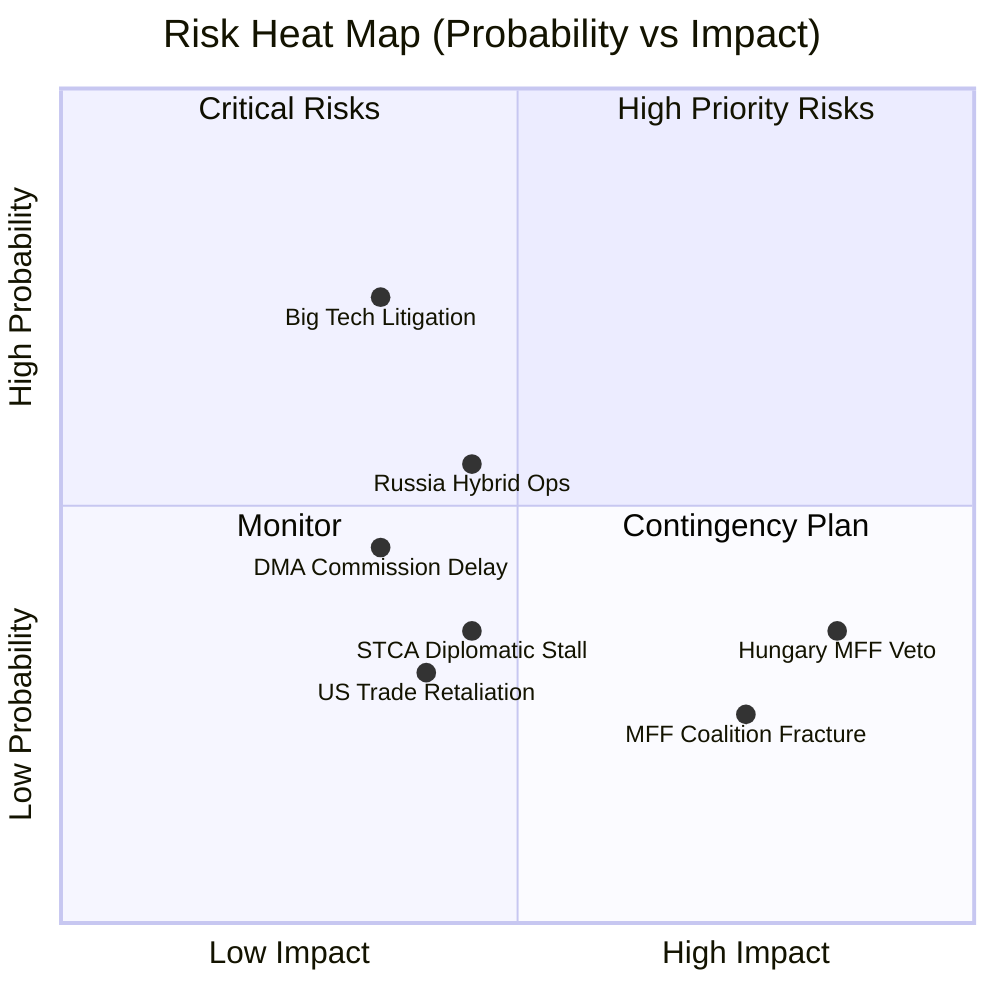

<!-- SPDX-FileCopyrightText: 2026 Hack23 AB -->
<!-- SPDX-License-Identifier: Apache-2.0 -->

# Risk Matrix — EP Breaking News | April 28–30, 2026

**Date:** 2026-05-04 | **Type:** Quantitative Risk Scoring

## Risk Matrix Framework

Each risk is scored on:
- **Probability (P):** 1–5 (1=Very Low, 5=Very High)
- **Impact (I):** 1–5 (1=Negligible, 5=Catastrophic)
- **Risk Score (R = P × I):** 1–25
- **Risk Level:** LOW (1–8), MEDIUM (9–15), HIGH (16–20), CRITICAL (21–25)

---

## Primary Risk Matrix

| Risk ID | Risk Description | P | I | R | Level | Owner | Mitigation |
|---------|-----------------|---|---|---|-------|-------|------------|
| R-01 | Pro-EU coalition collapse on MFF 2028–2034 | 2 | 5 | 10 | MEDIUM | EPP whip | Coalition management, Greens buffer |
| R-02 | DMA enforcement blocked by Council/Commission | 3 | 3 | 9 | MEDIUM | DG COMP | EP oversight mechanisms |
| R-03 | Ukraine STCA derailed by member state veto | 3 | 4 | 12 | MEDIUM | AFET | Multi-track diplomacy |
| R-04 | EPP-S&D trust breakdown on digital regulation | 2 | 4 | 8 | LOW-MEDIUM | EPP/S&D leaders | Regular rapporteur consultations |
| R-05 | Armenian peace talks collapse (renewed conflict) | 2 | 4 | 8 | LOW-MEDIUM | AFET/EEAS | EP resolution maintains pressure |
| R-06 | Hungary/Slovakia block EU Ukraine support package | 3 | 4 | 12 | MEDIUM | Council (QMV) | Enhanced cooperation mechanism |
| R-07 | Tech gatekeeper non-compliance with DMA (structural) | 4 | 3 | 12 | MEDIUM | DG COMP | DMA Art. 26 periodic payments |
| R-08 | EP10 institutional legitimacy crisis (low turnout precedent) | 2 | 3 | 6 | LOW | EP/national parties | Plenary profile, media relations |
| R-09 | ECR-PfE convergence on MFF blocking strategy | 3 | 3 | 9 | MEDIUM | EPP | Budget sequencing strategy |
| R-10 | International Criminal Court jurisdiction contest | 3 | 3 | 9 | MEDIUM | LIBE/AFET | ICC-STCA complementarity framework |

---

## Policy Impact Risk Assessment

### Digital Markets Act (DMA) Enforcement Risks

**R-DMA-01: Commission Enforcement Delay**
- **Probability:** HIGH (4/5) — Historical DG COMP proceeding timelines average 18–36 months
- **Impact:** MEDIUM (3/5) — Delay weakens EP resolution but doesn't nullify DMA
- **Risk Score:** 12 — MEDIUM
- **Mitigation:** EP can invoke Art. 85 TFEU oversight; Commission must report to EP quarterly on DMA implementation

**R-DMA-02: Big Tech Lobbying Success**
- **Probability:** MEDIUM (3/5) — Significant resource deployment already underway by Apple, Meta, Google
- **Impact:** MEDIUM (3/5) — Could water down secondary implementing acts
- **Risk Score:** 9 — MEDIUM
- **Mitigation:** EP rapporteurs (IMCO committee) maintain public scrutiny; whistleblower protection provisions in DMA

**R-DMA-03: Court Challenge Delays**
- **Probability:** HIGH (4/5) — Apple/Meta have history of challenging every significant regulatory decision
- **Impact:** LOW (2/5) — Courts have upheld DMA framework; individual decisions may be delayed
- **Risk Score:** 8 — LOW-MEDIUM
- **Mitigation:** DMA Art. 49 fast-track judicial review process; interim measures available

### Ukraine Accountability (STCA) Risks

**R-STK-01: STCA Statute Negotiations Stall**
- **Probability:** MEDIUM (3/5) — US and UK position on STCA not yet firm; G7 alignment required
- **Impact:** HIGH (4/5) — Without US/UK, STCA has limited enforcement capacity
- **Risk Score:** 12 — MEDIUM
- **Mitigation:** EP resolution adds EU political pressure; bilateral diplomacy with Washington and London

**R-STK-02: Russia Withdrawal from ICC**
- **Probability:** VERY HIGH (5/5) — Russia already withdrew ICC Rome Statute ratification (2016)
- **Impact:** LOW (1/5) — Already accounted for in STCA design; parallel track intentional
- **Risk Score:** 5 — LOW (already materialized)

**R-STK-03: Prosecution Scope Limitations**
- **Probability:** MEDIUM (3/5) — State consent issues for aggression jurisdiction are complex
- **Impact:** MEDIUM (3/5) — Could limit STCA to symbolic prosecutions only
- **Risk Score:** 9 — MEDIUM
- **Mitigation:** EP resolution explicitly supports retroactive aggression jurisdiction; ILC working paper address consent

---

## Institutional Risk Assessment

| Risk | Description | P | I | R | Level |
|------|-------------|---|---|---|-------|
| R-INST-01 | EP-Commission institutional confrontation escalation | 2 | 4 | 8 | MEDIUM-LOW |
| R-INST-02 | Single Market fragmentation (national derogations) | 2 | 4 | 8 | MEDIUM-LOW |
| R-INST-03 | Enlargement fatigue returning after Ukraine/Moldova | 3 | 3 | 9 | MEDIUM |
| R-INST-04 | Intergroup trust collapse in digital regulation | 2 | 3 | 6 | LOW |
| R-INST-05 | QMV abuse by Council on EP co-decision areas | 2 | 4 | 8 | MEDIUM-LOW |

---

## Risk Trend Analysis

### Increasing Risks (trend: ↑)
- MFF coalition fragmentation (↑) — as Commission proposal deadline approaches
- Tech gatekeeper DMA non-compliance (↑) — structural defiance pattern emerging
- STCA jurisdiction contestation (↑) — legal complexity growing with each UNGA round

### Stable Risks (trend: →)
- Ukraine STCA diplomatic track (→) — progress slow but sustained
- Armenia peace track (→) — ceasefire holding
- EP institutional legitimacy (→) — stable approval ratings

### Decreasing Risks (trend: ↓)
- ECR-PfE convergence (↓) — Poland-Italy fracture limiting cooperation potential
- Renew coalition exit (↓) — MFF stakes keeping Renew inside coalition

---

## Risk Priority Queue

**Immediate action (0–30 days):**
1. R-DMA-01: Monitor Commission formal DMA proceedings announcements
2. R-STK-01: Track STCA London conference preparation progress
3. R-06: Monitor Council QMV dynamics on Ukraine support packages

**Medium-term monitoring (30–90 days):**
1. R-01: Coalition temperature on MFF as Commission proposal materializes
2. R-09: ECR-PfE MFF position statements
3. R-07: Tech gatekeeper compliance reports to DG COMP

**Long-term structural:**
1. EP10 institutional assertiveness sustainability through 2026–2027 MFF cycle

---

## Risk Heat Map

## WEP/Admiralty Final Assessment

**For risk-matrix use:**
**Source reliability:** B (Reliable) — EP official data, structural analysis
**Information credibility:** 2-3 (Probably True to Possibly True) — risk assessments are inherently probabilistic
**Overall Admiralty:** B3 — Reliable source, possibly true (appropriate for forward-looking risk assessment)

**WEP Assessment:** WHO: EP10 coalition, Commission, Council | EVIDENCE: Structural analysis + historical pattern | PROBABILITY: See risk matrix above
