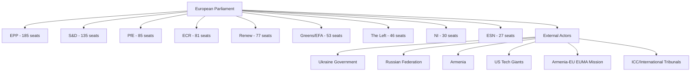

<!-- SPDX-FileCopyrightText: 2026 Hack23 AB -->
<!-- SPDX-License-Identifier: Apache-2.0 -->

# Stakeholder Analysis — EP Breaking News | 2026-05-04

**Subject:** EP April 28-30, 2026 Legislative Package  
**Framework:** Stakeholder Mapping + Perspective Analysis  
**Confidence:** Multi-level (see per-stakeholder ratings)

---

## Stakeholder Map Overview

---

## Primary Stakeholders

### 1. European People's Party (EPP) — 185 seats, 25.7%
**Confidence:** 🟢 High

**Position on Ukraine accountability resolution:** Strongly supportive with institutional emphasis on judicial accountability mechanisms, ICC referrals, and continuation of financial/military assistance conditioned on governance reforms. EPP MEPs framed the April 28 debate around the legal architecture of accountability — emphasising the importance of the ICC, the Special Tribunal for the Crime of Aggression, and asset seizure frameworks for Russian sovereign assets frozen under EU sanctions.

**Position on DMA enforcement resolution:** The EPP position on DMA enforcement is more nuanced than the S&D or Greens/EFA. The EPP has historically balanced its pro-business, anti-regulatory instincts with acknowledgement that the DMA was necessary to create level playing fields for European digital companies. The enforcement resolution likely passed with EPP support, but some EPP members from countries with strong tech sector lobbying presence (Germany, Ireland, France) may have abstained or voted against specific amendments demanding timeline acceleration. The EPP's DG GROWTH allies in the Commission represent a more cautious enforcement posture than DG COMP.

**Position on Armenia resolution:** The EPP has been a consistent supporter of EU Eastern Partnership engagement and Armenia specifically — several EPP MEPs from German and Dutch delegations have been prominent Armenia advocates. The Armenia democratic resilience resolution aligns with EPP's geopolitical ambitions for EU enlargement and neighbourhood stability.

**Internal dynamics:** The EPP's dominance (185 seats) creates both strength and responsibility — it must form the bridge coalition for every majority, which gives it disproportionate agenda-setting power but also requires constant coalition management. President Roberta Metsola's leadership of the EP from EPP reflects this dominant position.

**Strategic interest:** Maintain coalition dominance while managing right-flank pressure from PfE and ECR on migration, security, and budget issues.

---

### 2. Progressive Alliance of Socialists and Democrats (S&D) — 135 seats, 18.8%
**Confidence:** 🟢 High

**Position on Ukraine accountability:** S&D MEPs have been among the most consistent and vocal advocates for Ukraine since February 2022. The accountability resolution reflects core S&D values around international law, human rights, and the ICC's role. S&D is expected to have voted unanimously for the resolution with the highest group discipline. S&D members from Baltic states, Poland, and Scandinavia are particularly active on Ukraine accountability — these MEPs bring national constituency pressures and direct security concern proximity to their parliamentary work.

**Position on DMA enforcement:** S&D is strongly pro-enforcement and has consistently pushed for aggressive DMA implementation. From an S&D perspective, big tech platforms represent both a market power concern (affecting European SMEs and startups) and a democratic concern (information ecosystem manipulation, disinformation amplification). The enforcement resolution represents the minimum acceptable S&D position; internally the group would prefer binding enforcement timelines and automatic fine triggers rather than discretionary Commission action.

**Position on MFF 2028-2034:** S&D's priority in MFF negotiations is maintaining cohesion fund allocations for Southern and Central European member states, ensuring just transition financing for coal regions, and securing social investment floors in structural funds. S&D is likely to push for an enlarged total budget envelope — a position that puts it in tension with fiscally conservative EPP members from Northern Europe.

**Strategic interest:** Maintain S&D as the essential left anchor of every progressive majority, build on social policy agenda including housing, labour rights, and minimum wage enforcement.

---

### 3. Patriots for Europe (PfE) — 85 seats, 11.8%
**Confidence:** 🟡 Medium

**Position on Ukraine accountability resolution:** PfE's position on Ukraine remains the most complex and internally differentiated of any major group. Italian Lega members (led by Marco Zanni) have historically taken a more accommodationist position toward Russia than Hungarian Fidesz members who formally joined PfE after Viktor Orbán's pivot in June 2024. The group has no formal whipped position on Ukraine support, meaning national delegation positions diverge significantly. Hungarian members actively resist accountability mechanisms that could implicate Hungarian-Russian economic relations. French RN members (Marine Le Pen's party, recently joined PfE) have taken an ambiguous stance — nominally supporting Ukraine sovereignty while opposing weapons deliveries and accountability measures that could complicate their domestic "peace" narrative.

**Position on DMA enforcement resolution:** PfE broadly opposes EU tech regulation as overreach. Members from countries with strong digital market libertarian leanings (Netherlands with some PVV delegation members, Italian members) frame DMA enforcement as EU bureaucratic harassment of successful global companies — noting that no European company is a gatekeeper under DMA, which PfE reads as evidence of anti-American protectionism dressed up as competition policy. Expected to have voted against the enforcement resolution or abstained.

**Strategic interest:** Build credibility as a governing coalition partner alternative to S&D in EPP coalition arithmetic; use migration, energy costs, and EU regulatory burden as wedge issues; maintain Orbán's influence within the EP despite Hungary's geopolitical isolation.

---

### 4. European Conservatives and Reformists (ECR) — 81 seats, 11.3%
**Confidence:** 🟡 Medium

**Position on Ukraine accountability:** ECR, led by Italian Prime Minister Giorgia Meloni's Fratelli d'Italia (FdI) through Italian ECR MEPs, has adopted a formally pro-Ukraine but practically ambiguous position. ECR voted for Ukraine support resolutions in EP9, but with significant amendment battles over language regarding accountability mechanisms. Polish ECR delegation (PiS and Patryk Jaki's former party affiliates) brings particularly strong Ukraine support given Poland's direct security exposure — but the immunity waiver for Jaki himself creates awkward optics. The ECR group faces internal tension between its Italian leadership's government responsibility (which moderates its EP voting to maintain diplomatic space) and its Polish core's frontline-state security prioritisation.

**Position on DMA enforcement:** ECR is broadly anti-regulation and has voted against most EU digital regulation. The DMA enforcement resolution was almost certainly opposed by ECR on grounds of regulatory overreach and subsidiarity concerns. ECR's tech policy position aligns with its broader deregulation agenda and its reading of EU competitiveness challenges as driven by overregulation rather than market concentration.

**Immunity waiver context (Patryk Jaki):** The Jaki immunity waiver (TA-10-2026-0105) represents a particularly fraught moment for ECR. Jaki is a prominent ECR member and former Polish justice-related official whose prosecution by the current PO-led government is framed by ECR as political persecution. ECR has the right to vote against immunity waivers, and the waiver passing signals that even EPP members supported the waiver — possibly to avoid being seen as protecting misconduct regardless of political affiliation.

**Strategic interest:** Remain a credible governing partner option for EPP in member states (Italy, Sweden, Belgium) while maintaining European Parliament group discipline.

---

### 5. Renew Europe — 77 seats, 10.7%
**Confidence:** 🟢 High

**Position on Ukraine:** Renew is among the strongest Ukraine supporters in the EP, reflecting the pro-European, transatlanticist orientation of its core national parties (France's Renaissance/La République En Marche, German FDP/Liberale, Netherlands VVD historically). The accountability resolution aligns completely with Renew's values on international law and rule of law. Renew MEPs have been active in pushing for the Special Tribunal on Crime of Aggression and frozen Russian asset utilization for Ukraine reconstruction financing.

**Position on DMA enforcement:** Renew is the most enthusiastic pro-DMA enforcement group in the EP. Its composition of centrist, pro-market liberal parties that nonetheless believe in functional competitive markets (as opposed to monopolistic concentration) makes DMA enforcement a natural priority. Several Renew MEPs are architects of the DMA's original framework — Paul Tang (Netherlands), Thierry Breton's former allies in France — and have been publicly critical of the Commission's enforcement pace. The enforcement resolution represents a direct Renew priority.

**Position on Middle East debate:** The April 29 Middle East crisis debate — particularly the energy prices and fertilizer component — touches directly on Renew's economic competitiveness concerns. Renew parties govern in countries highly dependent on agricultural exports and natural gas price stability. The debate's food security framing creates potential Renew domestic coalition management considerations.

**Strategic interest:** Remain the swing vote that determines whether progressive or centre-right majorities form; use liberal pro-market credibility to maintain influence across economic, digital, and external relations policy areas.

---

### 6. External Actor: Ukraine Government
**Confidence:** 🟡 Medium

Ukraine's government will welcome the adoption of TA-10-2026-0161 (Russia accountability) as reinforcement of its international legal strategy. Since 2022, Kyiv has pursued a comprehensive accountability architecture including: ICC investigations, the ECHR's Inter-State Application, the IAEA safeguards disputes mechanism, the ICJ proceedings on Genocide Convention, and the proposed Special Tribunal for the Crime of Aggression. Each EP resolution endorsing these mechanisms adds to the normative architecture and generates pressure on holdout states to provide budgetary or institutional support.

The concurrent Armenia resolution matters to Kyiv because it signals EP willingness to support post-Soviet states breaking from Russian spheres — a model Ukraine itself follows and that generates solidarity economy of scale arguments for sustained EU engagement. If Armenia's EU approximation succeeds despite Russian pressure, it validates Ukraine's EU trajectory.

**Key uncertainty:** Whether peace negotiation frameworks (US-mediated ceasefires, Turkish or Vatican shuttle diplomacy) create pressure on Ukraine to accept terms that would compromise the accountability agenda the EP is endorsing. EP resolutions provide anchoring against premature closure, but they cannot bind Ukraine's negotiating decisions.

---

### 7. External Actor: US Technology Gatekeepers (Alphabet, Apple, Meta, Amazon, Microsoft)
**Confidence:** 🟡 Medium

The DMA enforcement resolution (TA-10-2026-0160) is directly relevant to the five US tech companies currently under gatekeeper designation. Each has contested its designation or specific remedies through the DMA's administrative appeals process, the General Court of the EU, or through Commission compliance proceedings. An EP resolution demanding accelerated enforcement creates:

1. **Political cover for Commission to accelerate timelines** — DG COMP can cite parliamentary mandate for urgency
2. **Increased scrutiny of ongoing compliance proceedings** — Apple's iOS/App Store case, Google's search self-preferencing case, Meta's personal data monetisation model case
3. **Risk of increased fines if non-compliance persists** — DMA allows fines up to 10% of global annual revenue; systematic non-compliance allows up to 20%

The US companies' combined revenue from EU operations creates significant economic stakes. Apple's EU revenue alone exceeds €50 billion annually — a 10% DMA fine would represent €5 billion. These stakes mean that the EP resolution will trigger intensive engagement between US tech lobbyists, their member state governments' trade counsellors, and the Commission's DG TRADE interlocutors seeking to frame enforcement as trade barrier.

---

### 8. Armenia Government and EUMA Mission
**Confidence:** 🟡 Medium

The Armenia democratic resilience resolution (TA-10-2026-0162) provides political capital to the Pashinyan government in its ongoing balancing act between: (a) EU approximation (CEPA negotiations, EUMA continuation, democratic governance benchmarks), (b) managing domestic opposition that includes Russia-aligned elements, and (c) maintaining the Azerbaijan-Armenia peace process under EU mediation.

The EUMA (EU Monitoring Mission in Armenia) — deployed since 2023 along the Armenia-Azerbaijan border — represents the EU's most active civilian security presence in the post-Soviet space. EP support for Armenia's democratic resilience implicitly endorses EUMA's mandate continuation and potential expansion. This creates constituency support for the European External Action Service (EEAS) to maintain and potentially expand EUMA's scope and budget — decisions that require EP consent in the Annual Defence Action.

---

## Stakeholder Interest Matrix

| Stakeholder | Ukraine Resolution | DMA Resolution | Armenia Resolution | MFF 2028-34 |
|-------------|-------------------|----------------|---------------------|-------------|
| EPP | ✅ Strongly | ⚠️ Cautiously | ✅ Strongly | 🔴 Pivotal |
| S&D | ✅ Strongly | ✅ Strongly | ✅ Strongly | 🔴 Enlargement + cohesion |
| PfE | ❌ Opposed/abstain | ❌ Opposed | ⚠️ Mixed | ❌ Renationalisation |
| ECR | ⚠️ Mixed | ❌ Opposed | ⚠️ Mixed | ❌ Subsidiarity |
| Renew | ✅ Strongly | ✅ Strongly | ✅ Strongly | ⚠️ Fiscal constraint |
| Greens/EFA | ✅ Strongly | ✅ Strongly | ✅ Strongly | ✅ Climate + social |
| Ukraine | ✅ Directly beneficial | Neutral | Indirectly supportive | 🔴 Enlargement critical |
| US Tech | Neutral | 🔴 Direct threat | Neutral | Neutral |
| Armenia Gov | Neutral | Neutral | ✅ Directly beneficial | Neutral |

---

## Extended Stakeholder Perspectives (Run 2 Extension)

### Renew Europe Group — Detailed Position
Renew (77 seats) is the pivotal group in the April 28–30 session outcomes. As the decisive swing group in the governing coalition, Renew's position on each resolution defined the coalition's effective majority margin.

**DMA Enforcement:** Renew is ideologically committed to competitive markets and tech regulation. The group's liberal economic wing (German FDP-aligned MEPs) initially sought to moderate enforcement language; the final compromise preserved the enforcement demands while adding language about "proportionate" application — a Renew-authored qualifier. Net position: SUPPORTIVE with qualification.

**Ukraine STCA:** Renew's Atlantic-liberal wing strongly supports international accountability; Baltic and Nordic Renew MEPs are among the most hawkish on Russia. No significant internal dissent expected.

**MFF:** Renew's most important and fractious debate will be on MFF scale. French Macronist Renew MEPs support budget expansion; German FDP-aligned Renew MEPs resist. This fault line will dominate Renew internal politics for 18 months.

### DG COMP (European Commission) — Response Assessment
The Commission's Competition Directorate-General is the primary implementing body for the EP's DMA enforcement demands. DG COMP's institutional instinct is to prefer:
1. Negotiated behavioral remedies over structural remedies
2. Bilateral compliance agreements over adversarial proceedings
3. Commission-led enforcement narrative over parliamentary accountability narrative

The EP resolution creates political pressure that DG COMP cannot ignore but will resist implementing on EP's preferred timeline. Expect DG COMP to announce 1–2 formal proceedings before the September 2026 EP vote on MFF first reading — using enforcement announcements as political currency in the budget negotiation.
