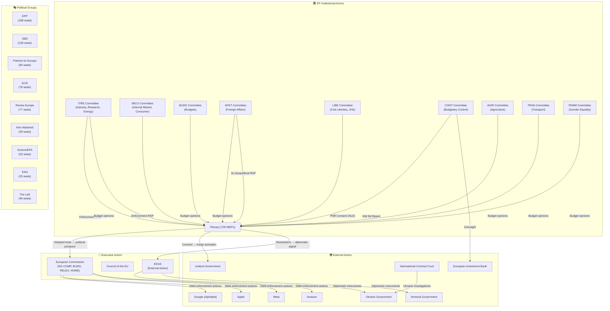
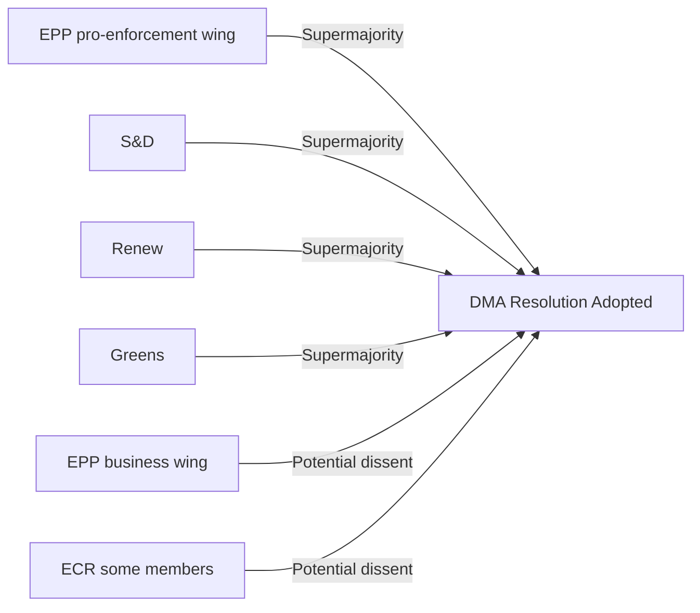
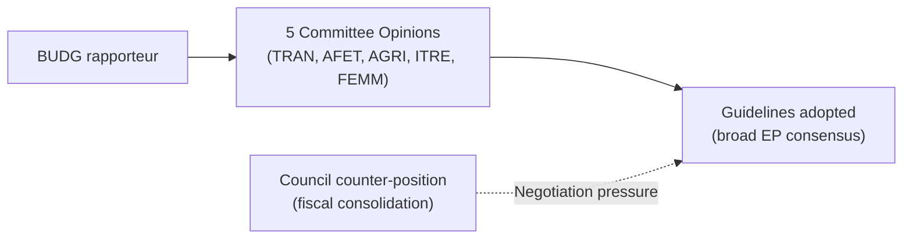

<!-- SPDX-FileCopyrightText: 2026 Hack23 AB -->
<!-- SPDX-License-Identifier: Apache-2.0 -->

# Actor Mapping — EP Committee Reports Week 27 Apr–4 May 2026

**Article Type:** committee-reports | **Date:** 2026-05-04
**Framework:** Political Actor Mapping — Roles, Alliances, and Influence Chains
**Confidence:** 🟡 Medium (no MEP-level voting data available)

---

## Actor Universe Map

---

## Actor Profiles

### EP Committees (Primary Institutional Actors)

#### ITRE + IMCO (Joint Lead — DMA Enforcement)
- **Composition (approximate):** ITRE ~80 members; IMCO ~45 members
- **Chair information:** Not available from EP API (meeting records absent)
- **Dominant political groups:** EPP largest group in both; S&D, Renew significant
- **Legislative role in DMA:** ITRE was primary committee; IMCO opinion; both monitor enforcement
- **Current posture:** Assertive enforcement oversight — demanding Commission escalation
- **Rapporteur/shadow rapporteur:** Not identifiable from available API data (procedure 2026-2596 lacks rapporteur field)
- **Influence chain:** Committee → Plenary adoption → Political pressure on Commissioner Vestager/successor

#### BUDG Committee (Lead — Budget 2027)
- **Composition:** ~45 members
- **Cross-committee outreach:** Successfully gathered 5 committee opinions (exceptional breadth)
- **Current posture:** Investment-oriented; defence/digital/climate balance
- **Key dynamic:** BUDG must manage internal political group tensions on defence spending vs. social spending while presenting unified front to Council
- **Rapporteur for budget guidelines:** Not available from EP API (procedure 2025-2246)
- **Influence chain:** BUDG → Plenary guidelines → formal EP-Council budget conciliation mandate

#### AFET Committee (Lead — Geopolitical Resolutions)
- **Composition:** ~80 members (largest standing committee)
- **Current activity:** High-tempo — three resolutions in one plenary week plus ongoing Ukraine/Belarus/Moldova/Georgia dockets
- **Political group dynamics:** EPP, S&D, Renew core supporters; ECR more ambivalent on accountability mechanisms
- **Key subcommittees:** SEDE (security/defence) — likely involved in Ukraine accountability sub-elements
- **Influence chain:** AFET → Plenary resolutions → EEAS diplomatic instructions (informal) → Council CFSP conclusions (pressure)

#### LIBE Committee (Lead — Iceland PNR)
- **Composition:** ~60 members
- **Structural role:** Consent authority for JHA international agreements — legally binding committee role
- **Data protection stance:** Historically cautious; post-Schrems scrutiny elevated
- **Influence chain:** LIBE → Plenary consent → Treaty entry into force (or blockage)

#### CONT Committee (Lead — EIB Report)
- **Composition:** ~30 members
- **Character:** Cross-group, technically oriented; less ideologically driven than policy committees
- **Expertise:** Deep institutional knowledge of EU budget institutions (Commission, EIB, ECB, OLAF)
- **Influence chain:** CONT → Annual INI report → EIB governance expectations → Institutional response

---

### Political Group Dynamics

#### EPP (188 seats — Largest Group)
**Position on week's items:**
- Budget: Supportive of defence investment priorities; cautious on new spending without fiscal consolidation
- DMA: Split — pro-enforcement mainstream vs. business-sympathetic wing
- Ukraine: Strongly supportive; drives accountability agenda
- PNR: Supportive (law enforcement priorities)
- EIB: Supportive of accountability

**Strategic position:** EPP must balance its traditional pro-business wing (DMA skeptics) with its European sovereignty/digital independence wing (DMA supporters) while maintaining coalition leadership.

#### S&D (136 seats — Second Largest)
**Position:**
- Budget: Strongly pro-investment; social spending, gender mainstreaming priorities (FEMM opinion)
- DMA: Strong enforcement support (consumer protection, worker rights in platform economy)
- Ukraine: Strongly supportive of accountability mechanisms
- PNR: Cautious but ultimately supportive if data protection safeguards met
- Armenia/Haiti: Humanitarian solidarity

**Strategic position:** S&D drives social dimension of all committee outputs; reliable coalition partner on digital regulation and geopolitical solidarity.

#### Renew Europe (77 seats)
**Position:**
- Budget: Fiscal responsibility balanced with digital/green investment
- DMA: Strong enforcement support (liberal market competition perspective)
- Ukraine: Strongly supportive
- PNR: Consent with scrutiny

**Strategic position:** Renew typically part of EPP-S&D-Renew supermajority on European project issues.

#### Greens/EFA (53 seats)
**Position:**
- Budget: Strong green investment priorities; likely critical if defence spending crowds out climate
- DMA: Strong enforcement support
- Ukraine: Supportive of accountability
- Armenia/Haiti: Human rights solidarity

#### ECR (78 seats)
**Position:**
- Budget: Defence spending supportive; skeptical of social/green commitments
- DMA: Mixed — sovereignty arguments can cut both ways (EU digital sovereignty vs. market intervention skepticism)
- Ukraine: Divided — some ECR members from countries with ambivalent Ukraine positions (Hungary, Italy)
- JHA: Generally supportive of law enforcement tools (PNR)

**Strategic risk:** ECR dissent on Ukraine accountability could signal emerging political fracture in solidarity coalition.

#### Patriots for Europe / ESN (84+25 seats — Far Right)
**Position:**
- All resolutions: Likely highest dissent rate, particularly on Ukraine accountability
- DMA: Anti-regulatory stance
- Budget: Eurosceptic; suspicious of new EU spending mandates
- AFET resolutions: Likely no-votes or abstentions on Ukraine/Armenia solidarity

---

## Alliance Architecture

### Pro-DMA Enforcement Alliance

### Budget 2027 Cross-Group Coalition

---

## Influence Flow Analysis

### Tier 1 Influence (Direct legal effect)
- LIBE consent → Iceland PNR agreement enters into force
- BUDG guidelines → formal EP mandate for budget conciliation

### Tier 2 Influence (Political pressure with institutional mechanism)
- ITRE/IMCO → DMA enforcement resolution → Commission political accountability
- CONT → EIB oversight → EIB governance expectations
- BUDG multi-committee → Council negotiating pressure

### Tier 3 Influence (Diplomatic/normative signal)
- AFET resolutions → EEAS diplomatic instructions (informal)
- AFET resolutions → Council CFSP agenda-setting
- AFET Armenia resolution → EU-Armenia Partnership Agreement momentum

---

## Unresolved Actor Questions

| Question | Impact | Resolution Pathway |
|---------|--------|-------------------|
| Who is the DMA resolution rapporteur? | MEDIUM | EP website/ITRE committee page |
| Exact DMA resolution text (what enforcement actions demanded?) | HIGH | EP adopted texts website full text |
| Which MEPs drove AFET Ukraine resolution? | MEDIUM | AFET committee proceedings |
| Budget guidelines specific numbers? | HIGH | BUDG committee documents |
| EIB 2024 lending highlights? | MEDIUM | EIB Annual Report 2024 |

**Note:** These questions cannot be answered from EP API data alone in this run. They represent research opportunities for future runs with broader data access.
