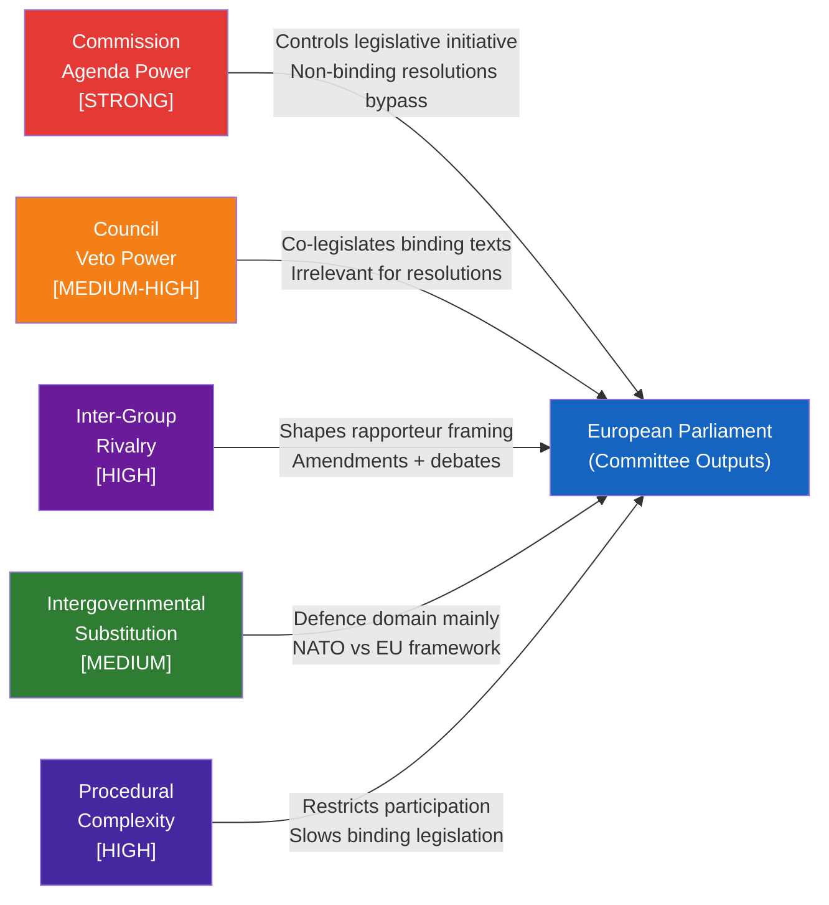

<!-- SPDX-FileCopyrightText: 2026 Hack23 AB -->
<!-- SPDX-License-Identifier: Apache-2.0 -->

# Forces Analysis — EP Committee Reports Week 27 Apr–4 May 2026

**Article Type:** committee-reports | **Date:** 2026-05-04
**Framework:** Porter's Five Forces + Political Forces adaptation for EU legislative dynamics

---

## Adaptation Note

Classical Porter's Five Forces (supplier power, buyer power, competitive rivalry, threat of substitutes, barriers to entry) are adapted here to the EP legislative context:

| Porter force | Legislative analog |
|-------------|-------------------|
| Supplier power | Commission's legislative monopoly (Art. 17 TEU) |
| Buyer power | Council's co-legislative veto power |
| Competitive rivalry | Inter-group political competition for rapporteurships |
| Threat of substitutes | Member state or intergovernmental alternatives to EU legislation |
| Barriers to entry | Procedural complexity, treaty change requirements |

---

## Force 1: Commission Agenda Power (HIGH)

**Assessment: STRONG**

The Commission holds the exclusive right of legislative initiative under Article 17 TEU. For this week's committee outputs:

- **DMA enforcement:** Commission holds exclusive enforcement discretion. EP's resolution is politically significant but legally non-binding. The Commission can ignore it — at political cost.
- **Budget 2027 guidelines:** Commission sets the draft budget (Article 314 TFEU). EP's guidelines are EP's opening bid in negotiations. Commission draft typically incorporates EP concerns selectively.
- **AFET resolutions:** Commission (EEAS) implements foreign policy; EP resolutions are political inputs, not binding directives.

**Force direction:** Commission power is constitutionally entrenched but politically constrained by EP pressure. The resolution cycle creates a documented political record that constrains future Commission discretion.

**Intensity: HIGH** — Commission agenda-setting power is the dominant structural force in EU legislative politics.

---

## Force 2: Council Veto Power (MEDIUM-HIGH for legislative matters)

**Assessment: STRONG for binding legislation; WEAK for resolutions**

For this week's mix of adopted texts:
- **DMA enforcement resolution:** Non-binding. Council has no formal role. Force = ZERO.
- **Budget 2027 guidelines:** Council is co-legislator in budget procedure. Force = HIGH.
- **Iceland PNR (NLE):** Council consent required after EP consent. Force = HIGH (already given).
- **AFET resolutions:** Council has no formal role. Force = ZERO.
- **EIB annual report (INI):** Non-binding. Force = ZERO.

**Weighted force assessment for this week's texts:** MEDIUM. Most outputs are non-binding resolutions where Council force is irrelevant. The budget procedure is where Council force peaks.

---

## Force 3: Inter-Group Rivalry (HIGH in committee phase, MEDIUM in plenary)

**Assessment: INTENSIFYING**

The 10th Parliament's political balance creates higher inter-group rivalry than 9th Parliament:
- New far-right blocs (Patriots + ESN) challenge the traditional cordon sanitaire
- EPP has moved right, increasing internal tension with S&D on joint legislation
- Renew Europe weakened (seat loss in 2024), reducing centrist swing vote

**Rivalry manifestations in this week's outputs:**
- **Budget guidelines amendment (2026-04-22):** Filed after plenary adoption — signals ongoing EPP-S&D tension on defence/climate trade-off
- **DMA resolution:** ITRE/IMCO rivalry on tech policy framing (consumer protection vs. industrial policy)
- **Ukraine resolution:** Right/far-right split on accountability framing

**Rapporteur competition:** High-profile dossiers (DMA, budget) attract rivalry for rapporteur positions. Who gets the rapporteurship often determines the ideological framing of the output.

---

## Force 4: Intergovernmental Substitution Threat (MEDIUM)

**Assessment: PRESENT but bounded**

Member states can sometimes bypass EU legislative process through:
- Enhanced cooperation (Art. 20 TEU)
- Intergovernmental treaties (e.g., TSCG fiscal compact)
- National implementation at higher standards
- NATO/OECD frameworks as substitute for EU legislation

**Relevance for this week:**
- **DMA enforcement:** No substitution threat — DMA is EU law; member states cannot enforce it separately in the same way
- **Budget 2027:** No substitution — EU budget is a purely EU-level instrument
- **Ukraine accountability:** Some member states have bilateral war crimes investigation programs; Special Tribunal is itself an intergovernmental substitute for ICC
- **Defence spending:** NATO targets increasingly substitute for EU defence investment framework — this is an ACTIVE substitution dynamic

**Force intensity:** MEDIUM — primarily relevant for defence/security domain.

---

## Force 5: Procedural Complexity (HIGH barrier to entry)

**Assessment: CONSISTENTLY HIGH**

The EU legislative process creates high barriers to participation:

**Complexity factors:**
- 24 official languages requiring translation/interpretation
- Multiple institutional actors (Commission, Council, EP, ECJ, ECA)
- 4+ ordinary legislative procedure stages (proposal → committee → plenary → trilogue → adoption)
- Infringement procedure possibility adding post-adoption complexity
- Constitutional constraints (Article 352 general competence vs. specific legal bases)

**Relevance for this week:**
- **DMA enforcement:** EP's resolution bypasses the normal legislative barrier — resolutions are fast-tracked compared to directives
- **PNR agreement (NLE):** Consent procedure is streamlined — EP votes yes/no, no amendments allowed
- **Budget procedure:** Most complex annual cycle in EU institutional calendar (9-month process from March guidelines to December adoption)

**Barrier assessment:** HIGH consistently — the complexity is a feature (deliberation quality) not just a bug.

---

## Composite Forces Diagram

---

## Strategic Assessment

The dominant forces for this week's committee outputs are:

1. **Commission agenda power** — the enforcement resolution is fundamentally a political message to the Commission; its effectiveness depends entirely on Commission response
2. **Inter-group rivalry** — the budget amendment and DMA framing reflect ongoing EPP-S&D competition for issue ownership
3. **Procedural complexity** — the multi-step committee opinion chain for budget guidelines is both a source of legitimacy (breadth of consultation) and vulnerability (compromise dilution)

**The net effect** is a week of primarily non-binding outputs where EP is exercising political pressure rather than legal power. The binding outputs (Iceland PNR, amendments to budget/DMA via formal procedures) are the minority.
