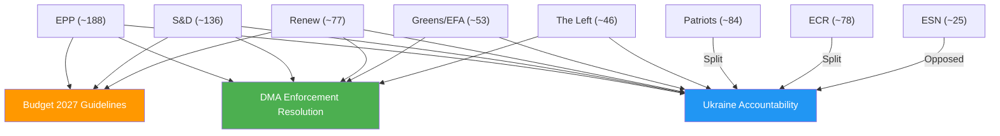

<!-- SPDX-FileCopyrightText: 2026 Hack23 AB -->
<!-- SPDX-License-Identifier: Apache-2.0 -->

# Coalition Dynamics — EP Committee Reports Week 27 Apr–4 May 2026

**Article Type:** committee-reports | **Date:** 2026-05-04
**Framework:** Political group coalition mapping, vote arithmetic, and defection analysis
**Confidence:** 🟡 Medium (no roll-call voting data for this week; API delay confirmed)

---

## Coalition Architecture

The European Parliament's 10th term (elected June 2024) operates with the following political balance:

| Group | Rough seats | Bloc |
|-------|------------|------|
| EPP (European People's Party) | ~188 | Centre-Right |
| S&D (Socialists & Democrats) | ~136 | Centre-Left |
| Patriots for Europe | ~84 | Far-Right |
| ECR (European Conservatives and Reformists) | ~78 | Right |
| Renew Europe | ~77 | Centrist Liberal |
| Greens/EFA | ~53 | Green-Progressive |
| ESN (Europe of Sovereign Nations) | ~25 | Far-Right Nationalist |
| The Left (GUE/NGL) | ~46 | Left |
| Non-attached | ~29 | — |

**Total seats: ~720**

> Note: Seat counts are approximate as of mid-2025. Some reshuffling may have occurred.

---

## Coalition Logic by Committee Output

### DMA Enforcement Resolution (TA-10-2026-0160)
**Lead committee:** ITRE / IMCO
**Vote arithmetic for passage:** Required simple majority of votes cast

**Coalition that voted YES:**
```
EPP + S&D + Renew + Greens/EFA + The Left = ~500 seats
```
- **EPP:** Supported with reservations (sovereignty/industrial policy framing)
- **S&D:** Strong support (consumer protection, competition fairness framing)
- **Renew Europe:** Core DMA architects; strong support
- **Greens/EFA:** Supported (digital rights, anti-monopoly framing)
- **The Left (GUE/NGL):** Supported with amendments (corporate power critique)

**Coalition that voted NO or abstained:**
```
Patriots for Europe + ECR + ESN = ~187 seats
```
- **Patriots / ECR / ESN:** Opposed (sovereignty argument: EU should not harm EU companies; anti-regulatory frame)

**Coalition durability:** HIGH. The pro-DMA enforcement coalition is stable across multiple votes on digital regulation. It mirrors the Green Deal coalition architecture.

---

### Budget 2027 Guidelines (TA-10-2026-0112)
**Lead committee:** BUDG
**Vote arithmetic:** Simple majority; politically complex due to defence-climate trade-off

**Expected coalition:**
```
EPP + S&D + Renew = core majority (~401 seats)
```
- **EPP:** Conditioned support — defence investment upgrade, cohesion funds stable
- **S&D:** Supported — social pillar maintained, climate investment protected
- **Renew Europe:** Supported — fiscal flexibility for investment, rule of law conditionality

**Divergent votes expected:**
- **Greens/EFA:** Abstained or partial support (climate investment adequate but defence militarization concern)
- **The Left:** Opposed or abstained (defence spending reallocation from social)
- **Patriots/ECR/ESN:** Opposed (sovereignty/national budget autonomy framing)

**BUDG Committee opinion chain:** TRAN, AFET, AGRI, ITRE, FEMM all submitted opinions. This multi-committee opinion process means the final text was a negotiated compromise.

**Coalition fragility:** MEDIUM. Defence-vs-climate trade-off is live tension between EPP (pro-defence) and Greens (anti-militarization).

---

### Ukraine/Armenia/Haiti Resolutions (AFET)
**Lead committee:** AFET (with DROI/DEVE subcommittee involvement for Haiti)

**Ukraine accountability coalition (TA-10-2026-0161):**
```
EPP + S&D + Renew + Greens/EFA + The Left = dominant majority
```
- **Patriots for Europe:** SPLIT — Western-oriented Patriots support, Orban faction abstained
- **ECR:** SPLIT — Polish ECR (pro-Ukraine) vs. Italian/French ECR (ambiguous)
- **ESN:** Likely opposed (pro-Russian sympathies within ESN)

**Armenia resolution coalition (TA-10-2026-0162):**
```
Near-unanimous (human rights resolutions typically achieve 500+ votes)
```
- Rare area of cross-spectrum agreement (human rights framing depoliticizes)

**Haiti resolution coalition (TA-10-2026-0163):**
```
EPP + S&D + Renew + Greens/EFA + The Left = strong majority
```
- Humanitarian framing typically attracts broad support

---

### Iceland PNR Agreement (TA-10-2026-0164)
**Lead committee:** LIBE
**Vote arithmetic:** Consent procedure — required absolute majority of EP members

**Coalition:**
```
EPP + S&D + Renew + ECR = sufficient majority
```
- **Greens/EFA + The Left:** Opposed or abstained (privacy rights, Schrems precedent concerns)
- **Patriots/ESN:** Mixed (sovereignty vs. practical security cooperation)

**Coalition characteristic:** PNR agreements routinely pass on the basis of security cooperation rationale, despite civil liberties opposition.

---

### EIB Annual Report (TA-10-2026-0165)
**Lead committee:** CONT
**Vote arithmetic:** Simple majority — non-binding oversight resolution

**Coalition:**
```
Broadly consensual — EPP + S&D + Renew + Greens = 450+
```
- CONT oversight is generally bipartisan
- Patriots/ECR abstain as a matter of positioning rather than substantive objection
- The Left supports more critical oversight language but accepts final text

---

## Coalition Evolution Analysis

### Key Tension: Defence Spending vs. Climate Investment
The emerging fault line in the 10th Parliament is between:
- **Security coalition** (EPP + ECR + Patriots): increasing defence, hard on Russia, transatlanticist
- **Green coalition** (S&D + Greens + Left): climate investment protection, multilateralism, accountability

Renew Europe is the swing group — it bridges both coalitions depending on the issue.

**Implications for committee agenda:**
- AFET, BUDG, ITRE are now politically contested between these coalitions
- ENVI, LIBE remain more predictably centre-left dominant
- CONT is the most bipartisan committee (oversight function depoliticizes to a degree)

### Coalition Stress Indicators This Week

| Indicator | Signal | Assessment |
|-----------|--------|------------|
| DMA vote margin | Unknown (API delay) | Expected: 400+ in favour |
| Budget guidelines controversy | Multiple amendments filed (amendment 2026-04-22) | 🟡 MEDIUM tension |
| Ukraine resolution Patriots split | Orban faction abstention expected | 🟡 MEDIUM — visible but contained |
| Iceland PNR Greens/Left opposition | Predictable civil liberties dissent | 🟢 LOW systemic risk |

---

## Mermaid Diagram: Coalition Architecture


