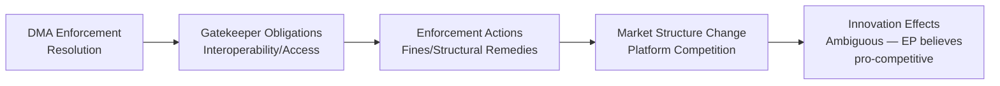

<!-- SPDX-FileCopyrightText: 2026 Hack23 AB -->
<!-- SPDX-License-Identifier: Apache-2.0 -->

# PESTLE Analysis — EP Committee Reports Week 27 Apr–4 May 2026

**Article Type:** committee-reports | **Date:** 2026-05-04
**Framework:** PESTLE (Political, Economic, Sociological, Technological, Legal, Environmental)
**Confidence:** 🟡 Medium | **IMF Status:** 🔴 Unavailable (degraded mode)

---

## P — Political

### DMA Enforcement as Institutional Power Signal
The adoption of TA-10-2026-0160 (DMA enforcement resolution) is primarily a political act: the EP is using its oversight resolution powers to signal dissatisfaction with Commission enforcement pace and to establish political expectations ahead of possible enforcement actions against major gatekeepers. This is a pattern consistent with EP's assertive role in digital regulation since 2019.

**Key political dynamics:**
- **EP-Commission tension:** The RSP procedural type (non-binding but politically significant) creates Commission accountability pressure without triggering infringement procedures
- **EPP-S&D-Renew coalition coherence:** DMA enforcement enjoys broad cross-group support in EP; the absence of visible dissent in the adoption suggests strong centrist consensus on digital regulation
- **Industrial lobby counterpressure:** Major tech companies maintain significant Brussels lobbying operations; their influence on Commission enforcement pace is a contested political variable

### Budget 2027: Fiscal Federalism Politics
The breadth of committee opinions (TRAN, AFET, AGRI, ITRE, FEMM) contributing to BUDG report reveals the structural political economy of EP budget negotiations: every major policy coalition secures representation in budget guidelines before negotiations begin.

**Salience signals:**
- AFET opinion signals defence spending prioritisation — consistent with post-2022 security environment
- FEMM opinion signals gender mainstreaming commitment — a progressive coalition priority
- ITRE opinion signals digital/energy transition investment priorities

### AFET Triple Resolution: Geopolitical Positioning
Ukraine, Armenia, and Haiti resolutions in one session demonstrate EP's role as a **geopolitical norm-setter** — adopting resolutions that establish EU political positions even where binding legislative action is not possible.

**Political assessment:** 🟡 Medium confidence that these resolutions reflect genuine cross-group consensus rather than partisan coalition dynamics. Without voting breakdowns, defection patterns are unknown.

---

## E — Economic

> ⚠️ **IMF DEGRADED MODE NOTICE:** IMF data unavailable (proxy timeout, probe returned `available: false`). All economic analysis in this section is based on structural/contextual knowledge only. No IMF-sourced statistics are cited. This limitation is recorded per `08-infrastructure.md` degraded-mode protocol.

### Budget 2027 Guidelines — Structural Economic Context
The 2027 budget cycle will operate in a European economy shaped by:
- Post-pandemic fiscal consolidation pressures in southern member states (pre-existing structural)
- Defence expenditure escalation driven by NATO commitments (structural, 2022-ongoing)
- Green transition investment requirements under the European Green Deal
- Digital infrastructure investment gaps identified in Draghi Report (2024)

The BUDG committee guidelines position EP as a champion of investment-oriented budget (over austerity), but the specific fiscal numbers are not available from EP API.

### EIB Financial Activities 2024
The EIB Group annual report covers lending that typically exceeds €70–80 billion annually. CONT oversight focuses on:
- Climate alignment (EIB Climate Bank targets: 50% green lending by 2025)
- External lending under EU guarantee
- Investment returns and risk management

**Confidence:** 🔴 Low on specific figures (IMF/EIB data not retrieved); 🟡 Medium on structural analysis.

### DMA Economic Implications
DMA enforcement against major gatekeepers has significant economic implications:
- Platform interoperability requirements affect revenue models
- Access obligations may redistribute digital advertising revenue
- Structural remedy risks (e.g., divestiture) carry significant market valuation implications
- EU enforcement decisions carry precedent for UK/US regulatory approaches

---

## S — Sociological

### Animal Welfare Regulation (TA-10-2026-0115)
The dogs and cats welfare/traceability regulation reflects sustained public concern about pet welfare and illegal breeding. Sociological drivers:
- EU pet ownership reached record levels post-pandemic
- Public pressure on puppy mill imports (organized crime connections documented)
- National fragmentation in pet traceability approaches driving single-market need for harmonization

**Assessment:** 🟢 High confidence on sociological drivers; regulation text content not fully available from EP API.

### Ukraine Solidarity Fatigue Management
The Ukraine accountability resolution (TA-10-2026-0161) exists in a sociological context of potential war fatigue in EU publics. EP continues to adopt strong positions even as public support data shows mixed trends across member states. The resolution serves an internal political function of maintaining EP coalition solidarity on Ukraine.

### Armenia Minority Rights Context
The Armenian democratic resilience resolution (TA-10-2026-0162) addresses a population that has experienced mass displacement (2023 Nagorno-Karabakh exodus). EU diaspora communities in France, Germany, and the Netherlands create sociological pressure for EP engagement.

---

## T — Technological

### Digital Markets Act as Technological Governance
DMA enforcement is fundamentally about **technological market structure**:
- App store interoperability requirements (Apple, Google)
- Messaging interoperability mandates (Meta WhatsApp/Messenger)
- Search ranking non-preferencing requirements (Google)
- Advertising data restrictions

EP's enforcement pressure signals EP believes the Commission's current enforcement posture is insufficiently responsive to technological compliance failures.

### AI Regulatory Context
The DMA intersects with the EU AI Act (which ITRE co-led). The week's committee output signals continued EP attention to digital governance across multiple regulatory instruments simultaneously.

### PNR Data Technology
The Iceland PNR agreement involves:
- Automated screening of passenger records against terrorism databases
- Data retention periods and access controls
- Algorithmic profiling limitations under EU law

LIBE's consent implies satisfactory technological safeguards assessment.

---

## L — Legal

### DMA Enforcement Legal Mechanisms
The DMA provides for:
- Fines up to 10% of global annual revenue (or 20% for repeated infringement)
- Periodic penalty payments
- Structural remedies (divestiture) in exceptional cases
- Right of EP/Council to request further market investigation

The RSP resolution likely calls for activation of these mechanisms. Non-compliance by gatekeepers would trigger Article 26 (non-compliance fines) or Article 29 (market investigation) procedures.

### Iceland PNR — Legal Framework
The NLE consent procedure confirms:
- Legal basis: Article 218 TFEU (international agreements on police cooperation)
- Data protection compatibility: LIBE assessment of adequacy
- Terrorist offence definition alignment with Framework Decision 2002/475/JHA as amended

**Confidence:** 🟡 Medium — procedural type confirmed, full agreement terms not available from EP API.

### Ukraine Accountability — International Law
The AFET resolution on Ukraine (TA-10-2026-0161) operates in the international law framework of:
- ICC mandate (Article 5 Rome Statute: war crimes, crimes against humanity)
- Special Tribunal for the crime of aggression (proposed/in development)
- UN General Assembly resolutions on Ukraine territorial integrity
- EU sanctions framework (Council Regulation basis)

EP resolutions support this legal architecture but cannot directly trigger ICC proceedings.

---

## E2 — Environmental

### Green Deal Budget Priority
The ITRE and AGRI committee opinions on the 2027 budget guidelines likely reinforce Green Deal spending commitments. ITRE typically advocates for:
- Horizon Europe research funding (energy transition)
- REPowerEU fund continuation
- Energy infrastructure investment

AGRI's opinion addresses CAP reform financing, including eco-schemes and sustainable agriculture premiums.

### EIB Climate Alignment 2024
CONT's EIB oversight covers the bank's Climate Bank Roadmap commitment to align 50% of its lending with climate action and environmental sustainability by 2025. The 2024 annual report would measure progress against this target.

### DMA Environmental Dimension
Less directly, DMA enforcement on data centres and hyperscaler energy consumption has environmental implications. The Commission's DMA enforcement unit has not prioritised environmental compliance as a gatekeeper obligation, but energy-intensive platform services fall within EU sustainability reporting requirements.

---

## PESTLE Summary Matrix

| Dimension | Key Finding | Confidence | Institutional Actor |
|-----------|------------|-----------|-------------------|
| Political | EP-Commission DMA tension; cross-committee budget coalition | 🟡 Medium | ITRE/IMCO, BUDG, AFET |
| Economic | Degraded mode — no IMF data; structural budget/EIB context only | 🔴 Low | BUDG, CONT |
| Sociological | Pet welfare public pressure; Ukraine solidarity maintenance | 🟡 Medium | AGRI, AFET |
| Technological | DMA gatekeeper compliance failures; PNR algorithmic safeguards | 🟡 Medium | ITRE/IMCO, LIBE |
| Legal | DMA enforcement mechanisms; Iceland PNR adequacy; Ukraine ICC | 🟢 High | ITRE/IMCO, LIBE, AFET |
| Environmental | Budget Green Deal continuity; EIB climate alignment | 🟡 Medium | BUDG, CONT, ITRE |
