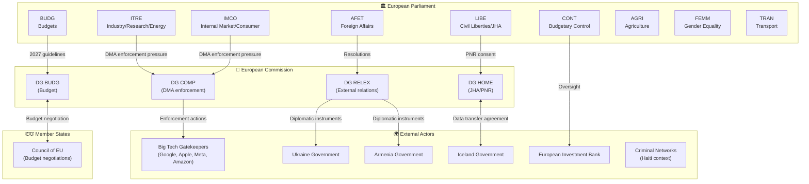
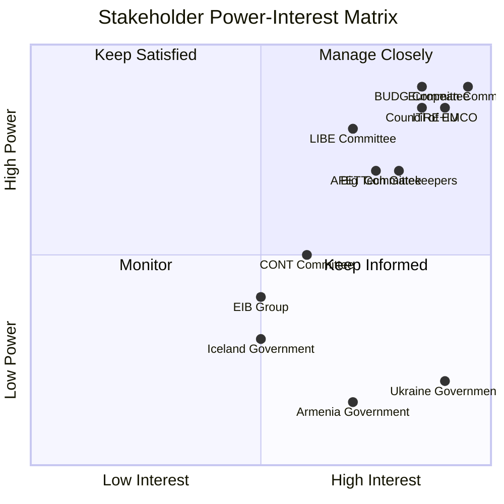

<!-- SPDX-FileCopyrightText: 2026 Hack23 AB -->
<!-- SPDX-License-Identifier: Apache-2.0 -->

# Stakeholder Map — EP Committee Reports Week 27 Apr–4 May 2026

**Article Type:** committee-reports | **Date:** 2026-05-04
**Framework:** Multi-level stakeholder mapping using EP open data
**Confidence:** 🟡 Medium (no MEP-level voting data available this run)

---

## Stakeholder Architecture

---

## 1. Primary Stakeholders

### 1.1 ITRE + IMCO Committees (Joint DMA Lead)

**Role:** Joint legislative oversight on digital markets; DMA enforcement resolution lead
**Interests:** Strong DMA enforcement to create competitive digital markets, protect EU consumers, and establish EU technological sovereignty
**Influence:** HIGH — RSP resolutions create political accountability for Commission; committees hold the power to initiate follow-up legislative measures
**Position:** Pro-enforcement, pressing for faster Commission action against identified gatekeepers

**Stakeholder Perspective:**
ITRE and IMCO occupy a unique position as dual-committee enforcers of the EU digital agenda. ITRE brings the industrial/innovation angle — concerned that Big Tech dominance suppresses European startup competitiveness — while IMCO brings the consumer protection angle, focusing on platform fairness and interoperability mandates. Their joint resolution signals that the DMA enforcement debate has moved beyond technical compliance into political accountability territory. The committees' combined membership spans EPP, S&D, Renew Europe, Greens, and ECR, suggesting cross-group consensus that the Commission has been insufficiently aggressive. This consensus, if it holds through the DMA enforcement review cycle, creates structural pressure for the Commission to escalate its enforcement posture — or face formal EP criticism in future resolutions or even budget motions.

From the ITRE perspective, the underlying concern is European digital sovereignty: if DMA gatekeepers can continue anti-competitive practices without structural consequences, EU digital markets will remain fragmented and dependent on American-headquartered platforms. The strategic framing of DMA enforcement as a sovereignty issue gives the committee leverage across ideological lines, including with EPP members who might otherwise be more sympathetic to business interests.

**Key uncertainty:** Without the full resolution text, it is unclear whether the committees named specific gatekeepers or focused on systemic enforcement mechanisms. 🟡 Medium confidence.

---

### 1.2 BUDG Committee

**Role:** Lead committee for 2027 budget guidelines
**Interests:** Ensuring EP's fiscal priorities are reflected in Council budget negotiations; maintaining investment spending against Council consolidation pressure
**Influence:** HIGH — guidelines establish EP's formal negotiating position
**Position:** Investment-oriented (digital, green transition, defence, CAP continuity)

**Stakeholder Perspective:**
The BUDG committee's successful mobilization of five committee opinions (TRAN, AFET, AGRI, ITRE, FEMM) is a textbook example of EP inter-institutional coalition building before budget negotiations. Each opinion represents a political commitment: TRAN for infrastructure investment, AFET for defence/external action, AGRI for CAP continuity, ITRE for digital and energy, FEMM for gender mainstreaming. This breadth serves two functions: it demonstrates EP consensus to the Council, and it creates internal accountability within EP if any of these priorities are later abandoned during negotiations.

The amendment filed on 2026-04-22 (A-10-2026-0044-AM-079-079) suggests active post-vote engagement with the text, potentially reflecting ongoing inter-group negotiation or Council signaling. The BUDG committee will now begin the formal annual budget cycle, with Council's preliminary draft budget typically issued in early summer.

The absence of IMF macroeconomic data in this analysis is a significant analytical gap: the 2027 budget debate takes place against a European economic context that would normally be anchored by IMF World Economic Outlook projections for eurozone growth, inflation, and fiscal positions.

**Key uncertainty:** The specific fiscal numbers in the guidelines (spending ceilings, priority allocations) are not available from EP API. 🟡 Medium confidence on political dynamics; 🔴 Low confidence on specific fiscal figures.

---

### 1.3 AFET Committee

**Role:** Lead on foreign affairs resolutions (Ukraine, Armenia, Haiti)
**Interests:** Maintaining EU geopolitical presence; supporting democratic transitions; responding to humanitarian crises
**Influence:** MEDIUM-HIGH — resolutions create political visibility and diplomatic signals; do not bind Council foreign policy actions
**Position:** Ukraine accountability (ICC/tribunal support), Armenia solidarity, Haiti crisis response

**Stakeholder Perspective:**
The AFET committee's adoption of three simultaneous resolutions on the last plenary day of April reflects both genuine humanitarian and geopolitical concerns and the operational reality of EP plenary scheduling: committees must batch their resolutions to available plenary slots. Ukraine remains the dominant AFET agenda item, but the concurrent Armenia and Haiti resolutions demonstrate EP's multi-crisis management capacity.

On Ukraine, the accountability focus (TA-10-2026-0161) represents a strategic evolution: as military conflict continues without near-term resolution, EP is shifting emphasis toward ensuring that war crimes documentation and legal accountability mechanisms are in place for eventual post-conflict justice. This aligns EP with the ICC's Ukraine mandate and the proposed Special Tribunal for the crime of aggression.

On Armenia (TA-10-2026-0162), EP's resolution supports Armenia's EU integration trajectory following the 2023 Nagorno-Karabakh crisis and subsequent Azerbaijani control. The democratic resilience framing reflects EP's interest in supporting the Pashinyan government's Westward orientation against continued Russian pressure and Azerbaijani leverage.

On Haiti (TA-10-2026-0151), the trafficking/criminal exploitation focus addresses a humanitarian catastrophe that EP has limited direct instruments to address. The resolution likely calls for EU support to Kenyan-led multinational security force deployment and targeted sanctions against criminal network leaders.

**Key uncertainty:** Without voting breakdowns, the degree of political consensus vs. contested adoption is unknown. RSP resolutions sometimes pass with ECR/ID group dissent. 🟡 Medium confidence.

---

### 1.4 LIBE Committee

**Role:** Consent for EU-Iceland PNR agreement
**Interests:** Counter-terrorism cooperation; GDPR compliance; data rights protection
**Influence:** HIGH (NLE consent) — LIBE's consent is legally required for agreement entry into force
**Position:** Cautious consent — requires robust data protection safeguards as condition of approval

**Stakeholder Perspective:**
LIBE occupies a structurally privileged position in JHA (Justice and Home Affairs) matters: its consent is legally required for international agreements involving data transfer. The committee's willingness to grant consent to the Iceland PNR agreement signals that the adequacy assessment met LIBE's data protection threshold — but this should not be read as uncritical acceptance. LIBE typically negotiates enhanced safeguards (retention limits, access restrictions, oversight mechanisms) as conditions for consent.

The Iceland PNR agreement is relatively uncontroversial compared to the ongoing debates about U.S. PNR frameworks or the broader EU-third country data transfer architecture. Iceland's EEA membership, participation in the Schengen Area, and legal alignment with EU data protection standards (GDPR-equivalent) make this a less contested consent than agreements with non-EEA partners.

The key data protection concern is purpose limitation: PNR data restricted to terrorism/serious crime must not be used for immigration enforcement or profiling based on protected characteristics. LIBE's consent implies satisfactory safeguards on these points, but ongoing monitoring mechanisms will be LIBE's tool for post-consent accountability.

---

### 1.5 CONT Committee

**Role:** Annual oversight of EIB Group financial activities
**Interests:** Ensuring EIB lending aligns with EU objectives; financial accountability for EU guarantee-backed lending; climate alignment verification
**Influence:** MEDIUM — annual INI report creates oversight record; does not bind EIB directly but signals EP expectations
**Position:** Supportive of EIB mandate; vigilant on climate alignment and governance

**Stakeholder Perspective:**
CONT's annual EIB oversight exercise is one of the committee's most important non-budget functions. The EIB Group — comprising the European Investment Bank and European Investment Fund (EIF) — manages risk-weighted lending that represents a significant multiplier of EU budget instruments. For 2024, the key accountability questions are: Did EIB meet its 50% green lending target? Are external lending mandates being effectively deployed in neighbourhood countries? Are governance structures for conflict-of-interest management adequate?

CONT has historically been a cross-group committee less dominated by coalition dynamics than BUDG or AFET. Financial accountability issues tend to generate technical rather than ideological debate, with MEPs from different groups focused on professional oversight standards. This makes CONT's EIB report one of the more credible accountability instruments in EP's toolkit.

---

### 1.6 Big Tech Gatekeepers (External)

**Role:** Primary targets of DMA enforcement
**Interests:** Limiting structural remedies; delaying/diluting compliance obligations; influencing Commission interpretation of DMA obligations
**Influence:** MEDIUM (via lobbying, legal challenge) — cannot prevent EP resolutions but can delay/shape Commission enforcement responses
**Position:** Compliance minimization; legal challenge of Commission decisions where feasible

**Stakeholder Perspective:**
Google, Apple, Meta, and Amazon collectively spend tens of millions of euros annually on EU lobbying. The DMA enforcement resolution creates renewed political pressure that these companies must factor into their Brussels engagement strategies. The specific risk is that a credible EP-Commission alignment on enforcement priorities could accelerate structural remedies that their current legal challenge strategies cannot indefinitely defer.

The companies' preferred strategy has been to comply minimally with DMA gatekeeper obligations while legally contesting Commission compliance decisions that go beyond their interpretation of the law. EP's resolution shifts the political context: it signals that minimum compliance is not politically acceptable and that Commission inaction will face democratic accountability.

**Key uncertainty:** Without the resolution text, the specific enforcement actions demanded are unknown. 🔴 Low confidence on specifics; 🟡 Medium on strategic dynamics.

---

## 2. Secondary Stakeholders

| Stakeholder | Relation to Week's Output | Interest | Influence |
|------------|--------------------------|---------|-----------|
| Ukraine Government | AFET resolution beneficiary | Accountability mechanisms, EU solidarity | LOW (subject of EP attention) |
| Armenia Government | AFET resolution beneficiary | EU integration support, diplomatic backing | LOW |
| Iceland Government | LIBE PNR consent | Agreement entry into force | MEDIUM (bilateral partner) |
| EIB Group | CONT oversight subject | Positive oversight assessment, climate target credit | MEDIUM |
| EU Member States (Council) | Budget negotiation counterpart | Spending ceilings, agricultural/cohesion priorities | HIGH (budget co-authority) |
| EU Civil Society/Pet Owners | AGRI animal welfare regulation | Effective enforcement, traceability system | LOW-MEDIUM |
| Kenyan-led Haiti mission | AFET resolution context | EU financial/political support | LOW |

---

## 3. Stakeholder Power-Interest Matrix

---

## 4. Coalition Dynamics

### DMA Enforcement Coalition
**Pro-enforcement:** ITRE + IMCO + S&D + Greens + Renew Europe + (some EPP)
**Ambivalent:** EPP mainstream (business interest consideration)
**Opposition:** ECR, ID (sovereignty/deregulation arguments)
**Assessment:** Strong majority coalition for DMA enforcement; opposition likely insufficient to block resolution. 🟡 Medium confidence (no voting data).

### Budget 2027 Coalition
**Broad consensus:** All major groups contributed committee opinions
**Fault line:** Defence spending (higher priority for EPP/ECR) vs. social spending (S&D/Greens priority)
**Assessment:** EP traditionally reaches budget consensus across ideological lines vs. Council. 🟡 Medium confidence.

### AFET Geopolitical Coalition
**Ukraine solidarity:** Broad consensus across EPP, S&D, Renew, Greens; ECR more ambivalent on accountability mechanisms
**Armenia:** Broad cross-group consensus on democratic support
**Haiti:** Humanitarian consensus across all groups
**Assessment:** All three resolutions likely passed with comfortable majorities. 🟡 Medium confidence.
