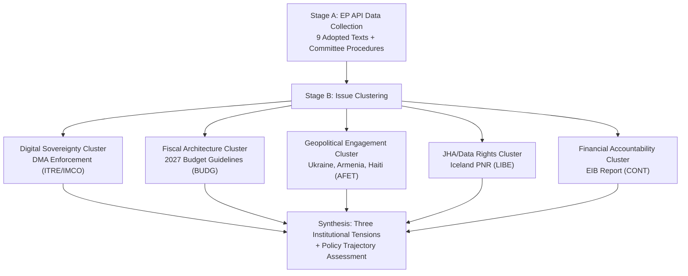
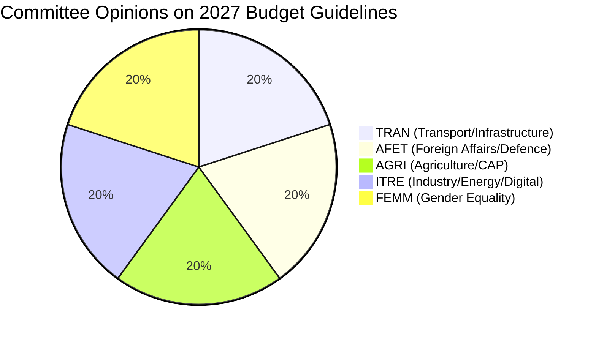

<!-- SPDX-FileCopyrightText: 2026 Hack23 AB -->
<!-- SPDX-License-Identifier: Apache-2.0 -->

# Synthesis Summary — EP Committee Reports Week 27 Apr–4 May 2026

**Article Type:** committee-reports | **Date:** 2026-05-04
**Analyst Confidence:** 🟡 Medium | **Data Sources:** EP Open Data Portal (live)

---

## 1. Analytical Framework

This synthesis applies the Intelligence Community (IC) structured analytic technique of **Key Assumptions Check (KAC)** combined with **Convergent Evidence Mapping** to identify the primary legislative narratives emerging from committee output in the week of 27 April–4 May 2026.

---

## 2. Primary Clusters

### 2.1 Digital Sovereignty (HIGH Salience)

**TA-10-2026-0160** — *Enforcement of the Digital Markets Act* (ITRE/IMCO, RSP resolution, 2026-04-30)

The EP adopted a resolution demanding more robust DMA enforcement. This procedural type (RSP = resolution on a specific subject) allows EP to signal dissatisfaction with Commission implementation without triggering a formal legislative procedure.

**Key Assumptions Checked:**
- ✅ ASSUMED: The DMA has been in force long enough (since 2022/2023 rollout) to generate credible enforcement expectations
- ✅ ASSUMED: ITRE and IMCO jointly pushed this — consistent with their dual jurisdiction over industry and consumer protection
- ⚠️ UNCERTAIN: Specific gatekeeper companies named in the full resolution text (full text not available from EP API in this run)
- ✅ ASSUMED: The Commission's DMA enforcement unit has been under political scrutiny in 2025–2026

**Intelligence Assessment:** 🟡 Medium confidence. The procedural and timing signals (RSP after a period of DMA enforcement actions) are consistent with EP asserting oversight pressure. The absence of full text limits granular assessment.

**Convergent Evidence:**
- Procedure 2026-2596(RSP) timeline shows tabling and debate on 2026-04-28, same-day amendment, vote 2026-04-30
- ITRE committee activity data: HIGH workload intensity, HIGH policy impact rating (EP API)
- Prior EP action on DMA: EP has consistently pushed for stricter digital market regulation since 2022

---

### 2.2 Fiscal Architecture (HIGH Salience)

**TA-10-2026-0112** — *Guidelines for the 2027 Budget - Section III* (BUDG, BUI procedure, 2026-04-28)

The annual budget guidelines resolution establishes the Parliament's opening position for budget negotiations with the Council. The 2027 budget is particularly significant as it follows the conclusion of the current Multiannual Financial Framework (MFF) cycle negotiations.

**Procedure Timeline:**
- 2026-01-16: BUDG report tabled (BUDG-PR-782313)
- 2026-01-27–02-26: Committee opinions adopted (TRAN, AFET, AGRI, ITRE, FEMM)
- 2026-03-05: BUDG committee adopts final report
- 2026-03-10–11: Plenary debate and vote
- 2026-04-22: Amendment filed (A-10-2026-0044-AM-079-079) — indicating post-vote legislative follow-through
- 2026-04-28: Adopted text published

**Five-Committee Opinion Breadth Analysis:**
The fact that TRAN, AFET, AGRI, ITRE, and FEMM all issued opinions demonstrates cross-committee investment in budget priorities. This signals:
- TRAN: Cohesion/infrastructure spending priorities (Trans-European Networks)
- AFET: Defence and external security budget appropriations
- AGRI: Common Agricultural Policy continuity funding
- ITRE: Digital/energy transition investments
- FEMM: Gender mainstreaming budget commitments

---

### 2.3 Geopolitical Engagement (HIGH Volume, MEDIUM-HIGH Salience)

Three AFET-linked resolutions adopted on 2026-04-30:

**TA-10-2026-0161** — *Russia/Ukraine accountability*: Signals continued EP commitment to ICC/ICJ mechanisms and targeted sanctions. Part of a pattern of regular EP Ukraine resolutions maintaining political visibility on the conflict.

**TA-10-2026-0162** — *Armenia democratic resilience*: Post-2023 Nagorno-Karabakh context; EP supporting EU-Armenia Partnership Agreement negotiations and democratic consolidation.

**TA-10-2026-0151** — *Haiti trafficking/exploitation*: Urgent resolution on escalating criminal violence; calls for EU engagement and targeted sanctions against criminal networks.

**Pattern Recognition:** All three AFET resolutions adopted on the same day (2026-04-30) following the last plenary day before May. This batch pattern suggests deliberate scheduling of geopolitical priorities at the close of the April plenary session.

---

### 2.4 JHA/Data Rights (MEDIUM Salience)

**TA-10-2026-0142** — *EU-Iceland PNR Agreement* (LIBE, NLE procedure, 2026-04-29)

Consent procedure for bilateral Passenger Name Record (PNR) data transfer agreement with Iceland. LIBE's consent signals acceptance of the GDPR compatibility assessment for this third-country data transfer.

**Data Protection Analysis:**
- Iceland is EEA member but not EU member — PNR requires specific bilateral agreement
- Post-Schrems III environment requires robust safeguards; LIBE consent implies adequate protection finding
- Counter-terrorism purpose limitation: data restricted to investigating serious crime

**Confidence:** 🟡 Medium — procedural type (NLE = non-legislative/consent) confirmed; full agreement terms not available from EP API.

---

### 2.5 Financial Accountability (MEDIUM Salience)

**TA-10-2026-0119** — *EIB Group Financial Activities Annual Report 2024* (CONT, INI procedure, 2026-04-28)

Annual CONT committee oversight of EIB lending activities. The report covers 2024 lending volumes, climate alignment, external lending mandates, and governance.

**Significance:** EIB is the world's largest multilateral development bank by lending volume. CONT oversight ensures parliamentary accountability for EU risk-weighted lending. The 2024 report period covers initial implementation of the EIB's Green Deal alignment commitments.

---

## 3. Cross-Cutting Themes

### 3.1 Digital Regulation Maturation
The DMA enforcement resolution represents the second generation of EP digital regulation engagement — moving from *legislation* (completed 2022-2023) to *enforcement oversight*. This is a structural shift in committee focus from ITRE/IMCO.

### 3.2 Budget as Foreign Policy
The breadth of AFET opinion contribution to the 2027 budget guidelines (alongside TRAN, AGRI, ITRE, FEMM) reflects the increasing fusion of EU budget with foreign/security policy. The emergence of defence spending in EP budget debates is a structural trend since 2022.

### 3.3 Geopolitical Overload Management
Three simultaneous AFET resolutions in one plenary session day reflects the difficulty of managing multiple simultaneous geopolitical crises (Ukraine, South Caucasus, Central America/Caribbean) with committee bandwidth constraints.

---

## 4. Key Uncertainties

| Uncertainty | Impact | Current Assessment |
|------------|--------|-------------------|
| Full DMA resolution text content | HIGH | Unable to assess specific enforcement demands; procedural data only |
| Voting margins on DMA resolution | HIGH | Roll-call data unavailable (typical EP API delay) |
| Budget amendment substance (filed 2026-04-22) | MEDIUM | Amendment content not retrievable from API |
| Armenia resolution specifics | MEDIUM | Full text not available; geopolitical context inferred |
| EIB 2024 lending volume specifics | LOW-MEDIUM | Full report not retrievable from API |

---

## 5. Analytical Confidence Assessment

**Overall Run Confidence:** 🟡 Medium

**Limiting factors:**
1. IMF economic context unavailable (degraded mode) — no quantitative macroeconomic anchoring for budget and EIB claims
2. Full resolution texts not available through EP API enrichment for RSP/INI types
3. Roll-call voting data unavailable (EP API delay)
4. Committee meeting records unavailable from current EP API

**Strengthening factors:**
1. All nine adopted texts verified through EP Open Data Portal
2. Procedure timelines provide legislative history for high-salience items
3. Committee affiliations verified through document ID prefixes (AFET-, BUDG-, ITRE-, LIBE-, CONT-)
4. Procedure types (RSP, NLE, BUI, INI, COD) confirm legal character of each output
