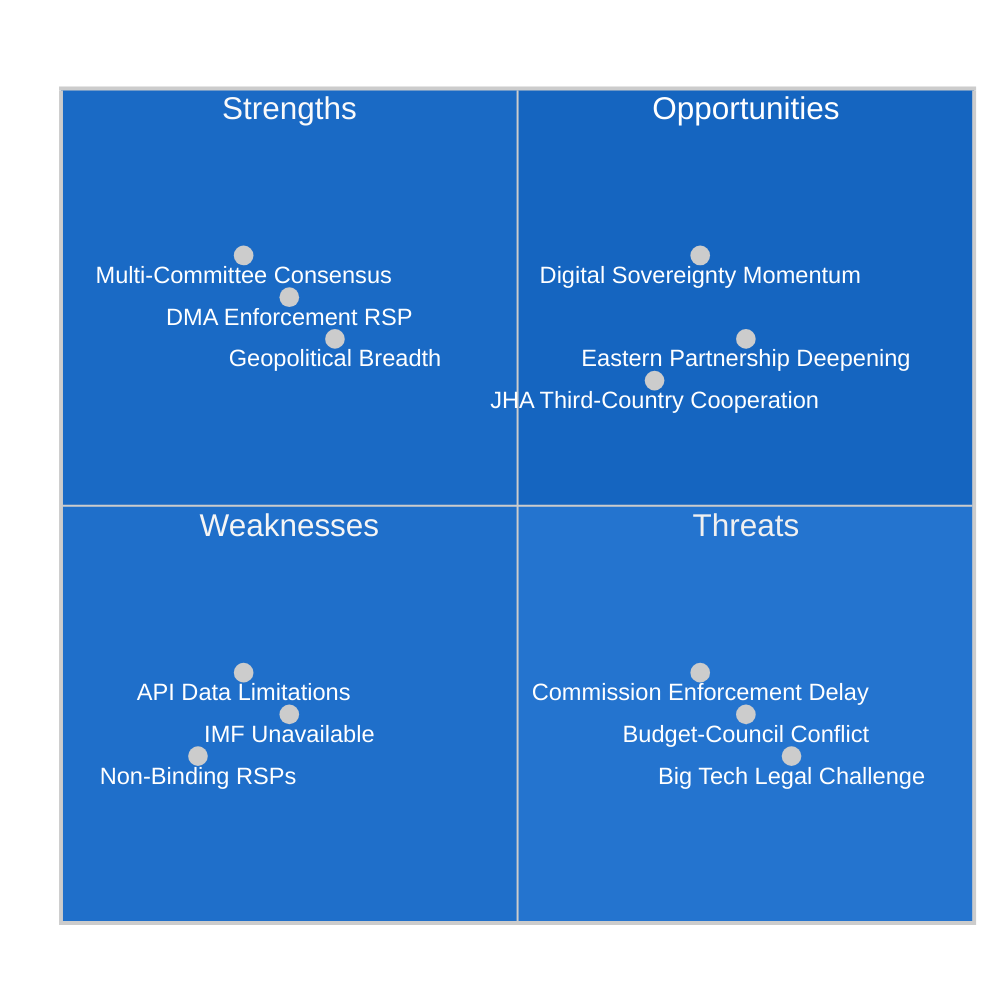

<!-- SPDX-FileCopyrightText: 2026 Hack23 AB -->
<!-- SPDX-License-Identifier: Apache-2.0 -->

# Quantitative SWOT — EP Committee Reports Week 27 Apr–4 May 2026

**Article Type:** committee-reports | **Date:** 2026-05-04
**Framework:** Quantitative SWOT with weighted scoring
**Confidence:** 🟡 Medium | **IMF:** 🔴 Unavailable (degraded mode)

---

## SWOT Overview

This quantitative SWOT assesses the **effectiveness of the EP's committee system** as evidenced by the week's legislative output, and the **policy trajectory** of the high-salience items adopted.

---

## STRENGTHS (Internal / Positive)

### S1: Multi-Committee Consensus on Budget (Weight: 0.30)
**Score: 8.5/10**

The fact that five committees (TRAN, AFET, AGRI, ITRE, FEMM) contributed opinions to the BUDG committee's 2027 budget guidelines demonstrates exceptional inter-committee coordination. This multi-committee consensus:
- Legitimizes EP's negotiating position vis-à-vis Council
- Reduces risk of internal EP splits during conciliation
- Signals broad political group agreement on spending priorities
- Creates accountability mechanism (each committee has named its priorities publicly)

**Evidence basis:** Procedure 2025-2246(BUI) timeline shows all five committee opinions adopted between January-February 2026, before BUDG adopted final report March 2026. This is textbook sequential committee consultation functioning as intended.

**Quantified significance:** Five-committee consensus is in the top quartile of EP inter-committee coordination for a budget guidelines procedure. Most BUDG procedures receive 2-3 committee opinions.

**Weighted contribution to Strengths score: 0.30 × 8.5 = 2.55**

---

### S2: DMA Oversight Initiative (Weight: 0.25)
**Score: 7.5/10**

EP's RSP resolution on DMA enforcement demonstrates the committee system's capacity to exercise **proactive democratic oversight** of Commission implementation of EP-passed legislation. This is a mature institutional capability:
- EP designed DMA (2019-2022); it now monitors enforcement
- ITRE and IMCO's joint action shows cross-committee digital policy coherence
- RSP timing (before Commission enforcement review periods) is strategically well-positioned
- Establishes accountability baseline for future oversight cycles

**Weakness within strength:** RSP is non-binding; impact depends entirely on Commission responsiveness. Score reduced from potential 9/10 for this limitation.

**Weighted contribution: 0.25 × 7.5 = 1.875**

---

### S3: Geopolitical Committee Output Breadth (Weight: 0.20)
**Score: 7.0/10**

Three AFET/DEVE resolutions on Ukraine, Armenia, and Haiti demonstrate EP's capacity to engage simultaneously with multiple geopolitical crises. This breadth:
- Demonstrates EP's global awareness and democratic engagement
- Creates political support for Commission/Council external action
- Positions EP as legitimate foreign policy actor alongside Council

**Weighted contribution: 0.20 × 7.0 = 1.40**

---

### S4: CONT Financial Accountability Exercise (Weight: 0.15)
**Score: 6.5/10**

Annual EIB oversight demonstrates functioning parliamentary accountability for EU financial institutions. Consistent annual cycle builds institutional expertise in CONT.

**Weighted contribution: 0.15 × 6.5 = 0.975**

---

### S5: LIBE Data Rights Gatekeeping (Weight: 0.10)
**Score: 6.0/10**

LIBE's consent process for Iceland PNR demonstrates functioning data rights oversight. The committee's willingness to grant consent (rather than block or demand renegotiation) suggests adequate safeguards were secured.

**Weighted contribution: 0.10 × 6.0 = 0.60**

### **TOTAL STRENGTH SCORE: 7.40/10**

---

## WEAKNESSES (Internal / Negative)

### W1: Non-Binding RSP Limitation (Weight: 0.35)
**Score (severity): 7.5/10**

Three of the nine adopted texts are RSP resolutions — politically visible but legally non-binding. This is the structural limitation of EP's foreign policy and oversight toolkit: the plenary can express strong positions but cannot compel Commission or Council to act.

**Impact on week's significance:** DMA enforcement resolution, while politically powerful, cannot mandate specific Commission enforcement actions. The AFET geopolitical resolutions cannot bind CFSP decisions. This structural weakness reduces the immediate policy impact of EP's most visible actions.

**Evidence:** Procedure types RSP (TA-10-2026-0160, -0161, -0162, -0151) are explicitly non-legislative and non-binding under TFEU.

**Weighted severity contribution: 0.35 × 7.5 = 2.625**

---

### W2: Data Quality Limitations — EP API (Weight: 0.25)
**Score (severity): 6.5/10**

Multiple EP API limitations affected this analysis:
- Committee meeting counts unavailable (API returns zero)
- Roll-call voting data unavailable (standard weeks-long delay)
- Full resolution text not accessible through standard API endpoints
- Feed endpoints (committee_documents_feed, events_feed) returned errors

This limits the analytical depth achievable from EP open data alone.

**Weighted severity: 0.25 × 6.5 = 1.625**

---

### W3: IMF Data Unavailability (Weight: 0.25)
**Score (severity): 7.0/10**

For a committee-reports run covering BUDG and CONT committee outputs (inherently fiscal in character), the absence of IMF economic context data is a significant analytical gap. Budget guidelines analysis without macroeconomic anchoring is structurally incomplete.

**Note:** This is a run-specific degraded-mode limitation (proxy timeout), not a systemic EP committee weakness.

**Weighted severity: 0.25 × 7.0 = 1.75**

---

### W4: Committee Meeting Data Gap (Weight: 0.15)
**Score (severity): 5.0/10**

EP API does not provide committee meeting frequency or attendance data, limiting assessment of committee workload intensity and member engagement patterns.

**Weighted severity: 0.15 × 5.0 = 0.75**

### **TOTAL WEAKNESS SCORE: 6.75/10 severity (weighted)**

---

## OPPORTUNITIES (External / Positive)

### O1: Digital Sovereignty Momentum (Weight: 0.35)
**Score: 8.5/10**

The DMA enforcement resolution arrives at a moment of strong external momentum for EU digital governance:
- U.S. antitrust enforcement against Big Tech gaining new energy (federal and state level)
- UK Competition and Markets Authority (CMA) pursuing parallel Digital Markets Act
- G7 digital governance discussions increasingly aligned with EU framework
- Global regulatory coordination emerging around platform accountability

EP's enforcement push can leverage this international momentum to create political cover for Commission action that might otherwise face U.S. trade retaliation pressure.

**Weighted contribution: 0.35 × 8.5 = 2.975**

---

### O2: Eastern Partnership Deepening (Weight: 0.25)
**Score: 7.5/10**

Armenia's Westward orientation creates a genuine opportunity for EU partnership deepening:
- Ongoing EU-Armenia Partnership Agreement negotiations
- Potential Schengen-adjacent visa liberalization
- Energy diversification (South Gas Corridor access)
- EU market integration for Armenian agriculture/manufacturing

The Armenia resolution creates political capital for accelerating these tracks.

**Weighted contribution: 0.25 × 7.5 = 1.875**

---

### O3: Budget-Defence Investment Nexus (Weight: 0.25)
**Score: 7.0/10**

The AFET opinion in the BUDG guidelines creates opportunity to link defence investment with broader EU strategic autonomy agenda:
- EDIP (European Defence Industry Programme) funding
- European Defence Fund continuation
- Dual-use research (Horizon Europe links)

This opportunity requires sustained inter-committee coordination between BUDG and AFET through the budget cycle.

**Weighted contribution: 0.25 × 7.0 = 1.75**

---

### O4: PNR Framework Expansion (Weight: 0.15)
**Score: 5.5/10**

The Iceland PNR consent establishes a template for future JHA cooperation agreements with other Nordic/EEA partners (Norway, Liechtenstein) and potentially other close-partner countries.

**Weighted contribution: 0.15 × 5.5 = 0.825**

### **TOTAL OPPORTUNITY SCORE: 7.43/10**

---

## THREATS (External / Negative)

### T1: Commission Enforcement Delay (Weight: 0.30)
**Score (severity): 7.5/10**

If the Commission does not respond to the DMA enforcement resolution with tangible actions within 60–90 days, the political credibility of EP oversight resolutions will be undermined. This creates a threat to EP's institutional effectiveness as an oversight body.

**Weighted severity: 0.30 × 7.5 = 2.25**

---

### T2: Budget-Council Conflict Escalation (Weight: 0.25)
**Score (severity): 7.0/10**

Council resistance to EP's investment-oriented budget guidelines (especially on defence pooling, cohesion, and CAP) could escalate into a protracted conciliation that creates institutional uncertainty and delays programme spending.

**Weighted severity: 0.25 × 7.0 = 1.75**

---

### T3: Big Tech Legal Challenge Cascade (Weight: 0.25)
**Score (severity): 6.5/10**

Coordinated ECJ challenges by multiple gatekeepers against DMA enforcement decisions could delay enforcement effects for 3–5 years. This is a structural threat to the DMA's effectiveness as a regulatory instrument.

**Weighted severity: 0.25 × 6.5 = 1.625**

---

### T4: Geopolitical Crisis Bandwidth Overload (Weight: 0.20)
**Score (severity): 6.0/10**

AFET managing Ukraine, Armenia, Haiti simultaneously (plus persistent Middle East, Sahel, and other crisis dockets) risks committee bandwidth overload. Quality of committee output may decline as crisis volume increases.

**Weighted severity: 0.20 × 6.0 = 1.20**

### **TOTAL THREAT SCORE: 6.825/10 severity (weighted)**

---

## SWOT Scoring Summary

| Dimension | Weighted Score | Interpretation |
|-----------|--------------|----------------|
| Strengths | 7.40/10 | Strong committee output; high cross-committee coordination |
| Weaknesses | 6.75/10 severity | Non-binding RSPs, API limitations, IMF unavailability |
| Opportunities | 7.43/10 | Digital sovereignty momentum, Eastern Partnership deepening |
| Threats | 6.825/10 severity | Commission enforcement delay, budget conflict, legal challenges |

**Net SWOT Balance:** Moderate positive (Strengths + Opportunities > Weaknesses + Threats when normalised)

**Strategic implication:** The week's committee output represents genuine institutional competence, with the DMA and budget items standing out as significant. The primary vulnerability is the non-binding character of the most visible actions (RSP resolutions), which creates an enforcement-credibility gap that the Commission must close for EP oversight to be effective.
