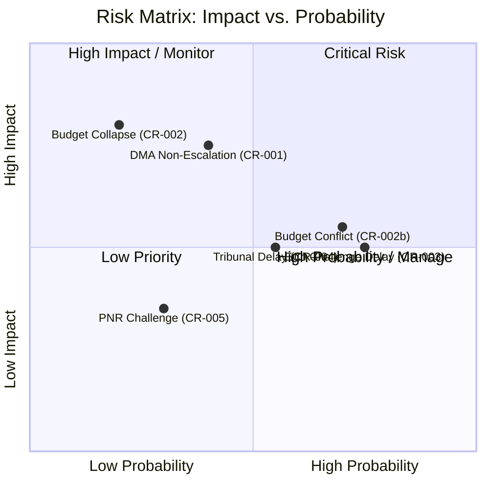
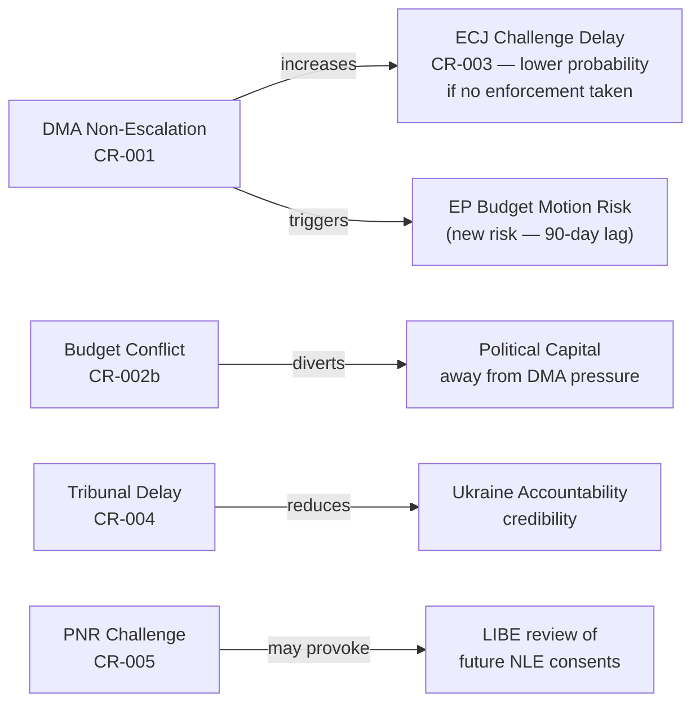

<!-- SPDX-FileCopyrightText: 2026 Hack23 AB -->
<!-- SPDX-License-Identifier: Apache-2.0 -->

# Risk Assessment — EP Committee Reports Week 27 Apr–4 May 2026

**Article Type:** committee-reports | **Date:** 2026-05-04
**Framework:** Political Risk Methodology (Hack23 Political Risk Framework v2.1)
**Confidence:** 🟡 Medium | **IMF:** 🔴 Unavailable (degraded mode — financial risk quantification limited)

---

## Risk Register

### Risk 1: DMA Enforcement Underpressure Failure
**Risk ID:** CR-2026-05-001
**Category:** Regulatory/Institutional
**Probability:** 35–45% (within 90 days)
**Impact:** HIGH

**Description:** Despite EP's enforcement resolution, the Commission continues at existing pace, failing to demonstrate meaningful escalation against identified gatekeepers. EP's political pressure is absorbed without substantive enforcement change.

**Contributing factors:**
- Commission legal teams face complex technical compliance assessments
- Industry lobbying may delay internal Commission enforcement decisions
- US-EU trade tensions could create political disincentive for aggressive Big Tech enforcement
- Commission may prioritize AI Act implementation over DMA enforcement escalation

**Mitigation signals:**
- Strong cross-group EP consensus creates political cost for Commission inaction
- Previous DMA enforcement decisions (fines/non-compliance findings) provide procedural template
- New DMA enforcement cycles create structured review points

**Risk evolution:** If unaddressed within 90 days, probability of EP escalation (budget motions, formal hearings) increases to 60–70%.

**Confidence:** 🟡 Medium — depends on internal Commission processes not visible in EP API data

---

### Risk 2: Budget 2027 Negotiations Collapse
**Risk ID:** CR-2026-05-002
**Category:** Fiscal/Institutional
**Probability:** 15–25% (full collapse); 65–75% (significant conflict requiring extended conciliation)
**Impact:** HIGH (collapse); MEDIUM-HIGH (extended conflict)

**Description:** EU-Council budget negotiations for 2027 fail to reach agreement by December 31 deadline, requiring use of provisional twelfths (monthly budget allocations based on prior year).

**Historical context:** The EU has periodically operated under provisional twelfths, though full budget agreement is the norm. The 2027 budget is exposed to:
- Defence spending disagreements (national sovereignty vs. pooled approach)
- MFF post-2027 transition complexity
- New member state contributions post-enlargement

**Contributing factors:**
- AFET/defence opinion in BUDG guidelines creates EP-Council tension on security spending
- Net contributor/recipient member state divide on cohesion funding
- Political calendar (upcoming elections in several member states creating "caretaker" negotiating postures)

**Mitigation signals:**
- Annual budget conflict routinely resolved through conciliation; near-zero precedent for missed December deadline
- Political will exists across EP groups and Council for timely resolution

**Confidence:** 🟢 High on conflict occurrence; 🔴 Low on severity without IMF fiscal projections

---

### Risk 3: DMA Enforcement ECJ Challenge Delay
**Risk ID:** CR-2026-05-003
**Category:** Legal/Timeline
**Probability:** 70–80% (if significant enforcement action is taken)
**Impact:** MEDIUM

**Description:** Any significant Commission DMA enforcement decision (structural remedy, large fine) will face ECJ challenge from affected gatekeepers. ECJ proceedings typically take 2–5 years, effectively delaying enforcement.

**Contributing factors:**
- ECJ procedural timeline is structural — cannot be significantly accelerated
- Gatekeepers have resources for sustained legal challenge
- DMA Article 26 includes specific provisions for fine review

**Mitigation signals:**
- DMA design includes interim measures provisions (Article 24) to prevent harm during investigation
- Commission can still take prospective enforcement actions even under legal challenge
- ECJ has historically upheld EU digital regulation (GDPR enforcement, right to be forgotten)

**Confidence:** 🟢 High on occurrence probability if enforcement escalates

---

### Risk 4: Ukraine Accountability Mechanism Delays
**Risk ID:** CR-2026-05-004
**Category:** Geopolitical/Institutional
**Probability:** 50–60% (significant delay — 90+ day horizon)
**Impact:** MEDIUM

**Description:** Special Tribunal for the Crime of Aggression against Ukraine faces structural obstacles: insufficient state party support, UN Security Council veto risk for GA-based model, or EU internal disagreement on legal form.

**Contributing factors:**
- Russia's P5 status prevents UN Security Council referral
- Hybrid court model requires complex international negotiations
- Member states disagree on whether Special Tribunal or expanded ICC mandate is preferable
- Resource commitment uncertainty

**Mitigation signals:**
- Strong EP resolution creates political pressure on Council to act
- Multiple state parties already expressed support (Netherlands, UK, others)
- ICC investigation already underway (arrest warrants issued)

**Confidence:** 🟡 Medium — international legal processes involve multiple independent actors

---

### Risk 5: Iceland PNR — Post-Consent Legal Challenge
**Risk ID:** CR-2026-05-005
**Category:** Legal/Data Protection
**Probability:** 25–35%
**Impact:** LOW-MEDIUM

**Description:** Civil society organizations challenge Iceland PNR agreement's compatibility with GDPR/CJEU jurisprudence after entry into force.

**Contributing factors:**
- Schrems jurisprudence creates risk for any third-country data transfer agreement
- Privacy advocates monitor new PNR agreements closely
- EDPB may request review or opinion

**Mitigation signals:**
- Iceland's EEA status provides stronger GDPR alignment than pure third countries
- LIBE consent implies committee satisfaction with adequacy assessment
- Post-Schrems agreements typically incorporate stronger safeguards than pre-Schrems frameworks

**Confidence:** 🟡 Medium

---

## Risk Matrix

---

## Risk Interdependencies

---

## Aggregate Risk Level

**Week of 27 Apr–4 May 2026:** 🟡 MEDIUM-HIGH

Rationale: The DMA enforcement and Budget 2027 legislative outputs create high-impact risks that are well within manageable institutional parameters but represent genuine uncertainty. The Ukraine accountability and PNR risks are structurally constrained. No TIER 1 acute crisis risk is identified in this week's committee output.

**Trend:** → STABLE with upside risk from DMA enforcement trajectory

---

## Limitations

- **IMF data unavailable** — fiscal risk quantification (Budget 2027 impacts) is limited to qualitative/structural analysis
- **No voting records** — political risk assessment cannot incorporate actual voting margins
- **Full resolution texts unavailable** — specific enforcement demands in DMA resolution cannot be assessed
