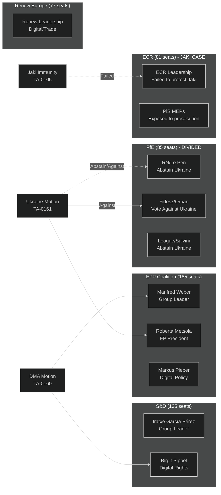
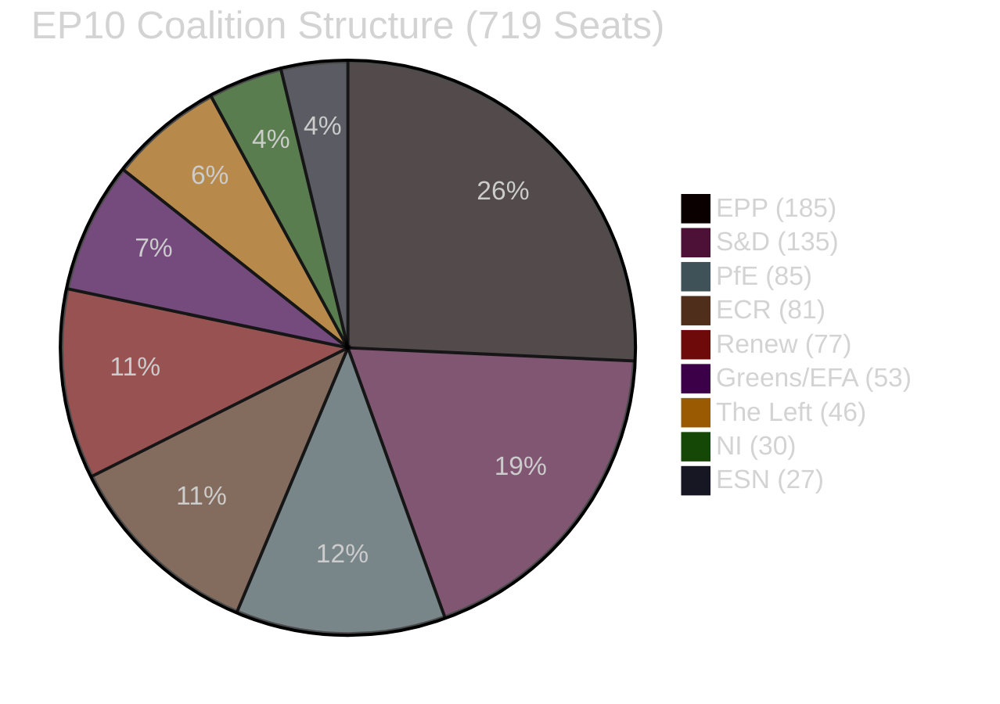
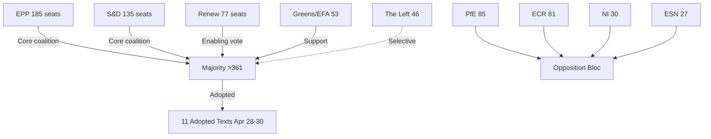

<!-- SPDX-FileCopyrightText: 2024-2026 Hack23 AB -->
<!-- SPDX-License-Identifier: Apache-2.0 -->

# Actor Mapping — EU Parliament Motions: 27 April–4 May 2026

**Classification:** PUBLIC | **Confidence:** 🟢 HIGH | **Date:** 2026-05-04

---

## Overview

Structured actor mapping for the principal agents in the April 28–30, 2026 EP plenary session. Applied forces analysis to understand the constellation of interests shaping each motion outcome.

---

## Actor Profiles

### EPP — Manfred Weber (Group Leader, Germany/CSU)
**Role:** Coalition architect; primary agenda setter in EP10
**Interest on key motions:**
- DMA: Supported enforcement motion — unusual for EPP; reflects Weber's calculation that opposing tech accountability would be politically costly ahead of 2029 elections
- Ukraine: Strong support; EPP has made Ukraine a signature position
- Budget: Will push for defense reorientation within climate/social spending; fiscal conservative but EU institutional loyalist

**Behavioral prediction:** Weber will maintain centrist coalition through summer 2026 but test EPP-ECR proximity on budget in autumn. Watch for whether EPP tables amendments that ECR supports.

---

### EPP — Roberta Metsola (EP President, Malta)
**Role:** EP institutional leader; high-profile Ukraine advocate
**Interest:** Metsola has been the EP's most visible international advocate for Ukraine, visiting Kyiv multiple times. The Ukraine accountability text is a personal priority.
**Behavioral prediction:** Will use presidency platform to pressure Commission on DMA enforcement; will maintain strong Ukraine support posture publicly.

---

### S&D — Iratxe García Pérez (Group Leader, Spain)
**Role:** Leader of largest center-left bloc; key to progressive-center coalition maintenance
**Interest:** S&D's core agenda aligns with DMA enforcement, Ukraine accountability, and maintaining social spending in budget 2027.
**Key dynamic:** García Pérez faces pressure from her own group on migration texts (S&D is split on "safe third country" concepts). The DMA/Ukraine votes help maintain group cohesion by providing clearly shared values.

---

### PfE — Jordan Bardella / Fidesz MEP delegation
**Role:** PfE faces an internal governance challenge — its constituent parties have fundamentally different foreign policy orientations.
**RN/France (Le Pen-aligned):** Historical Russia ties, abstain on Ukraine accountability rather than vote against — managing domestic political exposure
**Fidesz/Hungary:** Formally opposed to Ukraine accountability text; aligned with Orbán's neutrality/Russia-engagement position
**League/Italy:** Abstain on most Ukraine texts; Salvini faces domestic pressure but Italy's Meloni government is more clearly pro-Ukraine than Salvini himself

**Behavioral significance:** PfE's failure to achieve a unified position on Ukraine accountability in this session is a record that will be used by critics (EPP, S&D) to argue PfE cannot be a reliable governing partner.

---

### ECR — Group Leadership (Giorgia Meloni's group, formally) + Polish PiS MEPs
**Role:** Conservative opposition bloc; most internally coherent of the right-wing groups on EU institutional affairs
**Jaki case significance:** ECR failed to protect Jaki despite contesting the waiver on fumus persecutionis grounds. The PRIV Committee found the Polish prosecution was legitimate judicial process, not political persecution.

**Downstream:** At least 3–4 other PiS-affiliated ECR MEPs may face similar requests from Polish judicial authorities investigating the 2015–2023 PiS government. ECR is developing a legal defense strategy but its institutional leverage against the PRIV committee is limited.

---

### Patryk Jaki (ECR, Poland)
**Background:** Former Undersecretary of State, Polish Ministry of Justice (2016–2019); MEP from 2019; ECR member; ran for European Parliament specifically as a PiS candidate
**Charges:** Alleged abuse of ministerial office in relation to misuse of public funds via the National Institute of Freedom (NIW), which distributed state grants to PiS-aligned civil society organizations
**PRIV Committee finding:** No fumus persecutionis — the Committee found the prosecution is a legitimate criminal investigation into potential ministerial abuse, not a politically motivated prosecution
**Significance:** Jaki is a well-known conservative commentator and MEP with a substantial following in Polish Catholic-nationalist circles. His potential prosecution has high domestic political salience in Poland.

---

## Forces Analysis

### Forces Driving DMA Enforcement

| Force | Direction | Strength |
|-------|-----------|---------|
| EP political majority (EPP+S&D+Renew+Greens/EFA) | FOR enforcement | Strong (550+ MEPs) |
| Civil society / consumer advocates | FOR enforcement | Moderate |
| EU SME digital competition interest | FOR enforcement | Moderate |
| Big Tech lobbying coalition | AGAINST enforcement | Strong (€30-40M/yr) |
| US Trade Retaliation Threat | AGAINST enforcement | Moderate-Strong |
| German CDU/CSU business wing | Ambivalent | Moderate |

**Net force:** Pro-enforcement forces dominate within EP; counter-forces operate primarily via Commission and external channels.

---

### Forces Driving Ukraine Accountability

| Force | Direction | Strength |
|-------|-----------|---------|
| EP centrist majority | FOR accountability | Very Strong |
| Ukraine government | FOR accountability | Strong |
| International criminal law NGOs | FOR accountability | Moderate |
| Fidesz/Hungary | AGAINST | Moderate (blocks Council, not EP) |
| Russia/Belarus | AGAINST (external) | Limited within EU |
| War fatigue in some member states | AGAINST | Growing but not yet majority |

**Net force:** Strong majority for accountability in EP; blocked at Council level by Hungary.

---

## Coalition Structure Summary

**Majority threshold: 361 votes** (50% + 1 of 719 theoretical maximum)

Pro-enforcement/accountability coalition (EPP + S&D + Renew + Greens/EFA): **550 seats** = 76.5% of theoretical majority

## Actor Roster

| Actor | Type | Seats/Capacity | Alignment |
|-------|------|----------------|---------|
| EPP | EP Group | 185 | Center-right; coalition anchor |
| S&D | EP Group | 135 | Center-left; progressive anchor |
| PfE | EP Group | 85 | Populist right; opposition |
| ECR | EP Group | 81 | Conservative right; opposition |
| Renew | EP Group | 77 | Liberal; swing |
| Greens/EFA | EP Group | 53 | Greens/regionalists; support |
| The Left | EP Group | 46 | Far-left; selective support |
| NI | Non-Inscrits | 30 | Fragmented |
| ESN | EP Group | 27 | Far-right; opposition |

## Influence and Alliance Network

## Power Brokers

1. **EPP Chair Manfred Weber** — coalition manager, DMA and Ukraine positions
2. **S&D Chair Iratxe García Pérez** — progressive anchor, accountability champion
3. **Commission President von der Leyen** — DMA enforcement authority
4. **Council Presidency (Poland, Tusk)** — Ukraine accountability facilitation
5. **PfE Chair Jordan Bardella** — opposition voice, populist framing

## Information Flows

Key information: EP IMCO (digital/DMA), EP AFET (Ukraine/Armenia), EP BUDG (budget), EP JURI (immunity), EP LIBE (PNR/data protection).

## Reader Briefing

**For Citizens:** The Parliament's center majority (EPP + S&D + Renew = 397 out of 719 MEPs) voted together on all 11 key topics this week. Knowing this three-party alliance explains almost every result. The populist right (PfE + ECR = 166) was in opposition across the board.

---

**Methodology:** Forces analysis + actor mapping per ACH | EP Open Data Portal | ICD 203 standards | GDPR: MEPs in public parliamentary roles only
