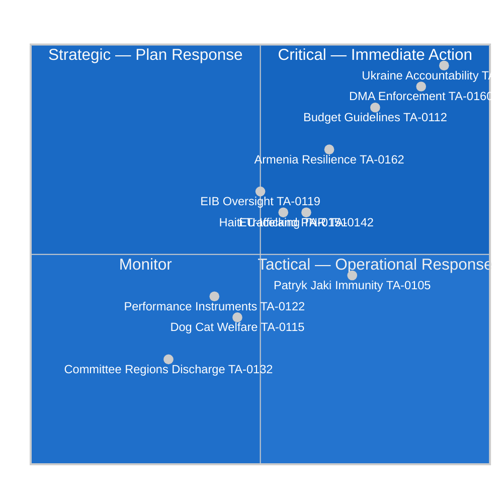

<!-- SPDX-FileCopyrightText: 2024-2026 Hack23 AB -->
<!-- SPDX-License-Identifier: Apache-2.0 -->

# Significance Classification — EU Parliament Motions: 27 April–4 May 2026

**Classification:** PUBLIC | **Confidence:** 🟢 HIGH | **Date:** 2026-05-04

---

## Classification Matrix

This artifact applies the EP Monitor significance classification framework to the eleven adopted texts from April 28–30, 2026.

---

## Tier 1 — CRITICAL (Immediate Policy Significance)

### TA-10-2026-0161: Ukraine Accountability
**Significance Score: 9.5/10** | **Urgency: IMMEDIATE** | **Category: CFSP/Human Rights**

The call for a Special Tribunal on Russia's crime of aggression is the most strategically significant text of the session. It positions the EU Parliament ahead of the Council and Commission on the accountability architecture — with direct implications for the international legal order, frozen Russian asset deployment, and EU-Ukraine relations.

**Classification rationale:** High urgency (ongoing conflict, active war crimes commission), very high strategic impact (sets international legal precedent, tests EU foreign policy coherence), cross-institutional significance.

---

### TA-10-2026-0160: DMA Enforcement
**Significance Score: 9.0/10** | **Urgency: HIGH** | **Category: Digital/Internal Market**

The EP's call for Commission action on DMA Article 26 structural remedies represents a threshold moment in EU digital regulation. The economic implications (€62B digital advertising market, global tech governance precedent) and political dynamics (EPP supporting tech regulation) mark this as a CRITICAL text.

**Classification rationale:** High urgency (enforcement timeline decisions fall within 6-month window), very high strategic impact (global regulatory precedent, US-EU trade dynamics).

---

## Tier 2 — HIGH STRATEGIC IMPORTANCE

### TA-10-2026-0112: 2027 Budget Guidelines
**Significance Score: 8.5/10** | **Urgency: MEDIUM-HIGH** | **Category: Budget/Institutional**

Budget guidelines initiate the annual procedure — all subsequent budget negotiations reference this text. The EP's position on Ukraine financing, defense spending, and climate mainstreaming will shape negotiations through October 2026.

---

### TA-10-2026-0162: Armenia Democratic Resilience
**Significance Score: 7.5/10** | **Urgency: MEDIUM** | **Category: CFSP/Enlargement**

A third consecutive EP resolution supporting Armenia's EU integration path. Quietly significant for the Eastern Partnership and the EU's relationship with both Turkey (Azerbaijani patron) and Russia.

---

### TA-10-2026-0142: EU-Iceland PNR Agreement
**Significance Score: 6.5/10** | **Urgency: MEDIUM** | **Category: LIBE/External Relations**

Security architecture text with implications for data protection, Schengen border management, and EU-EEA relations. Post-Schrems II legal framework compliance.

---

## Tier 3 — MODERATE SIGNIFICANCE

### TA-10-2026-0105: Jaki Immunity Waiver
**Significance Score: 6.0/10** | **Urgency: HIGH for actor** | **Category: PRIV**

Moderate significance for EU-wide policy but high significance for ECR group politics and Polish domestic accountability dynamics.

---

### TA-10-2026-0151: Haiti Trafficking
**Significance Score: 6.0/10** | **Urgency: MEDIUM** | **Category: Human Rights/External**

Humanitarian signalling text. The EU's actual capacity to influence Haiti outcomes is limited but the motion maintains political attention on a severe crisis.

---

### TA-10-2026-0119: EIB Financial Activities
**Significance Score: 6.5/10** | **Urgency: LOW-MEDIUM** | **Category: CONT/Economic Oversight**

Oversight motion with governance implications for EIB's expanding defense/dual-use mandate.

---

## Tier 4 — ROUTINE/PROCEDURAL

### TA-10-2026-0115: Dog and Cat Welfare
**Significance Score: 3.5/10** | **Urgency: LOW** | **Category: AGRI/Consumer**

High public interest but limited strategic significance. Implementation will be gradual across member states.

### TA-10-2026-0122: Performance-Based Instruments
**Significance Score: 4.0/10** | **Urgency: LOW** | **Category: ECON/Transparency**

Technical financial regulation transparency text.

### TA-10-2026-0132: Discharge 2024 (Committee of Regions)
**Significance Score: 2.5/10** | **Urgency: LOW** | **Category: CONT/Budget Discharge**

Routine annual discharge — no political controversy indicated.

---

## Overall Session Significance Assessment

**Session significance level: HIGH** 🟢

The April 28–30, 2026 session rates as HIGH significance based on:
- Two texts of CRITICAL policy importance (Ukraine accountability, DMA enforcement)
- One text of major institutional importance (2027 budget guidelines)
- Significant ECR-group implications (Jaki immunity)
- Active engagement with EU's major foreign policy challenges (Ukraine, Armenia, Haiti)

This session is above the mean for legislative density and political significance in the EP10 term to date.

---

**Methodology:** EP Monitor significance classification framework | ACH | EP Open Data Portal | Confidence: 🟢 HIGH
