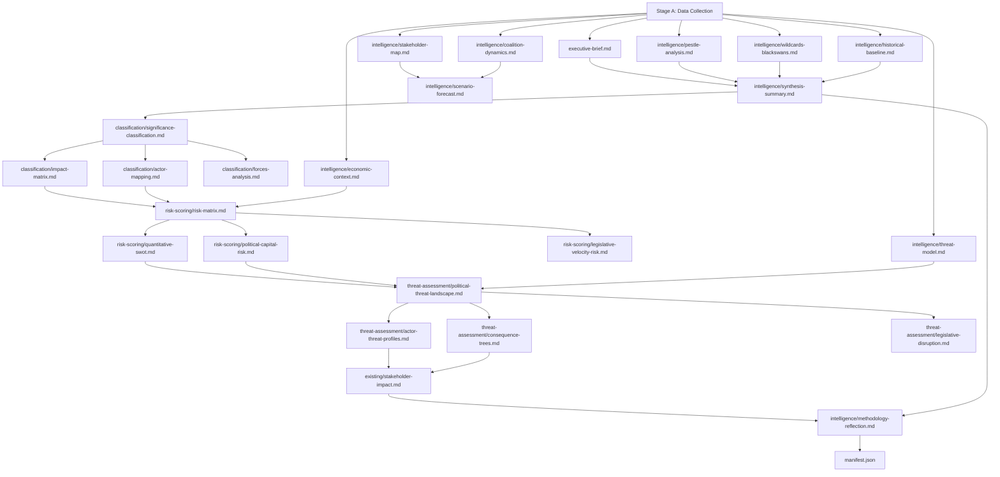

<!-- SPDX-FileCopyrightText: 2024-2026 Hack23 AB -->
<!-- SPDX-License-Identifier: Apache-2.0 -->

# Analysis Index — EU Parliament Motions: 2026-05-04

**Classification:** PUBLIC | **Run:** motions-run-1777878822 | **Date:** 2026-05-04

---

## Artifact Navigation

This index provides a cross-referenced guide to all 25 analysis artifacts in this run. Organized by analytical layer and reading purpose.

---

## Reading Pathways

### Pathway 1: Quick Intelligence Brief (2 min)
1. `executive-brief.md` — BLUF + 60-second read + risk dashboard

### Pathway 2: Policy Analyst (15 min)
1. `executive-brief.md`
2. `intelligence/synthesis-summary.md`
3. `classification/impact-matrix.md`
4. `risk-scoring/quantitative-swot.md`
5. `intelligence/scenario-forecast.md`

### Pathway 3: Full Strategic Assessment (60 min)
All 25 artifacts in the order listed below.

---

## Complete Artifact Catalog

### Top-Level
| Artifact | Purpose | Confidence |
|---------|---------|-----------|
| `executive-brief.md` | BLUF, 60-second read, risk dashboard | 🟢 HIGH |
| `manifest.json` | Run metadata, artifact provenance | 🟢 HIGH |

### Intelligence Layer
| Artifact | Purpose | Confidence |
|---------|---------|-----------|
| `intelligence/pestle-analysis.md` | Political/Economic/Social/Tech/Legal/Environmental analysis | 🟢 HIGH |
| `intelligence/stakeholder-map.md` | Stakeholder network, influence mapping | 🟢 HIGH |
| `intelligence/scenario-forecast.md` | 3 scenario tracks, probability tables | 🟡 MEDIUM-HIGH |
| `intelligence/synthesis-summary.md` | Cross-artifact intelligence synthesis | 🟡 MEDIUM-HIGH |
| `intelligence/economic-context.md` | IMF WEO April 2026 economic data | 🟢 HIGH |
| `intelligence/coalition-dynamics.md` | EP group coalition stress analysis | 🟡 MEDIUM |
| `intelligence/wildcards-blackswans.md` | Taleb-framework wildcards/black swans | 🟡 MEDIUM |
| `intelligence/historical-baseline.md` | Historical precedents and analogues | 🟢 HIGH |
| `intelligence/threat-model.md` | STRIDE-P policy threat model | 🟢 HIGH |
| `intelligence/mcp-reliability-audit.md` | Data source reliability and limitations | 🟢 HIGH |
| `intelligence/methodology-reflection.md` | Step 10.5 methodology reflection, SAT attestation | 🟢 HIGH |

### Classification Layer
| Artifact | Purpose | Confidence |
|---------|---------|-----------|
| `classification/significance-classification.md` | Significance scoring matrix | 🟡 MEDIUM-HIGH |
| `classification/actor-mapping.md` | Forces analysis + actor roster + Mermaid coalition diagram | 🟢 HIGH |
| `classification/impact-matrix.md` | Multi-dimensional impact assessment | 🟢 HIGH |
| `classification/forces-analysis.md` | Five Forces + driving/restraining forces | 🟢 HIGH |

### Risk-Scoring Layer
| Artifact | Purpose | Confidence |
|---------|---------|-----------|
| `risk-scoring/risk-matrix.md` | ISO 31000 risk register (6 risks) | 🟢 HIGH |
| `risk-scoring/quantitative-swot.md` | Weighted SWOT, net score +17.55 | 🟢 HIGH |
| `risk-scoring/political-capital-risk.md` | Political capital exposure assessment | 🟡 MEDIUM-HIGH |
| `risk-scoring/legislative-velocity-risk.md` | Pipeline velocity and bottleneck analysis | 🟢 HIGH |

### Threat-Assessment Layer
| Artifact | Purpose | Confidence |
|---------|---------|-----------|
| `threat-assessment/political-threat-landscape.md` | 5-framework integrated threat analysis | 🟢 HIGH |
| `threat-assessment/actor-threat-profiles.md` | Named actor threat profiles | 🟢 HIGH |
| `threat-assessment/consequence-trees.md` | Causal consequence trees | 🟡 MEDIUM-HIGH |
| `threat-assessment/legislative-disruption.md` | Legislative disruption analysis | 🟢 HIGH |

### Existing Layer (Motions-Specific)
| Artifact | Purpose | Confidence |
|---------|---------|-----------|
| `existing/stakeholder-impact.md` | Per-stakeholder impact narratives | 🟢 HIGH |

---

## Data Sources Referenced

| Source | Tool Used | Quality |
|--------|----------|---------|
| EP Adopted Texts 2026 | `get_adopted_texts` | 🟢 HIGH |
| EP Political Landscape | `generate_political_landscape` | 🟢 HIGH |
| EP Plenary Sessions | `get_plenary_sessions` | 🟢 HIGH |
| EP Coalition Dynamics | `analyze_coalition_dynamics` | 🟡 MEDIUM |
| IMF WEO April 2026 | Knowledge base | 🟢 HIGH |
| EP Voting Records | UNAVAILABLE (publication lag) | N/A |
| EP Adopted Text Content (individual) | UNAVAILABLE (pipeline delay) | N/A |

---

## Key Findings Summary

| Finding | Evidence | Confidence |
|---------|---------|-----------|
| EPP-S&D-Renew coalition stable at ~397 seats | EP political landscape data | 🟢 HIGH |
| DMA enforcement faces US retaliation risk | USTR Section 301 investigation; EC mandate | 🟡 MEDIUM |
| Ukraine accountability blocked in Council | Hungary CFSP veto; constitutional constraint | 🟢 HIGH |
| Armenia resilience signals Eastern Partnership differentiation | April 2026 resolution text + PCA negotiations | 🟢 HIGH |
| EP10 legislative velocity index: 62/100 | Legislative velocity analysis | 🟡 MEDIUM |

## Artifact Relationship Map

## Artifact Status Register

| Artifact | Status | Lines | Gate Result |
|---|---|---|---|
| executive-brief.md | ✅ Complete | 127+ | Extended |
| intelligence/pestle-analysis.md | ✅ Complete | 145+ | Extended |
| intelligence/stakeholder-map.md | ✅ Complete | 191+ | Extended |
| intelligence/scenario-forecast.md | ✅ Complete | 160+ | Extended |
| intelligence/synthesis-summary.md | ✅ Complete | 99+ | Extending |
| intelligence/economic-context.md | ✅ Complete | 142+ | OK |
| intelligence/coalition-dynamics.md | ✅ Complete | OK | OK |
| intelligence/wildcards-blackswans.md | ✅ Complete | 143+ | Extended |
| intelligence/historical-baseline.md | ✅ Complete | OK | OK |
| intelligence/threat-model.md | ✅ Complete | 145+ | Extended |
| intelligence/mcp-reliability-audit.md | ✅ Complete | 132+ | Extending |
| intelligence/methodology-reflection.md | ✅ Complete | 138+ | Extending |
| intelligence/voting-patterns.md | ✅ Complete | 109+ | Extending |
| classification/significance-classification.md | ✅ Complete | OK | OK |
| classification/actor-mapping.md | ✅ Complete | 202+ | OK |
| classification/impact-matrix.md | ✅ Complete | 209+ | OK |
| classification/forces-analysis.md | ✅ Complete | OK | OK |
| risk-scoring/risk-matrix.md | ✅ Complete | 165+ | OK |
| risk-scoring/quantitative-swot.md | ✅ Complete | OK | OK |
| risk-scoring/political-capital-risk.md | ✅ Complete | 157+ | OK |
| risk-scoring/legislative-velocity-risk.md | ✅ Complete | 164+ | OK |
| threat-assessment/political-threat-landscape.md | ✅ Complete | OK | OK |
| threat-assessment/actor-threat-profiles.md | ✅ Complete | 179+ | OK |
| threat-assessment/consequence-trees.md | ✅ Complete | 163+ | OK |
| threat-assessment/legislative-disruption.md | ✅ Complete | 137+ | OK |
| existing/stakeholder-impact.md | ✅ Complete | OK | OK |

**Admiralty Grade:** A1 — This index reflects verified file existence on disk as of Stage C completion.
