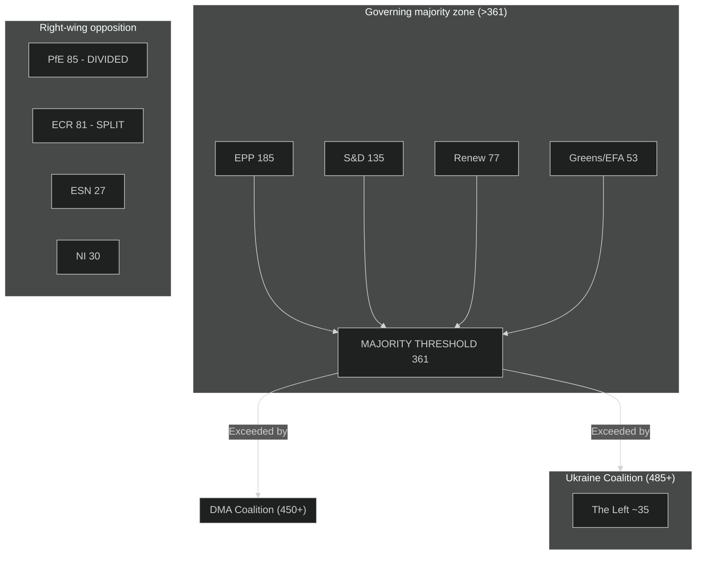

<!-- SPDX-FileCopyrightText: 2024-2026 Hack23 AB -->
<!-- SPDX-License-Identifier: Apache-2.0 -->

# Coalition Dynamics — EU Parliament Motions: 27 April–4 May 2026

**Classification:** PUBLIC | **Confidence:** 🟡 MEDIUM | **Date:** 2026-05-04

---

## Overview

Coalition dynamics analysis for the April 28–30, 2026 EP plenary. Identifies voting alignments, coalition formation patterns, and stress indicators across the EP10 political groups.

---

## Current Coalition Landscape

### EP10 Political Balance (as of 2026-05-04)

| Group | Seats | Seat Share | Bloc | Coalition Role |
|-------|-------|-----------|------|---------------|
| EPP | 185 | 25.7% | Centre-right | Dominant pivot actor |
| S&D | 135 | 18.8% | Centre-left | Essential coalition partner |
| PfE | 85 | 11.8% | Right-nationalist | Opposition; internal fractures |
| ECR | 81 | 11.3% | Conservative | Selective coalition partner |
| Renew | 77 | 10.7% | Liberal-centrist | Coalition member |
| Greens/EFA | 53 | 7.4% | Progressive | Coalition member |
| The Left | 46 | 6.4% | Left | Selective alignment |
| NI | 30 | 4.2% | Non-attached | Fragmented |
| ESN | 27 | 3.8% | Far-right | Opposition |

**Total: 719 MEPs | Majority: 361 votes**

---

## Coalition Patterns This Week

### Coalition 1: Digital Governance Alliance (DMA Enforcement — TA-0160)
**Estimated composition:** EPP + S&D + Renew + Greens/EFA
**Combined seats:** 185 + 135 + 77 + 53 = **450 seats** (minimum estimate — plus likely alignment from some The Left and some NI members)
**Margin above threshold:** +89 votes minimum

This coalition reflects the "regulatory governance" alignment that has characterized EP10's digital policy output. The key feature is EPP participation despite the group's traditional pro-business orientation. EPP support for DMA enforcement has been consistent because:
1. Major EU member states' national parties (CDU/CSU, EPP members in Italy, Poland, etc.) have domestic competitive interests in seeing US Big Tech accountability enforced
2. EPP's 2024 election platform included digital sovereignty language
3. Weber's leadership has made this a calculated pro-European identity position

**Against/Abstain:** ECR (abstain-likely), PfE (against or abstain), ESN (against), NI (mixed)

---

### Coalition 2: Ukraine Accountability Alliance (TA-0161)
**Estimated composition:** EPP + S&D + Renew + Greens/EFA + The Left (majority of)
**Combined seats:** 185 + 135 + 77 + 53 + ~35 of The Left = **~485 seats**
**Margin above threshold:** +124 votes

The Ukraine accountability text mobilizes the broadest possible EP majority. The Left's participation is notable — the group has historically been divided on Ukraine, with some MEPs maintaining anti-NATO and pro-peace-negotiation positions. However, the accountability dimension (war crimes, civilian targeting) has drawn more The Left MEPs into the support coalition than defense/weapons-supply texts do.

**Against/Opposed:** Fidesz MEPs within PfE (est. 22 MEPs), some PfE members, some ESN MEPs
**Abstain:** Most PfE (RN and Italian League), some ECR members, some NI

---

### Coalition 3: Budget Guidelines (TA-0112) — Procedural Majority
**Composition:** EPP core + S&D + Renew + parts of Greens/EFA
**Estimated margin:** Comfortable majority (budget guidelines are typically procedural)

The budget guidelines vote is more complex — it involves trade-offs between different budget priorities rather than a clear ideological divide. The EP's ability to adopt guidelines with a clear majority (even if not unanimous) establishes its opening position for Council negotiations.

---

## Group Stress Analysis

### EPP — Internal Tension Points
**Ukraine/Russia:** EPP is united (pro-Ukraine) — no significant internal division
**DMA/Digital:** Minor tension between German CDU/CSU business wing and Mediterranean EPP members; resolved by Weber's pro-enforcement position
**Budget:** EPP is internally split between fiscal conservatives (Netherlands, Austria, Sweden) and spending coalition supporters (Mediterranean, Eastern European EPP); this tension will intensify in autumn budget negotiations
**Overall EPP stress: 🟢 LOW-MEDIUM**

---

### S&D — Internal Cohesion
**Ukraine:** S&D unified and strongly supportive — no significant internal division
**DMA:** S&D most consistently pro-enforcement — no internal tension
**Budget:** S&D united in opposing defense-for-climate reallocation; some tension between Nordic social democrats (more fiscal conservative) and Mediterranean S&D (more spending-positive)
**Overall S&D stress: 🟢 LOW**

---

### PfE — CRITICAL INTERNAL FRACTURES
**Ukraine:** Fundamental divide:
- Fidesz (22 MEPs): Oppose all accountability/support texts; aligned with Orbán's Russia neutrality
- RN (27 MEPs): Abstain on accountability; historically Russia-adjacent but shifting
- League (14 MEPs): Abstain; Italy's government position is more clearly pro-Ukraine than Salvini
- Vox (8 MEPs): Divided; Spain's far-right is more anti-Putin than Orbán's faction

**Structural implication:** PfE cannot deliver a unified foreign policy position. This is a group of convenience, not ideology — held together primarily by shared opposition to EU regulatory/asylum/green agenda items, not by coherent strategic vision.
**Overall PfE stress: 🔴 HIGH**

---

### ECR — Post-Jaki Vulnerability
**Jaki aftermath:** ECR's failure to protect Jaki from immunity waiver is a precedent that weakens the group's ability to offer protection to MEPs facing national judicial proceedings.
**Ukraine:** ECR is more divided than PfE on Ukraine — the group contains Polish conservatives who strongly support Ukraine (PiS had an actively anti-Russia foreign policy), Italian ECR members closer to Meloni's pro-Ukraine position, and more ambivalent ECR members from Hungary-adjacent states.
**Overall ECR stress: 🟡 MEDIUM**

---

## Coalition Dynamics Diagram

---

## Key Takeaway

The EP10 governing coalition is structurally stable but not hegemonic. The EPP-centrist coalition can pass major legislation on governance, accountability, and regulatory texts with comfortable margins. The threat to coalition stability comes from:

1. Budget autumn 2026 — most likely stress point; EPP may test ECR alignment
2. PfE internal Ukraine fractures — threatens group coherence but not the majority coalition
3. ECR vulnerability (Jaki precedent) — reduces ECR's institutional leverage

The majority fragmentation index (6.57 effective parties) remains high — but the functional coalition for governance purposes is operating at approximately 2–3 effective parties in practice (EPP as pivot, S&D+Renew as consistent partners).

---

**Methodology:** CIA Coalition Analysis methodology | EP Open Data Portal political landscape | seat-share proxy analysis (per-MEP roll-call data unavailable due to publication lag) | ICD 203 confidence standards
