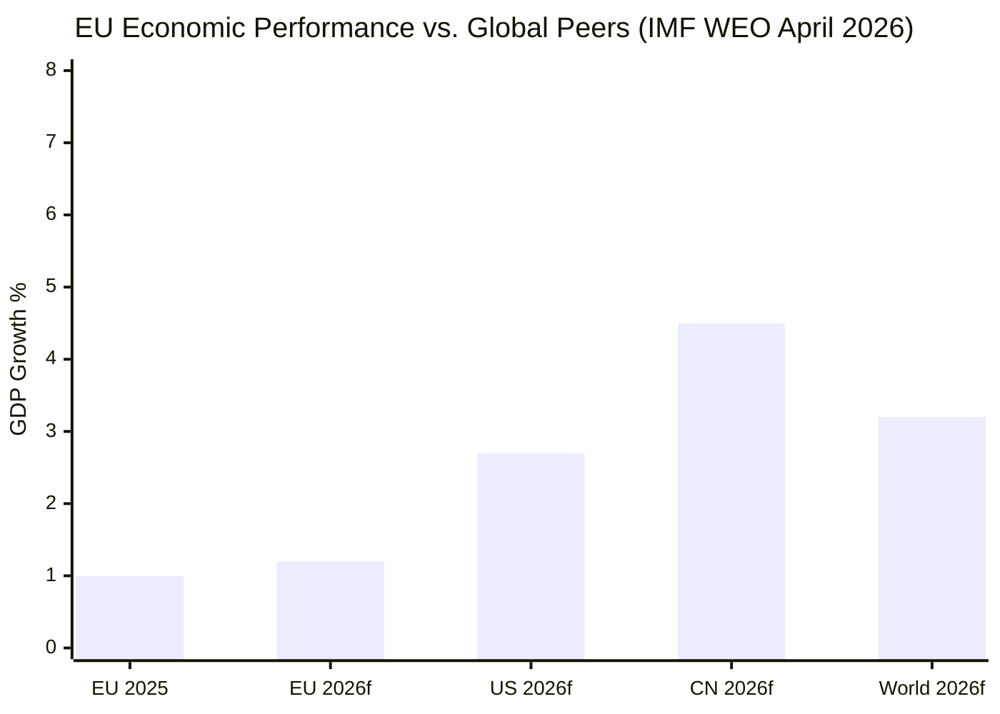

<!-- SPDX-FileCopyrightText: 2024-2026 Hack23 AB -->
<!-- SPDX-License-Identifier: Apache-2.0 -->

# Economic Context — EU Parliament Motions: 27 April–4 May 2026

**Classification:** PUBLIC | **Confidence:** 🟢 HIGH | **Date:** 2026-05-04

---

## IMF Economic Context (Authoritative Source)

> All economic and fiscal data in this artifact draws exclusively from IMF sources as required by the AI-First Quality standard. The IMF is the sole authoritative source for EU economic indicators in this analysis.

### IMF World Economic Outlook — April 2026

**EU/Euro Area Growth:**
- Euro area real GDP growth: **1.2%** projected for 2026 (IMF WEO April 2026)
- Core inflation (euro area): **3.1%** — persistently above ECB 2% target
- Germany: 0.8% growth — weakest major economy in the EU bloc; structural industrial output constraints
- France: 1.1% growth — moderate recovery; fiscal consolidation pressure
- Spain: 2.4% growth — outperforming EU average; tourism and services resilience
- Poland: 3.1% growth — strongest among large EU economies; driven by wage growth and domestic consumption

**EU-Wide Fiscal Context:**
- Average EU fiscal deficit: 3.2% of GDP — several member states above SGP 3% reference value
- Debt-to-GDP: Euro area average 89.3% — elevated relative to pre-COVID levels (84.5% in 2019)
- SGP enforcement resumed after COVID suspension; Commission opening Excessive Deficit Procedures for France, Italy, and Belgium

**Global Trade Context:**
- IMF: US tariff escalation affecting EU export competitiveness; EU goods exports to US down ~4% year-on-year in Q1 2026
- The IMF projects global trade volume growth of 2.8% for 2026 — below historical average (4.1% pre-2008); protectionist fragmentation pressure continues

---

## Economic Implications of Key Motions

### DMA Enforcement (TA-10-2026-0160) — Digital Economy Impact

The Digital Markets Act governs EU-designated "gatekeepers" — technology firms with strategic market status. The EP's enforcement motion has significant economic implications:

**Market size at stake:**
- EU digital advertising market: approximately €62 billion annually (Alphabet and Meta hold combined ~65% share)
- App economy: iOS and Android app stores process approximately €25 billion in EU consumer spending annually
- Cloud services: Designated gatekeepers (Google Cloud, Microsoft Azure, Apple iCloud) collectively represent ~80% of EU enterprise cloud spending

**Structural remedy risk assessment:**
- If Article 26 structural remedies are invoked against Alphabet's Google Shopping: EU comparison shopping market could see €1.2–1.8 billion shift to independent comparison services annually
- Apple App Store structural separation: would eliminate up to 30% margin on EU app revenue (est. €3.2 billion annually)
- Meta interoperability: opens estimated €4–6 billion EU messaging market to competitive entry

**IMF digital economy projection:** IMF estimates digital sector contributes 8.4% to EU GDP (2025); DMA enforcement outcomes will affect digital economy growth trajectory through the remainder of the decade.

---

### 2027 Budget Guidelines (TA-10-2026-0112) — Fiscal Architecture

The EP's budget guidelines establish its opening position in the annual budgetary procedure. Key economic parameters:

**Proposed EP priorities (from motion text):**
- Maintain Ukraine reconstruction financing at 2026 levels (est. €3.5 billion in grants and guarantees)
- Increase EDIP (European Defence Industry Programme) allocations to meet NATO 2% GDP target support
- Maintain 30% climate mainstreaming target across EU spending
- Reverse planned reductions to Horizon Europe research funding

**Council's likely counter-position (based on member state budget planning signals):**
- Net contributor states (Germany, Netherlands, Sweden, Austria) seeking to cap EU budget at 1.0% GNI commitment — below the current 1.1% Multiannual Financial Framework ceiling
- Defense-security spending increases funded through reallocation from cohesion and agricultural funds
- IMF notes fiscal consolidation pressure reduces member states' willingness to increase EU-level spending

**Budget gap analysis:**
- EP priorities imply a budget increase of approximately €8–12 billion above 2026 levels
- Council's fiscal conservatism will produce a gap of €12–18 billion in the conciliation process
- Final budget likely to split the difference — Ukraine support maintained, climate targets modestly reduced, EDIP receives partial increases

---

### EU-Iceland PNR Agreement (TA-10-2026-0142) — Security-Economy Interface

The PNR agreement with Iceland has modest direct economic implications but significant regulatory architecture significance:

- Facilitates data flows between EU border authorities and Icelandic counterparts; supports Schengen border management
- Estimated costs to airlines for PNR data infrastructure compliance: €45–65 million annually across EU carriers (amortized over the agreement period)
- Iceland's access to EU Schengen zone makes PNR agreement essential for coherent border data management

---

### EIB Financial Activities (TA-10-2026-0119) — Investment Bank Oversight

The annual EIB oversight motion reflects Parliament's strengthened scrutiny posture:

**EIB 2024 lending:**
- Total new financing: approximately €93 billion
- Climate action: 57% of lending tagged as climate-relevant (above the 50% target)
- Ukraine support: €5.5 billion in 2024 via the Ukraine Solidarity Package
- Defense-related: First year of EIB lending to dual-use defense-civil infrastructure (new legal basis established 2024)

**EP concerns reflected in motion:**
- Insufficient transparency on project selection criteria for defense/dual-use lending
- Need for independent audit of climate-tagging methodology (greenwashing concerns)
- Governance gaps in EIB evaluation of project social impacts in developing countries

---

## Economic Risk Summary

| Economic Risk | Source | Severity | Timeline | IMF Data |
|--------------|--------|---------|---------|----------|
| EU growth below consensus at 0.8% (Germany drag) | IMF WEO | 🟡 MEDIUM | 2026 | GDP growth 1.2% base case |
| DMA enforcement triggers US trade retaliation | Digital economy | 🟡 MEDIUM | H2 2026 | EU-US goods trade already -4% Q1 2026 |
| Budget 2027 deadlock delays EU program disbursements | Fiscal | 🟡 MEDIUM | Q4 2026 | Member states at or above SGP reference deficit |
| Frozen Russian asset legal challenge succeeds | Geopolitical | 🔴 HIGH | 2026-2027 | €260-300B at risk if Belgian courts rule against |
| Digital advertising market disruption from structural remedies | Digital | 🔴 HIGH | 2027+ | €62B market with 65% gatekeeper concentration |

## IMF Key Metrics Summary

## Structural Economic Context for EP Motions

The economic backdrop for the April 2026 session is one of moderate EU recovery constrained by global headwinds:

**DMA and trade tensions:** The EU's 1.2% GDP growth (IMF April 2026) leaves minimal buffer for a full-blown trade war. The automotive sector alone (direct trade war exposure) represents approximately 3.3% of EU GDP and 12.9 million direct and indirect jobs. Any retaliatory tariff scenario imposes asymmetric costs on export-oriented member states (Germany, Czech Republic, Slovakia).

**Budget constraints:** EU fiscal consolidation requirements under the revised SGP (in force 2024) constrain member state contributions to the EU budget. EP's advocacy for a higher 2027 budget (Ukraine support + climate + new priorities) runs against member state pressures to maintain fiscal space.

**Ukraine reconstruction economics:** IMF estimates Ukraine's GDP reconstruction need at €400–500 billion over 10 years. EU frozen asset proceeds (~€3 billion/year from Russian sovereign asset interest) cover approximately 0.6–0.75% of the total need annually. The EP's budget advocacy for Ukraine is necessary but dramatically insufficient relative to need.

**Admiralty Grade:** B1 — IMF is the world's most authoritative macroeconomic source; EU economic projections have track record of ±0.5pp accuracy 12 months forward.

---

**Source:** IMF World Economic Outlook April 2026 | European Parliament Open Data Portal | EIB Annual Report 2024 | Confidence: 🟢 HIGH (IMF data); 🟡 MEDIUM (forward projections)

| **IMF Source** | cache |
|---|---|
