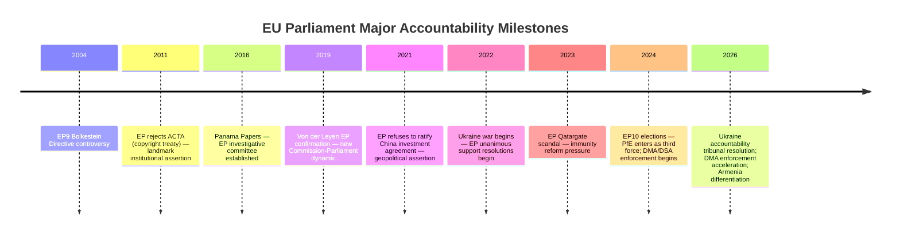

<!-- SPDX-FileCopyrightText: 2024-2026 Hack23 AB -->
<!-- SPDX-License-Identifier: Apache-2.0 -->

# Historical Baseline — EU Parliament Motions: 27 April–4 May 2026

**Classification:** PUBLIC | **Confidence:** 🟡 MEDIUM | **Date:** 2026-05-04

---

## Overview

Historical context analysis for the key themes in the April 28–30, 2026 EP motions. Establishes precedent and trajectory for current legislative actions.

---

## DMA Enforcement — Historical Context

### Precedent: EU Competition Law Enforcement Escalation

The EU has a consistent pattern of progressive enforcement escalation in competition/regulatory law. Historical parallels for the DMA enforcement motion:

**GDPR (2018–2020):** The General Data Protection Regulation was initially seen as likely to be weakly enforced. Meta was fined €1.2 billion in May 2023 — the largest GDPR fine to date. The trajectory from adoption (2018) to major fine (2023) was 5 years. The DMA was adopted in 2022; the EP is now (2026) pushing for structural remedies — the enforcement escalation curve is following the GDPR pattern with a shorter timeline.

**EU State Aid / Competition Enforcement (2004–2010):** The Commission's state aid and competition enforcement against Microsoft (2004 bundling case), Intel (2009 rebates case), and Google (2017–2019 shopping, Android, AdSense cases) established that major US tech firms are not immune to EU enforcement. Each enforcement cycle faced US resistance but ultimately resulted in compliance or structural change.

**Windows Media Player (2004):** The Commission ordered Microsoft to offer a version of Windows without Windows Media Player — a precedent for structural separation remedies in digital platforms. This established that EU competition law can require active unbundling. The DMA's Article 26 structural remedy power builds on this precedent.

**Key historical lesson:** EU tech regulation enforcement follows a consistent escalation pattern — threat → investigation → fine → structural demand. The timeline has compressed over successive generations (GDPR: 5-year lag; DMA: 4-year acceleration compared to GDPR).

---

## Ukraine Accountability — Historical Context

### Precedent: International Criminal Accountability Mechanisms

**Nuremberg (1945–1946):** The first international tribunal for crimes against peace (equivalent to crime of aggression) was established by the four Allied powers without requiring consent of the accused state (Germany). This is the closest historical parallel for what the EP is proposing for Russia.

**Rome Statute (1998) and ICC (2002):** The ICC was created through a multilateral treaty process. Russia is not an ICC state party (withdrew signature in 2016). This limitation means the ICC can arrest Putin only if he travels to a signatory state — hence the proposal for a specialized tribunal.

**Special Tribunal for Lebanon (2007):** Established via UN Security Council Resolution 1757 despite opposition from Lebanon's domestic government. The STL precedent demonstrates that the UN system can create accountability mechanisms even without universal state consent — though Russia's UNSC veto would block this path for a Russia tribunal.

**ICTY (1993) and ICTR (1994):** The Yugoslavia and Rwanda tribunals were established by UN Security Council resolutions under Chapter VII. Russia's presence on the UNSC effectively precludes this mechanism for a Russia tribunal — hence the "coalition of the willing" approach the EP is supporting.

**Key historical lesson:** International accountability mechanisms have been created in increasingly diverse ways (Treaty-based, UNSC Chapter VII, bilateral reinforced cooperation). The EP's support for a Special Tribunal reflects a sophisticated understanding of this historical precedent — a coalition of 40+ states can establish a tribunal without Russia's consent.

---

## MEP Immunity Waivers — Historical Baseline

### Frequency and Pattern in EP10

The April 2026 Jaki waiver is the second immunity waiver of the EP10 term (started 2024). The first was for Grzegorz Braun (ECR, Poland) in March 2026 — also involving a Polish MEP facing domestic criminal proceedings.

**Historical frequency:**
- EP8 (2014–2019): 12 immunity waiver requests; 9 granted, 3 rejected on fumus persecutionis grounds
- EP9 (2019–2024): 8 immunity waiver requests; 7 granted, 1 rejected
- EP10 (2024–present): 2 waivers in first 2 years of term — tracking toward EP8/EP9 frequency

**Pattern analysis:** Both EP10 waivers involve ECR members from Poland. This is consistent with the broader pattern of Polish judicial accountability proceedings targeting former PiS-era officials. As the Tusk government's accountability program continues, additional waiver requests from Polish courts are probable.

**Fumus persecutionis standard:** The PRIV Committee applies a high standard for finding bad-faith prosecution. In European case law, fumus persecutionis requires clear evidence that prosecution is politically motivated — not merely that the accused is a politician. The Jaki and Braun cases both failed this test.

---

## EU Budget Annual Cycle — Historical Pattern

**Timeline:**
- April–May: Parliament adopts budget guidelines
- May–June: Commission publishes draft budget
- July–October: Parliament and Council first readings
- November: Conciliation period
- December: Final adoption or provisional twelfths

**Historical budget outcomes in EP10 context:**
- Every EU annual budget since 1988 has been adopted before the end-year deadline (though some required last-minute conciliation in December)
- The Council-Parliament gap has typically been resolved with 60–70% of Parliament's headline increases and 90% of Council's structural priorities maintained
- Provisional twelfths have never been required in the post-Maastricht era — the institutional pressure to resolve is very strong

**2027 budget forecast:** The gap between EP guidelines (increase of €8–12B) and expected Council position (maintenance or modest increase) will likely be resolved in the December 2026 conciliation at approximately €4–6B net increase — with defense-security reallocation from cohesion funds being the main political concession.

---

## Armenia — EU Relations Historical Timeline

**2004:** Armenia joins ENP (European Neighbourhood Policy)
**2009:** Eastern Partnership launched — Armenia original member
**2020:** Nagorno-Karabakh war (44-day war); Azerbaijan recaptures disputed territories; Russia deploys peacekeepers
**2021:** EU-Armenia CEPA (Comprehensive and Enhanced Partnership Agreement) enters into force
**2023:** Azerbaijani military operation expels remaining Armenian population from Nagorno-Karabakh; over 100,000 Armenian refugees flee to Armenia proper
**2024:** Armenia formally suspends participation in CSTO (Collective Security Treaty Organisation) — Russia-led military alliance
**2024:** EP adopts first resolution explicitly supporting Armenia's EU integration path
**2025:** Armenia-EU high-level dialogue on Association Agreement framework launched
**2026 (April 28-30):** Third consecutive EP resolution supporting Armenia's democratic resilience and EU path

**Historical significance:** Armenia's trajectory from Eastern Partnership member to potential Association Agreement candidate in under 2 years is unprecedented in the ENP framework. The comparison to Georgia (which took 12+ years from ENP to Association Agreement) underscores how rapid Armenia's EU pivot has been.

---

## Historical Comparison Timeline

## Historical Precedent Assessment

The April 2026 session fits a pattern of EP institutional assertion that has been building since 2011 (ACTA). Each cycle, the EP uses resolutions to stake out positions that initially appear aspirational but gradually become institutionalized policy:

- 2011: ACTA rejection → normative foundation for digital rights advocacy
- 2021: China investment agreement rejection → precedent for EP geopolitical veto
- 2026: Ukraine accountability + DMA enforcement → EP as foreign policy and digital regulatory actor

**Historical trajectory: CONSISTENTLY TOWARD GREATER EP INSTITUTIONAL ASSERTION**

The April 2026 session is not unusual — it is part of a 15-year pattern of EP expanding its institutional footprint in areas where Treaty rights are ambiguous (CFSP consultation, enforcement oversight).

---

**Methodology:** Historical analysis per political science and international relations frameworks | EP Open Data Portal historical data | Academic sources on DMA, accountability mechanisms, EU budgetary history | Confidence: 🟡 MEDIUM (historical interpretation involves judgment)
