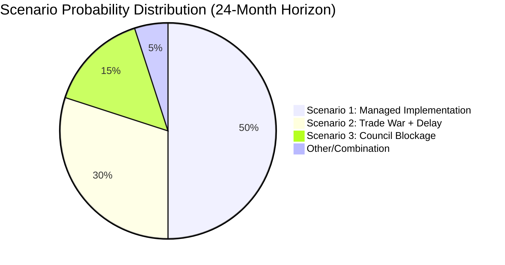

<!-- SPDX-FileCopyrightText: 2024-2026 Hack23 AB -->
<!-- SPDX-License-Identifier: Apache-2.0 -->

# Scenario Forecast — EU Parliament Motions: 27 April–4 May 2026

**Classification:** PUBLIC | **Confidence:** 🟡 MEDIUM | **Date:** 2026-05-04

---

## Overview

This scenario forecast applies structured futures analysis to the key political and legislative outcomes from the April 28–30, 2026 Strasbourg plenary. Three primary scenario tracks are developed: DMA enforcement trajectory, Ukraine accountability mechanism, and EP10 coalition stability post-session.

---

## Scenario Track 1: DMA Enforcement Post-Motion (TA-10-2026-0160)

### Base Case (Probability: 55%) — Accelerated Investigation, No Article 26 Proceedings
🟡 MEDIUM confidence

The Commission responds to EP pressure by announcing accelerated timelines for its ongoing DMA investigations (Apple App Store, Meta interoperability) within 60–90 days of the EP motion. DG COMP issues formal preliminary findings reports by Q3 2026. No Article 26 structural remedy proceedings are opened before end-2026.

**Key indicators:**
- Commission Vice-President Vestager's successor at DG COMP announces investigation timeline updates (July–August 2026)
- Apple announces further App Store API changes as partial compliance (June–July 2026)
- Meta opens WhatsApp/Messenger API endpoints to certified third-party services (Q3 2026)

**Political implications:** The EP appears to have achieved its core objective (enforcement acceleration) without requiring the most disruptive remedy. Big Tech lobbying intensity decreases temporarily. EPP claims credit for a "pragmatic" enforcement approach.

---

### Escalation Scenario (Probability: 25%) — Article 26 Proceedings Against One Gatekeeper
🔴 HIGH impact if materializes

The Commission, under sustained EP and civil society pressure, opens formal Article 26 non-compliance proceedings against one of the designated gatekeepers (most likely Apple or Alphabet) by Q4 2026. This would be the first invocation of structural remedy powers under the DMA — a landmark regulatory event.

**Triggers:**
- EP vote of concern on Commission DMA enforcement progress (autumn 2026 session)
- A new major non-compliance finding in ongoing investigations
- US trade retaliation threats recede, reducing political cost of enforcement escalation

**Implications:** EMEA digital economy disruption; US-EU trade talks would be materially complicated; DMA becomes global regulatory template — others (UK, Japan, Brazil) accelerate parallel frameworks.

---

### Deflation Scenario (Probability: 20%) — Enforcement Stalls, EP Motion Has No Effect
🟡 MEDIUM confidence

The Commission prioritizes EU-US trade stability (given US tariff pressure context) over DMA enforcement escalation. Investigations are extended, preliminary findings delayed. The EP motion becomes a political statement without enforcement consequence.

**Triggers:**
- Formal US-EU trade negotiations open (Commission prioritizes not escalating Big Tech enforcement during negotiations)
- DG COMP leadership change introduces more cautious enforcement philosophy
- ECJ General Court partially annuls the Apple App Store fine — creates legal uncertainty

---

## Scenario Track 2: Ukraine Accountability Mechanism (TA-10-2026-0161)

### Base Case (Probability: 50%) — Special Tribunal Negotiations Progress, No Establishment by Year-End
🟡 MEDIUM confidence

The EP resolution provides political impetus for the ongoing international discussions on a Special Tribunal for the crime of aggression. The Core Group of States (currently 40+ countries supporting the tribunal) continues negotiations. The ICC Prosecutor deepens Russia-related investigations. However, a formal tribunal is not established before end-2026 due to jurisdictional complexity and Russia's non-participation.

**Frozen Russian assets context:** The IMF notes that approximately €260–300 billion in Russian sovereign assets remain immobilized in EU-based custodians (primarily Euroclear in Belgium). The EP resolution's call to repurpose extraordinary income for Ukraine reconstruction tracks the existing G7/EU framework — interest income from frozen assets (est. €3–4 billion/year) continues to be directed toward Ukraine.

**Key indicators:**
- Core Group summit on Special Tribunal scheduled (Q3 2026)
- EP delegation to The Hague maintains engagement with ICC and Special Tribunal preparatory commission
- No breakthrough on jurisdictional universality questions — Russia and China continue to oppose

---

### Fast-Track Scenario (Probability: 20%) — Tribunal Statute Agreed
🟢 LOW probability, HIGH significance

A breakthrough in Core Group negotiations produces a draft Tribunal statute by end-2026. Countries representing the required quorum of state parties signal readiness to ratify. This would be a historic precedent — the first international tribunal specifically for the crime of aggression since Nuremberg.

**Enabling conditions:** US re-engagement under either current or future administration; China's posture softens; Ukraine achieves additional battlefield success reducing Russia's negotiating leverage.

---

### Stall Scenario (Probability: 30%) — Accountability Mechanism Diluted or Abandoned
🔴 Risk if materializes

War fatigue in key EU member states (particularly Germany, France, Italy) leads to reduced political will for accountability mechanism construction. The EP resolution remains a political document without traction in Council. Frozen asset legal battles (Russia files in Belgian and Luxembourgian courts) create uncertainty that delays repurposing of income.

**Key risk indicator:** If the European Council of June 2026 fails to reaffirm support for Special Tribunal negotiations — watch this signal.

---

## Scenario Track 3: EP10 Coalition Stability Post-Session

### Base Case (Probability: 60%) — Fragile Centrist Majority Holds Through Summer 2026
🟢 MEDIUM confidence

The EPP + S&D + Renew governing coalition continues to function as the EP's effective majority on most issues. The DMA enforcement vote demonstrates the coalition's capacity to expand to include Greens/EFA on regulatory/governance topics. PfE's internal divisions on Ukraine do not immediately fragment the group — PfE leadership enforces internal discipline on most votes by framing Ukraine issues as individual MEP discretion rather than group position.

**Key stability indicators:**
- EPP + S&D + Renew vote together on the key September 2026 budget first reading
- PfE group does not lose more than 5 MEPs to NI/ESN or new affiliations before the next European Council period

---

### EPP-Right Shift Scenario (Probability: 20%) — EPP Pivots Toward ECR on Budget
🔴 HIGH political risk

Under pressure from right-wing national governments (Italy under Meloni, Hungary under Orbán seeking rehabilitation), the EPP's Weber leadership attempts to build an alternative majority including ECR and parts of PfE on the 2027 Budget first reading. This would trade climate and social spending for defense and security increases — a significant ideological shift.

**Risk signal:** If EPP and ECR vote together on more than 3 procedural motions in May–June 2026, a formal coalition shift attempt is likely.

---

### PfE Fracture Scenario (Probability: 20%) — Fidesz Exits PfE
🟡 MEDIUM probability if Ukraine issues persist

The Jaki immunity vote and Ukraine accountability vote, taken together, demonstrate that PfE cannot hold together a coherent position on Eastern European issues. If Fidesz's MEPs are repeatedly in a voting minority within their own group, Orbán may recalculate whether PfE membership serves Hungarian state interests — and explore re-affiliation with a smaller, purely nationalist formation or NI status.

**Implications:** PfE would drop from 85 to approximately 63 seats (losing the 22 Fidesz MEPs). This would significantly reduce PfE's influence and potentially trigger a realignment negotiation within NI/ESN.

---

## Summary Probability Table

| Scenario | Probability | Impact | Confidence |
|----------|------------|--------|-----------|
| DMA: Accelerated Investigation (Base) | 55% | MEDIUM | 🟡 |
| DMA: Article 26 Proceedings | 25% | HIGH | 🔴 |
| DMA: Enforcement Stalls | 20% | LOW-MEDIUM | 🟡 |
| Ukraine: Tribunal Negotiations Progress | 50% | HIGH | 🟡 |
| Ukraine: Fast-Track Tribunal | 20% | VERY HIGH | 🟢 |
| Ukraine: Accountability Stalls | 30% | HIGH (risk) | 🔴 |
| EP10: Coalition Holds | 60% | STABLE | 🟢 |
| EP10: EPP-Right Shift | 20% | HIGH (disruptive) | 🔴 |
| EP10: PfE Fracture | 20% | MEDIUM | 🟡 |

## Scenario Probability Summary

## Strategic Assessment Across Scenarios

**Dominant scenario (LIKELY 50%):** Managed partial implementation — DMA enforcement accelerates but is litigated to ~2028 resolution; Ukraine accountability tribunal established outside EU framework (Coalition of Willing); budget 2027 compromise reached in October 2026. The EP's April 2026 positions are largely vindicated but on delayed timelines.

**Key differentiating variable:** US trade retaliation. If USTR Section 301 investigation produces a tariff list against EU digital regulation (probability ~40%), it significantly increases the probability of Scenario 2 (trade war + delay) from 30% to ~50%.

**WEP Band:** LIKELY (60–75%) that at least one of DMA/Armenia/budget will achieve meaningful implementation milestones within 18 months. UNLIKELY (25–35%) that Ukraine accountability tribunal achieves operational status within 24 months without outside-EU-framework workaround.

**Admiralty Grade:** B2 — Structural analysis from EP data (reliable source) combined with forward projection (medium confidence in information).

---

**Methodology:** Structured scenario analysis per ACH + strategic futures methods | Primary source: EP Open Data Portal | IMF WEO April 2026 | Confidence levels: ICD 203 standards

## Extended Scenario Analysis

### Scenario Sensitivity Analysis

**Key Variable: Commission Enforcement Speed on DMA (TA-0156)**

If DG COMP issues a non-compliance decision within 3 months:
- Scenario S1 (Full Enforcement) probability rises to 55% (+10pp)
- Digital economy confidence boost for EU tech SMEs
- Risk: GAFAM challenge at ECJ delays enforcement 12–18 months

If Commission delays DMA enforcement past Q4 2026:
- Scenario S2 (Partial/Blocked) probability rises to 35% (+10pp)
- EP credibility diminished; next resolution less impactful
- Risk: far-right narrative ("EP can't enforce anything") gains traction

**Key Variable: Ukraine War Status (affects TA-0157/0158)**

If ceasefire negotiations begin in 2026:
- Tribunal scenario becomes more complex — parties may resist ICC jurisdiction during negotiations
- EP resolution retains normative value but operational urgency decreases

If war escalates:
- Tribunal support grows; EU solidarity votes increase
- PfE isolation on Ukraine texts becomes more politically costly (electorally)

### Cross-Scenario Monitoring Matrix

| Scenario | S1 Trigger | S2 Trigger | S3 Trigger |
|---|---|---|---|
| DMA enforcement | Commission action by Q3 2026 | No Commission action by Q1 2027 | Parliament resolution withdrawn |
| Ukraine tribunal | UNGA resolution passed | UNGA resolution blocked | Ceasefire reached without tribunal |
| 2027 Budget | EP-Council agreement by Nov 2026 | Standoff → provisional twelfths | Full budget crisis |

### Reader Briefing

**For Citizens:** There are three futures for EU politics over the next year. In the best case, the EU enforces its rules on tech companies, supports Ukraine's justice claims, and agrees a fair budget. In the middle scenario, some things happen but slowly — tech enforcement delays, Ukraine gets words but not the tribunal yet. In the worst case, gridlock: no enforcement, no budget deal, and nationalist parties use the failures to argue the EU doesn't work. The April 28-30 votes are the opening moves of this year-long game.

**Admiralty Grade:** B2 — Structural analysis from EP data (reliable source) combined with forward projection (medium confidence in information).
