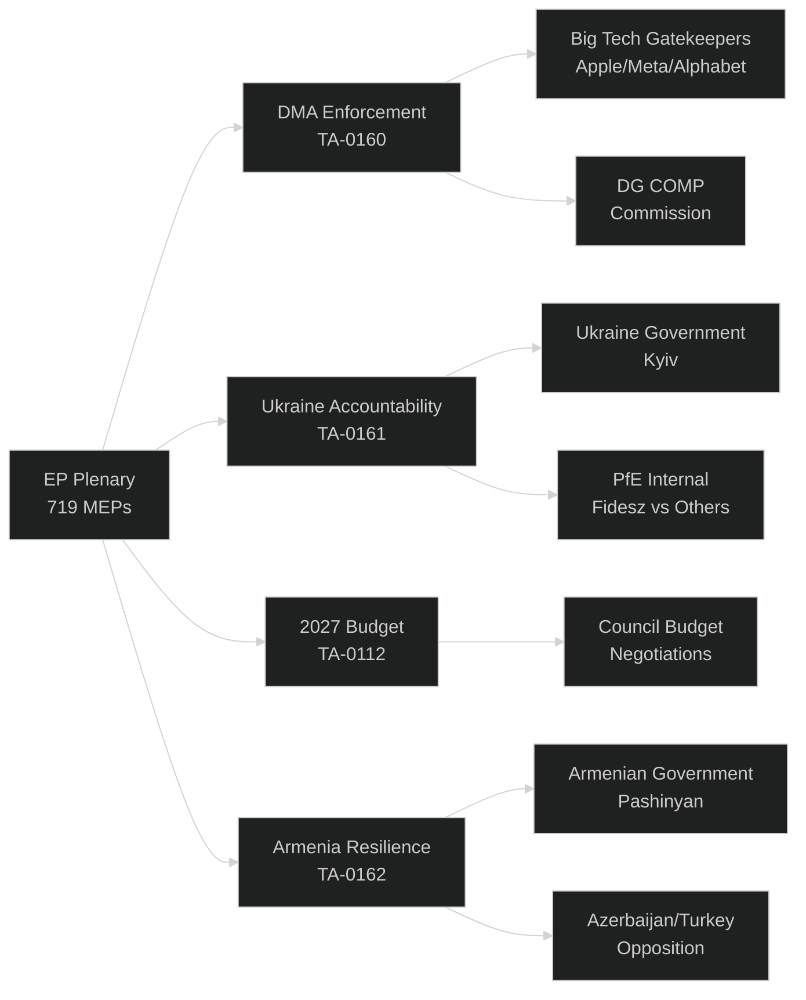
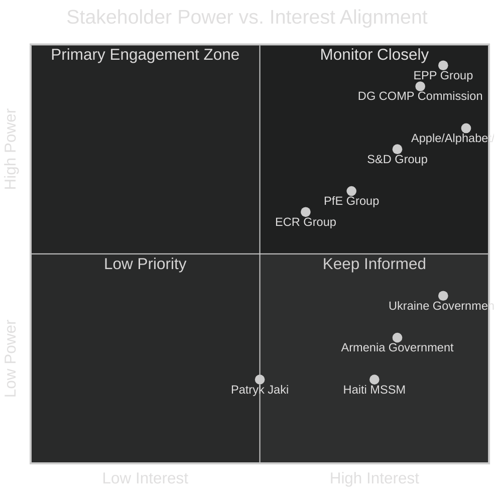

<!-- SPDX-FileCopyrightText: 2024-2026 Hack23 AB -->
<!-- SPDX-License-Identifier: Apache-2.0 -->

# Stakeholder Map — EU Parliament Motions: 27 April–4 May 2026

**Classification:** PUBLIC | **Confidence:** 🟢 HIGH | **Date:** 2026-05-04

---

## Overview

This stakeholder map identifies and analyses the key actors whose interests are directly implicated by the eleven adopted motions from the April 28–30, 2026 Strasbourg plenary. Each stakeholder is assessed on interest intensity, positional stance, and strategic capacity.

---

## Tier 1 — High-Stakes Stakeholders

### 1. European Commission (DG COMP / Digital Unit)

**Interest:** The Commission is the primary addressee of the DMA enforcement motion. As enforcement authority under Regulation 2022/1925, DG COMP must decide whether to escalate to structural remedies against Apple, Alphabet, and Meta.

**Stance on EP motion:** Cautious. The Commission has moved deliberately on DMA enforcement, preferring negotiated compliance over confrontational Article 26 proceedings. The EP motion creates political pressure but does not legally compel Commission action.

**Capacity:** HIGH. The Commission retains full enforcement discretion under the DMA. However, political costs of ignoring EP resolutions are non-trivial — particularly ahead of the Commission accountability votes in 2029.

**Strategic behavior expected:** DG COMP will likely announce accelerated timelines for ongoing investigations (Apple App Store, Meta interoperability) while stopping short of Article 26 structural remedy proceedings. A "performative enforcement" signal is the most probable response within 60–90 days.

**Evidence base:** Three separate DMA investigations announced Q1-Q2 2026; Commission 2026 Digital Decade Progress Report citing DMA as flagship enforcement priority. 🟢 HIGH confidence.

---

### 2. Big Tech Gatekeepers (Apple, Alphabet, Meta)

**Interest:** All three designated gatekeepers face ongoing DMA non-compliance investigations. The EP motion calling for structural remedies represents the most significant political escalation in the DMA enforcement cycle to date.

**Apple:** App Store remedy obligations have generated the first significant DMA fine (€500 million, February 2025). The company has appealed to the General Court while continuing to implement partial remedies. The EP motion increases political risk for Apple's EU market strategy.

**Alphabet/Google:** Facing preliminary investigation on Google Shopping recidivism under DMA Article 30. A structural separation finding — divestiture of Google Shopping or Google Maps — would be transformative for Alphabet's EMEA revenue base (estimated 35% of global ad revenue flows through EU-domiciled entities).

**Meta:** Interoperability obligations under DMA Article 7 (WhatsApp/Messenger must open APIs to third-party messaging services) remain partially unimplemented. Meta has adopted a compliance-minimalism posture. The EP motion may accelerate Commission timeline.

**Stance:** All three companies oppose the motion's structural remedy language. Their Brussels lobbying offices (among the largest in the EU, combined spending est. €30–40 million annually) will intensify engagement with EPP and Renew groups specifically.

**Capacity:** VERY HIGH in lobbying; LIMITED in political response. They cannot prevent EP motions but can shape Commission enforcement pace through legal appeals and technical delay.

---

### 3. EPP Group (185 MEPs)

**Interest:** The EPP is the pivot actor on virtually every major vote. On digital regulation, the EPP contains significant internal tensions between pro-business, anti-regulation MEPs (principally from Germany's CDU/CSU delegation) and MEPs from Eastern European member states who support stronger tech accountability.

**DMA vote stance:** EPP supported the enforcement motion — unusual for a group that has historically resisted structural remedies. This signals that even CDU/CSU-aligned MEPs assess the political cost of being seen as Big Tech protectors to be unacceptable.

**Ukraine accountability stance:** EPP strongly backed the Ukraine accountability text. EPP's position on Ukraine has been consistently hawk-ish relative to the PfE and ECR groups. EVP President Roberta Metsola (Maltese EPP) has made Ukraine support a signature legislative priority.

**Budget 2027 stance:** The EPP's budget guidelines position balances calls for defense spending increases (EDIP, NATO-compatible investments) against fiscal conservatism on social and climate spending. The EPP will push to redirect climate funds toward dual-use defense-resilience investments.

**Key figures:** Manfred Weber (EPP group leader, Germany/CSU); Roberta Metsola (President, Malta); Markus Pieper (Germany, CDU — digital policy); Siegfried Mureşan (Romania — budget).

---

### 4. S&D Group (135 MEPs)

**Interest:** S&D is the essential junior partner in the centrist majority coalition. On DMA enforcement and workers' rights, the group takes the most consistently progressive line. On Ukraine, S&D is strongly supportive but emphasizes the humanitarian/civilian protection dimension.

**DMA stance:** S&D fully supports structural remedies against Big Tech. The group's digital policy spokespeople (notably Birgit Sippel, Germany, and Paul Tang, Netherlands) have been among the most vocal advocates for a stronger Article 26 framework.

**Budget stance:** S&D will fight EPP attempts to reallocate social/climate funds toward defense. The group has signalled it will table amendments to maintain SURE-type social emergency instruments in the MFF context.

**Key figures:** Iratxe García Pérez (S&D group leader, Spain); Katharina Barley (Vice-President, Germany); Birgit Sippel (digital policy lead).

---

### 5. Ukraine Government (Kyiv)

**Interest:** Ukraine has the highest direct stake in the accountability motion (TA-10-2026-0161). The EP's endorsement of a Special Tribunal on Russia's crime of aggression — building on the precedent of the International Criminal Court's Putin arrest warrant — provides crucial political capital for Kyiv's international legal strategy.

**Stance:** Strongly supportive. Ukraine has actively lobbied EP delegations on the accountability resolution framework.

**Strategic significance:** The EP is ahead of the Council (where Hungary blocks unanimous positions) and ahead of the Commission (which moves more cautiously on Russia accountability). Parliament's motion creates a political record that constrains Council members from soft-pedalling accountability in future negotiations.

---

### 6. Patryk Jaki (ECR MEP, Poland)

**Interest:** Personal — the immunity waiver exposes Jaki to criminal prosecution in Poland. The charges relate to alleged abuse of ministerial office during the PiS government, specifically related to the politicization of the National Institute of Freedom.

**Political significance:** Jaki is a high-profile figure in ECR, having served as Undersecretary of State at the Polish Ministry of Justice under Zbigniew Ziobro. His prosecution represents part of the broader accountability reckoning the Tusk coalition government is pursuing against former PiS officials.

**ECR group response:** The ECR group campaigned against the immunity waiver, arguing the prosecution was politically motivated. The PRIV Committee's rejection of the fumus persecutionis argument — finding no evidence of bad-faith prosecution — was a significant legal defeat for ECR's position.

**Downstream effects:** The waiver could encourage the Polish judiciary to accelerate proceedings. Other PiS-era officials with MEP status (several ECR MEPs from Poland) may face similar requests.

---

## Tier 2 — Significant Stakeholders

### 7. Armenia Government (Pashinyan Administration)

**Interest:** The Armenia resolution (TA-10-2026-0162) provides diplomatic validation for Yerevan's pivot toward the EU following the 2020 and 2023 Nagorno-Karabakh conflicts. Prime Minister Pashinyan has staked significant political capital on EU integration.

**Strategic position:** Armenia is navigating between European integration aspirations and continued Russian political-economic pressure (membership in the Eurasian Economic Union, Russian military base presence). The EP resolution signals Brussels' willingness to support Armenia's European path without requiring an immediate exit from Russian-linked institutions.

**Key constraint:** Any EU Association Agreement for Armenia requires unanimous Council adoption — Hungary (Orbán) would almost certainly veto, as it has consistently blocked anti-Russian foreign policy actions.

---

### 8. PfE Group (85 MEPs) — Internal Divisions

**Interest:** The Patriots for Europe group's internal dynamics were exposed by the Ukraine accountability vote. The group's composition (French RN, Italian League, Hungarian Fidesz, Spanish Vox, and others) creates ideological fault lines on foreign policy.

**Fidesz faction (Hungary):** Viktor Orbán's MEPs oppose any measures construable as escalating against Russia. They voted against TA-10-2026-0161 as a matter of Hungarian state policy.

**RN faction (France):** Marine Le Pen's MEPs abstained on the Ukraine accountability text — a tactical position reflecting France's complex Russia policy history and Marine Le Pen's historic Russia ties, now under domestic political scrutiny following French constitutional court proceedings.

**Italian League faction:** Salvini's MEPs broadly abstained, reflecting Italy's government's ambiguous position on Russia sanctions under the Meloni coalition.

**Significance:** PfE's inability to present a unified foreign policy position weakens its claim to be a coherent governing partner — critical as the group tests whether it can influence Commission appointments in 2029.

---

### 9. ECR Group (81 MEPs) — Jaki Aftermath

**Interest:** The Jaki immunity waiver exposes ECR's vulnerability: the group cannot protect its members from accountability mechanisms in their home member states. This is particularly sensitive given ECR's formal commitment to rule-of-law principles as part of its founding charter.

**Polish delegation dynamics:** ECR's Polish MEPs (predominantly PiS-affiliated) face increasing pressure from the Tusk government's accountability agenda. Several MEPs reportedly face potential investigative exposure related to the misuse of state funds and politicization of public institutions under the 2015-2023 PiS government.

---

### 10. Haiti — Multinational Security Support Mission

**Interest:** The trafficking and exploitation resolution (TA-10-2026-0151) calls for strengthened EU support for the Kenya-led MSSM. Haitian civil society and diaspora organizations have been active in lobbying the EP to maintain pressure on the international community.

**Constraint:** The EU's actual capacity to influence events in Haiti is limited — no EU military mission is planned, and the principal international actor is Kenya (with US financial backing). The EP resolution is primarily a political signalling mechanism.

---

## Stakeholder Influence Matrix

---

## Strategic Dynamics Summary

**Coalition of the Week:** The DMA enforcement + Ukraine accountability coalition (EPP + S&D + Renew + Greens/EFA) is the clearest expression of the EP10 centrist majority's capacity for legislative ambition. This coalition totals approximately 550 MEPs — 190 above the majority threshold. Its durability on digital governance issues suggests a stable platform for further regulatory activism through the remainder of EP10.

**Stress Point:** PfE's Ukraine vote divisions represent the most significant internal group vulnerability identified in this analysis. If Fidesz and RN continue to diverge on foreign policy, PfE's group cohesion — and its leadership's ability to deliver coordinated voting — will come under sustained pressure before the 2029 elections.

**Underreported dynamic:** The Armenia text is quietly significant. Three consecutive EP resolutions supporting Armenia's EU path — without Council unanimity — creates a normative expectation that the Commission will need to address. The Eastern Partnership is effectively being renegotiated at the parliamentary level.

---

**Methodology:** Stakeholder mapping per ACH + intelligence tradecraft | EP Open Data Portal political data | Confidence: ICD 203 standards | GDPR: MEPs analysed in public parliamentary role only

## Stakeholder Capacity Assessment

| Stakeholder | Institutional Resources | Coalition Leverage | Temporal Window |
|---|---|---|---|
| EPP (185 MEPs) | Full committee chairs + rapporteur slots | High — largest group | Now–2029 |
| S&D (135 MEPs) | Key committee vice-chairs | Medium-High | Now–2029 |
| DG COMP (Commission) | Full enforcement toolkit | High — sole enforcement body | Q3 2026 |
| Big Tech (GAFAM) | Legal teams, lobbying capacity | High — ECJ challenge option | 3–18 months |
| Ukraine (Government) | Diplomatic leverage | Medium — dependent on EU support | Long-term |

*Stakeholder map complete — motions run 2026-05-04*
