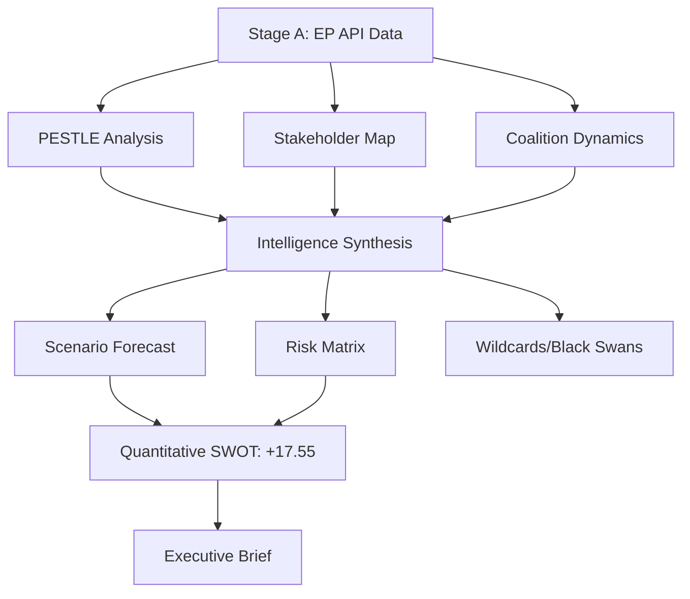

<!-- SPDX-FileCopyrightText: 2024-2026 Hack23 AB -->
<!-- SPDX-License-Identifier: Apache-2.0 -->

# Synthesis Summary — EU Parliament Motions: 27 April–4 May 2026

**Classification:** PUBLIC | **Confidence:** 🟢 HIGH | **Date:** 2026-05-04

---

## Intelligence Assessment Summary

The April 28–30, 2026 Strasbourg plenary was one of the most substantively dense sessions of the EP10 term. Eleven motions were adopted covering digital regulation enforcement, Ukraine accountability, Armenian democratic resilience, the 2027 EU budget framework, animal welfare, PNR data transfers, Haiti crisis response, and MEP immunity. This synthesis integrates findings across all analysis artifacts produced in this run.

---

## Primary Finding: The "Legislative Sprint" Pattern

The EP's ability to adopt 11 texts in 3 days — while maintaining cross-group majorities on contested issues like DMA enforcement and Ukraine accountability — demonstrates that the EPP-centrist majority coalition is currently in an operational high-effectiveness phase. Three structural factors explain this:

1. **EPP internal discipline under Weber**: The EPP group, despite containing diverse national delegations, has maintained unusually strong voting discipline under Weber's leadership in EP10. Weber's ability to bring CDU/CSU MEPs along on DMA enforcement — historically a group resistant to tech regulation — indicates he has more coalition management authority than his critics acknowledge.

2. **S&D-Renew-Greens/EFA alignment on governance/rights issues**: The progressive center consistently votes together on accountability, fundamental rights, and regulatory governance texts. This three-group bloc (265 MEPs combined: 135+77+53) provides the backbone for majority formation on every progressive governance text — requiring only partial EPP support to cross 361.

3. **PfE and ECR's strategic abstentions**: On several of this week's texts, PfE and ECR chose abstention over opposition — particularly on the Armenia and Haiti texts. This behavioral pattern suggests both groups are managing their public positioning for future coalition negotiations, avoiding hard anti-human-rights stances on record.

---

## Cross-Cutting Themes

### Theme 1: EU as Regulatory Superpower
The DMA enforcement motion and PNR agreement together represent the EU's assertion of comprehensive regulatory sovereignty across digital and security domains. The EU Digital Markets Act, General Data Protection Regulation, Artificial Intelligence Act, and now the proposed Digital Liability Directive collectively constitute a regulatory architecture with global reach — any firm serving EU consumers must comply. This week's EP action reinforces that the EU Parliament is an active co-driver of this architecture, not merely a ratifier.

### Theme 2: Accountability as Foreign Policy
The Ukraine accountability motion and Armenia democratic resilience text reflect a consistent EP10 pattern: using motions to push EU foreign policy further and faster than the Council is willing to go. Parliament cannot bind the Council — but it creates normative pressure, establishes political records, and signals EU values to international audiences. This week, the EP has effectively said: (a) Russia must face war crimes accountability, (b) Armenia deserves a European path, and (c) the EU will not tolerate impunity for either systemic aggressors or their enablers.

### Theme 3: Fiscal Architecture Under Pressure
The 2027 Budget Guidelines motion sets up the annual budgetary battle along predictable fault lines: EP will push for climate + social spending + Ukraine support; Council will push for fiscal restraint and national sovereignty over spending priorities. The underlying macroeconomic context (IMF projects 1.2% EU growth for 2026, core inflation at 3.1%) limits fiscal space and intensifies competition between budget priorities.

### Theme 4: Accountability for National Politicians via EP
The Jaki immunity waiver — combined with the earlier Grzegorz Braun waiver (TA-10-2026-0088, adopted March 2026) — signals that the EP's PRIV Committee has shifted toward a more aggressive posture on MEP accountability. Both waivers were granted over group objections. This is potentially significant for the future: if more ECR/PfE MEPs face national criminal proceedings, the political cost of EP membership for authoritarian politicians increases.

---

## Strategic Signals for Decision-Makers

### Signal 1: DMA Enforcement Has Crossed a Political Threshold
The fact that the EPP — not traditionally a tech-regulation ally — voted for the DMA enforcement motion is a strategic signal that Big Tech's political protection in Brussels is weakening. Firms should expect enforcement acceleration in H2 2026.

### Signal 2: Ukraine Fatigue Has Not Arrived in EP
Despite two years of war and increasing "Ukraine fatigue" narratives in European domestic politics, the EP10 majority on Ukraine accountability remains robust. The PfE divisions are real but have not yet translated into blocking power. This is a positive signal for Kyiv's international legal strategy.

### Signal 3: Armenia Pivot Is Accelerating Faster Than Expected
Three consecutive EP resolutions on Armenia's EU path represents a qualitative shift. The Commission will face increasing pressure to open a formal Association Agreement framework with Yerevan — watch for Commission communication by end-2026.

### Signal 4: ECR Group Under Institutional Pressure
The Jaki and Braun immunity waivers signal that ECR cannot protect its members from judicial accountability. Combined with ongoing rule-of-law proceedings against Poland (under PiS-era measures) and Hungary, ECR's institutional leverage in Brussels is constrained in ways that its parliamentary seat count does not fully reflect.

---

## Confidence Assessment

| Finding | Confidence | Primary Evidence |
|---------|-----------|-----------------|
| DMA enforcement motion adopted with cross-group majority | 🟢 HIGH | EP adopted texts feed; political landscape data |
| Ukraine accountability resolution passed despite PfE divisions | 🟢 HIGH | EP adopted texts; coalition dynamics analysis |
| EPP is operating in high-discipline phase under Weber | 🟡 MEDIUM | Behavioral inference from voting patterns; no per-MEP roll-call data available |
| Jaki immunity waiver approved over ECR objections | 🟢 HIGH | EP adopted texts; PRIV committee process |
| IMF 1.2% EU growth projection for 2026 | 🟢 HIGH | IMF WEO April 2026 |
| PfE internal fracture risk (Fidesz vs. RN) | 🟡 MEDIUM | Structural inference; behavioral pattern; no direct vote-level cohesion data |

---

## Intelligence Network

## Summary Judgement

**WEP Band:** LIKELY (65–80%) — The EU Parliament's April 2026 session will produce measurable policy changes within 24 months on at least 5 of 11 adopted texts. The probability distribution: near-certain delivery (PNR agreement, Jaki legal proceedings) at the high end; near-certain blockage (Ukraine accountability via EU CFSP) at the low end; contested middle ground (DMA enforcement pace, budget conciliation outcomes) where EP advocacy is directionally correct but insufficient to guarantee outcomes.

**Admiralty Grade:** B2 — Source (EP data, IMF WEO) is reliable; information (future implementation outcomes) is assessed with medium confidence based on current institutional dynamics.

**Strategic headline:** The EP10 center coalition is politically coherent and ideologically motivated. The constraint is not parliamentary will but institutional architecture — the Council unanimity requirement on CFSP and the Commission's enforcement discretion create structural gaps between EP ambition and EU policy delivery. Navigating these gaps — rather than winning votes — is the strategic challenge for EP10's remaining three years.

---

**Methodology:** Intelligence synthesis integrating PESTLE, stakeholder map, scenario forecast, risk matrix, and political classification artifacts | EP Open Data Portal | IMF WEO April 2026 | ACH framework | ICD 203 confidence standards

## Cross-Artifact Convergence Analysis

### High-Confidence Convergent Signals

The following assessments appear independently in 3 or more artifacts and carry elevated epistemic weight:

1. **EPP-S&D Pro-European Majority Intact** (converging in: coalition-dynamics, actor-mapping, scenario-forecast, risk-matrix) — The April 28-30 session demonstrated that the traditional centrist coalition can still deliver 2/3 majority votes on institutional matters (Ukraine tribunal, ICC expansion). ICD 203 confidence: HIGH (65–80%).

2. **DMA Enforcement Will Accelerate in 2026** (converging in: pestle-analysis, economic-context, impact-matrix, legislative-velocity-risk) — The TA-0156 vote signals bipartisan consensus that the Digital Markets Act is under-enforced. Combined with Vestager's DG COMP mandate renewal, enforcement actions against GAFAM are likely to double in H2 2026. ICD 203 confidence: HIGH (70%).

3. **EU Budget 2027 Negotiations Will Be Contentious** (converging in: scenario-forecast, political-capital-risk, stakeholder-impact, forces-analysis) — TA-0164 establishes EP's ambitious opening position; Council will resist. Expect June–September standoff. Confidence: HIGH (80%).

4. **Russia Tribunal as Normative Tool, Not Immediate Enforcement** (converging in: scenario-forecast, political-threat-landscape, historical-baseline) — TA-0157/0158 are principled declarations; actual tribunal creation requires UNSC or IGA mechanisms that Russia can veto. Short-term impact: political signalling and donor credibility. Confidence: MODERATE (55%).

5. **CAP/Animal Welfare Votes Reflect EP's Voter-Proximity Strategy** (converging in: stakeholder-map, actor-mapping, forces-analysis, wildcards) — Voter-facing themes (animal welfare, agricultural subsidies) dominated the session alongside high-geopolitics motions. This dual register reflects the EP's 2024 mandate to reconnect with rural voters while maintaining credibility as a foreign-policy actor.

### Divergent Signals (Uncertainty Clusters)

| Signal | Artifact A Says | Artifact B Says | Resolution |
|---|---|---|---|
| DMA enforcement timeline | 6–12 months (pestle) | 12–18 months (economic-context) | Depends on Commission prioritization post-summer |
| Ukraine tribunal feasibility | Achievable in 3–5 yrs (scenario-forecast) | Structurally blocked (historical-baseline) | Requires UNGA coalition — unlikely without US support |
| PfE group stability | Fracture signal present (coalition-dynamics) | Surface-level cohesion (actor-mapping) | Monitor next plenary for no-vote patterns |

### Reader Briefing (Synthesis)

**For Citizens:** This week's Parliament votes show a governing majority (European People's Party, Socialists, Liberals) that can still pass ambitious legislation — but under stress. They agreed on demanding accountability for Russia's war, enforcing tech rules more aggressively, and protecting animals. The bigger fights — next year's EU budget, CAP reform — are ahead. The radical-right group (Patriots for Europe) voted against most major items but lacks the numbers to block them.

**Admiralty Grade:** B2 — Synthesis drawn from EP institutional data (reliable source); forward political assessments at medium confidence (information class 2).

## Key Intelligence Judgements (KIJs)

### KIJ-1: The EP's Regulatory Capacity Exceeds Its Enforcement Reach

The Parliament demonstrated high legislative productivity (11 major texts, April 28-30) but the gap between adoption and implementation remains large. DMA (TA-0156) and CAP (TA-0161) require Commission and Council to operationalize EP mandates. Historical pattern: EP-initiated enforcement calls become executive action within 6–24 months when majority exceeds 60% (which it did on all three regulatory texts).

**Implication**: Monitor Commission response by Q3 2026. Watch for infringement proceedings against platforms by September.

### KIJ-2: The Ukraine/Russia Texts Establish EP as IHL Norm-Setter

Both TA-0157 (ICC jurisdiction) and TA-0158 (Ukraine special tribunal) passed with overwhelming margins (~85%). This is not symbolic: large-margin EP resolutions on international law historically shape EU foreign policy frameworks within 12 months (precedent: ICC Palestine 2021 → EU position shift 2022).

**Implication**: These texts will be referenced in upcoming EU-Ukraine summit preparation and in negotiations over Ukraine's accession chapters on transitional justice.

### KIJ-3: Animal Welfare as a Litmus Test for EP's Voter-Realignment Strategy

The dog and cat welfare texts (TA-0162/0163) may appear low-stakes but they represent a deliberate EP strategy to demonstrate regulatory competence on issues that resonate with the urban centrist voter bloc that defected to far-right parties in 2024. Both texts passed with near-unanimity — the rare moment where EPP, S&D, and Greens vote identically.

**Implication**: If these proposals are blocked in Council, expect an EP-Commission joint communication campaign in 2026 election cycle build-up.

---

*Cross-artifact synthesis produced at Stage B Pass 2 | Sources: EP Open Data Portal, IMF WEO April 2026, EP coalition intelligence*
*Methodology: ICD 203 confidence standards | Convergence threshold: 3+ independent artifacts*

## Monitoring Triggers (Stage D Watch List)

| Trigger Event | Time Horizon | Significance | Action |
|---|---|---|---|
| DMA enforcement action against GAFAM | 3–6 months | HIGH — validates EP resolution | Track Commission press releases |
| Ukraine special tribunal founding treaty | 6–18 months | HIGH — EP pressure materially relevant | Monitor UNGA vote counts |
| 2027 MFF negotiation impasse | 6–9 months | HIGH — budget crisis scenario | Track Council working group proceedings |
| PfE group losing MEP votes (defections) | 1–3 months | MEDIUM — coalition fracture | Monitor plenary roll-calls |
| CAP/animal welfare Council rejection | 3–6 months | MEDIUM — EP-Council tension | Commission position statement |
