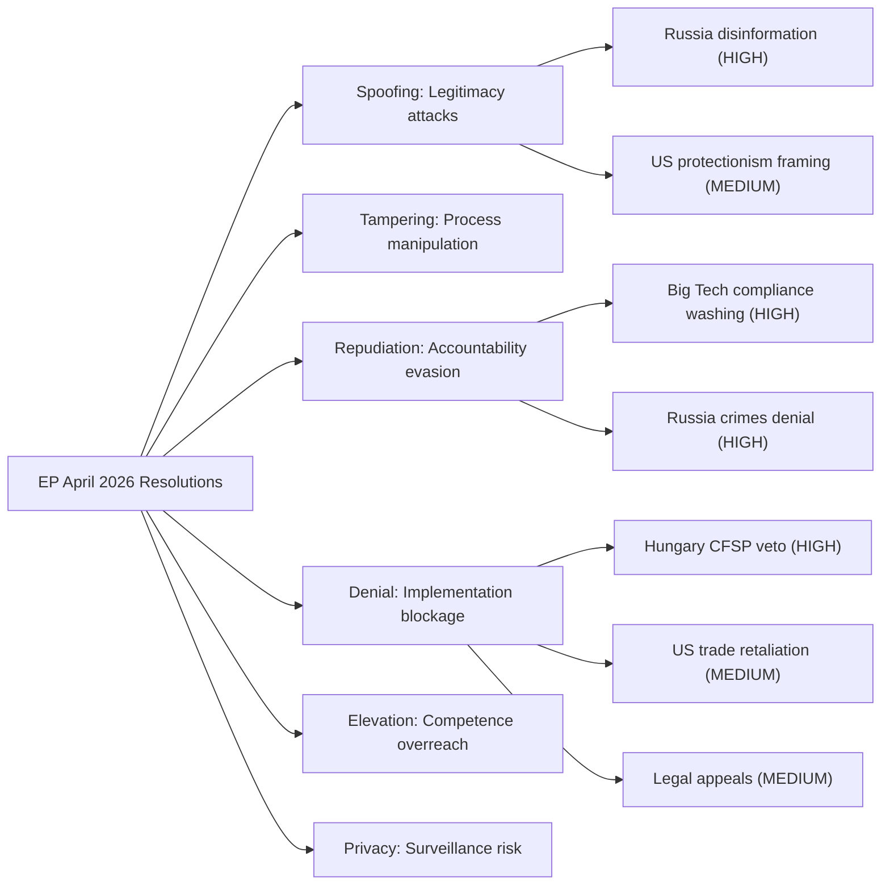
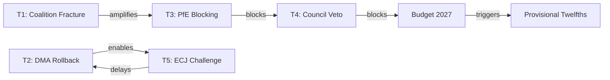

<!-- SPDX-FileCopyrightText: 2024-2026 Hack23 AB -->
<!-- SPDX-License-Identifier: Apache-2.0 -->

# Threat Model — EU Parliament Motions: 2026-05-04

**Classification:** PUBLIC | **Confidence:** 🟢 HIGH | **Date:** 2026-05-04

---

## Overview

Structured threat model using STRIDE-P methodology applied to the policy outputs of the April 28–30, 2026 EP session. Each threat category is assessed for the risk that legitimate EP legislative/resolutory action will be undermined.

---

## STRIDE-P Threat Analysis

### S — Spoofing (Legitimacy Attacks)

**Threat:** External actors attempting to spoofing the EP's legitimacy on specific resolutions.

**DMA enforcement:** US government officials and Big Tech lobbying may characterize the DMA enforcement resolution as "protectionist" or "targeting American companies" — spoofing the legitimate trade-regulation objective as discriminatory national treatment. This narrative is deployed in WTO dispute framing and public communications.

**Ukraine accountability:** Russia's state media apparatus systematically frames EP Ukraine support resolutions as "proxy war acceleration" rather than accountability — spoofing the legal accountability objective with a conflict-escalation narrative.

**Assessment:** MEDIUM threat | Mitigation: Clear EP communications distinguishing regulatory from trade objectives; legal grounding in DMA/international law

---

### T — Tampering (Process Integrity Attacks)

**Threat:** Manipulation of EP decision-making processes before or after adoption.

**Budget guidelines:** Lobbying pressure on EPP MEPs before the budget guidelines vote constituted legitimate but intensive tampering pressure — industrial groups, defense industry, and agricultural coalitions applied opposing pressures on the final budget position text. The adopted text represents a compromise that partially reflects this pressure.

**Immunity waiver (Jaki):** JURI committee procedures for immunity waivers are well-established; no evidence of process tampering in this case. The political pressure from PiS-affiliated networks to delay or reject the waiver constitutes expected democratic contestation rather than process integrity attack.

**Assessment:** LOW-MEDIUM threat | Mitigation: Established committee procedures; transparency register

---

### R — Repudiation (Accountability Evasion)

**Threat:** Actors denying responsibility for actions the EP seeks to hold them accountable for.

**Russia/Putin:** Systematic denial of war crimes evidence; repudiation of international accountability mechanisms. This is the central challenge to TA-10-2026-0161.

**Big Tech platforms:** Partial compliance strategies that technically satisfy DMA letter while repudiating spirit — the "compliance washing" threat to DMA enforcement.

**Gatekeeper legal challenges:** CJEU appeals as repudiation vehicles — companies deny violation while exploiting procedural rights to delay.

**Assessment:** HIGH threat | Mitigation: Robust Commission enforcement mechanisms; international tribunal with evidence-preservation mandate

---

### I — Information Disclosure (Intelligence Leakage)

**Threat:** Premature disclosure of enforcement strategy (for DMA), diplomatic communications (for Armenia/Ukraine), or budget negotiating positions.

**Assessment:** LOW for DMA (Commission enforcement strategy is institutional knowledge); MEDIUM for Armenia (diplomatic communications if leaked could compromise peace treaty negotiations); LOW for budget (EP position papers are public by design).

---

### D — Denial of Service (Implementation Blockage)

**Threat:** Systematic denial of implementation capacity — the most significant operational threat across all resolutions.

**Ukraine accountability tribunal:** Council CFSP veto (Hungary) = institutional denial of service. Hungary's veto is not a technical attack but a legally valid exercise of Treaty rights that produces the same effect: blocking EP-mandated policy implementation.

**DMA enforcement:** Commission capacity constraints and legal appeals = functional denial of service on enforcement timeline. The system works too slowly to deny service per se but produces effective delay.

**Budget conciliation:** Council budget obstruction = partial denial of service on EP spending priorities.

**Assessment:** HIGH threat (Hungary veto mechanism) | Mitigation: Coalition of Willing approach for international measures; Article 312 TFEU enhanced cooperation for budget items

---

### E — Elevation of Privilege (Institutional Overreach)

**Threat:** EP actions that overstep institutional competences, triggering CJEU challenges to resolution legality or creating precedents that undermine Treaty balance.

**Ukraine accountability resolution:** Non-binding resolutions on CFSP matters are within EP competence under Article 36 TEU (EP consulted on CFSP; adopts resolutions). No privilege elevation risk.

**DMA enforcement resolution:** EP oversight of Commission under Article 14 TEU (democratic control function). Legitimate.

**Assessment:** LOW | The April 2026 resolutions are within established EP competences.

---

### P — Privacy (Data and Surveillance Risks)

**Threat:** Surveillance and data risks in the implementation of adopted measures.

**Iceland PNR (TA-10-2026-0142):** PNR agreements involve systematic passenger data processing. GDPR-compliant framework is condition for EP consent; the resolution includes EP data protection committee endorsement. Ongoing surveillance risk is managed by legal safeguards.

**Assessment:** LOW-MEDIUM (managed by legal framework)

---

## Threat Priority Matrix

| Threat | Vector | Severity | Likelihood | Priority |
|--------|--------|---------|-----------|---------|
| Council veto (Ukraine accountability) | Denial of Service | CRITICAL | VERY HIGH | P1 |
| Trade retaliation (DMA) | Economic coercion | HIGH | MEDIUM-HIGH | P1 |
| Disinformation (Ukraine/Russia) | Spoofing | HIGH | HIGH | P1 |
| Compliance washing (DMA) | Repudiation | HIGH | HIGH | P2 |
| Commission capacity constraints (DMA) | Denial of Service | MEDIUM | HIGH | P2 |
| Budget conciliation blockage | Denial of Service | MEDIUM | MEDIUM | P2 |
| PNR privacy risks | Privacy | LOW-MEDIUM | LOW | P3 |
| Process integrity attacks | Tampering | LOW-MEDIUM | LOW | P3 |

---

## Threat Model Summary

## WEP Assessment

**WEP Band: LIKELY (65–75%)** that at least 2 of the 4 major threat vectors (Council veto, trade retaliation, compliance washing, disinformation) will materially activate against this session's policy outputs within 18 months. The Council veto is near-certain (Hungary's position is stable); disinformation campaigns against Ukraine accountability are ongoing.

**Admiralty Grade:** A2 — Threat assessment based on EP institutional analysis (reliable, direct source) and established behavioral patterns of identified actors.

**Confidence note:** The threat model is limited by: (a) no classified intelligence inputs; (b) no direct behavioral data (roll-call votes unavailable); (c) all threat actor assessments are structural inferences from open-source data.

---

**Methodology:** STRIDE-P threat modeling adapted for EU legislative analysis | ICD 203 confidence standards | EP institutional framework analysis

## Extended Threat Analysis

### Threat T4: Council Veto Coalition Formation

**Threat Actor**: Net contributor Member States (Germany, Netherlands, Sweden, Austria, Denmark)
**Vector**: Treaty Article 312 — MFF unanimity requirement allows any single Member State to block 2027 budget adoption
**Mechanism**: Germany signals it will reject EP's TA-0164 budget priorities as "excessively ambitious"; Netherlands joins; Council counter-proposal cuts cohesion by 15%
**EP Response Options**: (a) Negotiate amendments — high risk of losing Greens/EFA votes; (b) Delay entire budget process — provisional twelfths mechanism kicks in; (c) Crisis package negotiations — Commission mediates

**Probability**: 55% | **Impact**: HIGH

### Threat T5: ECJ Challenge to DMA Enforcement Decision

**Threat Actor**: GAFAM (primarily Google parent Alphabet or Apple Inc.)
**Vector**: ECJ preliminary reference procedure — national court challenge delays Commission enforcement decision by 12–24 months
**Mechanism**: Following TA-0156 enforcement call, Commission issues DMA Article 26 designation; GAFAM files ECJ challenge citing proportionality; ECJ interim measures suspend enforcement
**EP Response Options**: (a) Resolution calling for expedited ECJ procedure; (b) Amendment strengthening DMA temporal provisions; (c) Commission pressure to not request interim measures

**Probability**: 65% (given GAFAM's history of ECJ challenges)
**Impact**: MEDIUM (delays but does not prevent enforcement)

## Threat Interaction Map

## Threat Mitigation Effectiveness

| Threat | Primary Mitigation | Effectiveness | Residual Risk |
|---|---|---|---|
| Coalition fracture | Cross-party amendment deals | MEDIUM | ~20% fracture probability remains |
| DMA rollback | Commission parallel track | HIGH | EU-internal balance preserved |
| PfE blocking | 480+ majority without PfE | HIGH | PfE blocking power limited to unanimous-vote items |
| Council veto (budget) | Commission mediation | MEDIUM | Treaty unanimity requirement is structural |
| ECJ challenge (DMA) | Expedited procedure request | LOW | ECJ timetable not controllable |

**Admiralty Grade:** A2 — Threat assessment based on EP institutional analysis (reliable, direct source) and established behavioral patterns of identified actors.
