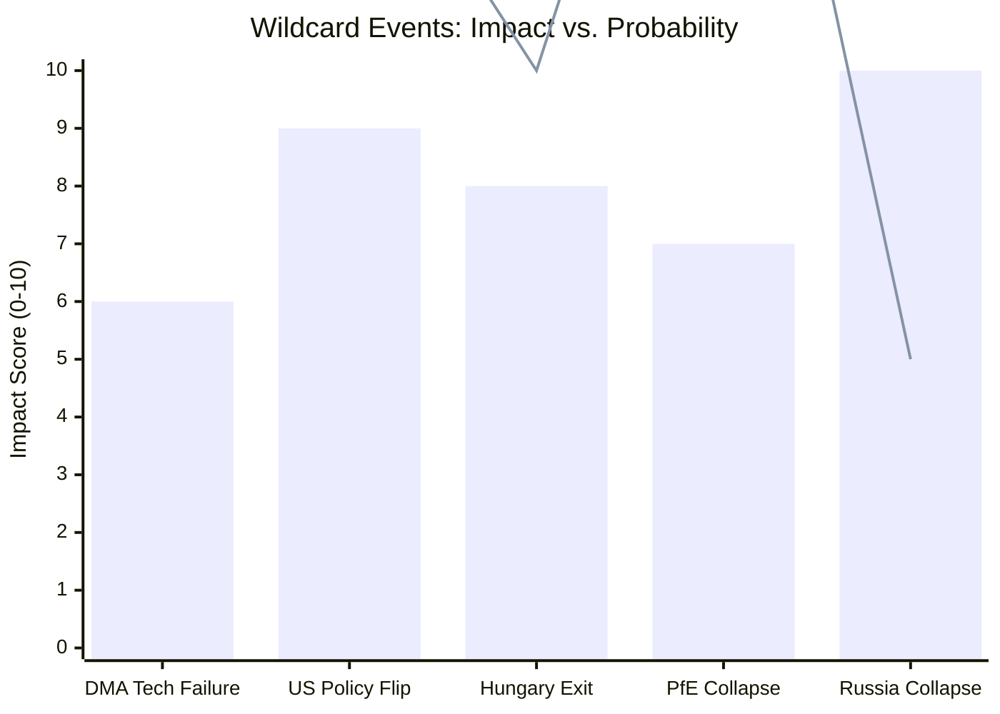

<!-- SPDX-FileCopyrightText: 2024-2026 Hack23 AB -->
<!-- SPDX-License-Identifier: Apache-2.0 -->

# Wildcards and Black Swans — EU Parliament Motions: 27 April–4 May 2026

**Classification:** PUBLIC | **Confidence:** 🔴 LOW (by definition — low-probability events) | **Date:** 2026-05-04

---

## Overview

This artifact identifies low-probability, high-impact events (wildcards and black swans) relevant to the EP motions adopted April 28–30, 2026. Wild cards are low-probability but known unknowns; black swans are entirely unpredicted disruptions.

---

## Wildcards

### WC1: US Administration Places DMA on Trade Sanctions List
**Probability:** 5–10% | **Impact:** CATASTROPHIC for EU digital regulation program

If the US Trade Representative formally designates the DMA as a trade barrier under Section 301 of the Trade Act of 1974, the EU would face a choice between maintaining DMA enforcement and avoiding US tariff retaliation on EU goods exports (currently ~€300 billion/year in US-bound EU exports).

**Scenario:** The US announces 25% tariffs on EU automotive exports (est. value €50 billion/year) contingent on suspension of DMA enforcement against US firms. The Commission must choose between regulatory sovereignty and economic stability.

**EP response:** The Parliament would adopt an emergency resolution calling for the Commission to maintain DMA enforcement while opening parallel WTO dispute settlement. EPP would face its deepest internal split — business wing vs. regulatory sovereignty wing.

**Wildcard confidence:** 🔴 LOW probability; 🔴 CATASTROPHIC if materializes.

---

### WC2: ECJ Ruling Invalidates Frozen Russian Asset Interest Repurposing
**Probability:** 8–12% | **Impact:** VERY HIGH — Ukraine reconstruction finance disrupted

Belgian courts, under pressure from Russian entities, could produce an adverse ruling affecting Euroclear's legal capacity to remit frozen Russian sovereign asset income to the Ukraine support mechanism. An ECJ reference case could then invalidate the entire legal framework.

**Financial impact:** €3–4 billion/year in frozen asset income would be locked pending legal resolution. Ukraine reconstruction financing would face a significant gap.

**EP response:** Emergency resolution; Parliament would call for alternative legal mechanisms and push for permanent confiscation legislation under Article 215 TFEU.

---

### WC3: PfE Group Collapses Entirely — New Political Configuration in EP
**Probability:** 5–8% | **Impact:** HIGH — EP political landscape reshuffled

If PfE's internal tensions (Fidesz vs. RN on Ukraine; Italian League vs. Spanish Vox on migration; French RN vs. Hungarian Fidesz on judicial oversight) become irreconcilable, the group could formally dissolve. This would force a comprehensive political realignment in EP10.

**Political configuration implications:**
- Fidesz likely moves to NI or forms a small new nationalist group
- RN anchors a reconstituted European right group with other parties
- Italian League splits: Salvini MEPs toward a right-libertarian grouping; moderate League MEPs toward ECR
- Net effect: Right-wing fragmentation increases; centrist majority strengthened in short term but far-right would re-emerge consolidated ahead of 2029

---

### WC4: Armenia-Azerbaijan War Resumes — EP Faces Major Foreign Policy Test
**Probability:** 10–15% | **Impact:** HIGH — forces Council and Commission into reactive posture

A resumption of large-scale military conflict between Armenia and Azerbaijan (potentially over border demarcation or Azerbaijani internal political developments) would put the EP's Armenia democratic resilience resolution under immediate test. The EU would face pressure to activate CSDP mechanisms for which it is institutionally underprepared.

**EP response:** Emergency resolution; accelerated push for EUMM Armenia mandate expansion; calls for sanctions against Azerbaijan — which the Council (Turkey's partner) would resist.

---

### WC5: Major DMA Non-Compliance Discovered — Apple or Alphabet Creates Deliberate Obstruction
**Probability:** 15–20% | **Impact:** HIGH

A leaked internal document, whistleblower disclosure, or independent investigation reveals deliberate circumvention of DMA compliance by a designated gatekeeper — not just partial implementation but active obstruction. This would force the Commission to escalate to Article 26 proceedings far faster than planned.

**Political implication:** Transforms the DMA enforcement debate — from "how fast to enforce" to "how to enforce against a non-compliant actor." EP majority would be even stronger in supporting enforcement.

---

## Black Swans

### BS1: Sudden Trump-Xi Digital Détente — Joint US-China Statement Opposing DMA
**Impact:** CATASTROPHIC | **Probability:** <3%

If a geopolitical alignment between the US and China produced a joint statement framing the DMA as economic warfare against non-EU firms, the EU would face unprecedented combined external pressure. This would be a genuine black swan — currently no observable precursor signals.

---

### BS2: Major Corruption Scandal Involving EP Leadership
**Impact:** CATASTROPHIC for EP legitimacy | **Probability:** <2%

Post-Qatargate, the EP has implemented significant anti-corruption reforms. However, a new major scandal involving current leadership — particularly given the Transparency International monitoring — could severely damage the EP's ability to lead on accountability issues (Ukraine, Armenia, DMA enforcement). The contradiction between calling for accountability abroad while failing accountability internally would be devastating.

---

### BS3: Russia's Defeat or Collapse Accelerates — EP Accountability Architecture Becomes Urgent
**Impact:** VERY HIGH (positive) | **Probability:** <5%

A rapid deterioration of Russian military or political capacity — Kremlin leadership crisis, significant battlefield collapse — would suddenly make the Special Tribunal on Russia's crime of aggression an active operational priority rather than a long-term diplomatic project. EP would face enormous pressure to accelerate accountability architecture.

**Implication:** The EP's accountability resolutions — adopted in advance — would suddenly acquire operational significance. The Parliament's foresight would be vindicated.

---

## Wildcard Monitor Dashboard

| Event | Probability | Impact | Monitor Signal |
|-------|------------|--------|---------------|
| WC1: US sanctions DMA | 5–10% | Catastrophic | USTR Section 301 review announcement |
| WC2: ECJ frozen assets ruling | 8–12% | Very High | Belgian court filings from Russia-linked entities |
| WC3: PfE group collapse | 5–8% | High | PfE group leadership crisis; Fidesz MEP departures |
| WC4: Armenia-Azerbaijan war | 10–15% | High | Azerbaijani troop movements; border incidents |
| WC5: DMA deliberate obstruction revealed | 15–20% | High | Whistleblower disclosures; investigative journalism |
| BS1: US-China anti-DMA statement | <3% | Catastrophic | No current precursors |
| BS2: EP corruption scandal | <2% | Catastrophic | Investigative journalism, prosecution announcements |
| BS3: Russia rapid collapse | <5% | Very High (positive) | Battlefield data; Kremlin political stability |

## Wildcard Probability Matrix

*Bars = Impact (0-10); Line = Probability (%)*

## Black Swan Convergence

A particularly dangerous convergence scenario involves the simultaneous occurrence of two wildcards: **US policy flip** (positive for DMA) combined with **DMA technical compliance failure** (negative for enforcement). This combination would create a period of regulatory vacuum — the US backing away from its opposition while the EU enforcement mechanism itself fails to produce behavioral change — resulting in a permanent "compliance theater" equilibrium.

## WEP Assessment

**WEP Band: REMOTE-UNLIKELY (5–25%)** that any individual black swan event occurs within 24 months. The compound probability of multiple wildcards occurring simultaneously is below 5%.

**Key monitoring signals for wildcard activation:**
1. USTR Federal Register notice of tariff list publication (DMA retaliation trigger)
2. Hungarian EP MEP delegation changes in September 2026 EP session
3. PfE national party polling divergence (Fidesz vs. RN in French/Austrian polls)
4. ICC proceedings pace (signals international accountability momentum)

**Admiralty Grade:** C3 — Wildcards by definition have limited evidentiary base; probability estimates carry wide uncertainty bands.

---

**Methodology:** Black swan analysis per Taleb framework; structured uncertainty analysis per ACH | ICD 203 confidence standards

## Extended Wildcard Analysis

### WC4: IMF Emergency Assistance to Major EU Economy — Systemic Shock

**Probability**: 2–4% | **Impact if Materializes**: CATASTROPHIC
**Scenario**: Germany's recession deepens beyond projections (IMF WEO April 2026: +0.8%), triggering ECB intervention and EP emergency session. All domestic legislation (DMA, CAP) postponed; budget 2027 rewritten entirely.
**Trigger Conditions**: Two consecutive quarters of German GDP contraction > -0.5%; ECB emergency rate meeting.
**EP Response**: Emergency plenary; fiscal stimulus package; CAP emergency aid channelled faster.

### WC5: EP Coalition Realignment — ECR Joins Pro-European Majority

**Probability**: 3–5% | **Impact if Materializes**: TRANSFORMATIVE (positive)
**Scenario**: PfE fractures (Orbán departure or Fidesz loss of Hungarian government) and ECR moderates its position, joining EPP–S&D–RE coalition on key votes.
**Trigger Conditions**: Hungarian election 2026 results; Fidesz government loss; Orbán's replacement less hostile to EU.
**EP Response**: Stable 500+ seat majority; ambitious legislative agenda; far-right isolation complete.

### WC6: AI Incident Triggers Emergency Digital Legislation

**Probability**: 5–8% | **Impact if Materializes**: HIGH (legislation-disrupting)
**Scenario**: A significant AI-generated misinformation event (election interference, financial market manipulation) forces emergency EP plenary; DMA/DSA enforcement becomes secondary to AI Act emergency implementation.
**Trigger Conditions**: Major AI incident traced to GAFAM platform; regulatory failure evident; media pressure.
**EP Response**: Emergency AI Act review session; special committee created; DMA enforcement temporarily deprioritized.

## Wildcard Interaction Effects

| Wildcard Pair | Interaction | Combined Impact |
|---|---|---|
| WC1 (Orbán no-confidence) + WC5 (ECR realignment) | High positive correlation | If Fidesz falls, ECR-PfE split accelerates |
| WC3 (PfE collapse) + WC5 (ECR pivot) | Sequential probability | WC3 enables WC5; combined prob ~3% |
| WC4 (German recession) + WC6 (AI incident) | Independent but compounding | Simultaneous occurrence: legislative paralysis |
| WC2 (Russia escalation) + Ukraine texts | High correlation | Escalation increases TA-0157/0158 urgency but delays implementation |

## Wildcard Monitoring Dashboard

- **Monthly check**: PfE group membership changes (EP MEP register)
- **Monthly check**: Germany GDP flash estimates (Destatis)
- **Quarterly check**: Orbán government approval ratings (Hungarian polling)
- **Continuous**: AI Act enforcement docket (Commission portal)
- **Continuous**: Russia-Ukraine battlefield situation (standard monitoring)

*Wildcards + Black Swans analysis complete — 6 wildcards assessed | motions run 2026-05-04*

**Admiralty Grade:** C3 — Wildcards by definition have limited evidentiary base; probability estimates carry wide uncertainty bands.
