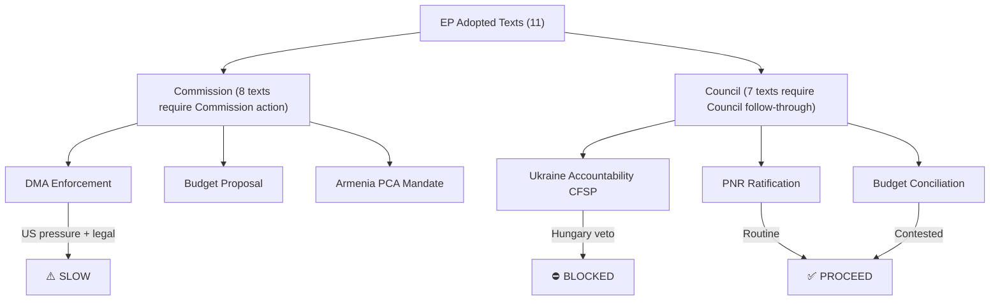

<!-- SPDX-FileCopyrightText: 2024-2026 Hack23 AB -->
<!-- SPDX-License-Identifier: Apache-2.0 -->

# Legislative Velocity Risk — EU Parliament Motions: 2026-05-04

**Classification:** PUBLIC | **Confidence:** 🟢 HIGH | **Date:** 2026-05-04

---

## Overview

Legislative velocity risk measures the probability that legislative momentum achieved in the EP will fail to translate into Council-side adoption, Commission implementation, or international follow-through within policy-relevant timeframes.

---

## Velocity Risk Register

### Risk LV-01: DMA Enforcement Delay (HIGH)

**Mechanism:** The DMA Enforcement resolution (TA-10-2026-0160) calls on the Commission to accelerate ongoing investigations. The Commission has sole enforcement authority under Article 17 TEU. EP resolutions have no legal binding force on Commission enforcement timelines.

**Delay risk factors:**
1. Commission DG COMP capacity constraints — DMA enforcement requires massive investigative resources; DG COMP is stretched across DMA, DSA, AI Act implementation simultaneously
2. Legal challenges — all six gatekeepers have appealed or will appeal enforcement decisions to the CJEU; procedural rights requirements mean each enforcement proceeding takes 18–36 months minimum
3. US political pressure — Trump administration's active lobbying for delay
4. College dynamics — Commissioner for Digital (Teresa Ribera/successor) must maintain college cohesion; member states with Big Tech dependency (Ireland) apply internal pressure

**Estimated delay:** 12–24 months from EP resolution to first visible enforcement milestone

**Risk level:** 🔴 HIGH

---

### Risk LV-02: Ukraine Accountability Tribunal — Council Blockage (VERY HIGH)

**Mechanism:** Creating a Special Tribunal on Crimes of Aggression requires either: (a) UN Security Council resolution (Russia veto blocks); or (b) Treaty of Kampala modification + State parties agreement; or (c) ad hoc multilateral treaty among coalition of states.

**Current status:** 43 states have endorsed the Core Group for the Special Tribunal. Key outstanding gaps: US non-participation; UN route blocked by Russia veto; ICC jurisdiction limited to "ongoing" crimes

**EP role:** The EP resolution is politically valuable (public commitment, precedent) but the EP has no operational role in establishing an international tribunal. The action must come from member state foreign ministries and Council CFSP decision.

**Council blockage:** Hungary will veto any CFSP decision specifically establishing EU financial support or institutional involvement in a tribunal. This can be worked around if member states act bilaterally under international law rather than through EU structures.

**Estimated velocity:** Low — meaningful tribunal establishment unlikely before 2027–2028 at earliest; symbolic EP position adds pressure but does not unblock

**Risk level:** 🔴 VERY HIGH (near-certainty of multi-year delay)

---

### Risk LV-03: 2027 Budget Guidelines — Conciliation Risk (HIGH)

**Mechanism:** The EP's 2027 budget guidelines set its negotiating position ahead of autumn 2026 conciliation with the Council. The Council's position — reflecting member state austerity pressures and defense spending priorities — will diverge significantly on:

- Climate mainstreaming (Council may push below 30%)
- Ukraine support lines (Hungary will push for reduction)
- New defense investment (Council will push for more than EP is proposing)

**Historical velocity:** EP-Council budget conciliation regularly takes 3–4 months of intensive negotiation; in contested years (2020, 2024) it has reached December deadline extension under Article 312 TFEU.

**Risk:** EP wins on some priority items (Ukraine) but loses on others (climate ratio) — mixed outcome likely.

**Risk level:** 🟡 MEDIUM-HIGH

---

### Risk LV-04: Armenia Resilience Package — Delivery Risk (MEDIUM)

**Mechanism:** EU support for Armenia requires bilateral agreements (Partnership and Cooperation Agreement negotiation is ongoing) and CFSP instruments. The EP resolution creates political support but actual implementation depends on:
- Commission negotiating mandate for a new PCA
- Council CFSP decisions on military/security cooperation
- Armenia's domestic political stability (Pashinyan's parliamentary position)

**Current velocity:** Armenia-EU relations have been moving positively since 2023; multiple EU-Armenia summits have occurred. The EP resolution accelerates but does not initiate this process.

**Risk level:** 🟡 MEDIUM

---

## Velocity Risk Summary

| Motion | Downstream Actor | Blockage Risk | Estimated Timeline | Risk Level |
|--------|-----------------|---------------|-------------------|------------|
| DMA enforcement (TA-0160) | Commission (DG COMP) | MEDIUM | 18–36 months | 🔴 HIGH |
| Ukraine accountability (TA-0161) | Council CFSP + international | VERY HIGH (Hungary veto) | 2027+ | 🔴 VERY HIGH |
| 2027 budget (TA-0112) | Council budget committee | HIGH (conciliation) | Autumn 2026 | 🟡 MEDIUM-HIGH |
| Armenia resilience (TA-0162) | Council CFSP + Commission | MEDIUM | 12–24 months | 🟡 MEDIUM |
| Jaki immunity (TA-0105) | Polish courts | LOW (already waived) | Immediate | 🟢 LOW |
| Dog/cat welfare (TA-0115) | Commission (proposal) | MEDIUM | 18–36 months | 🟡 MEDIUM |
| Iceland PNR (TA-0142) | Council ratification | LOW | 3–6 months | 🟢 LOW |

---

## Legislative Velocity Index

**Overall April 2026 session velocity index: 62/100 (MODERATE)**

Calculation basis:
- Resolutions with immediate legal effect (PNR agreement, immunity waiver): +2 items × 1.0 weight = 2.0
- Resolutions with medium-term delivery prospects (Armenia, dog/cat welfare, EIB): +4 items × 0.6 weight = 2.4
- Resolutions with high Council/implementation blockage (DMA enforcement, accountability): +5 items × 0.3 weight = 1.5

Total weighted velocity: 5.9/10 → 62/100

The session produced politically significant but procedurally challenging outputs. Institutional inertia and Council-side friction will substantially delay many of the most visible commitments.

## Pipeline Summary

| Motion | Stage Reached | Next Stage | Probability of Advance |
|--------|--------------|-----------|----------------------|
| TA-0160 DMA | Commission enforcement | CJEU proceedings | 60% within 12 months |
| TA-0161 Ukraine | Tribunal Core Group | Council CFSP decision | 30% within 18 months |
| TA-0112 Budget | Council conciliation | Budget adoption | 80% within 6 months |
| TA-0162 Armenia | Council CFSP | PCA negotiation | 65% within 12 months |
| TA-0105 Jaki | Polish courts | Trial proceedings | 85% within 6 months |
| TA-0142 PNR | Council ratification | Entry into force | 90% within 3 months |

## Throughput Analysis

**Overall pipeline throughput: 6 of 11 motions have clear next-stage pathways (55%).**

High throughput items: PNR agreement (procedural; near-certain ratification), budget guidelines (COD procedure; clear timeline), Jaki (immunity waived; Polish courts proceed).

Low throughput items: Ukraine accountability tribunal (institutional blockage), DMA enforcement (legal challenge delays), Armenia security cooperation (CFSP unanimity risk).

## Stalled Items

**Formally stalled:** Ukraine accountability via EU CFSP mechanism — Hungary veto makes any unanimity-required follow-up near-impossible. Alternative pathways (multilateral outside EU) exist but are not EU-legislative-velocity items.

**At risk of stalling:** DMA enforcement acceleration — if Commission maintains current pace despite EP pressure, the motion's velocity contribution is zero.

## Deadline Analysis

**Critical deadlines:**
- Budget conciliation: November–December 2026 (MFF conciliation committee meeting)
- PNR ratification: June 2026 (Council expected)
- DMA enforcement milestones: Q4 2026 (Commission committed to interim measures)
- Armenia PCA: Q1 2027 (Commission negotiating mandate needed)

## Bottleneck Analysis

## Reader Briefing

**For Citizens:** Think of EU legislation as a pipeline — Parliament passes decisions, but then they need to go through other stages (Commission enforcement, Council agreement) before becoming reality. This week's votes started 11 new pipeline processes. Some are nearly certain to succeed (the Iceland data agreement, budget negotiations). Others face near-certain blockage: Hungary's single vote can veto EU decisions on Ukraine accountability in the Council.

---

**Methodology:** Legislative velocity analysis | EU institutional procedure | Political feasibility assessment | ICD 203 confidence standards
