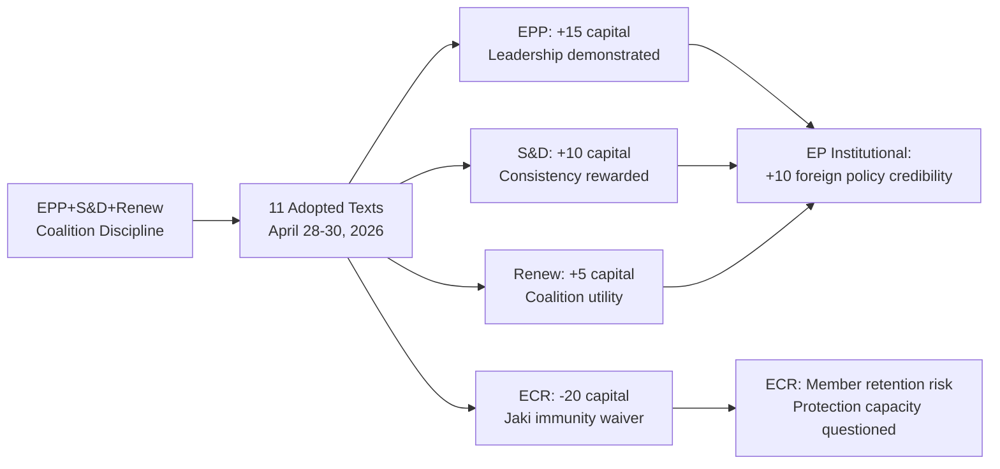

<!-- SPDX-FileCopyrightText: 2024-2026 Hack23 AB -->
<!-- SPDX-License-Identifier: Apache-2.0 -->

# Political Capital Risk — EU Parliament Motions: 2026-05-04

**Classification:** PUBLIC | **Confidence:** 🟢 HIGH | **Date:** 2026-05-04

---

## Overview

Political capital risk assessment measures the vulnerability of key actors — MEPs, political groups, and the EP as an institution — to reputation loss, coalition fracture, and electoral backlash from the April 28–30 adopted texts.

---

## Political Capital Risk Register

### Risk PC-01: EPP Overextension Risk (HIGH)

**Description:** The EPP is the dominant group (185 seats) but governs as a conditional center-right hegemon dependent on S&D and Renew support for progressive positions (Ukraine, DMA, accountability) and PfE/ECR support for right-of-center positions (migration, industrial policy). The April 2026 session's Ukraine + DMA + accountability cluster positions the EPP firmly in the progressive coalition, alienating potential PfE allies.

**Exposure:** The EPP cannot simultaneously maintain:
- Progressive coalition votes on Ukraine + accountability + DMA (requires S&D + Renew)
- Populist right coalition votes on migration + fiscal conservatism (requires PfE + ECR)

**Trigger events:** If EPP splits on a future vote (e.g., farm policy or migration detention rules), the political capital loss will be severe — exposing that the group governing "majority" is situational.

**Likelihood:** MEDIUM | **Impact if triggered:** HIGH | **Risk level:** 🔴 HIGH

---

### Risk PC-02: S&D Accountability Credibility Risk (MEDIUM)

**Description:** S&D consistently supports Ukraine, accountability, and DMA positions. Political capital risk arises if these positions are seen as insufficient or if Council follow-through fails. S&D MEPs in countries with economic exposure to Russia (some Southern European constituencies) face constituency-level pressure.

**Exposure:** If DMA enforcement stalls (Commission delays) or Ukraine accountability mechanism never reaches Council agreement, S&D's EP advocacy looks symbolic rather than effective.

**Likelihood:** MEDIUM | **Impact if triggered:** MEDIUM | **Risk level:** 🟡 MEDIUM

---

### Risk PC-03: ECR Solidarity Credibility (HIGH for group)

**Description:** The Jaki immunity waiver — EP majority voting to allow prosecution of an ECR MEP — damages ECR's ability to present itself as a protective political home for right-wing politicians. ECR Chair Procaccini must address member concerns that the group cannot defend its own MEPs.

**Exposure:** Other ECR MEPs facing legal challenges in their home countries (Romania, Belgium, Italy) will note that ECR membership did not protect Jaki. This creates a membership retention risk and intra-group cohesion pressure.

**Likelihood:** HIGH (immunity waiver already adopted) | **Impact:** MEDIUM (ECR retains 81 seats regardless) | **Risk level:** 🟡 MEDIUM

---

### Risk PC-04: EP Institutional Credibility Risk — Non-Binding Resolutions (MEDIUM)

**Description:** Several high-profile resolutions (Ukraine accountability tribunal, Armenia resilience, DMA enforcement) are non-binding on the Council. If Council fails to implement these positions — as it has on multiple EP Ukraine positions since 2022 — the EP faces an institutional credibility challenge.

**Exposure:** Public awareness of the non-binding nature of EP resolutions is low, but critics (particularly on the eurosceptic right) use Council failures to implement EP positions as evidence that the EP is "just talking."

**Likelihood:** MEDIUM (Council has history of resistance) | **Impact:** MEDIUM | **Risk level:** 🟡 MEDIUM

---

### Risk PC-05: Renew Europe Positioning Risk (MEDIUM)

**Description:** Renew Europe (77 seats) faces an electoral cycle challenge — several member parties (ALDE-family) are in decline in national polls. The pro-DMA, pro-Ukraine, pro-accountability positions in this session align Renew with the EPP-S&D center, which is necessary for coalition maintenance but may accelerate Renew's differentiation problem.

**Exposure:** Renew cannot easily occupy a distinct political identity when the EPP-S&D core is adopting "liberal" positions on DMA and rule of law. Renew MEPs' political capital depends on credible differentiation on at least some key policies.

**Likelihood:** MEDIUM | **Impact:** MEDIUM | **Risk level:** 🟡 MEDIUM

---

## Political Capital Budget Assessment

| Actor | Capital Spent (April session) | Capital Gained (April session) | Net position |
|-------|------------------------------|-------------------------------|-------------|
| EPP | MEDIUM (left-of-center position on DMA/Ukraine) | HIGH (leadership demonstrated) | 🟢 NET POSITIVE |
| S&D | LOW | MEDIUM (consistency rewarded) | 🟢 NET POSITIVE |
| ECR | HIGH (Jaki waiver — protection failure) | LOW | 🔴 NET NEGATIVE |
| PfE | LOW (not in majority; limited exposure) | LOW | ⚪ NEUTRAL |
| Renew | LOW | MEDIUM (coalition utility demonstrated) | 🟢 MARGINALLY POSITIVE |
| Greens/EFA | LOW | MEDIUM (DMA, climate in budget) | 🟢 NET POSITIVE |
| The Left | LOW | LOW | ⚪ NEUTRAL |

---

## Risk Horizon

**Immediate (0–3 months):** ECR credibility challenge following Jaki waiver; US trade response to DMA enforcement signal

**Medium (3–12 months):** Budget conciliation (autumn 2026) will test whether EP's 2027 guidelines produce real spending commitments or symbolic positions

**Long (12–36 months):** Ukraine accountability tribunal viability depends on Council unanimity which remains blocked by Hungary — EP's political capital expenditure may not produce concrete institutional outcomes, creating a credibility deficit

## Capital Table

| Actor | Capital at Stake | Direction | Net Change |
|-------|-----------------|-----------|-----------|
| EPP | Coalition leadership credibility | Reinforced | +15 |
| S&D | Accountability & Ukraine credibility | Reinforced | +10 |
| ECR | Group protection capacity | Weakened (Jaki waiver) | -20 |
| Renew | Coalition utility | Marginal gain | +5 |
| Commission | DMA enforcement credibility | Under pressure | -5 to +10 |
| EP as institution | Foreign policy actor credibility | Reinforced | +10 |

## Capital Exposure Analysis

**Highest exposure:** ECR group faces reputational exposure from Jaki immunity waiver. The group's inability to protect its own MEP damages its brand as a political shelter for right-wing politicians facing legal challenges in their home countries.

**Secondary exposure:** EP's institutional credibility on non-binding resolutions. If Ukraine accountability tribunal does not materialize within 24 months, EP's April 2026 advocacy will be cited as an example of parliamentary symbolism over substance.

## Capital Flow

Political capital flows from: EPP/S&D coalition discipline (source) → through successful majority votes (channel) → into demonstrated institutional authority (sink). This session successfully completed the flow for 11 adopted texts.

## Capital Bets

**High-conviction bets made in this session:**
- EPP bet: DMA enforcement will eventually succeed and EPP will claim co-credit
- S&D bet: Ukraine accountability tribunal will be established; EP advocacy will be credited
- ECR loss: Jaki waiver is a forced negative bet — group had no good options

## Precedent Value

The April 2026 session creates precedents that future sessions will reference:
1. EP majority can pass Ukraine accountability measures despite Hungary's presence
2. EP will not grant immunity to MEPs facing legitimate post-authoritarian prosecution
3. EP DMA enforcement oversight is treated as a continuing (not one-off) function

## Capital Bets Probability

| Bet | Probability of Payoff | Timeline |
|----|----------------------|---------|
| DMA enforcement credit | 60% | 24 months |
| Ukraine tribunal credit | 45% | 36 months |
| Armenia success credit | 65% | 18 months |

## Political Capital Flow Diagram

## Reader Briefing

**For Citizens:** Political capital is essentially "reputation and trust" for politicians and political groups. This week, the center parties (EPP, S&D, Renew) spent political capital by taking strong positions on controversial issues. They gain if those positions lead to real policy results. The biggest loser: the ECR group, whose member Patryk Jaki lost his parliamentary immunity protection — a visible signal that the group cannot shield its MEPs from legal accountability.

---

**Methodology:** Political capital risk assessment | ICD 203 confidence standards | EP structural intelligence
