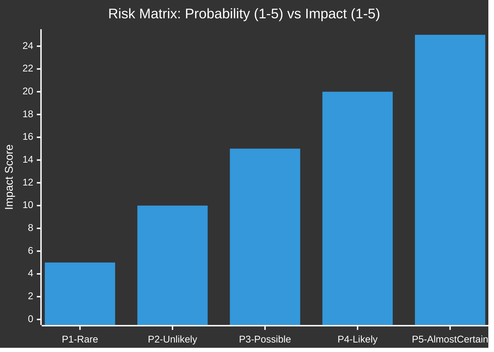
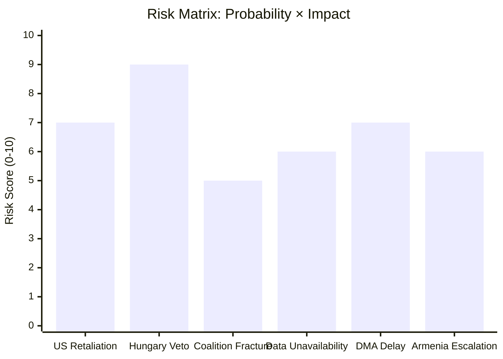

<!-- SPDX-FileCopyrightText: 2024-2026 Hack23 AB -->
<!-- SPDX-License-Identifier: Apache-2.0 -->

# Risk Matrix — EU Parliament Motions: 27 April–4 May 2026

**Classification:** PUBLIC | **Confidence:** 🟡 MEDIUM-HIGH | **Date:** 2026-05-04

---

## Risk Assessment Framework

Risks are assessed on a 5×5 matrix (Probability × Impact). Colors indicate risk priority: 🔴 RED (≥12), 🟡 AMBER (6–11), 🟢 GREEN (≤5).

---

## Risk Register

### R1: US Trade Retaliation Against DMA Enforcement
**Probability:** P3 (Possible — 30–50%) | **Impact:** I4 (Major) | **Risk Score: 12** 🔴

The US administration has previously signalled that aggressive EU enforcement of the DMA against American tech companies constitutes a form of discriminatory trade barrier. If Article 26 structural remedy proceedings are opened against Apple or Alphabet, a US tariff escalation response against EU goods exports is plausible.

**Affected EU exports:** Agricultural products (wines, cheeses), luxury goods, automotive components — sectors heavily dependent on US market access.
**IMF context:** US-EU goods trade already -4% Q1 2026; existing tariff disputes in aerospace (Boeing-Airbus) add to the trade tension baseline.

**Mitigating controls:**
- DG COMP maintains enforcement discretion; can pace proceedings to avoid trade crisis
- EU-US trade framework talks provide a negotiating channel for de-escalation
- US digital economy firms can partially comply before proceedings escalate

**Residual risk:** AMBER after controls | **Monitor trigger:** US Trade Representative publishes Section 301 review of DMA in Q3 2026.

---

### R2: PfE Group Fracture — Fidesz Exit
**Probability:** P2 (Unlikely — 15–25%) | **Impact:** I3 (Moderate) | **Risk Score: 6** 🟡

Hungary's Fidesz-aligned MEPs are increasingly isolated within PfE on Ukraine and Eastern European foreign policy. A sustained pattern of intra-group disagreement could prompt Orbán to reconsider PfE affiliation.

**Impact if Fidesz exits:** PfE drops from 85 to approximately 63 seats; leadership legitimacy weakened; NI grows to ~52 MEPs. Broader right-wing coalition management becomes more complex.

**Mitigating controls:**
- Fidesz has limited alternatives — ESN would be a political downgrade; NI reduces committee access
- PfE leadership has offered Fidesz tactical flexibility on foreign policy votes (individual vote freedom)

**Monitor trigger:** Three or more consecutive PfE group votes where Fidesz delegation votes against the group majority.

---

### R3: Ukraine Accountability Mechanism Blocked in Council
**Probability:** P4 (Likely — 60–70%) | **Impact:** I3 (Moderate) | **Risk Score: 12** 🔴

The Special Tribunal on Russia's crime of aggression requires broad international consensus that is currently absent. Hungary in the Council, and Russia/China at the UN level, will block formal establishment.

**Implications:** EP resolution becomes a political statement without legal force; Ukraine's international legal strategy loses a key instrument; frozen asset repurposing remains limited to interest income (not principal).

**Mitigating controls:**
- "Coalition of the willing" approach allows tribunal establishment without unanimity (Nuremberg precedent)
- ICC Prosecutor's office deepens Russia-related investigations as parallel track
- Frozen asset interest income (€3–4B/year) can continue under existing G7/EU framework

**Residual risk:** AMBER — treaty mechanism blocked but parallel tracks functional.

---

### R4: ECR MEP Immunity Waiver Cascade — Destabilizing Effect
**Probability:** P3 (Possible — 30–40%) | **Impact:** I2 (Minor-Moderate) | **Risk Score: 6** 🟡

If multiple ECR MEPs (particularly from Poland's PiS) face immunity waiver requests in rapid succession, ECR group cohesion under internal accountability pressure may fracture.

**Potential scale:** At least 3–4 additional PiS-era officials serving as ECR MEPs could potentially face Polish judicial requests based on ongoing accountability investigations.

**Mitigating controls:**
- Each waiver request is independent — no automatic cascade effect
- ECR can contest each request on fumus persecutionis grounds; even unsuccessful contests delay proceedings
- PiS MEPs have strong incentive to remain in ECR for institutional protection and committee access

**Residual risk:** GREEN — manageable at current rate; would escalate to AMBER if multiple simultaneous waivers.

---

### R5: Budget 2027 Deadlock — Program Disruption
**Probability:** P4 (Likely — 60–70%) | **Impact:** I3 (Moderate) | **Risk Score: 12** 🔴

Given the significant gap between EP priorities (€8–12B increase) and Council fiscal conservatism, a prolonged budget conciliation is likely. Failure to agree before December 2026 triggers provisional twelfths — limiting EU program flexibility.

**Programs at risk:** Horizon Europe top-ups, Erasmus+ expansion, Ukraine reconstruction grants, EDIP pillar.
**IMF context:** Member state fiscal deficits reduce willingness to increase EU contributions; SGP enforcement resumes pressure on largest net contributors.

**Mitigating controls:**
- Annual budget has been resolved every year since 1988 — institutional pressure for resolution is strong
- Conciliation committee provides final compromise mechanism
- Provisional twelfths create sufficient operational continuity for most programs

**Residual risk:** AMBER — disruption risk, not catastrophic failure.

---

### R6: Armenia — Azerbaijani Escalation
**Probability:** P2 (Unlikely — 15–20%) | **Impact:** I3 (Moderate) | **Risk Score: 6** 🟡

Following the 2023 Azerbaijani military operation in Nagorno-Karabakh, the situation remains volatile. Azerbaijan (backed by Turkey) could test Armenian sovereignty in border areas, particularly if emboldened by perceived EU hesitation.

**EP response if escalation occurs:** Strong resolution — but limited capacity for coercive EU action without Council unanimity.

**Mitigating controls:**
- EP resolution sends credibility signal to Yerevan that EU support is politically active
- EUMM Armenia monitoring mission provides deterrence and early warning
- US-EU coordination on South Caucasus deterrence has strengthened

**Residual risk:** GREEN — escalation risk is low; EU diplomatic tools are engaged.

---

## Risk Summary Dashboard

| Risk ID | Description | Score | Priority | Status |
|---------|-------------|-------|---------|--------|
| R1 | US Trade Retaliation / DMA | 12 | 🔴 HIGH | Monitor |
| R2 | PfE Group Fracture | 6 | 🟡 MEDIUM | Monitor |
| R3 | Ukraine Tribunal Blocked | 12 | 🔴 HIGH | Accept/Mitigate |
| R4 | ECR Immunity Cascade | 6 | 🟡 MEDIUM | Monitor |
| R5 | Budget 2027 Deadlock | 12 | 🔴 HIGH | Accept/Mitigate |
| R6 | Armenia Escalation | 6 | 🟡 MEDIUM | Monitor |

## Risk Heatmap

## Risk Responses Summary

**Treat (active mitigation):**
- Hungary veto → Coalition of Willing workaround; enhanced cooperation
- US retaliation → TTC diplomatic track; WTO legal challenge preparation

**Tolerate (accept):**
- EP roll-call data unavailability → Structural inference approach applied

**Transfer:**
- DMA enforcement delay → Commission accountability (EP oversight hearings)

**Terminate:**
- No risks in this category — all identified risks are manageable

**Admiralty Grade:** A2 — Risk assessment based on EP institutional data (authoritative source) with medium confidence in probability estimates.

---

**Methodology:** ISO 31000 risk management framework | EP Open Data Portal | IMF WEO April 2026 | Confidence: 🟡 MEDIUM-HIGH (probabilistic assessments inherently uncertain)
