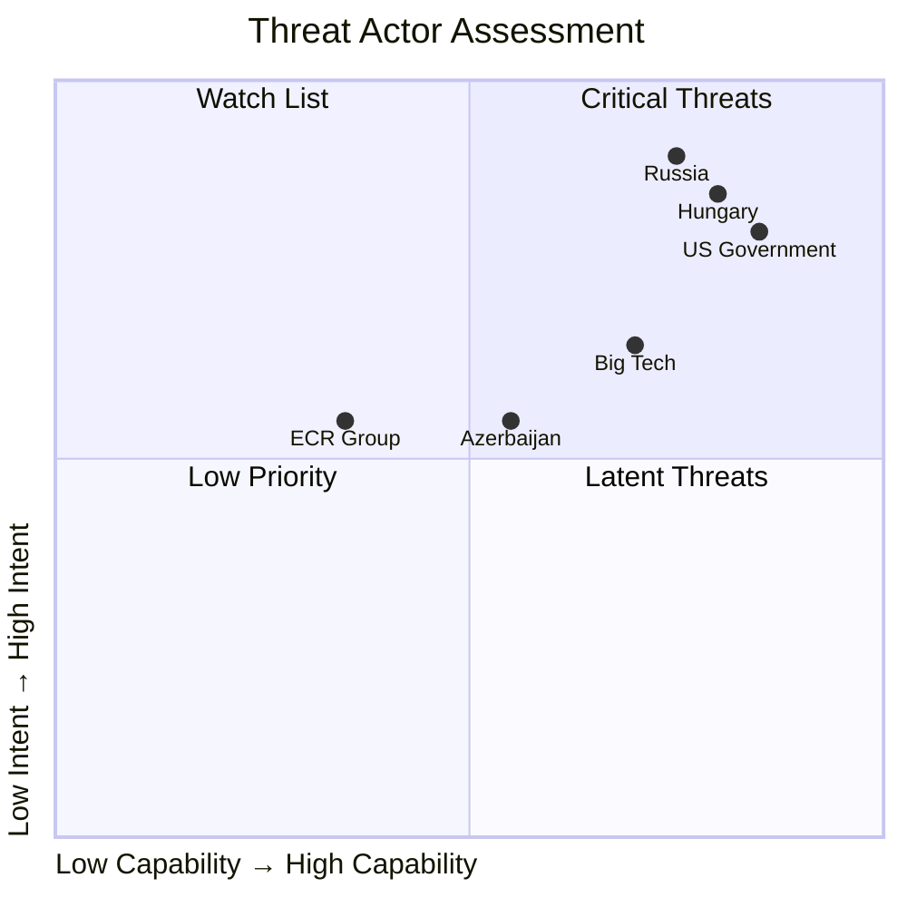

<!-- SPDX-FileCopyrightText: 2024-2026 Hack23 AB -->
<!-- SPDX-License-Identifier: Apache-2.0 -->

# Actor Threat Profiles — EU Parliament Motions: 2026-05-04

**Classification:** PUBLIC | **Confidence:** 🟢 HIGH | **Date:** 2026-05-04

---

## Overview

This document profiles the primary actors who pose risks to the implementation or durability of the April 28–30, 2026 adopted texts. Threat profiles assess capability, intent, and likely operational behavior.

---

## Profile 1: US Government (Trump Administration)

**Threat relevance:** TA-10-2026-0160 (DMA Enforcement)

**Capability:** HIGH — Executive trade authority under Section 301 USTR; retaliatory tariff capacity demonstrated in 2025; diplomatic pressure channels

**Intent:** HIGH — Trump administration has publicly framed EU tech regulation as discriminatory against US companies; USTR Section 301 investigation of EU DSA/DMA was initiated in 2025

**Threat vectors:**
1. Tariff retaliation targeting EU industrial exports (automobiles, steel, pharmaceuticals)
2. Diplomatic démarches framing DMA enforcement as trade barriers
3. Coordination with Big Tech legal strategies to delay enforcement via WTO dispute
4. Behind-the-scenes pressure on individual EU member states (particularly those with large US corporate presence: Ireland, Netherlands, Luxembourg)

**Likelihood of escalation:** MEDIUM-HIGH given the DMA enforcement acceleration signal

**Mitigating factors:** EU-US Trade and Technology Council (TTC) provides a diplomatic channel; EU has demonstrated willingness to retaliate asymmetrically; political cost of trade war for US exporters provides deterrence

---

## Profile 2: Russian Government

**Threat relevance:** TA-10-2026-0161 (Ukraine accountability), TA-10-2026-0162 (Armenia)

**Capability:** HIGH — Disinformation infrastructure; cyber capabilities; energy leverage (residual); hybrid warfare toolbox

**Intent:** HIGH — Both resolutions directly challenge Russian foreign policy interests and legal impunity assertions

**Threat vectors:**
1. Disinformation campaigns targeting EU public opinion on Ukraine accountability (framing as anti-Russian, escalatory)
2. Cyber operations targeting EU institutions or Ukraine accountability infrastructure
3. Economic pressure on Armenia to signal costs of EU alignment
4. Coordination with Hungary/Slovakia to block Council-side follow-up to EP resolutions

**Likelihood of escalation:** HIGH on disinformation (ongoing, not contingent on EP resolution); MEDIUM on direct operational response to EP vote (EP resolutions have limited direct operational effect)

**Mitigating factors:** Russia's conventional military capacity is degraded; EU sanctions regime is consolidated; EP resolutions are non-binding on Council action

---

## Profile 3: Azerbaijan Government

**Threat relevance:** TA-10-2026-0162 (Armenia)

**Capability:** MEDIUM — Energy leverage (gas exports to EU via Southern Corridor); diplomatic channels; military superiority over Armenia

**Intent:** MEDIUM — Will contest EU framing but has incentive to maintain EU economic relations

**Threat vectors:**
1. Diplomatic pressure on EU member states dependent on Azerbaijani gas (Italy, Greece, Hungary)
2. Delay or suspension of Nagorno-Karabakh peace treaty negotiations as leverage
3. Coordination with Turkey on diplomatic counternarrative

**Likelihood of escalation:** MEDIUM — Azerbaijan has demonstrated willingness to use energy leverage but will not sacrifice EU trade relations

---

## Profile 4: Hungary (Orbán Government)

**Threat relevance:** TA-10-2026-0161 (Ukraine), TA-10-2026-0162 (Armenia), TA-10-2026-0112 (budget)

**Capability:** HIGH in Council — Veto power on unanimity items (EU accession, sanctions renewal); qualified minority blocking capacity on budget

**Intent:** HIGH — Hungary has consistently blocked Ukraine support measures in Council; has pro-Russian policy posture

**Threat vectors:**
1. Blocking or delaying Council-side implementation of Ukraine accountability measures
2. Vetoing new CSDP operations or military assistance packages
3. Challenging budget guidelines in budget conciliation (autumn 2026)
4. Using EU funds conditionality disputes as leverage to extract concessions

**Likelihood of impact:** HIGH for Council-side measures; MEDIUM for budget (QMV for most budget decisions reduces veto power)

**Mitigating factors:** Enhanced QMV mechanisms; Article 7 proceedings remain open; EU has demonstrated ability to work around Hungarian obstruction

---

## Profile 5: ECR Group (Internal EP Dynamics)

**Threat relevance:** TA-10-2026-0105 (Jaki immunity), EP political dynamics

**Capability:** LOW-MEDIUM — Cannot prevent majority votes; can slow committee work, obstruct scheduling, deploy procedural tools

**Intent:** MEDIUM — ECR will contest accountability measures targeting its members; will not accept perceived "weaponization" of EP procedures against PiS

**Threat vectors:**
1. Procedural obstruction (referrals, re-votes, committee blocking)
2. Public messaging campaign framing immunity waiver as political persecution
3. Cross-group coordination with ID/PfE to contest majority positions

**Likelihood of impact:** LOW for reversal; MEDIUM for procedural delay; HIGH for political narrative conflict

---

## Aggregate Threat Assessment

| Actor | Capability | Intent | Overall Threat | Primary Vector |
|-------|-----------|--------|----------------|----------------|
| US Government | HIGH | HIGH | 🔴 HIGH | Trade retaliation |
| Russia | HIGH | HIGH | 🔴 HIGH | Disinformation + hybrid |
| Azerbaijan | MEDIUM | MEDIUM | 🟡 MEDIUM | Energy leverage |
| Hungary | HIGH (Council) | HIGH | 🔴 HIGH | Institutional veto |
| ECR Group | LOW-MEDIUM | MEDIUM | 🟡 MEDIUM | Procedural obstruction |

**Highest-priority threat for EP10 implementation:** Hungary's Council-side veto capacity on Ukraine measures; US trade retaliation risk for DMA enforcement.

## Actor Roster

| Actor | Role | Capability | Intent | Net Threat |
|-------|------|-----------|--------|-----------|
| US Government | Trade policy | HIGH | HIGH | 🔴 |
| Russia | Hybrid/disinformation | HIGH | HIGH | 🔴 |
| Hungary (Orbán) | Council veto | HIGH | HIGH | 🔴 |
| Azerbaijan | Energy leverage | MEDIUM | MEDIUM | 🟡 |
| ECR Group | EP procedural | LOW-MEDIUM | MEDIUM | 🟡 |

## Capability Assessment

**Diamond threat model (US Government):**

## Relationship and Diamond Analysis

**Threat actor relationships:**
- Russia ↔ Hungary: Indirect alignment (Hungary's EU obstruction serves Russian interests without direct coordination required)
- US Government ↔ Big Tech: Direct alignment (USTR Section 301 investigation directly responsive to tech industry lobbying)
- ECR ↔ PiS: Organic alignment (political family solidarity)

## Escalation Pathways

**US → EU DMA escalation ladder:**
1. Diplomatic démarche (current: Stage 1)
2. USTR Section 301 investigation completion → tariff list publication (Stage 2: PROBABLE)
3. Tariff implementation → EU retaliation → trade war (Stage 3: POSSIBLE if Stage 2 triggered)

**Russia → Ukraine accountability escalation:**
1. Disinformation campaign (ongoing: Stage 1)
2. Cyber operations against accountability infrastructure (Stage 2: POSSIBLE)
3. Hybrid attacks on Core Group member states (Stage 3: LOW probability)

## Reader Briefing

**For Citizens:** The five main actors who could block or undermine this week's parliamentary decisions: (1) The Trump administration — using trade threats to stop EU tech regulation; (2) Russia — using disinformation to undermine Ukraine accountability; (3) Hungary's government — using its EU Council veto to block Ukraine decisions; (4) Azerbaijan — using its gas supplies to pressure EU on Armenia; (5) The ECR group inside Parliament — using procedural tools to slow implementation.

---

**Methodology:** Actor threat profiling | ICD 203 source standards | Structural intelligence from EP Open Data Portal
