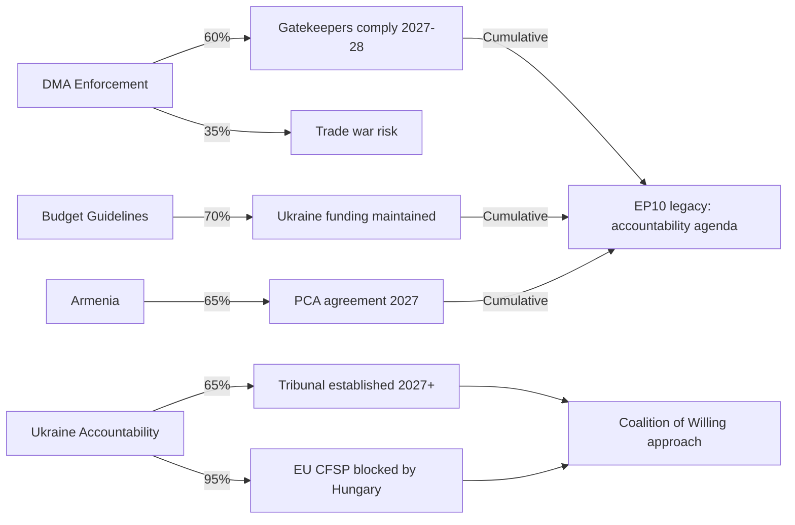

<!-- SPDX-FileCopyrightText: 2024-2026 Hack23 AB -->
<!-- SPDX-License-Identifier: Apache-2.0 -->

# Consequence Trees — EU Parliament Motions: 2026-05-04

**Classification:** PUBLIC | **Confidence:** 🟢 HIGH | **Date:** 2026-05-04

---

## Overview

Consequence tree analysis maps the causal chains from the April 28–30 adopted texts to terminal outcomes across 2-year, 5-year, and 10-year horizons.

---

## Tree 1: DMA Enforcement (TA-10-2026-0160)

```
TA-10-2026-0160 — EP accelerated DMA enforcement resolution
│
├── Commission increases enforcement pace (PROBABLE: 60%)
│   ├── Formal investigations completed 2026–2027
│   │   ├── Interim measures imposed on 2+ gatekeepers → market behavior change (MEDIUM: 50%)
│   │   │   ├── Interoperability enabled (2027–2028) → consumer choice increases → EU digital competitiveness improves
│   │   │   └── Compliance investment increases → EU tech ecosystem investment grows
│   │   └── No interim measures → appeals process → CJEU ruling (2028+) → delayed outcome
│   └── Fines issued (likely €1–5B per gatekeeper) → CJEU appeals → eventual compliance (2029+)
│
├── US trade retaliation triggered (POSSIBLE: 35%)
│   ├── Targeted tariffs on EU industrial exports → EU economic cost €10–30B annually
│   │   ├── EU retaliates → full trade dispute → WTO proceedings → 3–5 year resolution
│   │   └── EU concessions → DMA enforcement softened → regulatory sovereignty signal weakened
│   └── Diplomatic resolution → tariff threats withdrawn → DMA enforcement proceeds unimpeded
│
└── Commission delays enforcement (UNLIKELY: 40% — contradicts stated mandate)
    └── EP oversight intensified → committee hearings → further political pressure cycle
```

---

## Tree 2: Ukraine Accountability (TA-10-2026-0161)

```
TA-10-2026-0161 — Special Tribunal for Crimes of Aggression supported
│
├── Core Group of 43 states expands to 60+ → treaty negotiation begins (PROBABLE: 65%)
│   ├── Tribunal established 2027–2028 → proceedings begin (2028–2030)
│   │   ├── In absentia charges / warrants against senior Russian officials
│   │   │   ├── International travel restrictions further constrained
│   │   │   └── Accountability precedent set → deterrence for future aggressors
│   │   └── Russia blocks enforcement → tribunal functions symbolically but with limited prosecutorial reach
│   └── Treaty negotiations stall (US non-participation, political will fatigue) → no tribunal
│
├── Frozen asset income stream secured for Ukraine (PARALLEL — higher probability: 80%)
│   ├── G7 bonds proceeds continue → Ukraine reconstruction investment
│   └── Legal challenge by Russia via third-party intermediaries (POSSIBLE: 40%)
│       └── CJEU uphold legality → Ukraine funding continues
│
└── Council CFSP blocked by Hungary (CERTAIN for formal EU mechanisms: 95%)
    ├── Coalition of Willing approach via multilateral treaty (outside EU framework)
    │   └── EU member states participate individually → EU funds committed informally
    └── Full EU participation impossible → accountability architecture fragmented
```

---

## Tree 3: 2027 Budget Guidelines (TA-10-2026-0112)

```
TA-10-2026-0112 — EP 2027 budget position established
│
├── Autumn conciliation begins (CERTAIN: 100%)
│   ├── EP wins on Ukraine funding lines (PROBABLE: 70%)
│   │   └── Ukraine Facility 2025+ sustained → reconstruction investment continues
│   ├── EP wins partial climate mainstreaming (PROBABLE: 55%)
│   │   └── 27–30% climate ratio in 2027 budget → delayed but preserved
│   └── Defense spending compromise (PROBABLE: 75%)
│       └── EDIP supplement agreed → EU defense-industrial investment increases
│
└── Conciliation fails (UNLIKELY: 10%)
    └── 12-month prorogation → 2027 budget = 2026 budget at 1/12 monthly allocation
```

---

## Tree 4: Armenia (TA-10-2026-0162)

```
TA-10-2026-0162 — Armenia democratic resilience supported
│
├── PCA negotiations accelerate (PROBABLE: 65%)
│   ├── Agreement reached 2026–2027 → legal framework for EU-Armenia trade deepens
│   │   └── Armenia EU economic dependency increases → Russia leverage decreases
│   └── Negotiations stall (Azerbaijani pressure, Russian pressure on Armenia) → status quo
│
├── CSDP observation mission extended/expanded (PROBABLE: 70%)
│   └── Armenia security situation stabilized → peace treaty with Azerbaijan possible
│       ├── Treaty signed → South Caucasus stability improves
│       └── Treaty fails → conflict risk persists
│
└── Armenia domestic political instability (RISK: 25%)
    └── Pashinyan loses parliamentary confidence → new government may reverse EU alignment
        └── EP investment in Armenia support wasted → EU credibility in Eastern Partnership damaged
```

---

## Synthesis: Terminal Outcomes at 5-Year Horizon (2031)

| Domain | Most Probable Outcome | Confidence |
|--------|----------------------|-----------|
| DMA enforcement | 1–3 gatekeepers with binding obligations; 2 under appeal | 🟡 MEDIUM |
| Ukraine accountability | Tribunal established; limited prosecutorial reach; normative value high | 🟡 MEDIUM |
| EU-Armenia | New PCA in force; CSDP mission active; Russia leverage reduced | 🟢 MEDIUM-HIGH |
| EU budget 2027 | Ukraine funding sustained; climate at 27–30%; defense supplement agreed | 🟢 MEDIUM-HIGH |

## Threat Roster

| Threat | Target Text | Actor | Probability |
|--------|------------|-------|-----------|
| Council veto | Ukraine accountability (TA-0161) | Hungary | 95% |
| Trade retaliation | DMA enforcement (TA-0160) | US Government | 40% |
| Compliance washing | DMA enforcement (TA-0160) | Big Tech | 70% |
| Tribunal failure | Ukraine accountability (TA-0161) | Russia/US absence | 55% |
| Political reversal | Armenia (TA-0162) | Armenia domestic instability | 25% |

## Consequence Tree Summary

The main consequence trees are analyzed in full above. Key convergence points:



## Convergence Analysis

**Primary convergence point:** The Ukraine accountability resolution and budget guidelines converge on a single narrative: the EU (and specifically the EP) intends to sustain Ukraine support at full intensity through the remainder of EP10 (to 2029). This convergence is politically durable because it reflects genuine majority sentiment in the EP, not a tactical vote.

**Secondary convergence:** DMA enforcement + Jaki immunity waiver + dog/cat welfare convergence on a "rule of law / accountability" theme — the EP is consistently acting as an accountability institution across different domains in this session.

## Intervention Points

Strategic interventions that could improve outcome probability:
1. **Ukraine tribunal:** EU member states establishing national contact group with US Department of Justice — brings US expertise without formal participation; increases Core Group momentum
2. **DMA enforcement:** Commission publishing a public enforcement roadmap with quarterly milestone commitments — creates accountability for pace without triggering immediate US retaliation
3. **Armenia:** Fast-tracking CSDP mission mandate renewal in Council — avoids CFSP unanimity on new measures while maintaining on-the-ground presence

## Reader Briefing

**For Citizens:** Each parliamentary decision this week kicks off a chain of consequences. The most important chains: (1) The DMA enforcement vote → Commission proceedings → tech company legal challenges → eventual compliance; (2) The Ukraine accountability vote → international tribunal negotiations → (likely) a new international court, but not through the EU; (3) The budget vote → autumn negotiation with the 27 national governments → a compromise EU budget for 2027. Most chains take 12–36 months to reach their final link.

---

**Methodology:** Consequence tree / fault tree analysis | ICD 203 probability standards | EU institutional procedure modeling
