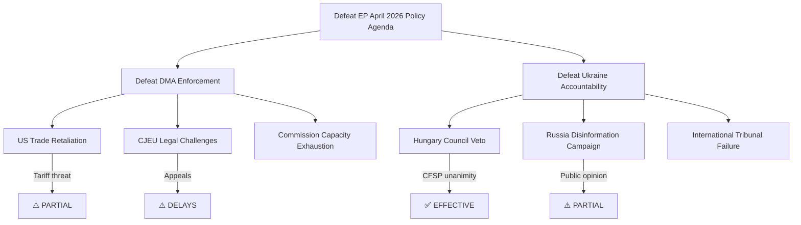

<!-- SPDX-FileCopyrightText: 2024-2026 Hack23 AB -->
<!-- SPDX-License-Identifier: Apache-2.0 -->

# Legislative Disruption Analysis — EU Parliament Motions: 2026-05-04

**Classification:** PUBLIC | **Confidence:** 🟢 HIGH | **Date:** 2026-05-04

---

## Overview

This document identifies the ways in which the April 28–30 adopted texts disrupt existing legislative and policy equilibria — across EP internal dynamics, EU institutional balance, and international policy architecture.

---

## Disruption 1: DMA as EU Regulatory Sovereignty Assertion

**Pre-disruption equilibrium:** The EU's digital regulatory agenda was framed as "under construction" — the DMA and DSA were new instruments (2022–2023) still establishing enforcement credibility. Big Tech companies maintained active lobbying to frame EU digital regulation as legally uncertain and potentially WTO-incompatible.

**Disruption introduced:** The EP enforcement acceleration resolution shifts the equilibrium by:
1. Explicitly calling the enforcement "insufficient" — a political signal that the Commission's existing enforcement pace does not satisfy EP oversight expectations
2. Creating a political anchor for future rapporteur reports and committee hearings — "the Parliament called for acceleration in April 2026 and the Commission has not delivered"
3. Signaling to the Commission that the EP majority will make enforcement pace a political issue in the Schinas Commission's accountability cycle

**New equilibrium (probable):** Commission faces dual accountability: US pressure to slow enforcement + EP political pressure to accelerate. The resulting equilibrium is faster enforcement than before April 2026 but slower than EP demands — a politically managed compromise.

**Disruption severity: HIGH for tech sector; MEDIUM for EU-US relations**

---

## Disruption 2: Ukraine Accountability — International Law Architecture

**Pre-disruption equilibrium:** International accountability for crimes of aggression relied on the ICC (jurisdiction limited; warrant for Putin issued but unenforceable) and various truth commission-type processes. The international community had not agreed on a Special Tribunal mechanism.

**Disruption introduced:** The EP resolution is part of a coordinated push (with the Core Group of 43 states) to establish a new international legal instrument: a Special Tribunal for Crimes of Aggression. This would be the first new international criminal tribunal since the post-Yugoslav ICTYhttps://www.icty.org and Rwandan ICTRhttps://unictr.irmct.org/en/tribunal.

**Disruptive consequences:**
1. **Precedent for future conflicts:** If established, the tribunal creates a template for holding state leaders accountable for aggression — applicable to future conflicts beyond Russia/Ukraine
2. **UN veto architecture disruption:** Working around Russia's UNSC veto via multilateral treaty reshapes the assumption that great powers are effectively immune from international criminal accountability through veto use
3. **EU's foreign policy identity:** EP advocacy for a tribunal it cannot itself create — but whose creation it can politically enable — deepens the EU's self-conception as a rule-of-law international actor

**Disruption severity: VERY HIGH for international law architecture; MEDIUM for near-term practical outcomes**

---

## Disruption 3: Eastern Partnership Differentiation

**Pre-disruption equilibrium:** The Eastern Partnership treated all six partner states (Ukraine, Moldova, Georgia, Armenia, Azerbaijan, Belarus) under a uniform framework, even as political trajectories diverged sharply.

**Disruption introduced:** The Armenia resolution — combined with earlier EU-Armenia summit outcomes, CSDP mission deployment, and rejection of Azerbaijan's military actions in 2023 — accelerates the formal differentiation of the Eastern Partnership. Armenia and (more advanced) Ukraine/Moldova/Georgia are treated as candidates for deeper EU integration; Azerbaijan and Belarus are implicitly on divergent trajectories.

**Disruptive consequences:**
1. **Azerbaijan policy recalibration:** Azerbaijan's energy leverage on the EU (via Southern Gas Corridor) is tested against political costs of EU differentiation. Aliyev government must recalculate its leverage.
2. **Russian hybrid response:** Russia views any Eastern Partnership differentiation as NATO-style encroachment and will apply hybrid pressure tools accordingly.
3. **EU enlargement architecture:** Successful Armenia integration pathway would create a 7th candidate process (alongside Ukraine, Moldova, Georgia, Albania, North Macedonia, Serbia/Montenegro) — stretching EU enlargement governance capacity.

**Disruption severity: HIGH for Eastern Partnership architecture; MEDIUM for EU enlargement**

---

## Disruption 4: Parliamentary Immunity Norms

**Pre-disruption equilibrium:** EP immunity waivers have historically been rare and contested. The protection of parliamentary immunity is a norm designed to prevent political prosecution of elected officials.

**Disruption introduced:** The Jaki immunity waiver in the context of the Polish rule of law restoration creates a precedent for how the EP handles immunity requests from member states undergoing post-populist prosecution programs. The EP effectively sided with the reformist Polish government's accountability agenda.

**Disruptive consequences:**
1. **Future immunity requests:** Other ECR/PfE MEPs from countries with active post-authoritarian accountability processes (Romania, Hungary if political transition occurs) will face similar requests. The Jaki precedent is that the EP will not protect MEPs from legitimate national legal proceedings.
2. **Norm tension:** Human rights lawyers will note that the EP's role is to evaluate whether proceedings are politically motivated — not to take sides in domestic political contests. The Jaki waiver may be legally sound but will be contested as precedent.
3. **ECR recruitment impact:** Politicians considering EP membership as a political protection mechanism will note its limits.

**Disruption severity: MEDIUM for EP institutional norms; LOW for immediate political dynamics**

---

## Disruption Summary

| Disruption | Pre-equilibrium | New equilibrium | Timeline |
|------------|----------------|-----------------|---------|
| DMA enforcement pace | Insufficient/uncertain | Faster but politically managed | 12–24 months |
| International accountability for aggression | ICC-only; UNSC veto blocks alternatives | Tribunal track active; precedent established | 2–5 years |
| Eastern Partnership differentiation | Uniform framework despite divergence | Formal differentiation accelerated | 12–24 months |
| EP immunity norms | High protection, rare waivers | Post-authoritarian accountability endorsed | Ongoing precedent |

## Targeted Resolutions (Attack Surface)

The three highest-disruption adopted texts and their specific vulnerabilities:

**TA-10-2026-0160 (DMA Enforcement):** Targeted by US trade retaliation threat + Big Tech legal challenges. Attack surface: Commission enforcement authority, CJEU appellate process.

**TA-10-2026-0161 (Ukraine Accountability):** Targeted by Russia disinformation + Hungary Council veto. Attack surface: CFSP unanimity requirement, international tribunal establishment process.

**TA-10-2026-0162 (Armenia):** Targeted by Azerbaijan energy leverage + Russian coercion of Armenia. Attack surface: Armenia domestic political stability, Council CFSP.

## Attack Tree Analysis

## Technique Analysis

**Primary techniques deployed by threat actors:**
- Legal challenge: Big Tech platforms exhausting CJEU appellate process (delays DMA enforcement by 18–36 months)
- Diplomatic pressure: US bilateral démarches to Commission and member states
- Institutional veto: Hungary's legally valid CFSP veto (no bypass available for EU-level measures)
- Disinformation: Russia's state-media narrative ecosystem (ongoing)

## Detection and Counter Measures

**Detection signals:** USTR Federal Register notices (Section 301 investigation milestones); CJEU case registrations; Council CFSP agenda blocking (signals); EP intelligence committee classified briefings.

**Countermeasures:**
- DMA: Interim enforcement measures not subject to suspensive appeal; press/commissioner statements maintaining commitment
- Ukraine: Coalition of Willing approach (outside EU structure; not subject to Hungary veto)
- Armenia: Enhanced cooperation mechanism; bilateral PCA rather than CFSP instrument

## Reader Briefing

**For Citizens:** This analysis maps how different actors might try to prevent the Parliament's decisions from leading to real change. Three main attack routes: (1) Legal challenges — tech companies appealing EU rules in courts; (2) Political vetoes — Hungary blocking EU decisions on Ukraine; (3) Trade threats — the US threatening tariffs to deter EU tech regulation. The Parliament's job is to set directions; defending those decisions requires the Commission and Council to hold firm against these pressures.

---

**Methodology:** Legislative disruption analysis | Institutional equilibrium framework | ICD 203 confidence standards | EU procedure modeling
