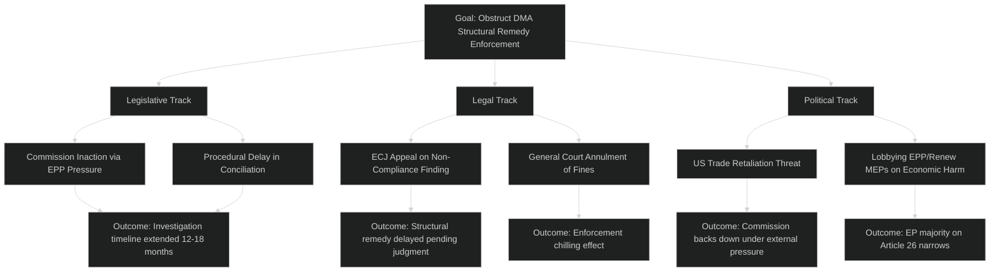

<!-- SPDX-FileCopyrightText: 2024-2026 Hack23 AB -->
<!-- SPDX-License-Identifier: Apache-2.0 -->

# Political Threat Landscape — EU Parliament Motions: 27 April–4 May 2026

**Classification:** PUBLIC | **Confidence:** 🟡 MEDIUM | **Date:** 2026-05-04

---

## Overview

This threat landscape applies the Hack23 Political Threat Framework v4.0 (5-framework integrated approach) to the political threats emerging from or identified in the April 28–30, 2026 EP plenary session.

> **Framework note:** This analysis uses the integrated Political Threat Framework (6-dimension, Attack Trees, Political Kill Chain, Diamond Model, ICO Threat Actor Profiling). STRIDE/DREAD are software frameworks explicitly rejected for political analysis.

---

## 1 — Political Threat Landscape (6-Dimension Model)

### Dimension 1: Coalition Shifts
**Risk level:** 🟡 MEDIUM | **Trend:** ↑ Slightly increasing

The EPP-centrist majority coalition (EPP + S&D + Renew + Greens/EFA) currently holds approximately 550 seats. However, structural pressures are building:
- EPP's Weber is managing a delicate balance between accommodating far-right pressure from national governments (Italy, Hungary) and maintaining the progressive coalition that enables legislative accomplishment
- If EPP pivots right on the 2027 budget (EPP + ECR alliance), the DMA enforcement coalition may fracture
- PfE's Ukraine divisions could either push PfE toward irrelevance or catalyze a centrist-vs-nationalist polarization that reshapes EP10's final year

**Threat indicator:** EPP and ECR voting together on more than 3 major procedural motions in May–June 2026 would signal a coalition shift attempt.

---

### Dimension 2: Transparency Deficit
**Risk level:** 🟡 MEDIUM | **Trend:** → Stable

The EP's accountability framework functions reasonably well — the PRIV committee's willingness to grant immunity waivers (Braun March 2026, Jaki April 2026) demonstrates institutional integrity. However:
- Roll-call vote data publication lag (4–6 weeks) reduces real-time public accountability
- Big Tech lobbying intensity — among the highest in Brussels at €30–40 million annually for the three major DMA gatekeepers — creates information asymmetry between industry and EP committees
- The EIB oversight motion reflects concerns about insufficient transparency in EU financial institution project selection

---

### Dimension 3: Policy Reversal
**Risk level:** 🟡 MEDIUM | **Trend:** → Stable

Risks of reversal on key policy commitments:
- DMA enforcement: Risk of Commission stall due to US trade pressure (see Risk R1)
- Ukraine support: PfE/ECR pressure on Ukraine fatigue narrative could shift centrist member state governments toward compromise positions
- Climate mainstreaming: Budget 2027 negotiations could see EPP push to reduce climate conditionality in favor of defense reallocations

---

### Dimension 4: Institutional Pressure
**Risk level:** 🟡 MEDIUM | **Trend:** → Stable

Institutional pressure vectors identified:
- Hungary's veto power in the Council creates systematic blocking of EU foreign policy ambition on Russia, China, and Eastern European issues
- The ECB leadership transition (new Vice-Chair appointment TA-10-2026-0033 earlier this session) creates uncertainty in monetary policy signalling
- The EP's own legitimacy challenges: Qatargate aftermath and ongoing lobbying transparency reform negotiations

---

### Dimension 5: Legislative Obstruction
**Risk level:** 🟡 MEDIUM | **Trend:** ↑ Slightly increasing

The far-right blocs (PfE: 85 seats, ECR: 81 seats, ESN: 27 seats, NI: 30 seats — total 223 seats) are below blocking minority (361) by themselves. However, their coordination on procedural motions and amendment storms can significantly slow legislative processes.

In this session: No significant obstruction of key texts. The smooth adoption of 11 texts in 3 days suggests the legislative management was effective. However, the budget negotiations will test obstruction capacity more severely.

---

### Dimension 6: Democratic Erosion
**Risk level:** 🔴 HIGH | **Trend:** → Stable

The Jaki immunity waiver — involving a former senior government official facing charges of abusing state resources to politicize civil society institutions — is a direct democratic erosion signal. The pattern of PiS-era officials using MEP status as a shield against domestic accountability represents a systematic challenge to democratic rule-of-law in EU member states.

**Broader pattern:**
- Grzegorz Braun (ECR, Poland) was subject to an earlier immunity waiver — notorious for antisemitic acts in the EP chamber
- Hungary's Orbán-aligned MEPs actively work to block EU accountability mechanisms for member state democratic backsliding
- ESN group contains MEPs from parties under investigation for foreign-influence operations (Russia-linked funding allegations)

---

## 2 — Attack Trees: DMA Obstruction

**Key attack path:** US Trade Retaliation Threat → Commission backs down → Structural remedy enforcement stalls. Probability: P3-P4 (30–50%).

---

## 3 — Political Kill Chain: PfE Coalition Fracture

**Goal (adversary perspective — hypothetical Fidesz exit scenario):**

Stage 1 (Reconnaissance): Fidesz assesses PfE coalition costs vs. benefits — committee access, group resources, political identity
Stage 2 (Planning): Maps alternative affiliations (NI, new group, standalone ESN partnership)
Stage 3 (Preparation): Tests intra-group waters by increasing frequency of Ukraine/foreign policy disagreements
Stage 4 (Execution): Announces formal departure from PfE group; 22 Fidesz MEPs join NI or form new group
Stage 5 (Exploitation): Negotiates from NI position — offers tactical support to EPP on specific issues in exchange for Hungary-specific policy concessions
Stage 6 (Consolidation): Establishes new group minimum (23 MEPs required) with other nationalist MEPs
Stage 7 (Actions on Objective): Increases Hungary's leverage in EP institutional negotiations

**Current stage:** Stage 2–3 (Tension building visible; no formal departure signals yet). Monitor.

---

## 4 — Diamond Model: Digital Tech Lobby vs. EP Digital Governance

| Dimension | Description |
|-----------|-------------|
| **Adversary** | Big Tech lobbying coalition (Apple, Alphabet, Meta Brussels offices + tech industry associations) |
| **Capability** | €30–40M annual lobbying spend; technical expertise capacity; MEP relationship networks in EPP and Renew |
| **Infrastructure** | Business Europe membership; CCIA (Computer & Communications Industry Association) Brussels; direct MEP outreach |
| **Victim** | EP DMA enforcement motion; Commission enforcement momentum; EU digital market competitiveness |

**Threat assessment:** The tech lobby is capable but politically exposed after this week's cross-group coalition in support of enforcement. Their primary leverage point is EPP economic conservatives — if they can shift 30–40 EPP MEPs away from enforcement support, they can narrow the majority. Currently not achieving this objective.

---

## 5 — Threat Actor Profiling (ICO): Hungary/Orbán in EP

| Factor | Assessment |
|--------|-----------|
| **Intent** | Obstruct EU foreign policy on Ukraine, Russia accountability, democratic backsliding enforcement |
| **Capability** | Single-state veto in Council; Fidesz MEP block in PfE; ECJ appeal capacity; EU funds leverage |
| **Opportunity** | Budget negotiations (leverage point); EU enlargement debates; rotating Council presidency transitions |
| **ICO Score** | I: 4/5 (high) | C: 3/5 (medium) | O: 3/5 (medium) → **ICO: 10/15 — SIGNIFICANT THREAT ACTOR** |

**Hungary threat assessment:** Hungary remains the most systemically disruptive actor in EU institutional politics. Its threat vector is primarily through Council unanimity veto — not the EP. The EP can adopt texts; only the Council (requiring unanimity) is directly affected by Hungary's blocking capacity.

---

## Summary Threat Assessment

| Threat | Framework | Severity | Confidence |
|--------|-----------|---------|-----------|
| US Trade Retaliation / DMA | Political Threat Landscape, Kill Chain | 🔴 HIGH | 🟡 MEDIUM |
| Hungary Institutional Obstruction | ICO Profiling | 🟡 MEDIUM (in EP) | 🟢 HIGH |
| PfE Coalition Fracture | Kill Chain | 🟡 MEDIUM | 🟡 MEDIUM |
| Democratic Erosion / MEP Immunity Abuse | 6D Model | 🔴 HIGH trend | 🟡 MEDIUM |
| Big Tech Lobbying vs. DMA | Diamond Model | 🟡 MEDIUM | 🟡 MEDIUM |

---

**Methodology:** Political Threat Framework v4.0 (Hack23) — 5-framework integrated approach | EP Open Data Portal | ICD 203 standards | STRIDE/DREAD explicitly excluded
