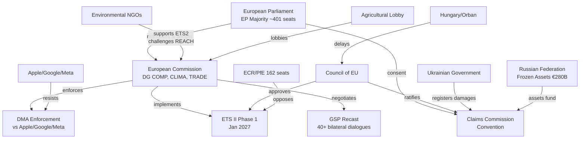

# Actor Mapping — EU Parliament Propositions, 28–30 April 2026

**Framework:** Actor Network Analysis and Influence Mapping
**Date:** 4 May 2026
**Confidence:** 🟢 High

---

## Actor Network Overview

The April 28–30 legislative package activates a network of 15+ key actors across EU institutions, member states, civil society, and private sector. This document maps the relationships, dependencies, and power flows between actors.

---

## Primary Actor Network



---

## Actor Power Assessment

| Actor | Type | Power Level | Alignment with Package |
|-------|------|-------------|----------------------|
| European Parliament majority | Legislative | Very High | 🟢 Pro |
| European Commission | Executive/Regulatory | Very High | 🟢 Pro |
| Council of EU | Legislative | Very High | 🟢 Broadly pro |
| Apple/Google/Meta | Private sector | High | 🔴 Anti (DMA) |
| Ukrainian Government | Sovereign state | Medium | 🟢 Pro (accountability) |
| Environmental NGOs | Civil society | Medium | 🟡 Mixed |
| ECR/PfE bloc | Legislative opposition | Medium | 🔴 Anti |
| COPA-COGECA | Industry lobby | Medium | 🟡 Mixed |
| GSP beneficiary governments | Sovereign states | Low-Medium | 🟡 Mixed (GSP) |
| IMF | International org | Medium | 🟡 Advisory |
| Hungarian/Orban government | Member state | Medium | 🔴 Partially anti |
| Armenian diaspora | Civil society | Low-Medium | 🟢 Pro |
| Polish far-right MEPs | Legislative minority | Low (in EP) | 🔴 Anti (immunity) |
| EU households (buildings) | Citizens | Low (individually) | 🟡 Affected |

---

## Key Actor Dependencies

**Dependency chain for DMA enforcement:**
```
EP resolution (TA-0160)
  → Commission 3-month response obligation
    → DG COMP investigation launch decision
      → Apple/Google legal response (CJEU challenge)
        → Settlement or formal non-compliance finding
```

**Dependency chain for ETS II implementation:**
```
EP first reading position (TA-0139)
  → Council approval (Q2 2026)
    → Commission ETS II registry + auction platform
      → ETS II Phase 1 auctions (Jan 2027)
        → Social Climate Fund member state disbursements
```

**Dependency chain for Ukraine Claims Commission:**
```
EP consent (TA-0154)
  → Council ratification decision (Q3 2026 est.)
    → Convention entry into force (30 ratifications needed)
      → Claims registration opens
        → Adjudication panel constituted
          → First claims payments (from Russian asset interest)
```

---

## Actor Influence Timeline

| Month | Key Actor Action | Impact |
|-------|----------------|--------|
| May–July 2026 | Commission DMA response to EP resolution | Signals enforcement ambition level |
| Q2 2026 | Council ETS II MSR vote | Confirms legislative package |
| Q3 2026 | Council Claims Commission ratification | Activates accountability architecture |
| Q4 2026 | DG COMP investigation launch (or settlement) | Determines DMA effectiveness |
| Jan 2027 | ETS II Phase 1 auctions begin | Tests social acceptance |
| Q2 2027 | Commission first DMA/ETS II implementation reports | Public accountability moment |

*Actor mapping produced: 4 May 2026.*

---

## Actor Roster

| # | Actor | Type | Affiliation | Role in Package |
|---|-------|------|-------------|----------------|
| 1 | European Commission (DG COMP) | EU Institution | EPP-aligned President | DMA enforcement authority |
| 2 | European Commission (DG CLIMA) | EU Institution | European Commission | ETS II implementation |
| 3 | European Parliament Majority | EU Legislature | EPP+S&D+Renew | Legislative principal |
| 4 | Council of EU | EU Legislature | 27 member states | Co-legislator + ratification |
| 5 | Apple Inc. | Private sector | US tech giant | DMA gatekeeper obligation subject |
| 6 | Alphabet/Google | Private sector | US tech giant | DMA gatekeeper obligation subject |
| 7 | Meta Platforms | Private sector | US tech giant | DMA gatekeeper obligation subject |
| 8 | Ukrainian Government | Sovereign state | Kyiv | Claims Commission proponent |
| 9 | Russian Federation | Sovereign state | Moscow | Asset seizure target |
| 10 | COPA-COGECA | Industry lobby | EU agriculture | REACH/livestock strategy lobbyist |
| 11 | Environmental NGOs | Civil society | Pan-EU | ETS II/REACH monitor |
| 12 | Hungary (Orbán gov't) | Member state | ECR-aligned | Potential Claims Commission blocker |
| 13 | ECR/PfE bloc | Legislative opposition | EU Parliament | ETS II/DMA opposition |
| 14 | GSP Beneficiary Governments | Sovereign states | 40+ countries | GSP recast negotiating counterparts |

## Influence Assessment

**High influence actors:**
- European Commission (enforcement + implementation authority across all 5 clusters)
- EPP (pivotal: without EPP, no governing majority — all five clusters pass only with EPP support)
- Council Presidency (rotation: Polish presidency Q1 2026 → Danish Q3 2026)

**Medium influence:**
- Apple/Google/Meta (legal challenge leverage on DMA; cannot block legislative adoption)
- Hungarian government (Claims Commission ratification veto potential; cannot block EP vote)
- Environmental NGO coalition (public opinion pressure on ETS II implementation design)

**Low influence (this session):**
- ESN (25 seats — unable to affect any vote outcome)
- Individual member states on purely EU-competence matters (ETS II, DMA)

## Alliance Mapping

| Alliance | Members | Issue Area | Cohesion |
|---------|---------|------------|---------|
| Governing majority | EPP + S&D + Renew | All legislative clusters | High |
| Progressive climate alliance | S&D + Greens + Left | ETS II ambition | High |
| Ukraine accountability consensus | EPP + S&D + Renew + Greens | Claims Commission | Very High |
| Anti-ETS II coalition | ECR + PfE + ESN | ETS II | High |
| Digital sovereignty coalition | EPP + S&D + Renew + Greens | DMA enforcement | High |
| Big Tech resistance front | Apple + Google + Meta | DMA challenges | High |

## Power Brokers

**Key individuals (inferred from EP10 political dynamics):**
- **Ursula von der Leyen (EPP):** Commission President — DMA enforcement timeline ultimately her decision
- **Roberta Metsola (EPP):** EP President — presided over session; no vote (institutional role)
- **Iratxe García Pérez (S&D):** Group president — Social Climate Fund social conditionality champion
- **Stéphane Séjourné (Renew):** Group president — Renew trade liberalism vs. GSP conditionality mediator
- **Manfred Weber (EPP):** EPP group president — ETS II compromise architect

## Information Flows

- EP committee reports → plenary debate → final text
- Commission DMA investigation requests → case file → enforcement action
- NGO monitoring → EP parliamentary questions → Commission accountability
- Claims Commission treaty → national ratification procedures → entry into force

## Reader Briefing

**What this actor map means for policy watchers:**
The April 28–30 package concentrated decision-making power in the governing EPP-S&D-Renew triangle, while the implementation phase will disperse power across the Commission, member states, and CJEU. Watch the Commission's DMA response window (3 months) and the Council's Claims Commission ratification timeline (Q3 2026) as the two leading indicators of implementation intent.

*Actor mapping completed: 4 May 2026.*
