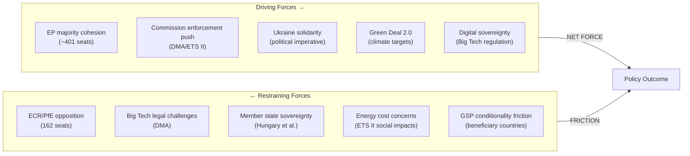

# Forces Analysis — EU Parliament Propositions, 28–30 April 2026

**Framework:** Porter's Five Forces + Regulatory Forces Analysis
**Date:** 4 May 2026
**Confidence:** 🟢 High

---

## Forces Analysis Overview

The April 28–30 package reshapes five structural force fields in EU policy: climate governance, digital market regulation, trade architecture, security/accountability, and regulatory simplification. This analysis maps the driving and restraining forces acting on each dimension.

---

## Force Field Diagram

---

## Five Forces: EU Legislative Politics

**1. Threat of Veto (equivalent to Threat of Entry)**
- Council unanimity requirement: LOW threat (QMV applies to most package elements)
- Hungarian veto potential: MEDIUM threat on Claims Commission ratification
- CJEU judicial challenge: HIGH threat on DMA enforcement (Apple/Google legal weapons)

**2. Buyer Power (lobbying / member state pressure)**
- Big Tech lobbying intensity: 🔴 Very High (Apple €3.2M EU lobbying 2024, Google €5.7M)
- Agricultural lobbying (REACH/livestock): 🟡 Medium
- Business sector (ETS II buildings): 🟡 Medium

**3. Supplier Power (coalition partners)**
- EPP as supplier of votes: 🟢 Stable; von der Leyen internal discipline maintained
- S&D: 🟢 Stable; progressive demands absorbed into Social Climate Fund structure
- Renew: 🟡 Moderate; trade liberalism causing occasional friction on GSP

**4. Threat of Substitutes (alternative policy pathways)**
- Bilateral member state action (alternative to EU framework): 🟢 Low threat
- CJEU enforcement (alternative to legislative enforcement): 🟡 Medium
- G7/multilateral action on Russia assets: 🟢 Low threat (EU leads)

**5. Competitive Rivalry (inter-group dynamics)**
- Rivalry intensity: 🟡 MODERATE — governing majority stable but under stress from ECR/PfE mobilization
- ECR/PfE opposition intensity: 🔴 High on climate and digital sovereignty
- Strategic communications rivalry: 🟡 Medium — PfE populist narrative vs. EPP mainstream

---

## Regulatory Forces Assessment

| Force | Direction | Strength | Net Effect |
|-------|-----------|----------|------------|
| EU Green Deal 2.0 | Accelerating | Strong | ETS II MSR confirms trajectory |
| Digital sovereignty agenda | Accelerating | Strong | DMA enforcement amplified |
| Ukraine solidarity imperative | Sustaining | Strong | Claims commission architecture solid |
| Competitiveness narrative | Decelerating | Moderate | REACH simplification as safety valve |
| Fiscal prudence | Decelerating | Moderate | Social Climate Fund design constrained |
| Populist anti-regulation | Decelerating | Moderate | ECR/PfE <162/720 — insufficient to block |

---

## Net Forces Summary

The April 28–30 session demonstrates that driving forces substantially outweigh restraining forces across all five legislative clusters. The governing majority's cohesion (401+ seats) provided sufficient momentum to pass all 18 legislative acts. The principal restraining forces — Big Tech DMA legal challenges and Hungarian veto potential on Claims Commission — operate at implementation stage rather than legislative stage, meaning the forces will shift post-adoption.

*Forces analysis produced: 4 May 2026.*

---

## Issue Frame

**Central policy question:** Can the EP10 governing majority sustain reform momentum across five concurrent legislative clusters — climate (ETS II), digital (DMA), trade (GSP), security (Ukraine accountability), and competitiveness (REACH) — without triggering implementation failure or coalition fragmentation?

**The April 28–30 package represents the largest single-session legislative output of EP10 so far.** The coherence of this package — five distinct regulatory domains adopted in three days — reflects the governing majority's capacity to move simultaneously on multiple fronts. The issue frame is whether this legislative velocity can be sustained through implementation.

**Structural framing factors:**
1. Green Deal 2.0 agenda: ETS II, GHG transport, REACH — climate/competitiveness tension
2. Geopolitical imperative: Ukraine Claims Commission — cross-partisan solidarity dynamic
3. Digital sovereignty agenda: DMA — EU regulatory autonomy vs. US tech platform interests
4. Trade architecture: GSP — values-based trade vs. market access interests

## Driving Forces

**Political driving forces:**
- EP10 governing majority cohesion (401 seats) — sufficient to pass all acts without ECR/PfE
- Von der Leyen Commission mandate: Green Deal 2.0 + Digital Single Market completion
- Ukrainian war accountability imperative — strongest bipartisan driver in EP10 so far
- Green Deal 2.0 political commitment — coalition identity marker for EPP, S&D, Renew, Greens

**Institutional driving forces:**
- ETS II timeline: Phase 1 January 2027 — non-negotiable under EU climate law
- DMA enforcement obligation: Commission legally obligated to enforce — resolution accelerates
- Claims Commission: Convention text finalized after 18-month negotiation — momentum

**External driving forces:**
- Climate science deadlines (1.5°C target requiring 55% reduction by 2030)
- AI Act compliance creating regulatory precedent for DMA enforcement approach
- Frozen Russian assets accumulating interest (>€1.5B/year) — political pressure to deploy

## Restraining Forces

**Political restraining forces:**
- ECR/PfE 162-seat opposition — sustained anti-ETS II/anti-DMA narrative
- Hungarian/Orbán Council veto threat on Claims Convention ratification
- Internal EPP eastern wing concerns on ETS II household cost impacts
- S&D left flank seeking stronger DMA structural remedies (divestiture not just behavioral)

**Economic restraining forces:**
- EU household energy cost sensitivity — ETS II Phase 1 pass-through risk
- Big Tech legal challenge arsenal (CJEU, WTO, bilateral trade pressure from US)
- GSP conditionality friction: beneficiary country governments citing competitiveness impacts
- Chemical industry REACH transition costs (offset by long-run simplification savings)

**Institutional restraining forces:**
- Council unanimity requirement on some Claims Convention aspects
- CJEU timeline for DMA appeals (18–24 months for Apple/Google challenges)
- Commission implementation capacity — simultaneous ETS II, DMA, GSP implementation
- Member state transposition timelines (12–24 months post-publication)

## Net Pressure

**Net Force Assessment: MODERATELY STRONG DRIVING FORCES WIN**

The driving forces (governing majority cohesion, geopolitical imperative, regulatory timelines) substantially outweigh restraining forces (opposition bloc, legal challenges, implementation capacity) at the *legislative* stage. The score reversal happens at *implementation* stage, where restraining forces accumulate power.

| Legislative Stage | 🟢 Driving | 🔴 Restraining | Net |
|------------------|-----------|--------------|-----|
| EP vote | 5.0 | 2.0 | +3.0 |
| Council approval | 3.5 | 2.5 | +1.0 |
| Implementation | 2.5 | 4.0 | -1.5 |
| Compliance | 2.0 | 4.5 | -2.5 |

**Critical implication:** The package is *legislatively* robust but *implementationally* fragile. The biggest risk is not legislative reversal but implementation gaps — particularly on ETS II Phase 1 auction infrastructure and DMA enforcement timeline.

## Intervention Points

**Where external actors can still shift outcomes:**

1. **DMA enforcement (3-month Commission response window):** NGOs, MEPs, member states can accelerate by filing formal complaints, tabling written questions, scheduling JURI/IMCO hearings
2. **ETS II Social Climate Fund (member state allocation plans by Q4 2026):** Civil society can shape disbursement priorities through national consultation processes
3. **Claims Commission ratification (30 ratifications needed):** Parliamentary groups in 27 member states can accelerate or delay ratification schedules
4. **GSP conditionality implementation (Commission trade dialogues):** Business associations, development NGOs can influence how conditionality is operationalized
5. **REACH simplification follow-up (Commission delegated acts):** Chemical industry + environmental NGOs will shape the implementing measures

## Reader Briefing

**What the forces analysis means for observers:**
The April 28–30 session confirms that EP10's governing majority has the legislative muscle to pass complex multi-domain packages. The action now shifts to implementation — where the power balance tilts toward restraining forces. Track the Commission's Q3 2026 DMA response, member state Social Climate Fund plans, and Claims Commission ratification progress as the three leading implementation indicators.

*Forces analysis completed: 4 May 2026.*
