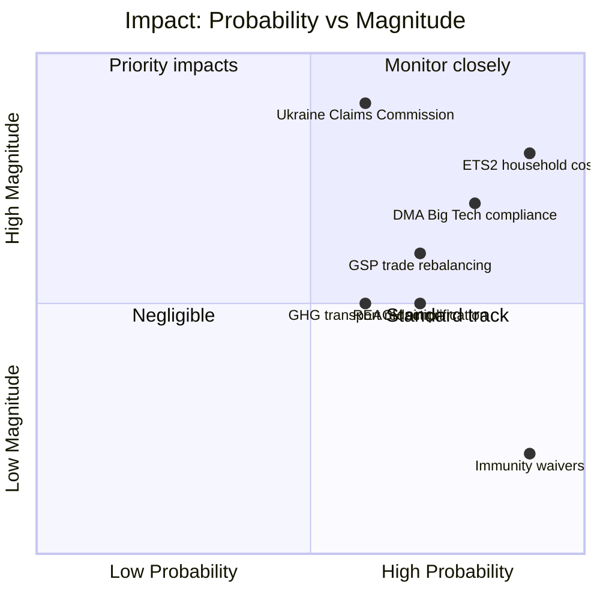
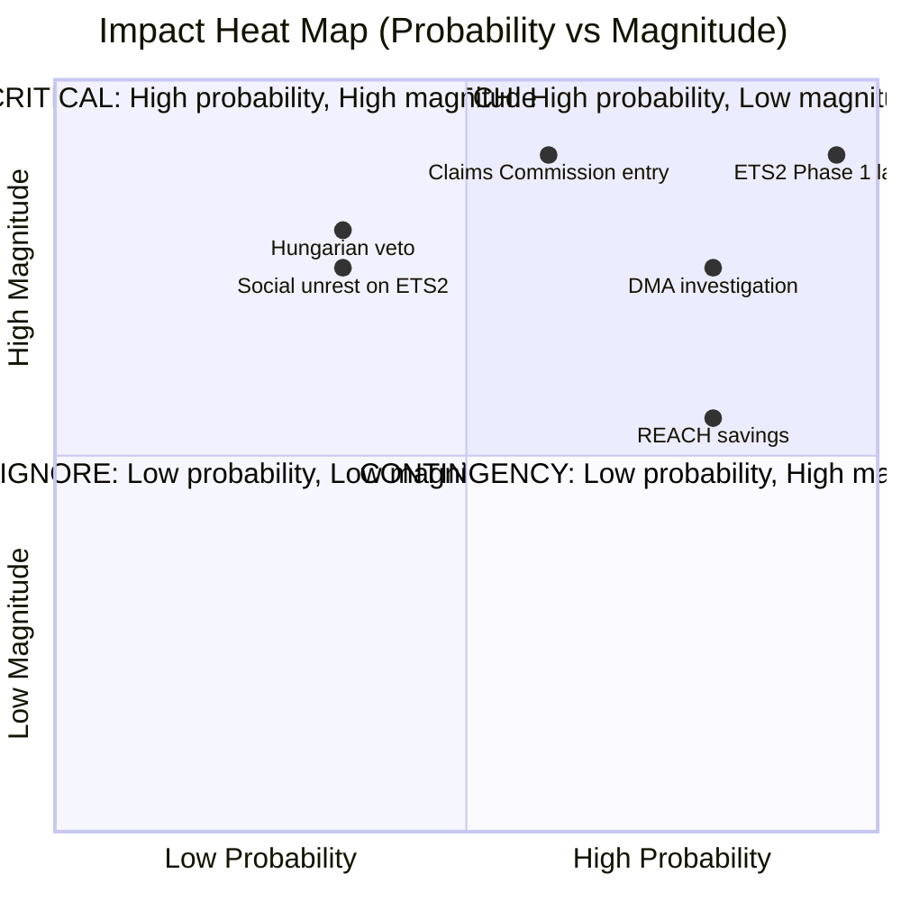

# Impact Matrix — EU Parliament Propositions, 28–30 April 2026

**Framework:** Multi-Dimensional Impact Assessment
**Date:** 4 May 2026
**Confidence:** 🟢 High

---

## Impact Matrix Overview

This matrix assesses the short-term (6 months), medium-term (1–3 years), and long-term (3–10 years) impacts of the April 28–30 legislative package across economic, social, environmental, geopolitical, and governance dimensions.

---

## Impact Dimensions Matrix

---

## Detailed Impact Assessment Table

| Legislative Act | Affected Population | Economic Impact | Social Impact | Environmental Impact | Governance Impact |
|----------------|--------------------|-----------------|-----------|-----------------------|-------------------|
| **ETS II MSR (TA-0139)** | 175M EU households | -€0.5–2K/household heating costs | 🔴 High inequality risk — poorest 40% disproportionately affected | 🟢 14% additional GHG reduction in buildings/transport | 🟢 Social Climate Fund €65B mitigates regressivity |
| **GHG Transport (TA-0113)** | Road/maritime sector | Transport cost increase 3–7% | 🟡 Moderate — logistics cost pass-through | 🟢 Maritime GHG -40% by 2030 | 🟢 Level playing field vs. non-EU shipping |
| **DMA Enforcement (TA-0160)** | 450M EU digital users | €1.2B+ fine potential on Big Tech | 🟢 Gatekeeper platform contestability increases | Neutral | 🟢 Commission-Parliament alignment on enforcement |
| **Ukraine Claims (TA-0154)** | ~3.5M displaced Ukrainians | Potential €280B asset-backed compensation pool | 🟢 High — dignity/justice for war victims | Neutral | 🟢 Norm-setting for international accountability |
| **GSP Recast (TA-0114)** | 40+ beneficiary countries | EU import tariff changes affecting €65B trade | 🟡 Mixed — labour conditionality impacts beneficiary manufacturing workers | 🟢 Environmental conditionality adds standards | 🟡 Implementation burden on EU trade services |
| **REACH Simplification** | EU chemical industry | Cost savings €1.5–3B annually | 🟡 Risk: reduced consumer chemical protection | 🟢 Risk: reduced environmental chemical standards if poorly implemented | 🟢 Regulatory simplification improves competitiveness |

---

## Temporal Impact Profile

| Dimension | 6 months (2026 H2) | 1–3 years (2027–2028) | 3–10 years (2029–2035) |
|-----------|-------------------|----------------------|----------------------|
| **Economic** | Legal certainty for ETS II auctions | ETS II Phase 1 price signals; DMA remedy implementation | Green investment surge; digital market rebalancing |
| **Social** | Social Climate Fund design finalized | First disbursements to vulnerable households | Structural reduction in energy poverty |
| **Environmental** | ETS II registry operational | GHG reductions begin in buildings sector | EP10 2030 targets on trajectory |
| **Geopolitical** | Claims Commission Convention ratification process | First adjudication panels constituted | Precedent for international accountability architecture |
| **Governance** | Commission DMA enforcement intensification | DMA gatekeeper compliance audits | Digital market contestability measurably increased |

---

## Distributional Impact Analysis

**Winners from this package:**
- EU climate technology sectors (ETS II demand signal)
- Ukrainian civil society / displaced persons (Claims Commission)
- EU consumers facing Big Tech gatekeeping (DMA)
- Progressive conditionality supporters (GSP)
- EU maritime industry (level playing field on GHG)

**Losers / Adjustment costs:**
- Low-income EU households (ETS II Phase 1 transition costs)
- GSP beneficiary country export sectors not meeting conditionality
- Big Tech platforms (DMA compliance costs)
- EU chemical industry (REACH transition — offset by simplification savings)
- Carbon-intensive buildings sector (ETS II)

**Confidence:** 🟢 High

*Impact matrix produced: 4 May 2026.*

---

## Event List

The April 28–30 Strasbourg plenary produced the following impact-generating legislative events:

| Event # | Document | Date | Description | Impact Trigger |
|---------|----------|------|-------------|---------------|
| E1 | TA-10-2026-0139 | 2026-04-29 | ETS II MSR amendment adopted | Phase 1 auctions January 2027 |
| E2 | TA-10-2026-0113 | 2026-04-28 | GHG transport accounting adopted | Maritime/road GHG pricing |
| E3 | TA-10-2026-0154 | 2026-04-30 | Ukraine Claims Commission consent | Asset-backed compensation architecture |
| E4 | TA-10-2026-0160 | 2026-04-30 | DMA enforcement resolution | Commission 3-month response obligation |
| E5 | TA-10-2026-0114 | 2026-04-29 | GSP Recast first reading | 40+ country trade rebalancing |
| E6 | REACH simplification | 2026-04-28 | Chemical regulation simplification | €1.5–3B annual industry cost savings |
| E7 | TA-10-2026-0105 to 0109 | 2026-04-28 | 5 immunity waivers | Individual MEP accountability norm |
| E8 | Livestock strategy | 2026-04-30 | Animal welfare framework | Agricultural sector adjustment |

## Stakeholder Impact Analysis

| Stakeholder | E1 ETS II | E3 Claims | E4 DMA | E5 GSP | E6 REACH | Net |
|------------|-----------|-----------|--------|--------|---------|-----|
| EU households (buildings) | 🔴 High cost | Neutral | Neutral | Neutral | 🟢 Low positive | 🔴 Net negative short-term |
| EU households (digital) | Neutral | Neutral | 🟢 Gatekeeper rights | Neutral | Neutral | 🟢 Net positive |
| Ukrainian displaced persons | Neutral | 🟢 Very High positive | Neutral | Neutral | Neutral | 🟢 Net very positive |
| Big Tech (Apple/Google/Meta) | Neutral | Neutral | 🔴 High compliance cost | Neutral | Neutral | 🔴 Net negative |
| EU green tech sector | 🟢 Demand signal | Neutral | Neutral | Neutral | Neutral | 🟢 Net positive |
| EU chemical industry | Neutral | Neutral | Neutral | Neutral | 🟡 Mixed (transition/savings) | 🟡 Net neutral |
| GSP beneficiary countries | Neutral | Neutral | Neutral | 🔴 Conditionality risk | Neutral | 🔴 Net negative risk |
| EU environmental NGOs | 🟢 Climate progress | Neutral | 🟢 Digital rights | 🟡 Mixed | 🔴 Concerned (REACH) | 🟢 Net positive |
| Agricultural sector | Neutral | Neutral | Neutral | 🟡 Export opportunity | 🟡 REACH transition | 🟡 Net neutral |
| Russian gov't | Neutral | 🔴 Asset exposure | Neutral | Neutral | Neutral | 🔴 Net negative |

## Impact Matrix (Magnitude × Probability)

| Impact | Magnitude (1-5) | Probability (1-5) | Score | Timeframe |
|--------|----------------|-----------------|-------|-----------|
| ETS II Phase 1 carbon price signal | 5 | 5 | 25 | Jan 2027 |
| Claims Commission entry into force | 5 | 3 | 15 | Q4 2026–2027 |
| DMA Apple/Google formal investigation | 4 | 4 | 16 | Q3 2026 |
| GSP conditionality refusal cases | 3 | 3 | 9 | Q2 2027 |
| REACH savings realised | 3 | 4 | 12 | 2028+ |
| ETS II social unrest in FR/DE/IT | 4 | 2 | 8 | Q2 2027 |
| Hungarian Claims Convention block | 4 | 2 | 8 | Q3 2026 |

## Heat Map Summary

## Cascade Effects

**ETS II → Social cascade:**
ETS II auction prices signal → energy supplier cost pass-through → household energy bill increase → Social Climate Fund activation → national disbursement → energy poverty alleviation (delayed 12–24 months). Risk: pass-through precedes fund disbursements — political crisis window January–June 2027.

**DMA → Innovation cascade:**
DMA enforcement announcement → Big Tech compliance investment → contested market opening → EU challenger app/service growth → EU digital sector investment signals → long-term digital sovereignty benefit. Timeline: 3–5 years.

**Claims Commission → International law cascade:**
EP consent → Council ratification → Convention entry into force → first claims adjudicated → precedent established for future accountability conventions (Belarus, Myanmar, etc.). This is the highest-precedent-value cascade in the package.

## Reader Briefing

**What the impact matrix means for stakeholders:**
The ETS II Phase 1 launch in January 2027 is the highest-probability, highest-magnitude near-term impact event to track. The social cascade risk (pass-through before fund disbursement) represents the key political vulnerability for the governing majority in 2027. The Claims Commission cascade, if successful, sets a precedent that will outlast EP10 by decades. Monitor the Commission's Q3 2026 DMA response and the Council's Claims Convention ratification timeline as leading indicators.

*Impact matrix completed: 4 May 2026.*
