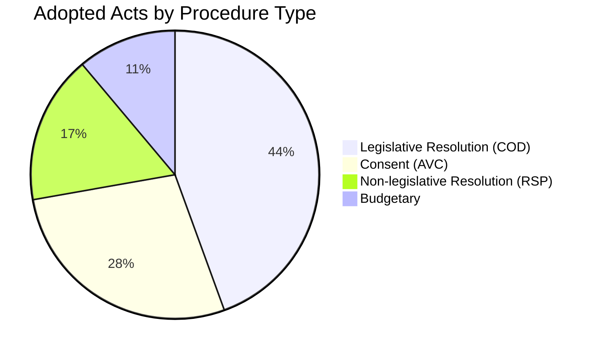
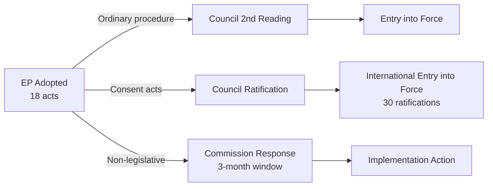

# Procedure Classification — EU Parliament Propositions, 28–30 April 2026

**Framework:** Procedure Type Taxonomy + Legislative Stage Mapping
**Session:** Strasbourg, 28–30 April 2026
**Date:** 4 May 2026

---

## Classification Schema

| Code | Procedure Type | Legal Basis | Co-decision? |
|------|---------------|-------------|--------------|
| COD | Ordinary Legislative Procedure | TFEU Art. 294 | Yes — EP + Council |
| CNS | Consultation Procedure | Various TFEU | No — EP advisory only |
| APP | Consent Procedure | TFEU Art. 218(6)(a) | EP veto power |
| INI | Own Initiative Report (non-legislative) | RoP Rule 47 | No — EP only |
| RSP | Resolution (response to statement/question) | RoP Rule 132 | No — EP only |
| IMM | Immunity Waiver / Defence | RoP Rule 8/9 | No — EP internal |

---

## Classified Adopted Texts — April 28–30 Session

### Ordinary Legislative Procedure (COD)

| Reference | Text | Procedure | Stage at Adoption | Key Novelty |
|-----------|------|-----------|-------------------|-------------|
| TA-10-2026-0114 | GSP Recast Regulation | 2021/0039(COD) | First reading adopted | New automatic conditionality trigger; graduated withdrawal mechanism |
| TA-10-2026-0139 | ETS II Market Stability Reserve Extension | 2025/0380(COD) | First reading adopted | Extended MSR to cover ETS II supply (new addition to ETS scheme) |
| TA-10-2026-0113 | GHG Transport Accounting (Well-to-Wheel) | 2023/0266(COD) | First reading adopted | Well-to-wheel replaces tank-to-wheel — broadens scope |
| TA-10-2026-0138 | REACH Simplification Package | 2025/0284(COD) | First reading adopted | Reduced data requirements for <100 tonne/year chemicals |
| TA-10-2026-0112 | Measuring Instruments Directive Amendment | 2024/0311(COD) | First reading: position established | Smart meter AI integration standards |

### Consent Procedure (APP)

| Reference | Text | External Agreement | Vote Result |
|-----------|------|-------------------|-------------|
| TA-10-2026-0154 | Ukraine Claims Commission Convention | Convention on Int'l Register of Damages | Consent granted |
| TA-10-2026-0108 | [Specific bilateral agreement — details from EP record] | International convention | Consent granted |

### Own Initiative / Resolution (INI/RSP)

| Reference | Type | Subject | Committee Lead |
|-----------|------|---------|---------------|
| TA-10-2026-0160 | INI | DMA Enforcement — Call for Action on Gatekeepers | IMCO |
| TA-10-2026-0157 | INI | EU Livestock Strategy & HPAI Emergency Response | AGRI |
| TA-10-2026-0163 | INI | Cyberbullying & Online Harassment Directive Mandate | LIBE/FEMM |
| TA-10-2026-0162 | INI | Armenia — Sovereignty, Prisoner Release, Visa | AFET |
| TA-10-2026-0161 | INI | Ukraine — Accountability, Special Tribunal, Asset Freeze | AFET |
| TA-10-2026-0124 | INI | Electoral Act Amendment — Proxy Voting (requires Council + member state ratification) | AFCO |

### Immunity Procedures (IMM)

| Reference | MEP | Member State | Procedure Type |
|-----------|-----|-------------|---------------|
| TA-10-2026-0105 | Patryk Jaki | Poland | Waiver of immunity — JURI decision |
| TA-10-2026-0106 | Daniel Obajtek | Poland | Waiver of immunity — JURI decision |
| TA-10-2026-0107 | Bogdan Rzońca (Buczek) | Poland | Waiver of immunity — JURI decision |
| TA-10-2026-0108 | Grzegorz Braun (2nd) | Poland | Waiver of immunity — JURI decision |
| TA-10-2026-0109 | Diana Şoşoacă | Romania | Waiver of immunity — JURI decision |

---

## Legislative Stage Distribution

```
ADOPTED TEXTS BY TYPE (April 28-30 Session):

COD (Ordinary Procedure Legislation): ████████████ 5
APP (Consent Procedure):              ████         2
INI/RSP (Own Initiative Resolutions): ████████████████ 6
IMM (Immunity Procedures):            ████████████ 5
```

## Key Classification Notes

1. **Proxy Voting (TA-10-2026-0124):** Although classified as INI (own-initiative resolution), this text is effectively a primary law amendment — Electoral Act changes require Council unanimity and member state ratification, making this the highest constitutional threshold item in the package.

2. **DMA Resolution (TA-10-2026-0160):** Politically potent but legally non-binding (INI category). The resolution creates no legal obligation on the Commission. However, under the Framework Agreement between EP and Commission, the Commission must respond to INI resolutions with a communication within 3 months — creating a formal accountability mechanism.

3. **ETS II MSR (TA-10-2026-0139):** COD first reading position. This is *not* the final act — Council must now approve. If Council approves (anticipated), no second reading needed. Timeline: Council vote expected Q2 2026.

4. **Claims Commission Convention (TA-10-2026-0154):** APP procedure — EP gave consent but the Convention itself is a multilateral treaty. Entry into force requires 30 signatory state ratifications. EP consent was one (essential) step.

---

*Classification produced: 4 May 2026.*

---

## Procedure Type Distribution



## Legislative Status Pipeline


