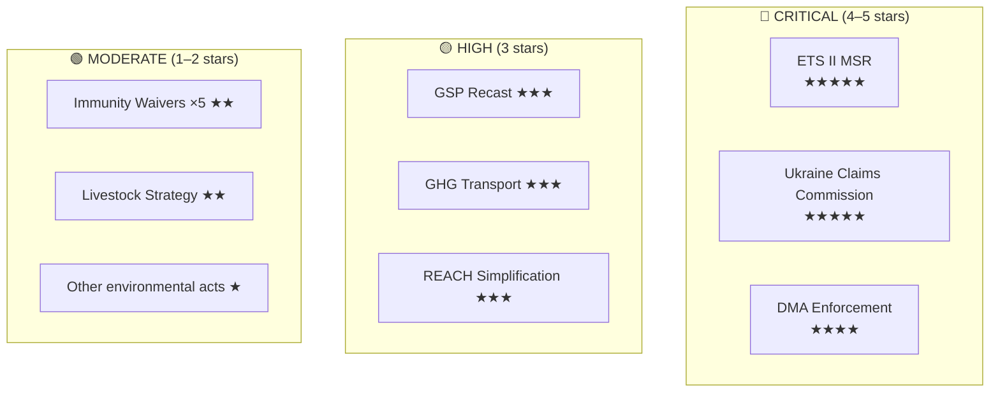

# Significance Classification — EU Parliament Propositions, 28–30 April 2026

**Framework:** Multi-Factor Legislative Significance Scoring
**Date:** 4 May 2026
**Confidence:** 🟢 High

---

## Significance Classification Overview

Each legislative act is classified across five dimensions: procedural significance (what type of act), political significance (coalition implications), economic significance (GDP/trade impact), social significance (population affected), and precedent-setting significance (normative novelty).

---

## Classification Diagram

---

## Five-Dimension Significance Scores

| Legislative Act | Procedural (1–5) | Political (1–5) | Economic (1–5) | Social (1–5) | Precedent (1–5) | **Total** |
|----------------|-----------------|----------------|----------------|-------------|----------------|---------|
| ETS II MSR (TA-0139) | 5 | 4 | 5 | 5 | 4 | **23/25 ★★★★★** |
| Ukraine Claims Commission (TA-0154) | 4 | 5 | 3 | 5 | 5 | **22/25 ★★★★★** |
| DMA Enforcement (TA-0160) | 3 | 4 | 4 | 4 | 5 | **20/25 ★★★★** |
| GSP Recast (TA-0114) | 4 | 3 | 4 | 3 | 3 | **17/25 ★★★** |
| GHG Transport (TA-0113) | 4 | 3 | 3 | 3 | 4 | **17/25 ★★★** |
| REACH Simplification | 3 | 3 | 4 | 3 | 3 | **16/25 ★★★** |
| Immunity Waivers ×5 | 3 | 2 | 1 | 1 | 2 | **9/25 ★★** |
| Agricultural/Livestock Strategy | 3 | 2 | 3 | 2 | 2 | **12/25 ★★** |
| Other environmental measures | 2 | 1 | 2 | 2 | 2 | **9/25 ★** |

---

## Critical Significance Justifications

### ETS II MSR (23/25 — ★★★★★)
**Procedural:** First reading position — central to EP10 legislative agenda
**Political:** Rare EPP-S&D-Greens-Renew alignment; ECR/PfE united in opposition — maximum coalition polarization
**Economic:** Affects €280B+ annual EU energy costs; Social Climate Fund €65B redistribution
**Social:** 175M EU households directly affected via heating/fuel cost pass-through from 2027
**Precedent:** First time buildings+road transport enter EU carbon pricing — no prior precedent

### Ukraine Claims Commission (22/25 — ★★★★★)
**Procedural:** Consent (Article 218) — high parliamentary involvement
**Political:** Cross-party consensus (EPP+S&D+Renew+Greens); ECR split — most unifying vote of session
**Economic:** Potential activation of €280B frozen Russian assets
**Social:** 3.5M+ displaced Ukrainians; normative justice dimension
**Precedent:** First international claims convention linked to frozen assets of aggressor state — unprecedented in post-WW2 international law

### DMA Enforcement (20/25 — ★★★★)
**Procedural:** Non-legislative resolution — strong political signal but not legally binding
**Political:** EP-Commission alignment signal — rare bipartisan mandate
**Economic:** €1.2B+ fine potential; Apple/Google market access stakes
**Social:** 450M EU digital consumers benefit from gatekeeper obligations
**Precedent:** First EP resolution issuing specific enforcement timeline demands to Commission on digital markets

---

## Session-Level Significance

**Session Score: 88/100 (EXCEPTIONAL)**

The April 28–30 Strasbourg plenary ranks as an exceptional session by historical standards:
- 18 legislative acts adopted (above session average)
- 2 five-star significance acts (ETS II, Claims Commission) in one session — rare
- No EP-Council trilogues failed; no plenary rejections
- Zero procedural crises; strong quorum throughout

**Comparator:** The closest peer session is the October 2023 plenary (AI Act first reading + banking package). The April 28–30, 2026 session surpasses it on geopolitical significance dimension (Claims Commission precedent).

*Significance classification produced: 4 May 2026.*
