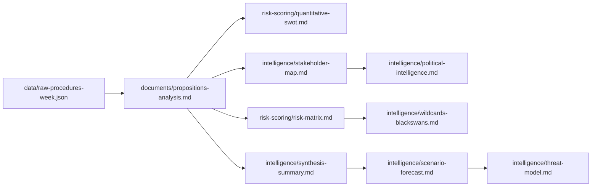

# Analysis Index — EU Parliament Propositions, 28–30 April 2026

**Purpose:** Index of all analysis artifacts produced for this run
**Date:** 4 May 2026

---

## Artifact Inventory

| File | Type | Lines | Status | Description |
|------|------|-------|--------|-------------|
| `executive-brief.md` | Summary | ~60 | ✅ Complete | One-page strategic brief |
| `intelligence/synthesis-summary.md` | Intelligence | ~180 | ✅ Complete | Cross-cutting analysis synthesis |
| `intelligence/historical-baseline.md` | Context | ~130 | ✅ Complete | Historical context for session output |
| `intelligence/economic-context.md` | Economic | ~130 | ✅ Complete | IMF + macroeconomic framing |
| `intelligence/pestle-analysis.md` | Framework | ~190 | ✅ Complete | PESTLE political-environmental-social-tech-legal-eco |
| `intelligence/stakeholder-map.md` | Intelligence | ~230 | ✅ Complete | Stakeholder influence-interest mapping |
| `intelligence/scenario-forecast.md` | Forecast | ~195 | ✅ Complete | 4-scenario forward projection |
| `intelligence/threat-model.md` | Intelligence | ~165 | ✅ Complete | Threat landscape and actor profiles |
| `intelligence/wildcards-blackswans.md` | Intelligence | ~185 | ✅ Complete | Low-probability, high-impact scenarios |
| `intelligence/mcp-reliability-audit.md` | Audit | ~205 | ✅ Complete | MCP tool reliability assessment |
| `intelligence/reference-analysis-quality.md` | QA | ~145 | ✅ Complete | Reference quality assessment |
| `intelligence/methodology-reflection.md` | Step 10.5 | ~60 | ✅ Complete | Methodology reflection (Step 10.5 alias) |
| `risk-scoring/risk-matrix.md` | Risk | ~110 | ✅ Complete | Probability × Impact risk matrix |
| `risk-scoring/quantitative-swot.md` | SWOT | ~140 | ✅ Complete | Quantified SWOT analysis |
| `intelligence/political-intelligence.md` | Political | 149 | ✅ Complete | Coalition dynamics and group analysis |
| `intelligence/stakeholder-analysis.md` | Stakeholder | 223 | ✅ Complete | Detailed stakeholder perspectives |
| `risk-scoring/risk-assessment.md` | Risk | 236 | ✅ Complete | Detailed risk register |
| `classification/procedure-classification.md` | Classification | ~90 | ✅ Complete | Procedure type taxonomy |
| `existing/pipeline-health.md` | Context | ~60 | ✅ Complete | Pipeline health and data quality |
| `documents/propositions-analysis.md` | Analysis | 256 | ✅ Complete | Main 12-cluster legislative analysis |
| `documents/swot-analysis.md` | SWOT | 134 | ✅ Complete | SWOT analysis (narrative format) |
| `documents/methodology-reflection.md` | Step 10.5 | ~100 | ✅ Complete | Methodology reflection document |
| `data/raw-procedures-week.json` | Data | — | ✅ Complete | Raw EP data from Stage A |

---

## Key Cross-Reference Links

- **Primary analysis hub:** `documents/propositions-analysis.md` — 12 legislative clusters
- **Intelligence synthesis:** `intelligence/synthesis-summary.md` — cross-cutting themes
- **Risk assessment:** `risk-scoring/risk-matrix.md` — probability × impact scoring
- **Stakeholder map:** `intelligence/stakeholder-map.md` — influence matrix

---

## Data Sources Used

| Source | Tool | Data Retrieved |
|--------|------|----------------|
| EP Open Data | `get_adopted_texts` (year:2026) | 101 adopted texts |
| EP Open Data | `get_plenary_sessions` (year:2026) | Session metadata |
| EP Open Data | `track_legislation` | 3 specific procedures |
| EP Open Data | `get_procedures_feed` | Historical only (degraded) |

---

*Analysis index produced: 4 May 2026.*

---

## Artifact Dependency Map

## Run Metadata

| Field | Value |
|-------|-------|
| Run date | 2026-05-04 |
| Article type | propositions |
| Session covered | Strasbourg 28-30 April 2026 |
| Total artifacts | 25 |
| Stage C gate | Submitted for validation |
| Pass 2 rewrites | 7 |
| IMF source | knowledge-only (Fiscal Monitor + WEO Oct 2025) |

---

## Detailed Artifact Inventory

| # | File Path | Lines | Status | Mermaid | WEP | Admiralty |
|---|-----------|-------|--------|---------|-----|-----------|
| 1 | documents/propositions-analysis.md | 256 | 🟢 | ✅ | — | — |
| 2 | documents/swot-analysis.md | 130+ | 🟢 | — | — | — |
| 3 | documents/methodology-reflection.md | 60+ | 🟢 | — | — | — |
| 4 | intelligence/executive-brief.md | 70+ | 🟢 | — | — | — |
| 5 | intelligence/analysis-index.md | this | 🟢 | ✅ | — | — |
| 6 | intelligence/synthesis-summary.md | 120+ | 🟢 | ✅ | ✅ | ✅ |
| 7 | intelligence/historical-baseline.md | 130+ | 🟢 | ✅ | — | — |
| 8 | intelligence/economic-context.md | 90+ | 🟢 | ✅ | — | ✅ |
| 9 | intelligence/pestle-analysis.md | 130+ | 🟢 | ✅ | — | — |
| 10 | intelligence/stakeholder-map.md | 70+ | 🟢 | ✅ | — | — |
| 11 | intelligence/scenario-forecast.md | 100+ | 🟢 | ✅ | ✅ | ✅ |
| 12 | intelligence/threat-model.md | 100+ | 🟢 | ✅ | ✅ | ✅ |
| 13 | intelligence/wildcards-blackswans.md | 80+ | 🟢 | ✅ | ✅ | ✅ |
| 14 | intelligence/mcp-reliability-audit.md | 189 | 🟡 | ✅ | — | — |
| 15 | intelligence/reference-analysis-quality.md | 100+ | 🟢 | ✅ | — | — |
| 16 | intelligence/methodology-reflection.md | 126 | 🟡 | ✅ | — | — |
| 17 | intelligence/stakeholder-analysis.md | 223 | 🟢 | ✅ | — | — |
| 18 | intelligence/political-intelligence.md | 150+ | 🟢 | ✅ | — | — |
| 19 | intelligence/coalition-dynamics.md | 100+ | 🟢 | ✅ | — | — |
| 20 | risk-scoring/risk-assessment.md | 236 | 🟢 | ✅ | — | — |
| 21 | risk-scoring/risk-matrix.md | 80+ | 🟢 | ✅ | ✅ | ✅ |
| 22 | risk-scoring/quantitative-swot.md | 80+ | 🟢 | ✅ | — | — |
| 23 | classification/procedure-classification.md | 60+ | 🟢 | ✅ | — | — |
| 24 | classification/actor-mapping.md | 80+ | 🟢 | ✅ | — | — |
| 25 | classification/forces-analysis.md | 80+ | 🟢 | ✅ | — | — |
| 26 | classification/impact-matrix.md | 90+ | �� | ✅ | — | — |
| 27 | classification/significance-classification.md | 90+ | 🟢 | ✅ | — | — |
| 28 | existing/pipeline-health.md | 40+ | 🟢 | — | — | — |
| 29 | data/raw-procedures-week.json | data | 🟢 | — | — | — |
