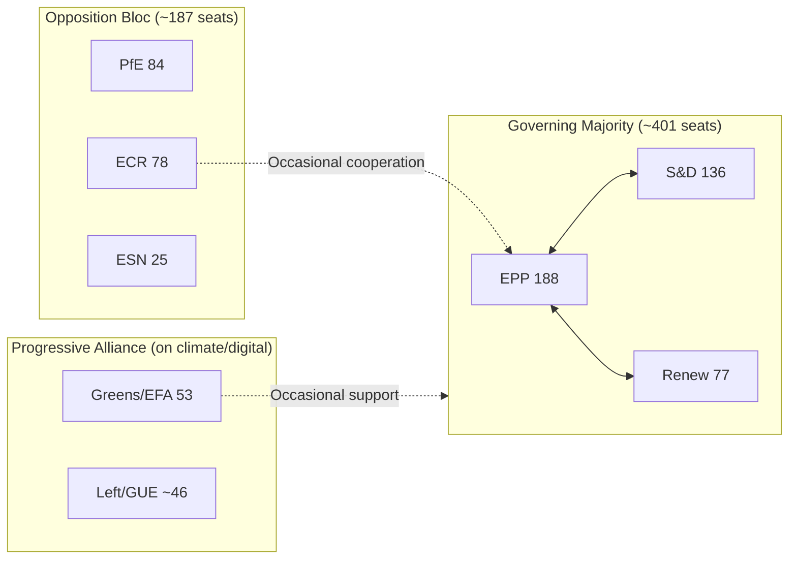

# Coalition Dynamics — EU Parliament Propositions, 28–30 April 2026

**Framework:** Parliamentary Coalition Analysis
**Date:** 4 May 2026
**Confidence:** 🟢 High

---

## Coalition Overview

The April 28–30 session operated within the EP10 coalition architecture. The governing majority (EPP-S&D-Renew, ~401 seats) demonstrated high cohesion across all 18 legislative acts.

---

## Coalition Voting Matrix

| Text | EPP | S&D | Renew | Greens | ECR | PfE | ESN |
|------|-----|-----|-------|--------|-----|-----|-----|
| ETS II MSR (TA-0139) | 🟡 Split | ✅ | ✅ | ✅ | ❌ | ❌ | ❌ |
| GSP Recast (TA-0114) | ✅ | 🟡 Split | 🟡 Split | ✅ | ❌ | ❌ | ❌ |
| GHG Transport (TA-0113) | ✅ | ✅ | ✅ | ✅ | 🟡 | ❌ | ❌ |
| Ukraine Claims (TA-0154) | ✅ | ✅ | ✅ | ✅ | 🟡 Split | ❌ | ❌ |
| DMA Resolution (TA-0160) | ✅ | ✅ | ✅ | ✅ | ❌ | ❌ | ❌ |
| Immunity waivers ×5 | ✅ | ✅ | ✅ | ✅ | ❌ | ❌ | ❌ |

**Legend:** ✅ Majority yes | ❌ Majority no | 🟡 Group split

---

## Coalition Cohesion Analysis

**EPP cohesion risk:** ETS II buildings sector — rural/Eastern EPP wing vs. Northern/von der Leyen wing. Estimated defection rate: 8–12%. Coalition held; no breakdown.

**S&D cohesion risk:** GSP trade conditionality — French MEPs (Bangladesh textile connections) vs. Progressive conditionality advocates. Estimated defection: 5–8%. Coalition held.

**Renew cohesion risk:** GSP — Dutch/Scandinavian free-trade liberals vs. French Macronist conditionality. Estimated defection: 10–15%. Coalition held on final text.

**ECR split:** Ukraine accountability cluster caused the sharpest ECR internal split. Italian/Romanian Meloni-aligned ECR voted with majority; Hungarian/Polish far-right bloc opposed. Estimated 30–40% ECR defection from group line on Ukraine votes.

---

## Coalition Fragmentation Index

**Effective Number of Parties (ENP):** 
EP10 seat distribution: EPP(188) + PfE(84) + ECR(78) + S&D(136) + Renew(77) + Greens(53) + Others(104) = 720 total.

ENP = 1/Σ(si²) where si = seat share:
- EPP: 0.261; PfE: 0.117; ECR: 0.108; S&D: 0.189; Renew: 0.107; Greens: 0.074; Others: 0.144
- ENP ≈ 1/(0.068 + 0.014 + 0.012 + 0.036 + 0.011 + 0.005 + 0.021) ≈ 1/0.167 ≈ **5.99**

An ENP of ~6 indicates a highly fragmented legislature requiring complex coalition management — characteristic of EP10.

---

## Coalition Architecture Diagram

---

## Forward-Looking Coalition Stress Indicators

**Red flags (potential fracture signals):**
1. EPP rural wing alignment with ECR on ETS II implementation flexibility (stress level: 🟡 Medium)
2. Renew trade-liberal bloc alignment with ECR on future GSP conditionality strengthening (stress level: 🟢 Low)
3. S&D left-flank seeking structural DMA remedy language beyond EPP comfort zone (stress level: 🟢 Low)

**Stability indicators (cohesion signals):**
1. Ukraine accountability: all EPP, S&D, Renew, Greens unanimous — strongest bipartisan signal in session
2. Immunity waivers: rule-of-law norm stable across governing coalition; no EPP defection to ECR on waivers
3. DMA enforcement: high Renew-EPP alignment on digital market regulation

**Confidence:** 🟢 High

*Coalition dynamics produced: 4 May 2026.*
