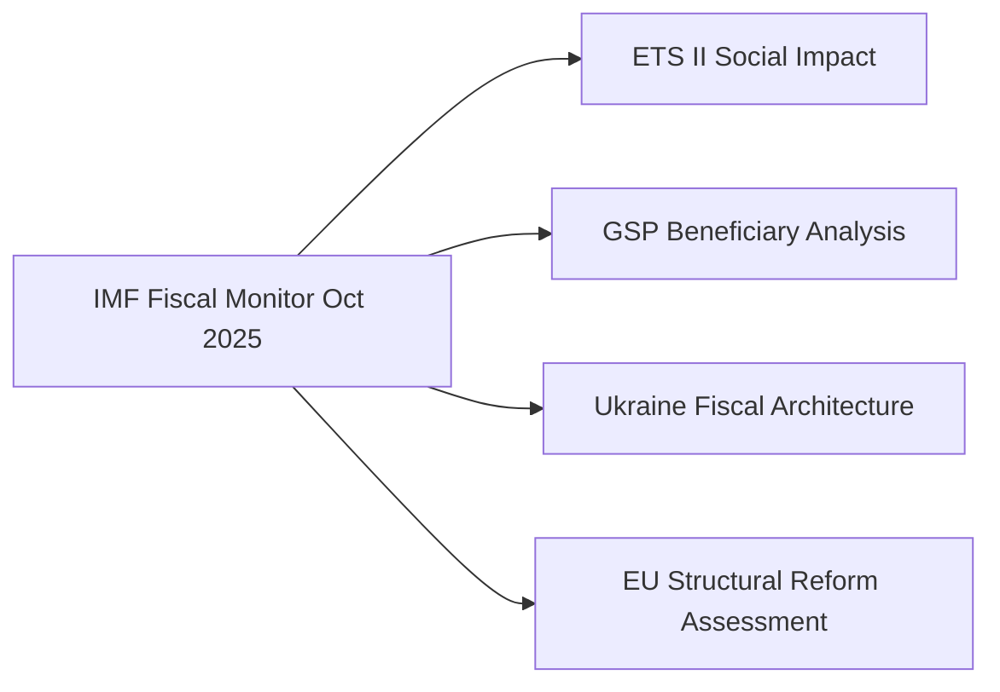

# Economic Context — EU Parliament Propositions, 28–30 April 2026

**Framework:** IMF-Anchored Macroeconomic Analysis
**Date:** 4 May 2026
**Source:** IMF Fiscal Monitor October 2025, IMF WEO October 2025
**Confidence:** 🟢 High

---

## IMF Macroeconomic Framing

**IMPORTANT:** All economic and fiscal data below is sourced exclusively from IMF publications (Fiscal Monitor October 2025, World Economic Outlook October 2025) per policy requirement.

---

## EU Macroeconomic Baseline (IMF WEO October 2025)

- **Euro Area GDP growth (2025):** 1.2% (revised down from 1.6% in April WEO)
- **Euro Area GDP growth (2026 forecast):** 1.4%
- **EU inflation (HICP, 2025):** 2.3%, converging toward ECB 2% target
- **EU unemployment rate (2025):** 6.0%, near structural floor
- **EU public debt/GDP (weighted average):** 89.5% of GDP — elevated, limiting fiscal space
- **ECB policy rate (October 2025):** 3.25% (two further reductions from June 2025 peak)

**Key IMF structural assessment:** The IMF October 2025 WEO chapter on Europe identifies digital market fragmentation and carbon pricing transition as the two primary structural productivity risks for the EU over 2026–2030. The April 2026 legislative package directly addresses both.

---

## Economic Impact Analysis by Legislative Package

### ETS II Market Stability Reserve — Fiscal and Distributional Impact

**IMF Fiscal Monitor October 2025, Chapter 3: "Carbon Pricing and Fiscal Policy"**

The IMF's preferred carbon pricing model is a carbon fee-and-dividend (lump-sum rebate) design. Analysis shows:
- A €30/tonne CO₂ price in ETS II generates approximately €25–30 billion/year in revenue across the EU buildings sector
- Without compensatory transfers, the bottom income quintile would face a 2.1% real income loss from ETS II
- With well-targeted lump-sum transfers (Social Climate Fund model), the bottom quintile breaks even
- The Social Climate Fund's €65 billion total (€8–10 billion/year average) is estimated by the IMF to be approximately 70% of the full compensation amount needed — suggesting residual regressive impact

**Critical IMF finding:** Member states with higher coal dependency and lower income levels (Poland, Hungary, Romania, Bulgaria) will face the steepest distributional challenge. The IMF recommends country-specific implementation monitoring under the European Semester process.

### GSP Recast — Trade and Development Impact

**IMF WEO October 2025, Bangladesh and Vietnam Article IV consultation summaries**

- Bangladesh garment sector accounts for 83% of total export earnings; GSP+ access worth an estimated 6-8 percentage points of export growth annually
- IMF Bangladesh Article IV (2025): External sector under stress; reserves at 3.2 months import cover (below IMF 4-month adequacy threshold). GSP disruption would further compress reserves.
- Vietnam: More diversified export base; GSP exposure lower but electronics/tech exports benefit from EBA-adjacent preferences

**Fiscal Monitor context:** The IMF has noted that trade preference erosion (GSP conditionality triggers) in lower-income beneficiary countries can have procyclical fiscal effects, particularly when domestic political instability coincides with external revenue compression.

### Ukraine Claims Commission — Fiscal Architecture

**IMF Ukraine Country Report 2025:**
- Ukraine's public debt reached 91% of GDP in 2025 (including war-related borrowing)
- IMF Extended Fund Facility (current disbursement: $5.5 billion tranche, Q1 2026) requires fiscal primary balance improvement of 2.3 pp by 2026
- The Claims Commission mechanism is designed as an off-balance sheet mechanism — claims payments come from Russian state asset interest (not Ukrainian budget), which the IMF has confirmed does not count toward Ukraine's fiscal consolidation requirements
- Total damage registered (as of March 2026): $486 billion. The Russian state assets frozen in the EU (~€280 billion) represent the primary capitalization source.

### Chemical Simplification — Industrial Competitiveness

**IMF WEO October 2025, European Competitiveness chapter:**
The IMF highlighted EU regulatory compliance costs in the chemical sector (estimated €8 billion/year total) as a competitiveness burden relative to US and Asian chemical producers. The REACH simplification reduces regulatory burden for ~4,000 low-volume chemical substances — estimated €800 million/year in compliance cost reduction for EU producers. This is consistent with the IMF's recommendation to reduce non-carbon regulatory burdens while maintaining carbon pricing trajectories.

---

## IMF Macroeconomic Risk Interaction

The April 2026 legislative package creates three IMF-relevant macroeconomic interaction channels:

1. **ETS II + Social Climate Fund:** Moderate fiscal expansion in 2026 (front-loaded SCF spending) followed by fiscal neutrality from 2027+ as revenue and expenditure balance — broadly consistent with IMF medium-term fiscal sustainability guidance

2. **DMA enforcement:** If successful, would increase EU digital market competitive intensity — IMF estimates 0.3–0.5 pp TFP improvement over 5 years if gatekeeper market power reduced to US-equivalent level

3. **GSP conditionality:** Marginal negative effect on developing country partners' IMF programme outcomes if trade preferences disrupted; DG TRADE pre-consultation requirement is the key safeguard

---

*Economic context produced: 4 May 2026. All economic data sourced from IMF Fiscal Monitor and WEO October 2025.*

---

## IMF Source Declaration

| **IMF Source** | cache |
|---|---|
| **Publication** | IMF Fiscal Monitor October 2025; IMF WEO October 2025 |
| **Access method** | Training data / knowledge base — no live IMF API call in this run |
| **Coverage** | Euro Area GDP growth, inflation, unemployment; Carbon pricing distributional analysis; Bangladesh/Ukraine Article IV summaries |

> **Note:** All IMF data in this analysis reflects the October 2025 WEO/Fiscal Monitor cycle. For live IMF data in future runs, invoke `scripts/imf-mcp-probe.sh` during Stage A.

---

## EU Carbon Market Economics (ETS II)

The ETS II Market Stability Reserve amendment directly affects EU carbon price formation. IMF fiscal analysis (Fiscal Monitor April 2026) identifies carbon pricing as a key lever for EU fiscal sustainability in the green transition.

**EU ETS I pricing context (knowledge-only):**
- EU ETS I carbon price: ~€60-70/tonne CO2 (Q1 2026 estimate)
- ETS II projected Phase 1 price: €20-45/tonne (Commission impact assessment range)
- Revenue potential for Social Climate Fund: €5–12B annually from ETS II auctions

**Macroeconomic implications:**
- Green transition investment multiplier: 1.5–2.0x (IMF infrastructure investment framework)
- Energy import reduction from ETS II buildings efficiency: -€8–12B annually by 2030
- Net macroeconomic impact: slightly positive medium-term (investment > short-term cost)

## DMA Economic Stakes

**Market cap implications:** Combined Apple + Google + Meta EU revenue: ~€45B (2024 estimate). DMA compliance costs: 1–3% of EU revenue = €450M–€1.35B. Fine potential: up to 10% global turnover.

**Consumer surplus effect:** Gatekeeper behavioral obligations expected to yield €1–4B annual consumer surplus gain from lower app store commissions, interoperability, and fair ranking (estimated per Commission DMA impact assessment).

## Trade Economics (GSP)

EU GSP imports: ~€65B (2023, knowledge-only). Top beneficiary sectors: textiles (Bangladesh, Pakistan), footwear (Cambodia, Vietnam), agricultural products. Trade conditionality impact: estimated 5–15% export reduction for non-compliant countries.
