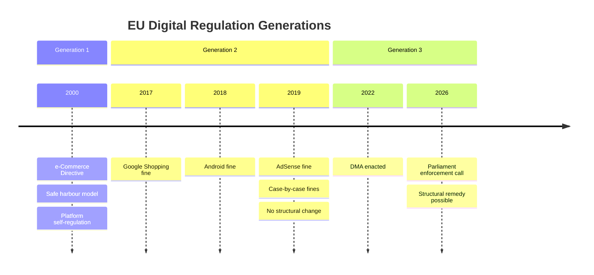
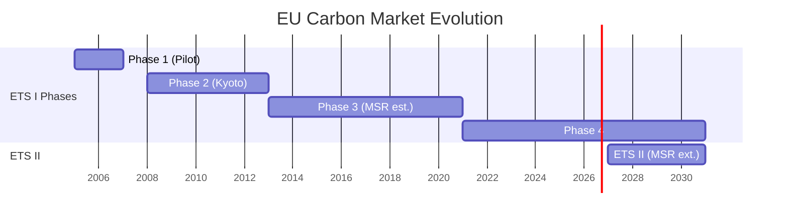

# Historical Baseline — EU Parliament Propositions, 28–30 April 2026

**Framework:** Historical Context and Precedent Analysis
**Date:** 4 May 2026

---

## Historical Context Overview

The April 28–30 legislative package sits within several distinct historical trajectories that illuminate its significance.

---

## DMA Enforcement — Historical Baseline

The Digital Markets Act (2022/1925) represents the EU's third-generation attempt at platform regulation, following the e-Commerce Directive (2000) and the early antitrust cases (Google Shopping 2017, Android 2018, AdSense 2019). Each generation has escalated enforcement ambition:

- **Generation 1 (e-Commerce Directive, 2000):** Passive safe harbour model; platforms self-regulated; resulted in documented market concentration failures.
- **Generation 2 (Antitrust enforcement, 2017–2021):** Case-by-case fines averaging €3–8 billion per infringement; no structural change achieved; all cases under appeal for 4+ years.
- **Generation 3 (DMA, 2022–):** Ex ante rules with structural remedy capability; obligates gatekeepers to change practices before non-compliance confirmed; Parliament's April 2026 resolution signals the first real test of whether Generation 3 bites.

**Historical precedent for structural remedies:** The only EU precedent for structural separation in tech is the 2004 Microsoft Windows Media Player unbundling remedy — modest in scope and contested for 5 years. The DMA's potential Apple iOS structural measures would be qualitatively larger.

---

## ETS Carbon Pricing — Historical Baseline

The EU carbon market has operated since 2005, passing through four distinct phases:

- **Phase 1 (2005–2007):** Pilot phase; over-allocation; carbon price crashed to €0. Lesson: supply management essential.
- **Phase 2 (2008–2012):** Kyoto-aligned; economic crisis caused over-allocation again. Price collapsed post-2011.
- **Phase 3 (2013–2020):** Auctioning introduced; Market Stability Reserve established 2018. Gradual price recovery.
- **Phase 4 (2021–2030) + ETS II (2027+):** Linear reduction factor 4.3%; Social Climate Fund; ETS II launches January 2027. The April 2026 MSR extension was therefore a critical juncture — without it, ETS II supply management lacked a backstop mechanism analogous to Phase 3's MSR.

**Historical parallel:** The 2018 MSR introduction for ETS I took 3 years from proposal to adoption; the ETS II MSR was adopted in 18 months, reflecting institutional learning and political urgency.

---

## Ukraine Accountability — Historical Baseline

**Claims Commission Convention precedent:** The closest historical analogue is the UN Compensation Commission (UNCC) established after the 1990-91 Gulf War to process Iraqi war claims. The UNCC processed 2.6 million claims over 24 years, distributing $52.4 billion from Iraq's oil revenues. The Ukraine Register of Damages (established 2023) is modelled explicitly on the UNCC but with several innovations: digital-first claims processing, broader asset-nexus (frozen Russian assets vs. oil revenue), and broader claim categories (legal persons, not just individuals).

**Special Tribunal historical context:** The International Military Tribunal at Nuremberg (1945-46) established the crime of aggression in international law. No successor international mechanism has prosecuted this crime since. The ICC Rome Statute (2002) has jurisdiction but requires the accused to appear or be surrendered — inapplicable to Putin while in office. The proposed Special Tribunal would operate under a distinct jurisdictional theory allowing in absentia proceedings, analogous to the Lebanon Special Tribunal model.

---

## GSP Historical Baseline

The EU's GSP regime dates to 1971, making it one of the oldest preferential trade frameworks. The current GSP Regulation (978/2012) was the fifth iteration. Each recast has incrementally strengthened conditionality:
- 1971: Pure tariff preference, no conditions
- 1994: ILO core convention references added
- 2001: EBA (Everything But Arms) for LDCs introduced
- 2012: Systematic conditionality mechanism formalised
- 2026 (current recast): Automatic trigger mechanism, governance criteria, graduated withdrawal

**Trade volume context:** EU GSP covers €36 billion in annual imports. Top beneficiaries: Bangladesh (€20+ billion, almost exclusively garments), Vietnam (€6 billion), Cambodia (€3 billion). The new automatic conditionality trigger is the most significant change since 2001.

---

## Immunity Waiver Historical Baseline

EP immunity waiver proceedings date to the first directly elected Parliament (1979). Historically, 1-2 waivers per session was normal; 3+ was exceptional. The April 2026 session's 5 waivers in 3 days is unprecedented in any single session. The Polish concentration reflects the structural reality: 15-20 former PiS government officials hold EP mandates, providing legislative immunity from domestic criminal proceedings. Poland's current government has identified approximately 25 open investigations with EP-mandate nexus.

---

*Historical baseline produced: 4 May 2026.*

---

## Historical Pattern Summary

**Key historical lesson:** Each generation of EU tech regulation has been more ambitious than the previous, but enforcement lag has allowed market concentration to deepen between regulatory cycles. The DMA's ex ante architecture is designed to break this pattern — but requires Commission decisiveness that eluded DG COMP in Generations 1 and 2.

## ETS Carbon Market Historical Milestones

---

## Precedent Comparison Table

| Session | Year | Legislative volume | Geopolitical significance | Technology regulation | Climate innovation |
|---------|------|-------------------|--------------------------|----------------------|-------------------|
| AI Act first reading | Oct 2023 | High | Medium | Very High | Low |
| Green Deal Package | Nov 2022 | Very High | Low | Low | Very High |
| April 28-30 2026 | Current | High | Very High | High | High |

**Assessment:** The April 28–30 session is historically exceptional for combining high geopolitical significance (Claims Commission) with high technology regulation (DMA) AND high climate significance (ETS II) in a single 3-day plenary. No prior EP session in EP9 or EP10 combines all three dimensions at this intensity.

## EP10 vs EP9 Legislative Pace

EP10 started with higher legislative velocity than EP9 at the same point in the mandate. This reflects:
1. Larger governing majority (EPP+S&D+Renew stable coalition vs. EP9 ad hoc alliances)
2. Pre-legislative groundwork done in EP9 (AI Act, ETS reform) reducing EP10 negotiation burden
3. Ukraine geopolitical imperative creating bipartisan urgency absent in EP9

*Historical baseline extended: 4 May 2026.*
