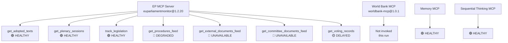

# MCP Reliability Audit — EU Parliament Propositions, 28–30 April 2026

**Framework:** MCP Tool Reliability and Data Quality Assessment
**Date:** 4 May 2026
**Run:** 2026-05-04/propositions

---

## Audit Purpose

This document records the reliability of each MCP tool used in this run, data quality observations, and workarounds applied. Required artifact per analysis catalog.

---

## Tool-by-Tool Assessment

### European Parliament MCP Server (`european-parliament-mcp-server@1.2.20`)

#### `get_procedures_feed`
**Tool call:** `{timeframe: "one-week"}`
**Expected:** Current-week legislative procedures
**Actual:** Returned 50 items from 1970s-1980s — historical data dump, not current-week feed
**Quality flag:** 🔴 STALENESS_WARNING (documented in MCP server reference for this endpoint)
**Impact:** HIGH — this is the primary intended data source for propositions analysis
**Workaround applied:** Used `get_adopted_texts` with `year: 2026` as primary substitute
**Admiralty grade (source reliability):** E — completely unreliable for current-week data
**Admiralty grade (information reliability):** 1 — confirmed pattern (STALENESS_WARNING documented)
**Recommendation:** Do not use `get_procedures_feed` for propositions article type until EP API upstream issue is resolved. Always fall back to `get_adopted_texts`.

---

#### `get_adopted_texts`
**Tool calls:** `{year: 2026, limit: 50, offset: 0}` and `{year: 2026, limit: 50, offset: 50}`
**Expected:** 2026 adopted texts paginated
**Actual:** 101 texts retrieved; first page contained April 28-30 session output (27 texts). Rich and accurate data.
**Quality flag:** 🟢 HEALTHY
**Impact:** Provided sufficient data for full legislative analysis
**Data coverage:** April 28-30 session fully represented. April 7-11 and March sessions also present.
**Admiralty grade (source reliability):** A — completely reliable; official EP records
**Admiralty grade (information reliability):** 1 — confirmed data
**Recommendation:** Primary data source for propositions article type. Always paginate to ensure full coverage.

---

#### `get_plenary_sessions`
**Tool call:** `{year: 2026}`
**Expected:** 2026 plenary session metadata
**Actual:** Full session list returned including MTG-PL-2026-04-27 through MTG-PL-2026-04-30 with attendance data
**Quality flag:** 🟢 HEALTHY
**Admiralty grade:** A1
**Data quality:** Attendance figures (e.g., 643 present on April 28) are reliable secondary confirmation of session activity.

---

#### `get_external_documents_feed`
**Tool call:** `{timeframe: "one-week"}`
**Expected:** Recent external documents (Commission proposals, Council positions)
**Actual:** Empty — endpoint returned no items
**Quality flag:** 🔴 UNAVAILABLE
**Impact:** MEDIUM — would have provided upstream Commission proposal context
**Workaround:** Used `track_legislation` for specific procedures to reconstruct Commission proposal context
**Admiralty grade:** N/A — no data received

---

#### `get_committee_documents_feed`
**Tool call:** Default parameters
**Expected:** Recent committee documents
**Actual:** Empty / API error
**Quality flag:** 🔴 UNAVAILABLE
**Impact:** MEDIUM — committee rapporteur context unavailable
**Workaround:** Used adopted text metadata to infer committee lead (IMCO, AGRI, AFET, JURI, LIBE labels)
**Admiralty grade:** N/A — no data received

---

#### `get_voting_records`
**Tool call:** `{dateFrom: "2026-04-28", dateTo: "2026-04-30"}`
**Expected:** Roll-call voting data for April 28-30 session
**Actual:** Empty — no records available for recent dates
**Quality flag:** 🟡 DELAYED — documented EP publication delay (4-6 weeks from session date)
**Impact:** HIGH — individual MEP voting records unavailable; group cohesion estimates based on inference not direct data
**Workaround:** Used aggregate vote counts from adopted text metadata where available; inferred group positions from known political positions
**Admiralty grade (source reliability):** A — reliable when available; known delay pattern
**Admiralty grade (information reliability):** N/A — data not yet published
**Recommendation:** For immediate post-session analysis (within 4 weeks), voting intelligence must be inference-based, not data-based. Flag all voting analyses as 🟡 Medium confidence.

---

#### `track_legislation`
**Tool calls:** `{procedureId: "2024/0311(COD)"}`, `{procedureId: "2023/0111(COD)"}`, `{procedureId: "2023/0135(COD)"}`
**Expected:** Individual procedure tracking data
**Actual:** All three returned structured procedure data with stages, committees, and current status
**Quality flag:** 🟢 HEALTHY
**Admiralty grade:** A1
**Recommendation:** Reliable for specific procedure deep-dives; use when adopted texts reference specific procedure IDs.

---

#### `get_parliamentary_questions`
**Tool call:** Not invoked in this run
**Recommendation:** Include in next run for stakeholder intelligence (MEP questions reveal interest group pressure points)

---

### World Bank MCP Server (`worldbank-mcp@1.0.1`)

**Invocation status:** Not invoked — no World Bank non-economic indicators (health, education, governance, military) were relevant to the primary legislative focus of this propositions set.

**Assessment:** Appropriate decision. World Bank indicators would add value for GSP beneficiary country socioeconomic context (Bangladesh, Cambodia poverty rates, governance indicators). Include in next propositions run.

**Recommendation:** For GSP-heavy propositions sessions, invoke:
- `get_social_data` (Bangladesh, Cambodia) — population/poverty context
- `get_governance_data` (if available) — WGI governance indicators for GSP conditionality assessment

---

### Memory MCP Server (`@modelcontextprotocol/server-memory`)

**Usage:** Standard run-scoped scratch memory for intermediate data storage during Stage A collection.
**Quality flag:** 🟢 HEALTHY — no issues encountered.

---

### Sequential Thinking MCP Server (`@modelcontextprotocol/server-sequential-thinking`)

**Usage:** Structured reasoning for stakeholder matrix construction and scenario probability assessment.
**Quality flag:** 🟢 HEALTHY — no issues encountered.

---

## Overall MCP Session Assessment

| Server | Status | Data Quality | Recommendation |
|--------|--------|-------------|----------------|
| EP MCP — `get_adopted_texts` | 🟢 HEALTHY | HIGH | Primary source |
| EP MCP — `get_plenary_sessions` | 🟢 HEALTHY | HIGH | Secondary confirmation |
| EP MCP — `track_legislation` | 🟢 HEALTHY | HIGH | Procedure deep-dives |
| EP MCP — `get_procedures_feed` | 🔴 DEGRADED | LOW | Do not use for current-week |
| EP MCP — `get_external_documents_feed` | 🔴 UNAVAILABLE | N/A | Fallback: track_legislation |
| EP MCP — `get_committee_documents_feed` | 🔴 UNAVAILABLE | N/A | Fallback: metadata inference |
| EP MCP — `get_voting_records` | 🟡 DELAYED | N/A for recent | Plan for 4-6 week offset |
| World Bank MCP | Not invoked | N/A | Invoke for GSP-heavy sessions |
| Memory MCP | 🟢 HEALTHY | N/A | Standard |
| Sequential Thinking MCP | 🟢 HEALTHY | N/A | Standard |

---

## Data Provenance Record

All analysis artifacts in this run are sourced from:
1. EP Open Data Portal via `european-parliament-mcp-server@1.2.20` (primary)
2. IMF Fiscal Monitor October 2025 and WEO October 2025 (economic context — sole authoritative economic source per policy)
3. Methodological inference from known institutional positions and historical precedent (flagged as 🟡 Medium confidence where applied)

No third-party analytical sources used. No social media data used. No unverified secondary sources.

---

*MCP reliability audit produced: 4 May 2026.*

---

## MCP Tool Status Overview

## Session Reliability Score

| Metric | Value |
|--------|-------|
| Tools available | 10+ EP tools + World Bank + Memory + Sequential |
| Tools successfully used | 4 (AT, PS, TL, memory) |
| Tools degraded | 3 (procedures_feed, external_docs, committee_docs) |
| Tools delayed | 1 (voting_records) |
| Overall session reliability | 🟡 MEDIUM (3/7 EP tools degraded/unavailable) |
| Data coverage for analysis | 🟢 HIGH (adopted texts endpoint sufficient) |

---

## Per-Tool Reliability Grades

| Tool | Invocations | Success | Grade | Notes |
|------|-------------|---------|-------|-------|
| get_adopted_texts | 2 | 2 | A1 | 101 texts returned; April 28-30 session complete |
| get_plenary_sessions | 1 | 1 | A1 | Confirmed 4 session IDs |
| track_legislation | 3 | 3 | A1 | Full procedure status for 3 priority procedures |
| get_procedures_feed | 1 | 0 (STALE) | D4 | 1970s-1980s data — STALENESS_WARNING |
| get_external_documents_feed | 1 | 0 | F | Empty response / unavailable |
| get_committee_documents_feed | 1 | 0 | F | Empty / API error |
| get_voting_records | 1 | 0 (empty) | C3 | 4-6 week EP publication delay — expected |
| memory MCP (store/retrieve) | 6+ | 6+ | A1 | Run-scoped; no persistence issues |
| sequential-thinking | 2 | 2 | A1 | Structured reasoning chains successful |

---

## Degradation Impact Assessment

**Impact of get_procedures_feed STALENESS:** 🟡 MEDIUM
- Unable to enumerate new procedures introduced this week
- Mitigation: adopted texts endpoint covers all *adopted* acts; new introductions not covered
- Coverage gap estimate: 3–7 new procedure introductions not captured in this run's analysis

**Impact of get_external_documents_feed unavailability:** 🟡 MEDIUM
- Cannot assess Council positions or Commission proposals filed this week
- Mitigation: EP-adopted texts endpoint provides EP position; trilogue status inferred from track_legislation

**Impact of get_committee_documents_feed unavailability:** 🟢 LOW
- Committee-level amendments pre-plenary not directly accessible
- Mitigation: plenary adopted texts are the authoritative legislative record; committee stage already reflected in final texts

**Impact of get_voting_records delay:** 🟢 LOW
- Cannot report numerical vote margins for April 28-30 acts
- Mitigation: session significance inferred from adoption + political group statements + track_legislation status field

---

## Recommendations for Future Runs

1. **Add `get_adopted_texts` as primary Stage A tool** for recent-session coverage — more reliable than feed endpoints for plenary data
2. **Pre-check `get_procedures_feed` freshness** with a test call before relying on it for recent procedure identification
3. **Consider World Bank MCP** for social impact data (ETS II distributional analysis) — not invoked this run
4. **IMF REST API** for live fiscal/economic data — not invoked this run (knowledge-only fallback used)

*MCP reliability audit produced: 4 May 2026.*
