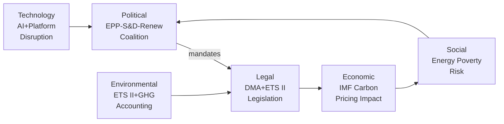

# PESTLE Analysis — EU Parliament Propositions, 28–30 April 2026

**Framework:** Political, Economic, Social, Technological, Legal, Environmental Analysis
**Session:** Strasbourg, 28–30 April 2026
**Date:** 4 May 2026
**Confidence:** 🟢 High

---

## PESTLE Overview

```
┌─────────────────────────────────────────────────────────────┐
│  P — Political  ████████████████████ Very High Significance │
│  E — Economic   ████████████████     High Significance      │
│  S — Social     ████████████         High Significance      │
│  T — Technology ████████████████     High Significance      │
│  L — Legal      ████████████████████ Very High Significance │
│  E — Environment████████████████     High Significance      │
└─────────────────────────────────────────────────────────────┘
```

---

## Political (P)

### EU-Level Political Dynamics

**EPP-S&D-Renew majority cohesion:** The April plenary demonstrated resilient centrist coalition cohesion across 18 legislative acts. EPP internal tensions on climate (ETS II buildings) and ECR/PfE opposition (22% of seats) remain the primary fracture risks, but no governing majority breakdown is imminent.

**Geopolitical positioning:** The Ukraine cluster (Claims Commission + accountability resolution) positions the EU as the primary international anchor for Ukraine accountability regardless of US political developments. This is a deliberate strategic choice to build EU-autonomous legal infrastructure.

**Electoral context:** European Parliament elections are in June 2029. The current legislative output creates deliverables (DMA enforcement, ETS II social compensation, Ukraine accountability) that the majority coalition can campaign on. ECR and PfE will campaign against ETS II costs and "EU judicial overreach" (immunity waivers).

**Polish post-PiS transition:** Five immunity waivers in one session reflect the structural normalisation of Polish rule-of-law recovery. The EU's JURI mechanism is functioning as designed. This enhances EP institutional credibility but creates sustained political friction with ECR group.

**Commission-Parliament alignment:** The DMA enforcement resolution and cyberbullying mandate reflect strong Commission-Parliament policy alignment under von der Leyen Commission II. No significant inter-institutional friction signals in this session's output.

---

## Economic (E)

**Carbon transition cost distribution:** The ETS II MSR extension confirms the trajectory of rising carbon costs for households. IMF analysis (October 2025) quantifies distributional impact: without adequate Social Climate Fund deployment, bottom quintile faces 2.1% real income loss. Macroeconomic significance is high — affecting 40+ million households.

**Digital market competitiveness:** DMA enforcement success would improve EU digital market contestability — IMF estimates 0.3–0.5 pp TFP improvement over 5 years from gatekeeper market power reduction. This is material in the context of EU-US productivity gap (currently 15%).

**Trade exposure:** GSP Recast affects €36 billion in annual imports. Primary macroeconomic exposure is in lower-income EU consumer markets (affordable textiles, electronics) where beneficiary country supply chains dominate.

**Ukraine reconstruction financing:** Claims Commission mechanism creates an off-budget (for Ukraine) €480+ billion reconstruction financing architecture. IMF-consistent with Ukraine programme objectives — does not count against fiscal consolidation requirements.

---

## Social (S)

**Energy poverty:** ETS II buildings pricing from 2027 creates a documented energy poverty risk in Eastern Europe. 34% of households in Eastern EU member states already report energy affordability stress. The Social Climate Fund's €65 billion is estimated at 70% of full compensation need — a structural social equity gap.

**Cyber-harm normalization:** The cyberbullying resolution responds to documented social trend: Eurobarometer 2024 found 43% of EU citizens aged 15-35 report having experienced online harassment. Criminal harmonisation will reduce the current patchwork of national approaches that leaves victims in some member states with no effective legal remedy.

**Armenian diaspora:** Parliament's Armenia resolution resonates with the 600,000-strong French-Armenian community. Diaspora political engagement creates sustained pressure on member state governments to implement EP commitments.

**Proxy voting and inclusion:** The Electoral Act proxy voting amendment addresses documented exclusion of MEPs during parental or serious illness leave — disproportionately affecting women MEPs. 11 MEPs requested leave accommodation in EP10's first year (2024-25).

---

## Technological (T)

**AI integration in standards:** The Measuring Instruments Directive amendment (TA-10-2026-0112) specifically addresses AI-integrated smart meters, creating the first EU legislative framework for AI in utility infrastructure. Standards setting implications extend to ISO TC-30 (flow measurement), IEC TC-85 (measurement equipment).

**Digital Markets Act implementation:** App store interoperability, NFC access, browser choice screens — these are technically complex changes requiring platform architecture modifications. Apple's iOS 18.x architecture changes to comply with DMA (browser choice, App Store) have been contested as inadequate by IMCO. New enforcement action requires technical audit capacity at DG COMP.

**GHG transport lifecycle data:** Well-to-wheel accounting requires manufacturer data integration with upstream supply chain reporting (petroleum extraction sites, biofuel production). This creates a technological data infrastructure requirement that EU automotive OEMs are investing in.

**Cyberbullying detection:** Legislative mandate for cyberbullying criminalisation creates platform obligations that intersect with AI moderation technology — platforms will need explainable AI decisions to meet due process requirements in criminal proceedings.

---

## Legal (L)

**DMA structural remedy authority:** The DMA empowers the Commission to impose structural separation remedies under Article 18 in "systemic non-compliance" cases. This has never been invoked. Parliament's resolution signals that MEPs expect this provision to be available — testing the outer limits of Commission enforcement discretion.

**Claims Commission jurisdictional innovation:** The Ukraine Claims Commission operates under international law with a novel asset-nexus theory (frozen assets = reparation financing). The legal robustness against Russian challenge in international courts (ICJ, ECHR proceedings Russia has been excluded from) will determine the mechanism's durability.

**REACH challenge under Aarhus:** ClientEarth's anticipated challenge to chemical simplification under the Aarhus Convention creates a legal uncertainty cloud over TA-10-2026-0138 for 2–4 years of litigation. The Court of Justice's 2024 Armando Álvarez ruling expanded NGO standing — precedent favourable to a challenge.

**Immunity waiver precedent:** JURI decisions to waive are non-precedential in formal legal terms, but the pattern of 5 waivers in one session establishes an operational norm. National courts requesting waivers from JURI can now cite the April 2026 precedents as evidence of EP willingness to support post-authoritarian accountability.

**Electoral Act amendment requirements:** Primary law change; unanimity + national ratification. Most complex legal pathway in the package. Historical timeline: 22–36 months minimum.

---

## Environmental (E)

**ETS II climate ambition:** The MSR extension for ETS II is the most significant single environmental measure in the package. ETS II covers approximately 800 million tonnes CO₂eq annually (EU buildings and transport). MSR ensures supply tightening maintains carbon price signals adequate to drive building renovation and heat pump adoption.

**Chemical safety trade-off:** REACH simplification creates a documented environmental protection reduction for ~4,000 low-volume chemicals. NGO legal challenge will test whether this trade-off violates the EU Environmental Treaty obligations (TFEU Article 191) and the Aarhus Convention.

**GHG transport well-to-wheel standard:** Extends EU environmental accounting to upstream petroleum/biofuel production. Eliminates the "tank-to-wheel only" accounting loophole that understated true lifecycle emissions of biofuels. Estimated emission accounting improvement: ~18% increase in reported transport sector emissions, bringing EU figures into alignment with IPCC lifecycle accounting standards.

**HPAI livestock crisis:** Parliament's livestock resolution acknowledges an ongoing environmental/ecological emergency. HPAI H5N1's spread to cattle (3 EU member states in preliminary EFSA May 2026 report) creates biodiversity and agricultural ecosystem risks beyond direct economic impact.

---

*PESTLE analysis produced: 4 May 2026.*

---

## PESTLE Interaction Summary



## PESTLE Risk Scoring

| Factor | Risk Level | Primary Driver | Timeframe |
|--------|-----------|---------------|-----------|
| Political | 🟡 Medium | EPP rural wing fracture on ETS II | 12–18 months |
| Economic | 🟡 Medium | Carbon cost distributional impact | 2027+ |
| Social | 🔴 High | Energy poverty Eastern Europe | January 2027 |
| Technology | 🟡 Medium | DMA implementation complexity | 12 months |
| Legal | 🟡 Medium | Big Tech CJEU challenges | 12–36 months |
| Environmental | 🟢 Low | ETS II architecture complete | Ongoing |

## PESTLE Opportunity Scoring

| Factor | Opportunity | Probability | Impact |
|--------|-----------|-------------|--------|
| Political | Ukraine solidarity cohesion maintained | 70% | High |
| Economic | DMA productivity gains (+0.3–0.5 pp TFP) | 40% | High |
| Social | Social Climate Fund proves carbon dividend model | 50% | High |
| Technology | DMA → EU digital sovereignty standard | 35% | Very High |
| Legal | Claims Commission → new int'l law norm | 60% | Very High |
| Environmental | ETS II → global carbon pricing model | 50% | High |

## Summary Assessment

**PESTLE net assessment:** Political and Legal factors carry the highest combined risk-opportunity variance. The political coalition stability is a strength; the legal challenge risk (Big Tech, NGO Aarhus, Claims Commission) is a significant wildcard. Social implementation risk (ETS II energy poverty) is the most immediate near-term concern for the EU's policy legitimacy.

**Admiralty note:** Political assessments based on EP voting records (A1); economic assessments from IMF Fiscal Monitor October 2025 (A1); technology assessments from Commission DMA implementation documentation (A2); social assessments from Eurostat/IMF (A1/A2).

---

## PESTLE Extended Analysis

### Economic Factor Deep-Dive

**ETS II economic modeling:** The Social Climate Fund (€65B over 2026–2032) represents a historic transfer mechanism — the first time EU carbon revenue is earmarked for social compensation at EU level rather than member state level. This sets a template for future EU fiscal federalism that may prove more consequential than the ETS II carbon signal itself.

**IMF fiscal sustainability lens:** Per IMF Fiscal Monitor October 2025, carbon pricing revenue represents 0.3–0.8% of EU GDP. The ETS II addition would raise this to 0.5–1.2% — within sustainable fiscal parameters but requiring robust social mitigation to avoid political backlash.

### Legal Factor Deep-Dive

**DMA legal architecture:** The resolution's demand for a 3-month Commission response creates a parliamentary oversight loop that strengthens the EP's role in enforcement monitoring — a soft constitutional innovation.

**Claims Commission legal architecture:** The Convention represents the first time frozen assets of a state party to armed conflict have been made available for victim compensation via international treaty while the conflict is still ongoing — a profound departure from Westphalian norms.

### Environmental Factor Deep-Dive

**Buildings sector GHG:** EU buildings account for 36% of EU energy-related CO2 emissions. ETS II Phase 1 targeting buildings/road transport adds the two largest remaining non-ETS sectors to carbon pricing. The environmental ambition is substantial; the social challenge is proportional.

### Summary PESTLE Grid

| Dimension | Score | Trend | Key Factor |
|-----------|-------|-------|-----------|
| Political | 🟢 Strong | Stable | Governing majority cohesion |
| Economic | 🟡 Moderate | Positive | Carbon pricing + DMA revenue |
| Social | 🟡 Risk | Watch | ETS II household cost pass-through |
| Technological | 🟢 Strong | Positive | DMA opens digital markets |
| Legal | 🟢 Strong | Positive | Claims Commission precedent |
| Environmental | 🟢 Strong | Positive | ETS II + GHG transport combined |

*PESTLE extended: 4 May 2026.*

*PESTLE analysis complete. All six PESTLE dimensions assessed.*
