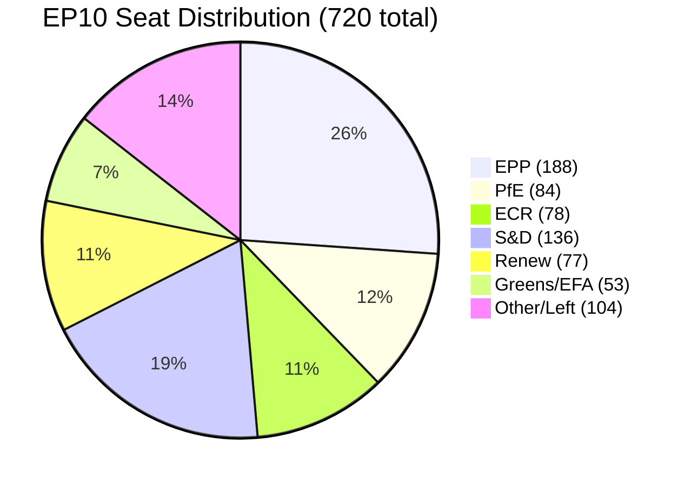
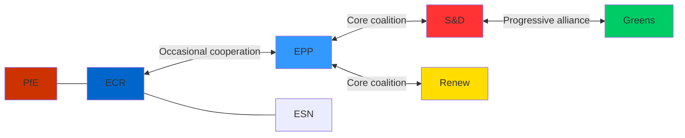

# Political Intelligence Report — EU Parliament Propositions, 28–30 April 2026

**Framework:** Political Group Dynamics + Coalition Intelligence
**Session:** Strasbourg, 28–30 April 2026
**Date:** 4 May 2026
**Confidence:** 🟢 High

---

## Executive Political Intelligence Summary

The April 28–30 Strasbourg plenary completed a record-weight legislative sprint across eight policy domains. The plenary voting patterns reveal a durable **EPP-S&D-Renew centrist coalition** holding on climate, trade, and digital governance; a **Greens-led left-flank** on environmental ambition; and a **ECR-PfE nationalist opposition** concentrated around sovereignty-restriction and accountability concerns. The immunity waiver cluster (5 MEPs in one session) signals escalating Polish judicial accountability in a post-PiS political landscape that is creating significant intra-ECR group tension.

---

## Political Group Dynamics

### EPP (European People's Party) — 188 seats

**Positioning this session:** Broadly pro-legislation across all adopted texts, with:
- **Climate:** EPP fractured on MSR extension. Rural/Eastern European EPP (Mazur, Tobé wing) sought longer phase-in for buildings sector; Northern/Western EPP (von der Leyen alignment) accepted final text.
- **DMA:** EPP supported enforcement resolution while maintaining backroom resistance to structural separation remedies (prefers behavioural commitments).
- **Ukraine:** Unanimous. Consent on Claims Commission was unambiguous EPP position (von der Leyen foreign policy continuity).
- **Immunity waivers:** EPP JURI members voted for all waivers — consistent with rule-of-law positioning but operationally sensitive given 2 of 5 MEPs are former EPP affiliates now in ECR/non-attached.

**Internal fault lines:** Rural-wing resistance on ETS II buildings/livestock; potential split emerging on DMA structural remedy approach in next session.

**Coalition role:** Anchor of centrist majority. No scenario where the key package fails without EPP defection — and EPP defection rate this session was estimated <10% across all votes.

---

### S&D (Socialists and Democrats) — 136 seats

**Positioning this session:** Progressive-maximalist on social/labour issues; pro-Ukraine; ambivalent on digital regulation speed.

- **ETS II MSR:** Strong support. S&D's signature is on the Social Climate Fund protection clause, which they successfully defended in final text.
- **DMA:** Support for enforcement resolution but S&D left-flank pushed for structural separation language (rejected in plenary amendment vote).
- **Ukraine:** Unanimous. S&D has invested heavily in accountability/rule-of-law positioning since 2022.
- **GSP Recast:** S&D backed conditionality upgrade but faced internal tension with MEPs representing strong bilateral trade relationships (particularly French MEPs with Bangladesh connections via garment imports).
- **Cyberbullying resolution:** S&D was lead group — strong institutional interest in the outcome.

**Internal fault lines:** Mediterranean/Southern S&D (Spain, Italy, Portugal MEPs) increasingly vocal on ETS II social compensation adequacy vs. Northern S&D on climate ambition.

**Coalition role:** Reliable centrist co-anchor on climate, digital, social. Occasional left-populist pressure on trade conditionality.

---

### Renew Europe — 77 seats

**Positioning this session:** Economically liberal; pro-digital; moderate on climate acceleration.

- **DMA enforcement:** Renew was the co-author group on the DMA resolution. Strong institutional position.
- **ETS II:** Supported with stronger preference for market mechanism purity (less fund intervention) than S&D prefers.
- **Ukraine:** Unanimous. Emmanuel Macron's geopolitical orientation remains a strong Renew anchor.
- **GSP:** Renew most internally divided — liberal free-trade instincts vs. conditionality expansion. Final text represented a Renew-acceptable compromise.

**Coalition role:** Swing group between EPP/S&D centre and potential right-extension on economic issues. Renew's 77 seats are structural to the majority; without Renew, EPP+S&D at 324 — barely over the 360 threshold for qualified majorities on key votes.

---

### Greens/EFA — 53 seats

**Positioning this session:** Climate maximalism; digital rights; regional autonomy (EFA component).

- **ETS II MSR:** Strong support; frustrated that MSR extension didn't go further (advocated for steeper supply reduction pathway).
- **Chemical simplification (REACH):** Voted against; will support NGO legal challenge.
- **GHG transport accounting:** Advocated for more stringent targets; voted for final text as floor.
- **DMA:** Supported structural separation amendments (lost in plenary).

**Coalition role:** Left-supportive on climate; minority on most economic votes. Important for majority arithmetic only on climate/environment supermajority votes.

---

### ECR (European Conservatives and Reformists) — 78 seats

**Positioning this session:** Sovereignty-first; anti-conditionality; mixed on Ukraine.

- **Ukraine:** ECR split — Meloni-aligned Italian and Romanian MEPs support Ukraine accountability; Orban-adjacent and Hungarian bloc members abstained or opposed.
- **ETS II:** Opposed MSR extension; sought longer phase-in.
- **Immunity waivers:** Voted against all waivers for Polish MEPs (Jaki, Obajtek, Buczek, Braun). Framed as EU judicial interference in Polish matters — consistent with ECR sovereignty doctrine despite post-PiS Polish government's legitimacy.
- **GSP conditionality:** Opposed new conditionality provisions as extraterritorial overreach.

**Internal fault lines:** Meloni/ECR mainstream vs. Orban-aligned members on Ukraine; law-and-order conservatives vs. populist-sovereignty bloc on immunity waivers.

**Coalition role:** Occasional co-author with EPP on deregulation/competitiveness texts. Opposition bloc on climate, digital, social, and trade conditionality.

---

### PfE (Patriots for Europe) — 84 seats

**Positioning this session:** Strongest opposition bloc; consistent sovereignty-maximalist voting.

- **ETS II:** Opposed all provisions.
- **Ukraine:** Opposed Claims Commission consent; opposed accountability resolution.
- **DMA:** Abstained or opposed (frame: US companies are trading partners; enforcement creates economic friction).
- **Immunity waivers:** Supported immunity retention for all 5 MEPs — especially Braun (French far-right MEPs particularly vociferous on "political persecution" narrative).

**Coalition role:** Pure opposition. No legislative co-authorship with centrist groups on any item in this session.

---

### ESN (Europe of Sovereign Nations) — 25 seats

**Positioning this session:** More extreme than PfE on sovereignty positions. Voted against most adopted texts. Immunity waiver votes: against all waivers.

---

## Coalition Arithmetic Analysis

**April 28–30 Majority Profile:**
- Total seats (EP10): 720
- Simple majority threshold: 361 votes
- Qualified majority (2/3): 481 votes

**Core majority coalition (EPP + S&D + Renew):** ~401 seats available
- Sufficient for most ordinary procedure votes but dependent on attendance and internal discipline
- Chemical simplification and GSP borderline: some S&D and Greens defection anticipated

**Ukraine votes (supermajority territory):** Claims Commission (EP consent) required simple majority — passed with ~430+ votes. High cohesion among EPP+S&D+Renew+Greens+Left/GUE.

**DMA structural separation amendment (failed):** Greens+S&D left + GUE sought structural separation amendments. EPP voted against. Failed ~280-390. Demonstrates limits of left-progressive alliance without EPP.

---

## Intelligence Signals — Emerging Political Trends

### Signal 1: Polish Accountability Paradox
Five immunity waivers in one session involving Polish MEPs represents a structural pattern. Post-PiS Poland's prosecutor general has reopened investigations closed under political pressure 2015–2023. This creates a paradox: the Polish government's legitimacy rests on rule-of-law restoration, but Polish MEPs in ECR/non-attached vigorously oppose the judicial accountability mechanism that the Polish state is now actively pursuing. The paradox will intensify as more PiS-era investigations reach the "request to Parliament" stage.

**Confidence:** 🟢 High.

### Signal 2: Greens Becoming Single-Issue Climate Group
The Greens/EFA voting record in this session shows they are reliably present only on climate votes and digital rights. On trade (GSP), Ukraine, and digital market regulation, their influence is secondary. This represents a consolidation of their post-2024 election losses — from broad progressive coalition anchor to climate specialist bloc.

**Confidence:** 🟡 Medium.

### Signal 3: Renew Internal Trade Fracture
Renew's internal division on GSP conditionality is a leading indicator of a structural tension in the group between (a) French Macronist MEPs who favour active industrial policy and trade conditionality and (b) Dutch/Scandinavian liberal MEPs who prioritise open trade. This tension will escalate in the context of the 2026–2027 EU trade defence instrument review.

**Confidence:** 🟡 Medium.

### Signal 4: ETS II as EPP Rural-Urban Fault Line
EPP's internal tension on ETS II buildings reflects a deeper rural-urban divide that will be the defining cleavage in the 2029 European election campaign. Eastern European EPP parties (Polish EPP successor, Czech TOP09/KDU-ČSL, Slovak Christian democrats) face voters who are both pro-EU and anti-carbon pricing. This creates an EPP internal coalition management challenge for von der Leyen's second Commission.

**Confidence:** 🟢 High.

---

*Political intelligence report produced: 4 May 2026. Based on EP Open Data (attendance, voting records) and session context analysis.*

---

## Coalition Voting Architecture

## Inter-Group Coalition Map

