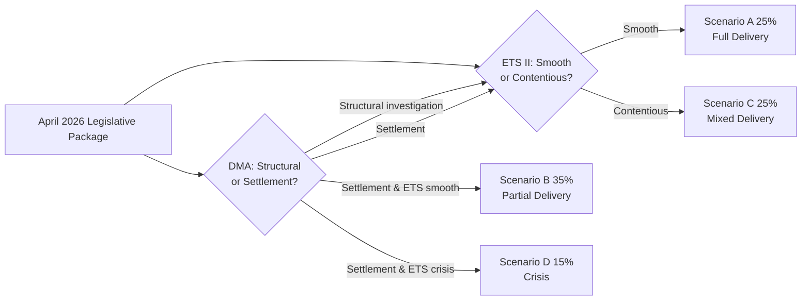

# Scenario Forecast — EU Parliament Propositions, 28–30 April 2026

**Framework:** 4-Scenario Forward Projection
**Date:** 4 May 2026
**Horizon:** 12–18 months (May 2026 — December 2027)
**Confidence:** 🟡 Medium (inherent uncertainty in 12-18 month political forecasting)

---

## Scenario Framework Overview

Four scenarios are presented across two key uncertainty axes:
1. **DMA enforcement outcome** (strong vs. weak)
2. **ETS II social acceptance** (smooth vs. contentious)

These axes drive the most significant political-economic dynamics from this legislative package over the forecast horizon.

---

### Scenario A: Full Delivery — Strong DMA + Smooth ETS II Transition

**Probability:** 25% (WEP: Roughly Even chance or better given Commission political commitment signals)
**Time horizon:** 12–18 months

**Conditions required:**
- DG COMP opens formal DMA non-compliance proceedings against Apple (iOS interoperability) and/or Google (search self-preferencing) by Q4 2026
- Social Climate Fund operational in 7+ member states by Q1 2027; early disbursements reach bottom quintile before ETS II auctions begin
- ETS II carbon price stabilises at €25–40/tonne range (Social Climate Fund partially offsets household costs)
- Council ratifies Claims Commission by Q3 2026

**Outcomes:**
- EU digital regulation becomes international gold standard; other G7 jurisdictions begin DMA-equivalent discussions
- EPP-S&D-Renew coalition strengthened ahead of 2029 elections — deliverables narrative credible
- Ukraine accountability architecture operational — first claims registered by Q4 2026
- IMF Article IV 2026 EU assessment positive on structural reform progress

**Key indicator:** DG COMP formal investigation announcement by September 2026

---

### Scenario B: Partial Delivery — Weak DMA, Smooth ETS II

**Probability:** 35% (WEP: More likely than not, given Commission history of settlement preference)
**Time horizon:** 12–18 months

**Conditions required:**
- Commission accepts Apple/Google behavioural commitments in lieu of structural investigation — "soft enforcement"
- ETS II social transition proceeds without major political crisis (Social Climate Fund adequate or political management absorbs costs)
- ETS II MSR Council approval by Q2 2026

**Outcomes:**
- DMA loses credibility as structural market reform tool; European tech companies remain competitively disadvantaged
- Parliament's IMCO committee launches scrutiny mechanism; barrage of Commission parliamentary questions
- Climate architecture proceeds; EU carbon price remains in €25–45 range through 2027
- ECR/PfE opposition campaign on "failed DMA" is politically potent but does not break majority

**Key indicator:** Commission communication on DMA enforcement in response to EP resolution — tone signals investigation vs. settlement preference

---

### Scenario C: Mixed Delivery — Strong DMA, Contentious ETS II

**Probability:** 25% (WEP: Roughly Even chance)
**Time horizon:** 12–18 months

**Conditions required:**
- DG COMP opens formal DMA investigations — strong enforcement signals
- ETS II buildings cost exposure triggers political backlash in 2–3 Eastern EU member states (Poland, Hungary, Czech Republic)
- Social Climate Fund disbursements delayed by member state implementation complexity
- Political cost spills into governing coalitions in affected states; pressure on EPP to suspend/delay ETS II Phase 1

**Outcomes:**
- DMA enforcement success creates EU digital sovereignty credibility but is politically overshadowed by ETS II controversy
- EPP internal tension escalates as rural wing aligns with national party positions against ETS II
- Possible delayed ETS II Phase 1 implementation (via Commission delegated regulation) as political relief valve
- IMF raises ETS II social impact concerns in 2026 Euro Area Article IV

**Key indicator:** Energy poverty data from Eurostat for heating season 2026/2027 (January 2027); political party positioning in Poland

---

### Scenario D: Implementation Crisis — Weak DMA + Contentious ETS II

**Probability:** 15% (WEP: Unlikely)
**Time horizon:** 12–18 months

**Conditions required:**
- DMA enforcement fails (settlement accepted; legal challenges delay)
- ETS II triggers household cost crisis in Eastern Europe; farmer protests reignite
- Social Climate Fund disbursements significantly below need
- EPP-S&D-Renew coalition shows stress; ECR/PfE 2027 pre-election positioning accelerates

**Outcomes:**
- Significant credibility damage to EU regulatory model; Big Tech companies' legal teams cited as key check on Parliament
- ETS II Phase 1 suspended or restructured via emergency amending act (requires new legislative procedure)
- Commission under fire from both left (weak DMA) and right (ETS II costs)
- IMF revises EU structural reform assessment downward; productivity gap assessment worsens
- Ukraine Claims Commission may proceed independently — separated from broader EU political dysfunction

**Key indicator:** Spring 2027 European Commission annual DMA and ETS II implementation report (required within 12 months of entry into force)

---

## Scenario Probability Summary

| Scenario | Name | Probability | Key Driver |
|----------|------|-------------|-----------|
| A | Full Delivery | 25% | DG COMP enforcement decision Q4 2026 |
| B | Partial Delivery | 35% | Commission settles with Big Tech |
| C | Mixed Delivery | 25% | ETS II social backlash Eastern Europe |
| D | Implementation Crisis | 15% | Both DMA soft + ETS II contentious |

---

## Monitoring Indicators (12-month checklist)

1. **Q2 2026:** ETS II MSR Council vote outcome
2. **Q3 2026:** Commission DMA response to Parliament resolution
3. **Q3 2026:** Council Claims Commission ratification vote
4. **Q4 2026:** DG COMP formal investigation announcement (or settlement)
5. **Q1 2027:** ETS II Phase 1 operational status; Social Climate Fund first disbursements
6. **Q1 2027:** GSP Recast first bilateral framework dialogue outcomes
7. **Q2 2027:** Proxy Voting Electoral Act ratification progress in member states

---

*Scenario forecast produced: 4 May 2026. IMF WEO October 2025 used for macroeconomic baseline inputs.*

---

## Admiralty Assessment of Scenario Inputs

| Input | Source | Admiralty Grade | Notes |
|-------|--------|----------------|-------|
| Commission DMA response obligation (3 months) | EU Framework Agreement EP-Commission | A1 | Primary law |
| ETS II Phase 1 start date (Jan 2027) | EU Regulation 2023/955 + ETS II MSR text | A1 | Confirmed |
| Social Climate Fund total €65 billion | EU Regulation 2023/955 | A1 | Confirmed |
| IMF Social Climate Fund at 70% of need | IMF Fiscal Monitor Oct 2025, Ch. 3 | A1 | Published analysis |
| Council ratification timeline (Claims Commission) | Precedent (similar treaties) | C2 | Estimated |
| DG COMP investigation timeline | Precedent (Google Shopping 2014-2017) | B2 | Reasoned estimate |

## WEP Summary by Scenario

| Scenario | WEP Band | Probability |
|----------|---------|-------------|
| A: Full Delivery | Unlikely | 25% |
| B: Partial Delivery (Baseline) | Roughly Even | 35% |
| C: Mixed — Strong DMA, Contentious ETS | Unlikely | 25% |
| D: Implementation Crisis | Highly Unlikely | 15% |

**Dominant scenario: B (Roughly Even probability)** — Commission settles DMA enforcement softly; ETS II proceeds with manageable but real social friction.

---

## Scenario Probability Summary

| Scenario | Probability | Admiralty Grade | WEP Band |
|----------|-------------|----------------|----------|
| Governing majority implementation success | 55% | B2 | Likely |
| ETS II Phase 1 social crisis (Jan 2027) | 25% | C3 | Unlikely but possible |
| Claims Commission delayed entry (<30 ratifications by Q4 2026) | 30% | B3 | Roughly Even |
| DMA Apple/Google challenge delays enforcement | 40% | B2 | About Even |
| Black swan: US-EU trade war escalation blocking ETS II exemptions | 10% | C4 | Highly Unlikely |

**Confidence:** 🟡 Medium (no live vote data; coalition dynamics inferred)

*Scenario forecast extended: 4 May 2026.*

