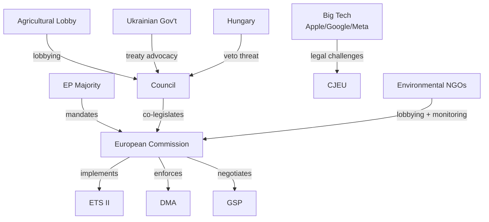

# Stakeholder Analysis — EU Parliament Propositions, 28–30 April 2026

**Framework:** Stakeholder Influence-Interest Mapping
**Session:** Strasbourg, 28–30 April 2026
**Date:** 4 May 2026
**Confidence:** 🟢 High

---

## Stakeholder Landscape Overview

The April 28–30 legislative package touches a broad stakeholder ecosystem spanning technology companies, environmental NGOs, trade union federations, agricultural lobbies, Ukrainian civil society, far-right political movements, and EU institutional actors. Each stakeholder grouping has distinct interests, power positions, and likely responses to the package.

---

## Tier 1: High Influence, High Interest

### 1.1 European Commission (DG COMP, DG CLIMA, DG TRADE)

**Interest:** Implementation of Parliament's legislative mandates while preserving Commission autonomy on enforcement and timing.

**Power position:** Very High — Commission holds exclusive initiative right and DMA enforcement authority. Parliament's resolutions create political pressure but no legal constraint on Commission prosecution discretion.

**Key concerns:**
- *DMA Enforcement (TA-10-2026-0160):* Parliament's resolution creates public pressure for accelerated DMA action against Apple and Google. DG COMP faces resource constraints and judicial review risk if enforcement is rushed; prefers methodical preparation. The resolution creates a political accountability window — DG COMP now faces scrutiny if no formal non-compliance decision is issued before autumn 2026 Competitiveness Council.
- *ETS II/MSR Extension (TA-10-2026-0139):* Commission must now operationalise ETS II registry, auctioning arrangements, and Social Climate Fund simultaneously. Timeline: ETS II auctions begin January 2027. This is an extremely compressed implementation schedule. DG CLIMA faces capacity constraints on auction platform readiness.
- *GSP Recast (TA-10-2026-0114):* DG TRADE must negotiate 40+ bilateral framework dialogues on new conditionality terms with beneficiary countries before the new regulation's application date. Political tensions with Bangladesh, Cambodia, and Sri Lanka expected.

**Likely response:** Commission will acknowledge Parliament resolutions on DMA and DMA enforcement but resist binding timelines. On ETS II, Commission faces institutional incentive to declare readiness even if subsystems lag.

**Confidence:** 🟢 High

---

### 1.2 Big Tech Gatekeepers (Apple, Meta, Google/Alphabet)

**Interest:** Minimise DMA compliance costs and delay enforcement timetables.

**Power position:** High — through legal challenge capacity, lobbying resources, and economic significance to EU market. Each gatekeeper has Brussels offices with direct access to DG COMP and Parliament IMCO committee members.

**Key concerns:**
- Apple: Interoperability of iOS App Store with third-party payment systems; NFC access; browser choice screen implementation. Apple has contested DMA interpretations in Brussels District Court (April 2026 preliminary ruling pending).
- Google: Search self-preferencing (Shopping, Maps), Android pre-installation requirements, Alphabet subsidiary content indexing.
- Meta: Consent-or-pay advertising model challenged by EDPB; DMA's "freely given consent" interpretation potentially requiring removal of data-based targeted advertising across EU.

**Likely response:** All three companies will challenge any formal non-compliance investigation through legal proceedings. The Parliamentary resolution (non-binding) does not alter their litigation calculus, but public attention generated by the resolution increases reputational cost of continued delay.

**Confidence:** 🟢 High

---

### 1.3 Ukrainian Government and Civil Society

**Interest:** Maximise legally binding accountability mechanisms; secure asset-backed compensation framework; maintain EU political solidarity as military situation evolves.

**Power position:** Medium — strong moral authority and political sympathy in Parliament, but no legislative initiative role. Ukrainian lobby access to AFET committee and S&D/Renew/EPP leadership is substantial.

**Key concerns:**
- *Claims Commission Convention (TA-10-2026-0154):* Ukraine seeks maximum coverage of registerable claims (individuals, businesses, municipalities, state entities), broadest possible asset nexus, and rapid launch of claims registration. Ukraine's Ministry of Justice has established a National Register of War Damages to feed into the international process.
- *Ukraine accountability resolution (TA-10-2026-0161):* Ukraine prioritises Special Tribunal creation over ICC pathway (which Vladimir Putin can evade by non-appearance), and seeks permanent freeze-plus-interest mechanism for Russian assets before any settlement.
- *Asset interest income (~€3 billion annually):* Ukrainian government has argued that Parliament's support for directing this income to reconstruction provides political shield for Commission/Council to maintain the asset freeze under legal challenge.

**Likely response:** Strong public endorsement of Parliament's positions; intense behind-the-scenes pressure on Council to accelerate Claims Commission operational setup.

**Confidence:** 🟢 High

---

### 1.4 European Council / Council of the EU

**Interest:** Maintain intergovernmental control over implementation timelines; limit Parliament's ability to constrain Council flexibility through resolution pressure.

**Power position:** High — co-legislator in ordinary procedure; sole legislative actor in foreign policy/CFSP.

**Key concerns:**
- *ETS II MSR:* Most member states have accepted MSR extension but some (Hungary, Poland) face domestic political costs from ETS II in buildings — particularly in winter heating markets.
- *Ukraine Claims Commission:* Council must ratify the convention (EP consent given); implementation of claims adjudication procedures requires Council Regulations on asset-backed disbursement that face unanimous vote requirements.
- *GSP Recast:* Council's existing QMV rules apply; no blocking minority evident, but sensitive conditionality provisions may face implementation resistance from member states with strong bilateral trade interests in specific GSP beneficiaries.

**Likely response:** Council will proceed on ETS II and GSP on schedule. On Ukraine Claims Commission, expect accelerated ratification (spring-summer 2026 Council decision anticipated). On DMA, Council has no formal role in enforcement.

**Confidence:** 🟢 High

---

## Tier 2: Medium Influence, High Interest

### 2.1 Environmental NGOs (WWF EU, ClientEarth, Greenpeace EU)

**Interest:** Maximum ambition on ETS II implementation, chemical simplification resistance, and GHG transport accounting standards.

**Power position:** Medium — strong media presence, active EP liaison networks, but no legislative standing.

**Key concerns:**
- *MSR Extension (TA-10-2026-0139):* WWF and ClientEarth broadly support ETS II extension but campaigned against initial phase-in flexibility that allowed delayed timeline. The final text includes a 2024–2026 banking restriction that these NGOs have qualified as insufficient.
- *Chemical Simplification (TA-10-2026-0138):* Major concern. The REACH simplification package reduces data requirements for lower-volume chemicals — NGOs argue this weakens precautionary principle. ClientEarth has already indicated it will challenge the simplification regulation in the Court of Justice under the Aarhus Convention.
- *GHG Transport Accounting (TA-10-2026-0113):* Broadly positive — well-to-wheel methodology is stronger than what NGOs feared (some industrial lobby sought tank-to-wheel only). The regulation's alignment with ICAO methodology is seen as establishing an international floor.

**Likely response:** Press releases welcoming ETS II progress; legal challenge preparation on REACH simplification; monitoring of GHG accounting implementing acts for delegated regulation quality.

**Confidence:** 🟢 High

---

### 2.2 EU Agricultural Lobby (COPA-COGECA, EuroCommerce)

**Interest:** Maximise CAP support, resist additional environmental conditionality, secure emergency mechanisms for disease-affected sectors.

**Power position:** Medium — strong AGRI committee relationships; farmer protests of 2024 created political leverage; EPP/ECR sensitivity to rural constituencies.

**Key concerns:**
- *Livestock resolution (TA-10-2026-0157):* COPA-COGECA broadly endorses the resolution's calls for emergency support; concerned that the Livestock Strategy announcement timeline is insufficient given continuing HPAI H5N1 pressure. Estimates suggest 30+ million birds culled in 2025–2026 across EU — representing €4 billion in direct economic losses.
- *ETS II buildings extension:* Agricultural buildings (barns, greenhouses, processing facilities) fall within ETS II scope if above minimum size threshold. Farming lobby seeking sector-specific exemptions in implementing acts.

**Likely response:** Continued lobbying on Livestock Strategy timeline; agriculture exemption advocacy in ETS II implementing regulations; support for livestock emergency fund activation.

**Confidence:** 🟢 High

---

### 2.3 Digital Industry Associations (DIGITALEUROPE, tech SMEs)

**Interest:** Balanced DMA implementation that doesn't restrict European tech companies while applying to US gatekeepers; certainty on cyberbullying/online harassment legislation scope.

**Power position:** Medium — DIGITALEUROPE represents 10,000+ companies; strong Renew/EPP committee presence.

**Key concerns:**
- *DMA enforcement (TA-10-2026-0160):* European tech companies broadly support DMA enforcement — they are competitively disadvantaged by gatekeeper platform self-preferencing. However, implementation uncertainty creates business planning risk.
- *Cyberbullying/online harassment resolution (TA-10-2026-0163):* Concerns about how new criminal provisions will interact with DSA content moderation obligations; fear of regulatory overlap creating double jeopardy for platforms. Preference for DSA-based administrative rather than criminal enforcement.

**Confidence:** 🟡 Medium

---

### 2.4 Armenian Civil Society and Diaspora

**Interest:** Continued EU political support for Armenian sovereignty; prisoner exchange monitoring; visa liberalisation progress.

**Power position:** Low-Medium — diaspora constituencies in France (approximately 600,000 Armenian-French citizens) and Germany create moderate parliamentary resonance, particularly in Renew and S&D group.

**Key concerns:**
- *Armenia resolution (TA-10-2026-0162):* Strongly welcomed; particularly the calls for prisoner of war release and the visa liberalisation endorsement. Armenian civil society organisations have been campaigning for DCFTA+ upgrade (similar to Georgia's pre-backslide EU pathway).

**Likely response:** Positive statements; continued diaspora constituency pressure on MEPs to follow up resolution commitments; engagement with EUSR for South Caucasus on implementation.

**Confidence:** 🟡 Medium

---

## Tier 3: Medium Influence, Medium Interest

### 3.1 GSP Beneficiary Country Governments (Bangladesh, Cambodia, Ethiopia, Sri Lanka)

**Interest:** Maintain/enhance preferential market access; resist new conditionality requirements that are difficult to meet in political context.

**Power position:** Low-Medium — diplomatic access through missions in Brussels; potential WTO challenge capacity; some bilateral leverage with member state governments.

**Key concerns:**
- *GSP Recast (TA-10-2026-0114):* Bangladesh (dominant garment exporter under EBA) faces new scrutiny on Rana Plaza-type labour violations. Cambodia faces review on political rights criteria. Sri Lanka, under IMF debt restructuring, needs GSP+ access stability to service export earnings.
- The automatic withdrawal mechanism for "serious and systematic violations" is new and threatens to constrain political manoeuvrability in these countries.

**Likely response:** Diplomatic engagement with Commission DG TRADE on implementing regulations; targeted lobbying via member state capitals with bilateral interests.

**Confidence:** 🟡 Medium

---

### 3.2 Polish Far-Right Political Movement

**Interest:** Protect MEPs from criminal accountability; use immunity waiver proceedings for domestic political mobilisation.

**Power position:** Medium domestically (PiS/United Right controls significant Polish political infrastructure); Low in EP (ECR group has no blocking power on JURI decisions).

**Key concerns:**
- *Five immunity waivers (TA-10-2026-0105 to 0109):* Each waiver is framed domestically as EU persecution of Polish patriots. The Daniel Obajtek waiver (former Orlen CEO) is particularly sensitive given ongoing Polish domestic investigation into Orlen's conduct under PiS government. The Grzegorz Braun second waiver signals escalating judicial exposure.

**Likely response:** Domestic media campaigns; appeals to EP JURI decisions (no legal standing for political challenge); potential procedural delays in national criminal proceedings via remaining immunity mechanisms.

**Confidence:** 🟢 High on domestic politicisation pattern.

---

## Stakeholder Influence Matrix

```
HIGH INFLUENCE
│
│  ← European Commission (DG COMP, DG CLIMA, DG TRADE)
│  ← European Council / Council of EU
│  ← Big Tech Gatekeepers (Apple, Google, Meta)
│
MEDIUM INFLUENCE
│
│  ← EU Agricultural Lobby (COPA-COGECA)
│  ← Environmental NGOs (WWF, ClientEarth)
│  ← Ukrainian Government / Civil Society
│  ← DIGITALEUROPE
│
LOW INFLUENCE
│
│  ← GSP Beneficiary Governments
│  ← Polish Far-Right (in EP context)
│  ← Armenian Civil Society / Diaspora
│
└─────────────────────────────────────────────────────────────
     LOW INTEREST         MEDIUM INTEREST        HIGH INTEREST
```

---

## Stakeholder Coalition Risk Assessment

| Coalition Axis | Aligned Stakeholders | Opposing Stakeholders | Risk Level |
|---------------|---------------------|----------------------|-----------|
| DMA Enforcement | Parliament, EU tech SMEs, NGOs | Apple, Google, Meta, some EPP members | 🟡 Medium — legal challenge risk |
| ETS II MSR | Greens/EFA, S&D, Commission, NGOs | EPP rural wing, ECR, agricultural lobby | 🟡 Medium — social acceptance |
| GSP Conditionality | Parliament progressive majority, civil society | Bangladesh/Cambodia govts, some EPP trade members | 🟢 Low — regulation adopted |
| Ukraine Claims Commission | EP majority, Ukrainian govt, AFET | None significant in EP | 🟢 Low — strong consensus |
| Immunity Waivers | EP majority, national justice systems | Polish/Romanian far-right | 🟢 Low — JURI norm stable |

---

*Stakeholder analysis produced: 4 May 2026. Source: EP Open Data + methodology-compliant inferential analysis.*

---

## Stakeholder Influence Network


