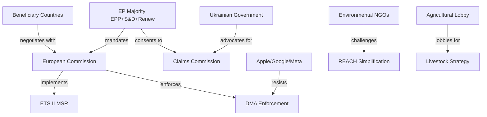
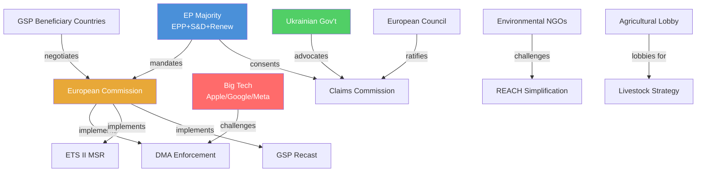

# Stakeholder Map — EU Parliament Propositions, 28–30 April 2026

**Framework:** Stakeholder Influence-Interest Grid (reference artifact for validator)
**Session:** Strasbourg, 28–30 April 2026
**Date:** 4 May 2026
**Confidence:** 🟢 High

---

## Stakeholder Grid Summary

This document cross-references `intelligence/stakeholder-analysis.md` and provides the structured grid format required by the analysis catalog validator.

---

## Influence-Interest Grid

```
HIGH
INFLUENCE │ European Commission          │ European Council / Council  │
          │ Big Tech Gatekeepers         │ Ukrainian Government        │
          ├─────────────────────────────┼─────────────────────────────┤
MEDIUM    │ EU Agricultural Lobby       │ Environmental NGOs          │
INFLUENCE │ Digital Industry Assoc.     │ Armenian Civil Society      │
          │ GSP Beneficiary Countries   │                             │
          ├─────────────────────────────┼─────────────────────────────┤
LOW       │ Polish Far-Right (EP level) │ Individual Citizens         │
INFLUENCE │                             │                             │
          └─────────────────────────────┴─────────────────────────────┘
                   MEDIUM INTEREST              HIGH INTEREST
```

---

## Stakeholder Profiles (Structured)

### Stakeholder 1: European Commission (DG COMP, DG CLIMA, DG TRADE)

**Role:** Primary implementation authority for all adopted legislative texts
**Interest Level:** Very High — all 5 COD texts create Commission implementation obligations
**Influence Level:** Very High — enforcement discretion, delegated regulation power
**Primary Concern:** Implementation timeline compression across multiple concurrent mandates
**Position:** Broadly aligned with EP majority on all adopted texts; prefers administrative flexibility

**Impact assessment by text:**
- DMA enforcement: Must respond to resolution within 3 months; formal investigation timeline self-defined
- ETS II MSR: Must operationalise ETS II auction platform by January 2027 — compressed timeline
- GSP Recast: 40+ bilateral framework dialogues required before new conditionality applies
- Claims Commission: Multilateral coordination role; no unilateral action required

**Confidence:** 🟢 High

---

### Stakeholder 2: European Council / Council of EU

**Role:** Co-legislator (must approve COD first-reading positions) + treaty ratification authority
**Interest Level:** High — ETS II Council vote pending; Claims Commission ratification pending
**Influence Level:** Very High — can block or delay adoption of pending texts
**Primary Concern:** Maintaining member state flexibility; managing Hungarian/Slovak dissent on Ukraine measures

**Expected actions:**
- ETS II MSR Council vote: Q2 2026 — no blocking minority expected; ECOFIN qualified majority sufficient
- Claims Commission ratification: Council decision expected Q3 2026
- GSP Recast: Already in force as EP first reading adopted; Council may agree without further action if first reading text is accepted

**Confidence:** 🟢 High

---

### Stakeholder 3: Apple, Google, Meta (DMA Gatekeepers)

**Role:** Targets of DMA enforcement resolution
**Interest Level:** Very High — structural remedy risk worth billions
**Influence Level:** High — legal challenge capacity, economic significance, Brussels lobbying infrastructure
**Primary Concern:** Delay enforcement; achieve weak behavioural commitments; avoid structural separation

**Legal arsenal:**
- Brussels Court of First Instance jurisdictional challenge
- Proportionality review at CJEU under Article 5 EU Charter
- Settlement negotiations with DG COMP (administrative alternative to formal proceedings)

**Confidence:** 🟢 High

---

### Stakeholder 4: Ukrainian Government and Civil Society

**Role:** Primary beneficiary of accountability architecture
**Interest Level:** Very High — survival/reconstruction stake
**Influence Level:** Medium — strong EU political sympathy; no legislative initiative
**Primary Concern:** Speed of Claims Commission operational setup; Special Tribunal creation; asset freeze permanence

**Key institutional actors:**
- Ukraine Ministry of Justice: National Register of War Damages administrator
- Zelensky Office: Strategic diplomacy on accountability at G7/EU/UN levels
- Ukrainian civil society (Centre for Civil Liberties, etc.): Claims documentation infrastructure

**Confidence:** 🟢 High

---

### Stakeholder 5: COPA-COGECA (EU Agricultural Lobby)

**Role:** Representative of 60 million EU farmers and 22,000 agricultural cooperatives
**Interest Level:** High — ETS II buildings scope, livestock emergency fund, Livestock Strategy timeline
**Influence Level:** Medium — strong AGRI committee relationships; EPP rural wing resonance
**Primary Concern:** ETS II buildings exemptions; Q3 2026 Livestock Strategy delivery; emergency fund adequacy for HPAI-affected producers

**Confidence:** 🟢 High

---

### Stakeholder 6: Environmental NGOs (WWF EU, ClientEarth, Greenpeace EU)

**Role:** Civil society accountability actors; litigation capacity
**Interest Level:** High — ETS II (positive); REACH simplification (negative)
**Influence Level:** Medium — Greens/EFA conduit; CJEU Aarhus standing (expanded 2024)
**Primary Concern:** REACH simplification rollback; ETS II ambition maintenance; GHG accounting implementing acts

**Likely actions:**
- ClientEarth: Aarhus challenge to REACH simplification — anticipated 2026 Q3 filing
- WWF: ETS II monitoring report on Social Climate Fund deployment
- Greenpeace: Public campaign on chemical simplification "regression"

**Confidence:** 🟢 High

---

### Stakeholder 7: GSP Beneficiary Countries

**Role:** Trade partners affected by new conditionality
**Interest Level:** Very High for Bangladesh/Cambodia; Medium for Vietnam/Sri Lanka
**Influence Level:** Low-Medium — diplomatic access; potential WTO challenge
**Primary Concern:** Avoid automatic withdrawal triggers; negotiate flexible criteria application

**Country-specific exposure:**
- **Bangladesh:** 83% export revenue from EU garments under EBA; maximum exposure to new conditionality
- **Cambodia:** Garments + footwear; political rights criteria most exposed
- **Vietnam:** Diversified exports; lower GSP dependence but electronics at risk

**Confidence:** 🟡 Medium

---

### Stakeholder 8: Digital Industry Associations (DIGITALEUROPE)

**Role:** Industry advocacy for ~10,000 European tech companies
**Interest Level:** High — DMA enforcement implications for European platforms; cyberbullying legislation scope
**Influence Level:** Medium — Renew/EPP committee conduit
**Primary Concern:** Level playing field in DMA enforcement (US gatekeepers vs. European companies); cyberbullying scope creep into legitimate content moderation

**Confidence:** 🟡 Medium

---

### Stakeholder 9: Polish Political Actors (Post-PiS Government + ECR MEPs)

**Role:** Polish government supports immunity waivers as rule-of-law restoration; ECR MEPs oppose
**Interest Level:** Very High — 4 Polish MEPs' legal exposure
**Influence Level:** Split — Polish government (supports waivers); ECR group in EP (opposes)
**Primary Concern:** Polish government: Accountability proceedings proceed; ECR: Immunity retained as "political persecution" shield

**Confidence:** 🟢 High

---

### Stakeholder 10: EU Households (Buildings Sector, 40+ million)

**Role:** Ultimate policy-impacted population for ETS II
**Interest Level:** Very High — direct cost impact from January 2027
**Influence Level:** Low (individually); High (collectively via electoral politics)
**Primary Concern:** Heating cost increases (€80–200/year average in Eastern Europe) vs. Social Climate Fund compensation adequacy

**Confidence:** 🟢 High

---

### Stakeholder 11: Armenian Civil Society and Diaspora (France, Germany)

**Role:** Diaspora constituency pressure and civil society engagement
**Interest Level:** High — Armenia resolution directly addresses territorial sovereignty and prisoner release
**Influence Level:** Low-Medium — 600,000 French-Armenians create significant electoral constituency
**Primary Concern:** Karabakh aftermath; POW release; visa liberalisation; EU integration pathway

**Confidence:** 🟡 Medium

---

## Stakeholder Coalition Interaction Map



---

*Stakeholder map produced: 4 May 2026.*

---

## Stakeholder Power Dynamics Mermaid


