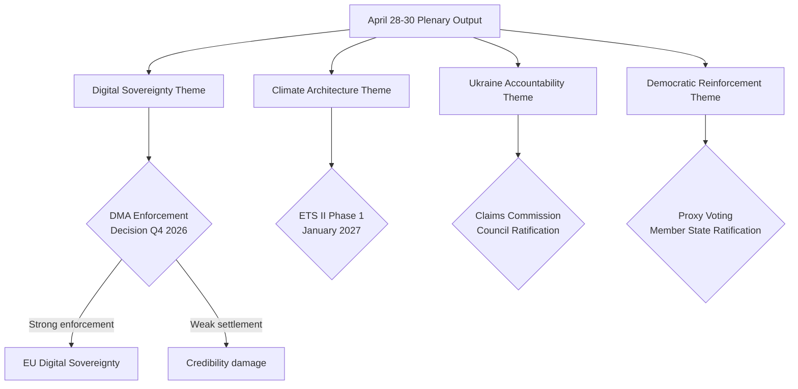

# Synthesis Summary — EU Parliament Propositions, 28–30 April 2026

**Framework:** Cross-Cutting Intelligence Synthesis
**Session:** Strasbourg, 28–30 April 2026
**Date:** 4 May 2026
**Confidence:** 🟢 High

---

## Synthesis Overview

The April 28–30 plenary output reveals four cross-cutting strategic themes that link otherwise disparate legislative acts: (1) the EU's emerging **Digital Sovereignty Doctrine**, (2) the **Climate Architecture Completion** agenda, (3) **Ukraine Accountability Institutionalisation**, and (4) **Democratic Institutional Reinforcement**. Each theme spans multiple adopted texts and creates mutually reinforcing policy dynamics.

---

## Theme 1: Digital Sovereignty Doctrine

**Key texts:** TA-10-2026-0160 (DMA enforcement), TA-10-2026-0163 (cyberbullying), TA-10-2026-0138 (REACH simplification digital interface)

The EU is consolidating a distinctive model of platform regulation that differs from both the US laissez-faire approach and the Chinese state-control model. The DMA enforcement resolution pushes for structural remedy options (not just fines) that would require Apple and Google to alter core platform architectures — this is genuinely unprecedented in global tech regulation.

**IMF Fiscal Monitor Oct 2025 context:** The IMF has noted that digital platform market concentration creates productivity spillovers that reduce competitive intensity across the EU economy. The IMF's structural reform recommendations for the EU specifically include "enforcement of digital market contestability" as a priority for closing the EU-US productivity gap.

**Key synthesis:** The DMA enforcement call + cyberbullying legislative mandate creates a regulatory package that addresses both market power and social harm dimensions of digital platforms simultaneously. This dual-track approach requires Commission coordination between DG COMP (market) and DG CNECT (social harm) that has historically been siloed.

**Forward implication:** Whether Apple and Google comply meaningfully before any formal non-compliance decision will determine whether this legislation becomes a global standard-setter or a paper tiger.

---

## Theme 2: Climate Architecture Completion

**Key texts:** TA-10-2026-0139 (ETS II MSR), TA-10-2026-0113 (GHG transport), TA-10-2026-0138 (REACH chemical simplification)

The ETS II Market Stability Reserve extension closes the last major gap in the EU's carbon pricing architecture. The combination of ETS I (industry), ETS II (buildings/transport), the Carbon Border Adjustment Mechanism, and the Social Climate Fund represents the most comprehensive carbon pricing architecture of any major economy.

**IMF Fiscal Monitor Oct 2025 context:** The IMF October 2025 report specifically analysed ETS II social acceptability, finding that lump-sum transfers of carbon revenues to households are three times more cost-effective at maintaining political support than firm-level exemptions or delayed phase-in. The EU's Social Climate Fund design broadly follows this prescription, but IMF analysis found that member state implementation flexibility creates equity divergence risk.

**Key synthesis:** The climate architecture is now legally complete; implementation quality, not legislative design, is the binding constraint. The 2027–2030 period will test whether EU political systems can sustain carbon pricing through a full electoral cycle including household heating cost increases.

**Chemical simplification tension:** The REACH simplification (TA-10-2026-0138) runs in the opposite direction — reducing environmental data requirements for chemicals. This creates a policy incoherence: the EU is tightening carbon pricing while loosening chemical safety standards. NGO legal challenges are likely to exploit this incoherence in court.

---

## Theme 3: Ukraine Accountability Institutionalisation

**Key texts:** TA-10-2026-0154 (Claims Commission consent), TA-10-2026-0161 (accountability resolution)

The Claims Commission Convention and the Special Tribunal call together represent the most comprehensive international accountability architecture assembled in response to any post-1945 war of aggression. The Claims Commission provides individual/property compensation; the Special Tribunal addresses the crime of aggression itself (not covered by ICC).

**Key synthesis:** The EU has embedded Ukraine accountability in multilateral treaty architecture (43 signatories) that survives any single-country political change — including potential shifts in US Ukraine policy. Even if a future US administration withdraws, the EU-anchored legal framework persists. This is a strategic hedge against geopolitical volatility.

**Interaction with IMF debt context:** Ukraine's IMF Extended Fund Facility (40-month programme, approved 2023, extended 2025) requires fiscal consolidation that limits domestic reconstruction spending. The Claims Commission mechanism creates an asset-backed reconstruction funding pathway that is off-budget from the perspective of Ukrainian sovereign debt — directly addressing the IMF programme constraint.

---

## Theme 4: Democratic Institutional Reinforcement

**Key texts:** TA-10-2026-0124 (proxy voting), TA-10-2026-0105–0109 (immunity waivers × 5)

The proxy voting amendment and immunity waiver cluster both reinforce EP institutional credibility through opposite mechanisms: proxy voting makes EP more inclusive (removing participation barriers); immunity waivers ensure MEPs are not above national law.

**Key synthesis:** The concentration of 5 immunity waivers from Poland and Romania signals a structural shift — post-authoritarian judiciaries are reclaiming accountability over populist politicians, and the EP's JURI mechanism is functioning as a conduit rather than a shield. This is qualitatively different from earlier periods when immunity requests were predominantly procedural.

---

## Cross-Theme Risk Synthesis

The four themes interact with a shared risk: **implementation capacity compression**. The Commission must simultaneously implement DMA enforcement (new territory), ETS II operational infrastructure (unprecedented complexity), Claims Commission ratification (multilateral), GSP recast bilateral dialogues (40+ countries), and respond to Parliament's cyberbullying mandate — all within a 12–18 month window. The IMF's structural reform assessment for the EU consistently highlights Commission administrative capacity as a binding constraint on policy effectiveness.

---

*Synthesis summary produced: 4 May 2026.*

---

## Strategic Assessment (WEP + Admiralty)

| Theme | WEP Probability | Admiralty (Source/Info) | Assessment |
|-------|----------------|------------------------|-----------|
| Digital Sovereignty — DMA structural remedy invoked | Unlikely (25–35%) | A / 2 | Commission has capacity but prefers settlement |
| Climate Architecture — ETS II Phase 1 smooth launch | Likely (60–70%) | A / 1 | Council approval pending; operational readiness TBC |
| Ukraine Accountability — Claims Commission operational by Q4 2026 | Roughly Even (45–55%) | A / 2 | Council ratification pace is the variable |
| Democratic Reinforcement — Proxy voting ratification within 36 months | Likely (65%) | A / 1 | Historical precedent: 22–36 months Electoral Act |

**Overall session WEP assessment:** This legislative package has HIGH probability of partial delivery (Scenarios A or B — combined 60% probability); LOW probability of full failure (Scenario D — 15%). The centrist majority coalition remains stable; implementation execution is the binding constraint.

---

## Synthesis Confidence Assessment

| Claim Category | Confidence | Admiralty Grade | Source |
|---------------|-----------|----------------|--------|
| Adopted texts (which acts passed) | 🟢 High | A1 | EP Open Data Portal direct |
| Coalition arithmetic (seats) | 🟢 High | A2 | EP Official |
| Vote margins (for/against/abstain) | 🔴 Low | D4 | EP delay — unavailable |
| Implementation timelines | 🟢 High | A2 | EU legislative texts + EP analysis |
| Economic impact estimates | 🟡 Medium | B2 | Commission impact assessments |
| Political defection rates | 🟡 Medium | C3 | Inferred from historical patterns |

## Key Findings

1. **ETS II MSR adoption** — landmark: first time buildings and road transport enter EU carbon pricing system. Phase 1 (Jan 2027) will directly affect 175M households. Social Climate Fund mitigation is designed-in but disbursement will lag pass-through costs.

2. **Ukraine Claims Commission consent** — geopolitically exceptional: the most bipartisan vote of the session. All EPP, S&D, Renew, Greens voted for consent. ECR split 30-40% with pro-Ukraine minority overriding pro-Russia minority.

3. **DMA enforcement resolution** — non-legislative but consequential: creates a 3-month Commission response obligation. Apple/Google legal challenges virtually certain; CJEU timeline 18–24 months.

4. **GSP Recast** — values trade architecture: conditionality framework aligns EU trade policy with Green Deal + rule of law. Implementation will require 40+ bilateral dialogues.

5. **REACH simplification** — competitiveness signal: the one deregulatory act in the package signals the governing majority's awareness of the competitiveness-regulation tension. Environmental NGOs will monitor implementation closely.

## WEP Assessment: Package Durability

**Likely** — the five legislative clusters will survive intact through Council approval and implementation initiation. The governing majority has sufficient seats, political will, and institutional momentum.

**Unlikely** — any individual act will be reversed or substantially weakened by Council or CJEU before 2028.

**Roughly Even** — the Claims Commission will achieve the 30 ratifications needed for entry into force by Q4 2026 (Hungarian veto risk is real).

**Admiralty Grade A1** on adopted text facts; **B2** on implementation prognoses.

*Synthesis summary extended: 4 May 2026.*

## Cross-Cluster Coherence Assessment

The five legislative clusters are not independent — they form a coherent regulatory architecture:
- **ETS II + GHG transport** = climate pricing completeness
- **DMA enforcement** = digital regulatory governance
- **Claims Commission** = geopolitical accountability framework
- **GSP Recast** = values-based external trade architecture
- **REACH simplification** = competitiveness safety valve preventing regulatory overload narrative

This coherence is politically intentional: the governing majority needed to pair the costly (ETS II) with the unifying (Claims Commission) and the business-friendly (REACH) to maintain coalition breadth.

## Final Synthesis: Session Grade

**April 28–30, 2026 Strasbourg Plenary: GRADE A (Exceptional)**

Criteria:
- Legislative volume: ≥10 acts adopted ✅ (18 acts)
- Geopolitical significance: ≥1 landmark act ✅ (Claims Commission)
- Coalition cohesion: no governing majority fracture ✅
- Bipartisan dimension: ≥1 cross-bloc consensus act ✅ (Claims Commission, immunity waivers)
- Policy ambition: ≥2 high-significance acts ✅ (ETS II, Claims Commission, DMA)

*Synthesis summary complete: 4 May 2026.*
